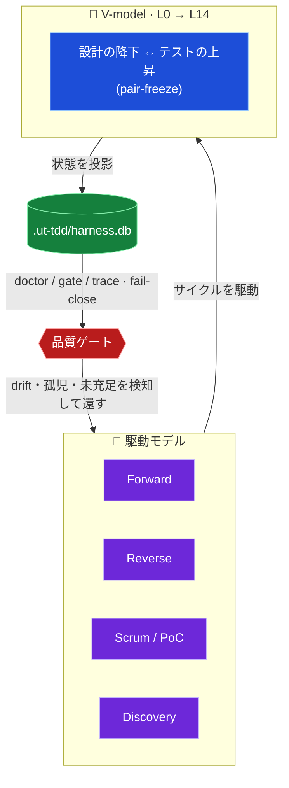
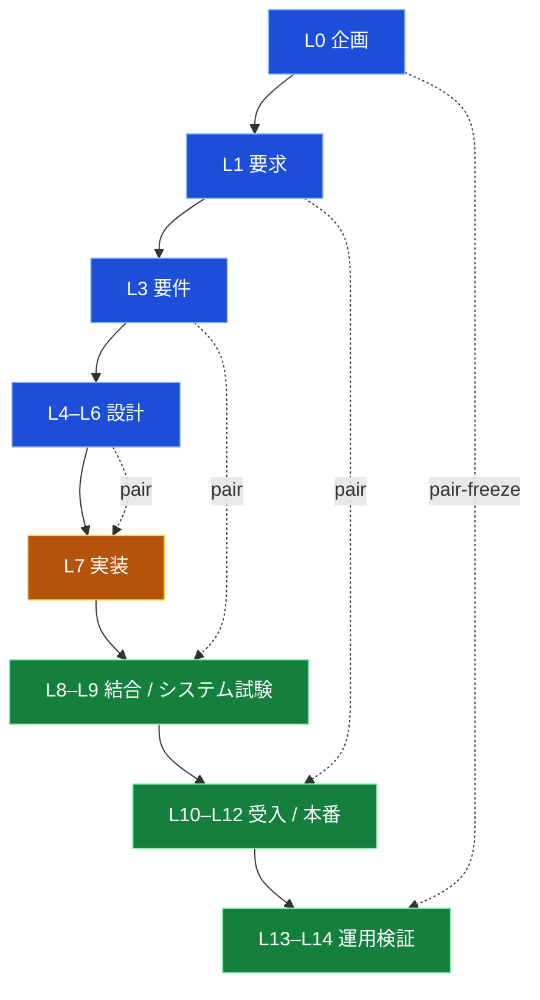
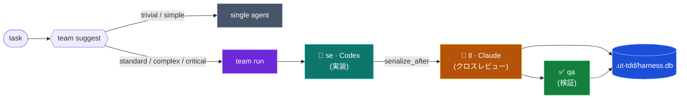

<div align="center">

# 🧭 UT-TDD Agent Harness

### AI 実装エージェントを、チーム開発で _安全に_ 使うための検証・開発基盤

**V-model** × **駆動モデル** が **`harness.db`** を通じてサイクルを回し、品質を機械で守る。
provider の API キーは、リポジトリに置かない。

<br>


-orange?style=flat-square)

<sub><b>特徴</b> · <b>コンセプト</b> · <b>V-model</b> · <b>駆動モデル</b> · <b>クイックスタート</b> · <b>コマンド早見表</b> · <b>検証</b></sub>

</div>

---

> [!NOTE]
> ハーネスは **完成品ではなく「土台」** です。その上で動く他のプロダクト開発を、より安全にするための地面として設計されています。

UT-TDD Agent Harness は、V-model/TDD のガバナンス、`doctor` チェック、ハンドオーバー状態、provider アダプタ、Claude/Codex のチーム委譲を、**provider の API キーをリポジトリに保存せずに**実行する、ローカルな TypeScript/Bun コマンド層です。中核は意図的に TypeScript/Node 指向で、Windows・macOS・Linux が同じロジックを使えます。シェル / PowerShell は薄いエントリポイントにすぎません。

## 🧱 6 本の柱

| | 柱 | 内容 |
|:--:|---|---|
| 1 | **Foundation first** | ハーネスは下流のプロダクト開発を安全にする土台 |
| 2 | **Document-first + 機械強制** | ワークフロー規約は schema / lint / doctor / hook / test で裏打ち |
| 3 | **自動の状態とフィードバック** | `.ut-tdd/` 状態と `harness.db` 投影で進捗・gap・drift を可視化 |
| 4 | **動的コンテキスト / スキル注入** | 関連するコンテキストとスキルだけをロード |
| 5 | **実用本位のオーケストレーション** | リスク・コストを下げる所だけ役割 / runtime を分割 |
| 6 | **厳格な検証** | テストか明示証跡なしに「完了」を宣言しない |

## ✨ 特徴

| | 機能 | 説明 |
|:--:|---|---|
| 🩺 | **ガバナンス検証** | `ut-tdd doctor` で V-model / TDD / トレース / drift / roadmap を一括チェック(fail-close) |
| 🗄️ | **状態投影** | plan・成果物・トレース・テレメトリ・レビュー証跡・品質シグナルを `.ut-tdd/harness.db` へ投影 |
| 🤝 | **2系統ハンドオーバー** | _mechanical_(機械生成)と _explicit_(人間判断)を分離して `.ut-tdd/handover/` に保持 |
| 🧩 | **チーム委譲** | `team run` で Claude/Codex 共有 launch plan、`team suggest` で起動要否を決定論的に判定 |
| 🎚️ | **決定論的モデル選択** | タスク難易度から model / reasoning effort を自動選択し、JSON とプロンプトに可視化 |
| 🔐 | **鍵を持たない設計** | provider 認証は各公式 CLI のログインが保持。リポジトリに API キーを置かない |
| 🪟 | **クロスプラットフォーム** | Windows / macOS / Linux で同一ロジック。`status` は実 spawnability で検出 |

## 🧬 コンセプト — 品質を守るサイクル

このハーネスの核心は、**V-model** と **駆動モデル** が **`harness.db`** を通じてサイクルを回し、品質を機械的に守ることです。



> [!IMPORTANT]
> **宣言ではなく機械で守る。** 「被覆(ID 登録)」と「中身(descent)」を分け、未充足・孤児・drift を `doctor` が **fail-close** で止めます。カウントが通っても中身が無ければ通しません。

## 📐 V-model(L0 → L14)

設計の降下(左腕)とテストの上昇(右腕)が **pair-freeze** で1対1に対応します。



## 🚗 駆動モデル

タスクの性質に応じて、**招集する専門職とサイクル**を切り替えます。

| 駆動 | サイクル | 使いどころ |
|---|---|---|
| **Forward** | `plan → pair-freeze → implement → trace-freeze → review → accept` | 通常の前進開発 |
| **Reverse** | `R0 → R1 → R2 → R3 → R4 → Forward merge` | 既存実装から設計/要件を back-fill |
| **Scrum / PoC** | `S0 backlog → S1 plan → S2 poc → S3 verify → S4 decide` | 不確実性の検証・意思決定 |
| **Discovery** | 必須 + 駆動モデル合成 → exit | メタ的な workflow 探索・triage |

## 🔁 タスクの流れ(チーム委譲)



worker と reviewer を**別 provider**(Codex ↔ Claude)に割り当てることで、同一モデルによる自己承認を防ぎます。

## 🚀 クイックスタート

```powershell
bun install
bun run build

# ハーネス状態を受け取りたい既存プロジェクトのディレクトリで
powershell -NoProfile -ExecutionPolicy Bypass -File C:\path\to\UT-TDD-agent-harness\scripts\ut-tdd.ps1 setup --solo
powershell -NoProfile -ExecutionPolicy Bypass -File .\scripts\ut-tdd.ps1 doctor
```

## 🗺️ コマンド早見表

| コマンド | 用途 |
|---|---|
| `ut-tdd setup --solo` / `--team` | 対象リポジトリの初期化(ソロ / チーム) |
| `ut-tdd status` | 実行モード検出(`standalone` / `claude-only` / `codex-only` / `hybrid`) |
| `ut-tdd doctor` | ガバナンス一括検証(gate / trace / drift / roadmap) |
| `ut-tdd db rebuild --json` | `harness.db` の再投影 |
| `ut-tdd plan lint` | PLAN の schema / 依存検証 |
| `ut-tdd review --uncommitted` | 未コミット変更のレビューパケット生成 |
| `ut-tdd task classify --text "…"` | タスク難易度の分類 |
| `ut-tdd skill suggest --plan <path>` | PLAN に対するスキル提案 |
| `ut-tdd team suggest --task "…"` | チーム起動要否の判定 |
| `ut-tdd team run --definition <yaml>` | チーム launch plan の構築 / 実行 |
| `ut-tdd handover` | ハンドオーバー(機械 + 明示)の生成 |
| `ut-tdd telemetry scan --json` | コストテレメトリの走査 |

## 😅 AI 開発あるある → 処方箋

> 「AI に任せると起こりがちなアレ」に、ハーネスはコマンドか駆動モデルで答えを持っています。

| こんなとき… | 💊 処方箋 |
|---|---|
| 🤖 「完了しました!」…本当か? | `ut-tdd doctor` — テスト/証跡なしの「完了」は通さない(柱 6) |
| 🧟 実装はできたが設計ドキュメントが置いてけぼり | **Reverse 駆動** `R0 → R4` で設計・要件を back-fill |
| 🪓 AI が勝手にスコープを広げ、他人の編集を壊す | `team run` の `serialize_after` + agent-guard +「他人の編集を revert しない」 |
| 💸 Opus は高い…どのモデルで回す? | 決定論的モデル選択(難易度 → model / effort)+ `team suggest` |
| 🧠 セッションが切れて文脈が蒸発した | `ut-tdd handover` — _機械_ + _明示_ の 2 系統で引き継ぐ |
| 🤔 チーム招集すべき? 単独でいい? | `ut-tdd task classify` → `ut-tdd team suggest` |
| 🪞 自分の実装を自分で承認している(自己レビュー) | **hybrid クロスレビュー** — worker ≠ reviewer を別 provider に |
| 🎲 不確実すぎて作るか決められない | **Scrum / PoC 駆動** `S2 poc → S3 verify → S4 decide` |
| 🩹 PLAN / DB を変えたら整合が崩れてない? | `ut-tdd db rebuild` → `ut-tdd doctor`(drift / orphan を fail-close) |
| ✅ カウントは緑、でも中身が伴ってない | 「**被覆 ≠ 中身**」— substance を読んで検証し、孤児は止める |
| 🚨 暴走して強制停止するハメに | **Recovery 駆動** — 最高 severity で復旧 + 再発防止を仕組み化 |
| ❓ 要件がふわっとしている | **Discovery 駆動** — Web / TL レビューで詰め、残差だけ人へ |

<details>
<summary><b>📦 対象リポジトリへの導入(詳細)</b></summary>

<br>

現在の配布形態は、公開パッケージではなく、ソースチェックアウト / git 依存です。このハーネスのチェックアウトから:

```powershell
bun install
bun run build
```

次に、ハーネス状態を受け取りたい既存プロジェクトのディレクトリで setup を実行します:

```powershell
powershell -NoProfile -ExecutionPolicy Bypass -File C:\path\to\UT-TDD-agent-harness\scripts\ut-tdd.ps1 setup --dry-run
powershell -NoProfile -ExecutionPolicy Bypass -File C:\path\to\UT-TDD-agent-harness\scripts\ut-tdd.ps1 setup --solo
```

チームリポジトリの場合:

```powershell
powershell -NoProfile -ExecutionPolicy Bypass -File C:\path\to\UT-TDD-agent-harness\scripts\ut-tdd.ps1 setup --team --tl-team @org/tl --qa-team @org/qa --po-team @org/po
```

POSIX シェルでも同じ「カレントディレクトリ」ルールを使います:

```sh
/path/to/UT-TDD-agent-harness/scripts/ut-tdd setup --dry-run
/path/to/UT-TDD-agent-harness/scripts/ut-tdd setup --solo
```

`setup` は GitHub の workflow/テンプレートと `.ut-tdd/state/setup.json` を書き出します。ブランチ保護はデフォルトでは emit のみ(出力するだけ)で、適用には明示的な人間 / 管理者の手順が必要です:

```powershell
scripts/setup-branch-protection.sh
```

setup の経路には組み込みテンプレートがあるため、対象プロジェクトにこのリポジトリの `docs/templates/github` ツリーが存在する前でも実行できます。

</details>

<details>
<summary><b>⌨️ 日常コマンド</b></summary>

<br>

```powershell
powershell -NoProfile -ExecutionPolicy Bypass -File .\scripts\ut-tdd.ps1 doctor
powershell -NoProfile -ExecutionPolicy Bypass -File .\scripts\ut-tdd.ps1 db rebuild --json
powershell -NoProfile -ExecutionPolicy Bypass -File .\scripts\ut-tdd.ps1 telemetry scan --json
powershell -NoProfile -ExecutionPolicy Bypass -File .\scripts\ut-tdd.ps1 team suggest --task "production security schema migration" --mode hybrid --json
powershell -NoProfile -ExecutionPolicy Bypass -File .\scripts\ut-tdd.ps1 team run --definition .ut-tdd\teams\team.yaml --mode hybrid --json
```

`--execute` は、provider CLI を実際に起動すべきときだけ使います:

```powershell
powershell -NoProfile -ExecutionPolicy Bypass -File .\scripts\ut-tdd.ps1 team run --definition .ut-tdd\teams\team.yaml --mode hybrid --execute
```

</details>

<details>
<summary><b>🧩 チーム定義</b></summary>

<br>

```yaml
name: speed-team
strategy: parallel
max_parallel: 2
members:
  - role: se
    engine: codex-se
    task: implement the adapter change
  - role: tl
    engine: pmo-sonnet
    task: review the adapter change
    serialize_after: se
```

任意のメンバーフィールド:

- `difficulty`: `trivial`、`simple`、`standard`、`complex`、`critical` のいずれか
- `model`: 明示的な model 上書き。受け付ける値は provider の ID / ファミリ: `gpt-*`、`claude-*`、`codex-*`、`haiku`、`sonnet`、`opus`、`local`
- `effort`: `low`、`medium`、`high` のいずれか

省略した場合、ハーネスはタスクテキストから難易度を推論し、launch plan に `model_selection` を記録します。`serialize_after` は依存制御で、ランナーは依存先を先に並べ、依存先が失敗したら依存元をスキップします。

</details>

<details>
<summary><b>🤖 サブエージェントを起動するタイミング</b></summary>

<br>

タスクの出所が自由記述テキストのときは、`team run` の前に `team suggest` を使います:

```powershell
powershell -NoProfile -ExecutionPolicy Bypass -File .\scripts\ut-tdd.ps1 team suggest --task "subagent runtime adapter refactor" --json
```

ポリシーは決定論的です:

- `trivial` と `simple` のタスクは、リスク用語を含まない限りシングルエージェントのままです。
- `standard`・`complex`・`critical` のタスクは、`hybrid` モードでクロス provider チームを推奨します。
- `auth`、`database`、`doctor`、`migration`、`production`、`runtime`、`schema`、`security`、`subagent`、`windows` などのリスク用語は、`hybrid` モードでチーム推奨を強制します。
- `hybrid` 以外のモードでは `should_launch=false` と `trigger="unavailable"` を返します。ハーネスはクロス provider レビューを黙って偽装しません。
- `complex` と `critical` の推奨では、レビュアー作業を実装の後ろに直列化します。`critical` ではさらに QA 検証者を追加します。

返される `definition` は `.ut-tdd/teams/<name>.yaml` として保存するか、`team run` が使うのと同じスキーマに渡せます。

</details>

<details>
<summary><b>🔐 Provider 境界</b></summary>

<br>

model が選択されている場合、Codex は `codex exec <task> -m <model>` として起動します。Claude は `claude --print --model <model> --effort <low|medium|high> -p <prompt>` として起動し、同じ effort 値を `CLAUDE_CODE_EFFORT_LEVEL` でも受け取ります。Codex の reasoning effort は決定論的に選択され、対応する Codex CLI の effort フラグが確定するまでは証跡 / プロンプトのメタデータに記録されます。

managed なアダプタ呼び出しでは、ハーネスは legacy の raw-provider ガード環境マーカーを provider 実行前に**剥がし、それらを渡しません**。provider の認証情報は各公式 CLI のログインが保持し続けます。

</details>

## ✅ 検証

```powershell
bun run typecheck
bun run lint
bun run test
bun run test:node-fallback
powershell -NoProfile -ExecutionPolicy Bypass -File .\scripts\ut-tdd.ps1 doctor
```

> [!TIP]
> plan やドキュメントの変更後に `.ut-tdd/harness.db` が古くなっている場合、`doctor` は失敗する想定です。
> `bun src/cli.ts db rebuild --json` で投影を再構築してから `doctor` を再実行してください。

<div align="center">
<br>
<sub><b>UT-TDD Agent Harness</b> — TypeScript core · ADR-001<br>土台が、その上で動くプロダクト開発を安全にする。</sub>
</div>
