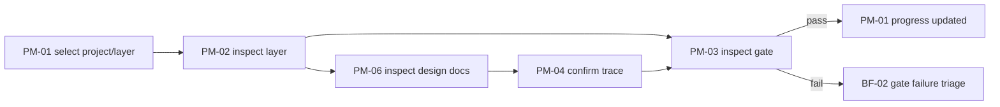
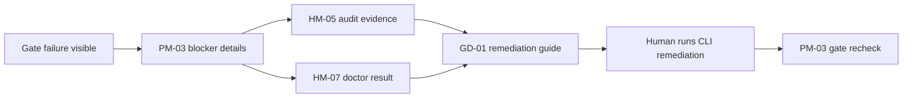

# L2 Business Flow Design

This document adds a user/business swimlane view over the UT-TDD harness. It complements [screen-flow.md](./screen-flow.md), which defines UI navigation edges. Here, the focus is who does what, which system artifact is touched, and which screen supports the human decision.

## 1. Actors and Lanes

| Lane | Actor | Responsibility | UI Surface |
|---|---|---|---|
| PO | Product owner or decision maker | Sign off gates, inspect next action, confirm scope and progress. | PM-01, PM-03, PM-05, PM-06 |
| TL / Operator | Human technical lead or harness operator | Run commands, inspect doctor/audit/recovery, coordinate runtime handover. | PM-02, PM-04, HM-01..HM-08 |
| AI Runtime | Codex / Claude Code process | Produce design, implementation, review, or verification output through CLI-mediated tasks. | No direct UI operation |
| UT-TDD Core | CLI, validators, doctor, plan lint, vmodel lint, projection writers | Enforce workflow, generate machine evidence, fail close on drift. | Reflected in PM/HM screens |
| Repository / GitHub | Git history, PR, checks, actions, review evidence | Persist canonical artifacts and CI evidence. | PM-03, HM-05, GD-01 |
| Docs / DB | Markdown design docs, test design docs, `.ut-tdd` state, `harness.db` | Provide readable design source and queryable runtime projection. | PM-04, PM-06, HM-04 |

## 2. Flow Catalog

| Flow ID | Name | Trigger | Primary Screens | Output / Decision |
|---|---|---|---|---|
| BF-01 | Forward design-to-implementation review | A plan moves through Forward `plan -> pair-freeze -> implement -> trace-freeze -> review -> accept`. | PM-01, PM-02, PM-03, PM-04, PM-06 | Gate pass/fail and next action. |
| BF-02 | Gate failure triage | A gate, doctor check, lint, or review fails. | PM-03, HM-05, HM-07, GD-01 | Human-readable blocker and remediation command text. |
| BF-03 | Handover and resume | Runtime changes, session resumes, or stale handover is detected. | PM-05, PM-02, PM-03, HM-05 | Non-stale next action and resumed work context. |
| BF-04 | Recovery / incident correction | Incorrect claim, interrupted run, broken state, or rollback candidate appears. | HM-06, PM-03, HM-05, HM-07 | Recovery decision, resume point, or escalation. |
| BF-05 | Coverage gap discovery | Coverage/trace/implementation status indicates weak or missing artifacts. | HM-02, HM-01, PM-04, PM-06 | New plan/task candidate and trace target. |
| BF-06 | Design document review | PO/TL needs to inspect canonical design docs before gate decision. | PM-06, PM-04, GD-01 | Doc review outcome and trace confirmation. |

## 3. Swimlane Flows

### BF-01 Forward Design-To-Implementation Review

| Step | PO | TL / Operator | AI Runtime | UT-TDD Core | Docs / DB | Screen |
|---:|---|---|---|---|---|---|
| 1 | Select project/layer to inspect. | Confirms active plan scope. | - | Reads plan registry/projection. | Provides current plan/doc state. | PM-01 -> PM-02 |
| 2 | Reviews design/readiness. | Runs or inspects pair-freeze evidence. | May produce design/review output via CLI. | Enforces plan/vmodel rules. | Updates design docs/test docs. | PM-02, PM-06 |
| 3 | Opens gate status. | Checks failing/passing evidence. | - | Emits gate result and next_action. | Stores evidence paths. | PM-03 |
| 4 | Confirms trace is sufficient. | Inspects upstream/downstream edges. | May repair missing artifact through a new plan. | Validates trace graph. | Updates trace/projection. | PM-04 |
| 5 | Accepts or sends back. | Records review evidence. | Implements/remediates only through approved path. | Updates status. | Persists result. | PM-03 -> PM-01 |

### BF-02 Gate Failure Triage

| Step | PO | TL / Operator | AI Runtime | UT-TDD Core | Repository / GitHub | Screen |
|---:|---|---|---|---|---|---|
| 1 | Sees failed gate or red project cell. | Opens blocker details. | - | Emits failure classification. | Provides check/log links. | PM-01 -> PM-03 |
| 2 | Reviews next_action and impact. | Opens audit/doctor evidence. | - | Maps error to gate/check. | Stores failed run evidence. | PM-03, HM-05, HM-07 |
| 3 | Chooses remediation/escalation. | Copies CLI command or opens guide. | Executes only when invoked via CLI by human/operator. | Validates remediation after rerun. | PR/check state changes. | GD-01, PM-03 |
| 4 | Rechecks gate. | Confirms pass or keeps blocker open. | - | Updates gate status. | Evidence linked. | PM-03 |

### BF-03 Handover And Resume

| Step | PO | TL / Operator | AI Runtime | UT-TDD Core | Docs / DB | Screen |
|---:|---|---|---|---|---|---|
| 1 | Opens current session state. | Checks whether handover is stale. | Previous runtime may have produced CURRENT.json. | Reads handover pointer and session digest. | Stores CURRENT.json and archives. | PM-05 |
| 2 | Confirms next work target. | Navigates to target layer/gate. | New runtime consumes handover through CLI/session context. | Resolves next_action target. | Provides plan/doc links. | PM-05 -> PM-02/PM-03 |
| 3 | Continues work. | Verifies evidence after continuation. | Produces changes through assigned role. | Updates logs/projection. | Updates handover/audit. | PM-03, HM-05 |

### BF-04 Recovery / Incident Correction

| Step | PO | TL / Operator | AI Runtime | UT-TDD Core | Repository / GitHub | Screen |
|---:|---|---|---|---|---|---|
| 1 | Notices incorrect completion, stuck run, or broken state. | Opens recovery view. | - | Surfaces recovery candidates and constraints. | Provides affected commits/checks. | HM-06 |
| 2 | Reviews safe resume/rollback options. | Checks audit and doctor output. | May be assigned a remediation role after decision. | Blocks destructive or ambiguous path. | Evidence remains linked. | HM-06, HM-05, HM-07 |
| 3 | Decides recovery route. | Runs approved CLI command or opens a recovery plan. | Executes within role. | Revalidates status. | New evidence committed/recorded. | PM-03, HM-06 |

### BF-05 Coverage Gap Discovery

| Step | PO | TL / Operator | AI Runtime | UT-TDD Core | Docs / DB | Screen |
|---:|---|---|---|---|---|---|
| 1 | Reviews coverage heatmap or project overview. | Opens weak coverage cell. | - | Aggregates missing artifacts/trace. | Provides projection rows. | HM-02 |
| 2 | Identifies missing FR/artifact/screen relation. | Opens feature list and trace view. | - | Maps FR to plan/doc/screen. | Reads relation graph. | HM-01, PM-04 |
| 3 | Opens target design doc. | Creates or routes new plan if needed. | May implement after plan approval. | Enforces plan requirements. | Updates docs/projection. | PM-06, PM-02 |

### BF-06 Design Document Review

| Step | PO | TL / Operator | AI Runtime | UT-TDD Core | Docs / DB | Screen |
|---:|---|---|---|---|---|---|
| 1 | Opens design doc tree. | Selects layer/sub-doc. | - | Reads doc catalog. | Provides Markdown/frontmatter. | PM-06 |
| 2 | Checks content and trace links. | Opens trace graph when needed. | - | Resolves trace key. | Provides upstream/downstream references. | PM-06 -> PM-04 |
| 3 | Records decision or requests remediation. | Opens gate or creates follow-up plan. | Executes only after routing. | Updates status/gate. | Evidence linked. | PM-03 |

## 4. Business Flow To UI Transition Mapping

| Business Flow | Screen Flow Scenario | Required Edges |
|---|---|---|
| BF-01 | S1 Forward normal, PM-06 supporting navigation | PM-01 -> PM-02 -> PM-03 -> PM-01; PM-02/PM-04 -> PM-06 |
| BF-02 | S2 Gate fail next_action | PM-03 -> HM-05 -> GD-01 -> PM-03 |
| BF-03 | S4 Session resume | PM-05 -> PM-02 -> PM-03 -> PM-01 |
| BF-04 | S3 Incident | PM-01 -> HM-06 -> HM-05 -> PM-01; HM-06 -> PM-03 |
| BF-05 | S5 Weak point diagnosis | HM-02 -> HM-01 -> GD-01; HM-01 -> PM-06 |
| BF-06 | PM-06 supporting navigation | PM-06 -> PM-04 -> PM-03 |

## 5. Coverage Checklist

- Each business flow has at least one primary screen and one decision/output.
- Each transition used by a business flow exists in `screen-flow.md` or is explicitly identified as a supporting navigation edge.
- Each human decision point has a screen with visible evidence, not only a log file.
- Each AI/runtime action is mediated by CLI, plan routing, or gate evidence; no UI direct execution is introduced.
- Recovery and destructive operations require human decision and show copyable command text only.

## 6. Carry

- L10 UX refinement should verify whether each business flow can be completed without hidden navigation.
- PM-06 should expose business-flow docs beside screen-flow docs so PO can review the workflow narrative.
- Future implementation should add screenshot evidence for BF-01, BF-02, BF-03, and BF-05 first because they cover daily operation and failure recovery.
