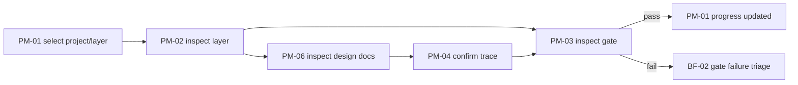
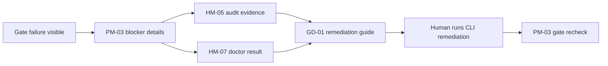

# L2 業務フロー設計

本書は UT-TDD harness に user/business swimlane view を追加する。UI navigation edges を定義する [screen-flow.md](./screen-flow.md) を補完し、誰が何を行い、どの system artifact に触れ、どの screen が human decision を支えるかに焦点を当てる。

## 1. アクターとレーン

| レーン | アクター | 責務 | UI 面 |
|---|---|---|---|
| PO | Product owner または decision maker | gate を sign off し、next action を確認し、scope と progress を確定する。 | PM-01、PM-03、PM-05、PM-06 |
| TL / Operator | Human technical lead または harness operator | command を実行し、doctor/audit/recovery を確認し、runtime handover を調整する。 | PM-02、PM-04、HM-01..HM-08 |
| AI Runtime | Codex / Claude Code process | CLI-mediated task を通じて design、implementation、review、verification output を作る。 | direct UI operation なし |
| UT-TDD Core | CLI、validator、doctor、plan lint、vmodel lint、projection writer | workflow を強制し、machine evidence を生成し、drift で fail-close する。 | PM/HM screen に反映 |
| Repository / GitHub | Git history、PR、check、action、review evidence | canonical artifact と CI evidence を永続化する。 | PM-03、HM-05、GD-01 |
| Docs / DB | Markdown design doc、test design doc、`.ut-tdd` state、`harness.db` | readable design source と query 可能な runtime projection を提供する。 | PM-04、PM-06、HM-04 |

## 2. フロー一覧

| Flow ID | 名称 | トリガー | 主要画面 | 出力 / 判断 |
|---|---|---|---|---|
| BF-01 | Forward 設計から実装へのレビュー | plan が Forward `plan -> pair-freeze -> implement -> trace-freeze -> review -> accept` を進む。 | PM-01、PM-02、PM-03、PM-04、PM-06 | Gate の pass/fail と next action。 |
| BF-02 | Gate failure の切り分け | gate、doctor check、lint、review のいずれかが fail する。 | PM-03、HM-05、HM-07、GD-01 | 人が読める blocker と remediation command text。 |
| BF-03 | Handover と再開 | runtime change、session resume、stale handover を検出する。 | PM-05、PM-02、PM-03、HM-05 | stale でない next action と再開後の作業 context。 |
| BF-04 | Recovery / incident correction | incorrect claim、interrupted run、broken state、rollback candidate が現れる。 | HM-06、PM-03、HM-05、HM-07 | recovery decision、resume point、escalation。 |
| BF-05 | Coverage gap discovery | coverage/trace/implementation status が弱い artifact または missing artifact を示す。 | HM-02、HM-01、PM-04、PM-06 | new plan/task candidate と trace target。 |
| BF-06 | Design document review | PO/TL が gate decision 前に canonical design doc を確認する必要がある。 | PM-06、PM-04、GD-01 | doc review outcome と trace confirmation。 |

## 3. スイムレーンフロー

### BF-01 Forward 設計から実装へのレビュー

| 手順 | PO | TL / Operator | AI Runtime | UT-TDD Core | Docs / DB | 画面 |
|---:|---|---|---|---|---|---|
| 1 | 確認対象の project/layer を選ぶ。 | active plan scope を確認する。 | - | plan registry/projection を読む。 | current plan/doc state を提供する。 | PM-01 -> PM-02 |
| 2 | design/readiness を review する。 | pair-freeze evidence を実行または確認する。 | CLI 経由で design/review output を作る場合がある。 | plan/vmodel rule を強制する。 | design docs/test docs を更新する。 | PM-02、PM-06 |
| 3 | gate status を開く。 | failing/passing evidence を確認する。 | - | gate result と next_action を出す。 | evidence path を保存する。 | PM-03 |
| 4 | trace が十分か確認する。 | upstream/downstream edge を確認する。 | new plan 経由で missing artifact を修復する場合がある。 | trace graph を検証する。 | trace/projection を更新する。 | PM-04 |
| 5 | accept または差し戻しを行う。 | review evidence を記録する。 | approved path だけで実装/是正する。 | status を更新する。 | result を永続化する。 | PM-03 -> PM-01 |

```mermaid
flowchart LR
  A[PM-01 select project/layer] --> B[PM-02 inspect layer]
  B --> C[PM-06 inspect design docs]
  B --> D[PM-03 inspect gate]
  C --> E[PM-04 confirm trace]
  E --> D
  D -->|pass| F[PM-01 progress updated]
  D -->|fail| G[BF-02 gate failure triage]
```

### BF-02 Gate failure の切り分け

| 手順 | PO | TL / Operator | AI Runtime | UT-TDD Core | Repository / GitHub | 画面 |
|---:|---|---|---|---|---|---|
| 1 | failed gate または red project cell を見る。 | blocker detail を開く。 | - | failure classification を出す。 | check/log link を提供する。 | PM-01 -> PM-03 |
| 2 | next_action と impact を review する。 | audit/doctor evidence を開く。 | - | error を gate/check へ map する。 | failed run evidence を保存する。 | PM-03、HM-05、HM-07 |
| 3 | remediation/escalation を選ぶ。 | CLI command を copy または guide を開く。 | human/operator が CLI で起動した場合のみ実行する。 | rerun 後に remediation を検証する。 | PR/check state が変わる。 | GD-01、PM-03 |
| 4 | gate を再確認する。 | pass を確認するか blocker を open のままにする。 | - | gate status を更新する。 | evidence を link する。 | PM-03 |

```mermaid
flowchart LR
  A[Gate failure visible] --> B[PM-03 blocker details]
  B --> C[HM-05 audit evidence]
  B --> D[HM-07 doctor result]
  C --> E[GD-01 remediation guide]
  D --> E
  E --> F[Human runs CLI remediation]
  F --> G[PM-03 gate recheck]
```

### BF-03 Handover と再開

| 手順 | PO | TL / Operator | AI Runtime | UT-TDD Core | Docs / DB | 画面 |
|---:|---|---|---|---|---|---|
| 1 | current session state を開く。 | handover が stale か確認する。 | previous runtime が CURRENT.json を作っている場合がある。 | handover pointer と session digest を読む。 | CURRENT.json と archive を保存する。 | PM-05 |
| 2 | next work target を確認する。 | target layer/gate へ移動する。 | new runtime は CLI/session context 経由で handover を消費する。 | next_action target を解決する。 | plan/doc link を提供する。 | PM-05 -> PM-02/PM-03 |
| 3 | 作業を継続する。 | 継続後の evidence を検証する。 | assigned role に従って変更を作る。 | log/projection を更新する。 | handover/audit を更新する。 | PM-03、HM-05 |

### BF-04 Recovery と incident correction

| 手順 | PO | TL / Operator | AI Runtime | UT-TDD Core | Repository / GitHub | 画面 |
|---:|---|---|---|---|---|---|
| 1 | incorrect completion、stuck run、broken state に気づく。 | recovery view を開く。 | - | recovery candidate と constraint を表示する。 | affected commit/check を提供する。 | HM-06 |
| 2 | safe resume/rollback option を review する。 | audit と doctor output を確認する。 | decision 後に remediation role を割り当てられる場合がある。 | destructive または ambiguous path を block する。 | evidence は link されたままにする。 | HM-06、HM-05、HM-07 |
| 3 | recovery route を決める。 | approved CLI command を実行、または recovery plan を開く。 | role 内で実行する。 | status を再検証する。 | new evidence を commit/record する。 | PM-03、HM-06 |

### BF-05 Coverage gap の発見

| 手順 | PO | TL / Operator | AI Runtime | UT-TDD Core | Docs / DB | 画面 |
|---:|---|---|---|---|---|---|
| 1 | coverage heatmap または project overview を review する。 | weak coverage cell を開く。 | - | missing artifact/trace を集約する。 | projection row を提供する。 | HM-02 |
| 2 | missing FR/artifact/screen relation を特定する。 | feature list と trace view を開く。 | - | FR を plan/doc/screen へ map する。 | relation graph を読む。 | HM-01、PM-04 |
| 3 | target design doc を開く。 | 必要なら new plan を作成または route する。 | plan approval 後に実装する場合がある。 | plan requirement を強制する。 | docs/projection を更新する。 | PM-06、PM-02 |

### BF-06 設計文書レビュー

| 手順 | PO | TL / Operator | AI Runtime | UT-TDD Core | Docs / DB | 画面 |
|---:|---|---|---|---|---|---|
| 1 | design doc tree を開く。 | layer/sub-doc を選ぶ。 | - | doc catalog を読む。 | Markdown/frontmatter を提供する。 | PM-06 |
| 2 | content と trace link を確認する。 | 必要に応じて trace graph を開く。 | - | trace key を解決する。 | upstream/downstream reference を提供する。 | PM-06 -> PM-04 |
| 3 | decision を記録、または remediation を要求する。 | gate を開く、または follow-up plan を作成する。 | routing 後にのみ実行する。 | status/gate を更新する。 | evidence を link する。 | PM-03 |

## 4. 業務フローと UI 遷移の対応

| 業務フロー | 画面フローシナリオ | 必須エッジ |
|---|---|---|
| BF-01 | S1 Forward normal と PM-06 supporting navigation | PM-01 -> PM-02 -> PM-03 -> PM-01。PM-02/PM-04 -> PM-06 |
| BF-02 | S2 Gate fail 時の next_action | PM-03 -> HM-05 -> GD-01 -> PM-03 |
| BF-03 | S4 Session resume | PM-05 -> PM-02 -> PM-03 -> PM-01 |
| BF-04 | S3 Incident | PM-01 -> HM-06 -> HM-05 -> PM-01。HM-06 -> PM-03 |
| BF-05 | S5 Weak point diagnosis | HM-02 -> HM-01 -> GD-01。HM-01 -> PM-06 |
| BF-06 | PM-06 supporting navigation | PM-06 -> PM-04 -> PM-03 |

## 5. Coverage チェックリスト

- 各 business flow は 1 つ以上の primary screen と 1 つの decision/output を持つ。
- business flow が使う各 transition は `screen-flow.md` に存在するか、supporting navigation edge として明示する。
- 各 human decision point は log file だけでなく visible evidence を持つ screen を持つ。
- 各 AI/runtime action は CLI、plan routing、gate evidence のいずれかで媒介し、UI direct execution は導入しない。
- recovery と destructive operation は human decision を要求し、copy 可能な command text だけを表示する。

## 6. Carry

- L10 UX refinement は、各 business flow が hidden navigation なしで完了できるかを検証する。
- PM-06 は screen-flow docs の隣に business-flow docs を公開し、PO が workflow narrative を review できるようにする。
- 将来の実装では、daily operation と failure recovery を覆う BF-01、BF-02、BF-03、BF-05 から screenshot evidence を追加する。
