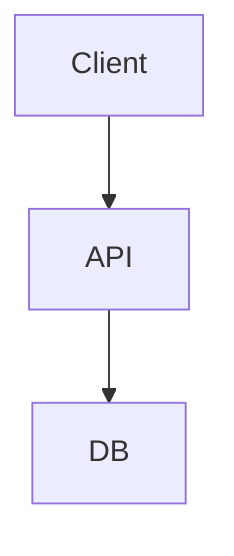
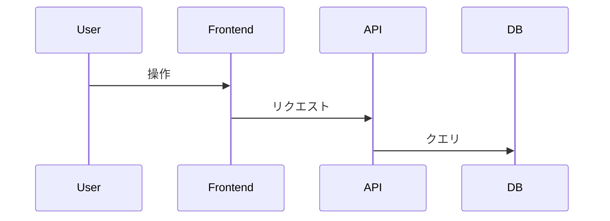
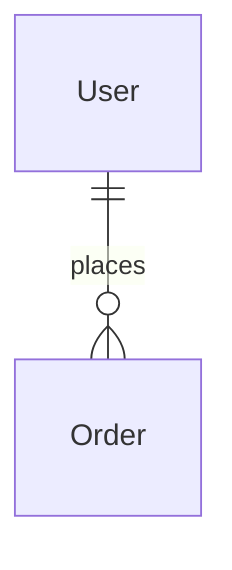
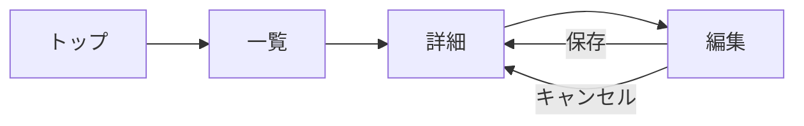

# 基本設計書

## 1. 概要
### 1.1 目的
<!-- 要件定義書 §1 から転記 -->

### 1.2 スコープ
- 対象範囲:
- 対象外:

### 1.3 前提条件・制約
<!-- 要件定義書 §6 から転記 -->

## 2. アーキテクチャ
### 2.1 システム構成図


### 2.2 技術スタック
| レイヤー | 技術 | バージョン | 選定理由 |
|---------|------|-----------|---------|
| Frontend | | | |
| Backend | | | |
| Database | | | |
| Infrastructure | | | |
| 監視 | | | |
<!-- 記入例:
| Frontend | Next.js | 14.x | SSR/SSG対応、React エコシステム活用 |
| Backend | FastAPI | 0.110 | 型安全、OpenAPI自動生成、非同期対応 |
| Database | PostgreSQL | 16 | JSONB対応、実績豊富 |
| Infrastructure | AWS ECS | - | コンテナ運用、オートスケール |
| 監視 | Datadog | - | APM + ログ統合 |
-->

### 2.3 ADR (Architecture Decision Records)
- [ADR-001](../adr/ADR-001.md): 

## 3. 機能設計
### 3.1 機能一覧
| ID | 機能名 | 概要 | 対応要件 | 優先度 |
|----|--------|------|---------|--------|
| F-001 | | | REQ-F-001 | |

### 3.2 ユーザーフロー


## 4. データモデル
### 4.1 ER図


### 4.2 主要エンティティ
| エンティティ | 概要 | 主要属性 | 概算レコード数 |
|-------------|------|---------|-------------|
| | | | |

## 5. API 概要設計
| ID | メソッド | パス | 概要 | 認証 | 対応機能 |
|----|---------|------|------|------|---------|
| A-001 | GET | /api/v1/ | | 要 | F-001 |

## 6. 画面設計
### 6.1 画面一覧
| ID | 画面名 | 概要 | 対応機能 | 遷移元 | 備考 |
|----|--------|------|---------|--------|------|
| S-001 | | | F-001 | | |

### 6.2 ユーザーフロー

<!-- 記入例:
graph LR
  Login[ログイン] --> Dashboard[ダッシュボード]
  Dashboard --> UserList[ユーザー一覧]
  UserList --> UserDetail[ユーザー詳細]
  UserDetail --> UserEdit[ユーザー編集]
  Dashboard --> Settings[設定]
-->

### 6.3 情報設計（IA）
```
サイト構造:
├── トップ (S-001)
│   ├── 一覧 (S-002)
│   │   └── 詳細 (S-003)
│   │       └── 編集 (S-004)
│   └── 設定 (S-xxx)
```
<!-- 記入例:
├── ダッシュボード
│   ├── プロジェクト一覧
│   │   └── プロジェクト詳細
│   │       ├── タスク一覧
│   │       └── メンバー管理
│   ├── 通知
│   └── 設定
│       ├── プロフィール
│       └── チーム管理
-->

### 6.4 ナビゲーション構造
| 種別 | 配置 | 項目 | 表示条件 |
|------|------|------|---------|
| グローバルナビ | ヘッダー/サイドバー | | 常時 |
| ローカルナビ | コンテンツ上部 | | 該当画面のみ |
| パンくずリスト | コンテンツ上部 | | 階層2以上 |
| ボトムナビ | フッター(mobile) | | mobile のみ |
<!-- 記入例:
| グローバルナビ | サイドバー | ダッシュボード / プロジェクト / 通知 / 設定 | 常時（ログイン後） |
| ローカルナビ | コンテンツ上部タブ | 概要 / タスク / メンバー / 設定 | プロジェクト詳細内 |
| パンくずリスト | コンテンツ上部 | ホーム > プロジェクト > [名前] | 階層2以上 |
| ボトムナビ | フッター | ホーム / プロジェクト / 通知 / マイページ | mobile のみ |
-->

## 7. セキュリティ設計
### 7.1 脅威分析（STRIDE）
| 脅威カテゴリ | 脅威シナリオ | 影響度 | 対策 |
|-------------|------------|--------|------|
| Spoofing | | | |
| Tampering | | | |
| Repudiation | | | |
| Information Disclosure | | | |
| Denial of Service | | | |
| Elevation of Privilege | | | |
<!-- 記入例:
| Spoofing | 他ユーザーのJWTを偽造 | 高 | JWT署名検証 + 短い有効期限 |
| Tampering | リクエストボディ改竄 | 中 | 入力バリデーション + HTTPS必須 |
-->

### 7.2 認証・認可設計
- 認証フロー:
- 認可モデル (RBAC/ABAC):
- トークン管理:

## 8. 非機能設計
### 8.1 性能設計
- キャッシュ戦略:
- DB インデックス戦略:
- CDN:

### 8.2 監視・ログ設計
| メトリクス | 閾値 | アラート先 |
|-----------|------|-----------|
| レスポンスタイム p95 | | |
| エラー率 | | |

### 8.3 バックアップ・DR
- バックアップ頻度:
- リストア手順:

## 9. 外部依存
| 依存先 | 用途 | SLA | フォールバック |
|--------|------|-----|-------------|
| | | | |

## 10. リスクと対策
| ID | リスク | 影響度 | 発生確率 | 対策 |
|----|--------|--------|---------|------|
| R-001 | | 高/中/低 | | |

---
## 駆動タイプ別の重点ガイド

| 駆動 | 必須セクション | 重点 | 省略可 |
|------|--------------|------|--------|
| be | §2,3,4,5,7,8 | API設計・データモデル | §6 画面 |
| fe | §2,3,6,7 | 画面一覧・ユーザーフロー | §4 データモデル詳細 |
| db | §2,4,5,8 | ER図・スキーマ・マイグレーション | §6 画面 |
| fullstack | 全セクション | BE+FE接続契約 | なし |
| agent | §2,3,5,7 | ツール定義・プロンプト設計 | §6 画面 |

## V-model メタデータ（architecture layer）

- sprint_type: architecture
- layer: architecture
- track: be / fe / db / fullstack
- pair_status: pending
- drive: be
- origin_mode: forward
- evidence_status: inferred

### review_axes（5 axis）

- vertical
- horizontal
- API-contract integrity
- state consistency
- operational readiness

### pair_status 遷移ルール

- architecture 設計凍結（G2）時は `pair_status='paired'` が必須
- 初期: pending → design_only / test_only（要件に応じて）→ paired

### 設計凍結時の design_sprint_entries 記録

- sprint_type: architecture
- layer: architecture
- track: be / fe / db / fullstack / shared
- drive: be / fe / db / fullstack
- pair_status: pending / design_only / test_only / paired
- freeze_gate: G2
- subgate: architecture_freeze

### G2 通過条件（architecture）

- API/構成説明の合意（既存 section）
- `pair_status == paired`
