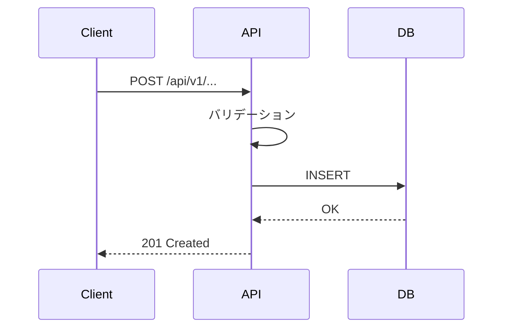

# 詳細設計書

## 1. API 詳細仕様 (D-API)

### A-001: [エンドポイント名]
- **Method**: POST
- **Path**: /api/v1/...
- **認証**: Bearer token (required)
- **対応機能**: F-001

#### Request
| フィールド | 型 | 必須 | 説明 | バリデーション |
|-----------|------|------|------|-------------|
| field1 | string | YES | | max: 255 |

#### Response (200)
| フィールド | 型 | 説明 |
|-----------|------|------|
| id | string (UUID) | |
| created_at | string (ISO8601) | |
<!-- 記入例:
### A-001: ユーザー登録
- **Method**: POST
- **Path**: /api/v1/users
- **認証**: 不要（公開エンドポイント）

#### Request
| フィールド | 型 | 必須 | 説明 | バリデーション |
|-----------|------|------|------|-------------|
| email | string | YES | メールアドレス | RFC5322準拠 |
| password | string | YES | パスワード | min:8, max:128, 英数記号 |
| name | string | YES | 表示名 | min:1, max:50 |

#### Response (201)
| フィールド | 型 | 説明 |
|-----------|------|------|
| id | string (UUID) | ユーザーID |
| email | string | 登録メール |
| created_at | string (ISO8601) | 作成日時 |
-->

#### Errors
| Status | Code | 条件 | レスポンス例 |
|--------|------|------|------------|
| 400 | VALIDATION_ERROR | 必須フィールド欠損 | |
| 401 | UNAUTHORIZED | トークン無効 | |
| 404 | NOT_FOUND | リソース不在 | |
| 409 | CONFLICT | 重複 | |
| 429 | RATE_LIMITED | レート超過 | |

---

## 2. DB スキーマ詳細 (D-DB)

### テーブル: [テーブル名]
| カラム | 型 | NULL | デフォルト | 説明 |
|--------|------|------|-----------|------|
| id | UUID | NO | gen_random_uuid() | PK |
| created_at | TIMESTAMPTZ | NO | NOW() | 作成日時 |

### インデックス
| 名前 | カラム | 種別 | 理由 |
|------|--------|------|------|
| idx_xxx_yyy | xxx, yyy | BTREE | クエリパターン: ... |

### マイグレーション計画 (D-MIG-PLAN)
| Step | 内容 | ロールバック |
|------|------|------------|
| 1 | CREATE TABLE ... | DROP TABLE |
| 2 | ADD INDEX ... | DROP INDEX |

---

## 3. 画面仕様 (D-UI)

### S-001: [画面名]
- **目的**:
- **対応機能**: F-001

#### 3.1 コンポーネント構成図
```
S-001: [画面名]
├── Header (共通)
│   ├── Logo
│   ├── Navigation
│   └── UserMenu
├── MainContent
│   ├── PageTitle
│   ├── FilterBar
│   │   ├── SearchInput
│   │   └── FilterSelect
│   └── ContentArea
│       ├── ItemCard (繰り返し)
│       │   ├── CardImage
│       │   ├── CardTitle
│       │   └── CardActions
│       └── Pagination
└── Footer (共通)
```
<!-- 記入例:
S-001: ダッシュボード
├── AppShell
│   ├── Sidebar
│   │   ├── Logo
│   │   ├── NavMenu
│   │   └── UserProfile
│   └── MainArea
│       ├── DashboardHeader
│       │   ├── PageTitle
│       │   └── ActionButtons
│       ├── StatsGrid
│       │   └── StatCard x4
│       ├── RecentActivity
│       │   └── ActivityItem (繰り返し)
│       └── QuickActions
-->

#### 3.2 状態管理（Props / State / Context）
| コンポーネント | Props | ローカル State | Context / Store | データソース |
|-------------|-------|-------------|----------------|-----------|
| ItemCard | id, title, image | isHovered | - | API: GET /items |
| FilterBar | - | searchQuery, selectedFilter | - | ローカル |
| Pagination | totalCount | currentPage | - | API レスポンス |
<!-- 記入例:
| UserCard | userId, name, avatar | isExpanded | AuthContext.currentUser | API: GET /users/:id |
| TaskList | projectId | sortOrder, filterStatus | TaskStore.tasks | API: GET /tasks?project=:id |
| NotificationBell | - | isOpen | NotificationContext.unreadCount | WebSocket |
-->

#### 3.3 イベントハンドリング
| コンポーネント | イベント | ハンドラ | アクション | 副作用 |
|-------------|---------|---------|----------|--------|
| SearchInput | onChange (debounce 300ms) | handleSearch | フィルタ更新 | API 再取得 |
| ItemCard | onClick | handleItemClick | 詳細画面へ遷移 | router.push |
| DeleteButton | onClick | handleDelete | 確認ダイアログ表示 | API: DELETE |
<!-- 記入例:
| LoginForm | onSubmit | handleLogin | API: POST /auth/login | トークン保存 → リダイレクト |
| LogoutButton | onClick | handleLogout | AuthContext.logout() | トークン削除 → ログイン画面 |
| InfiniteScroll | onScroll (threshold: 80%) | handleLoadMore | 次ページ取得 | API: GET /items?page=N |
-->

#### 3.4 バリデーションルール
| フィールド | ルール | タイミング | エラーメッセージ | 表示位置 |
|-----------|--------|----------|---------------|---------|
| | | onBlur / onSubmit | | フィールド直下 |
<!-- 記入例:
| email | required, RFC5322 | onBlur | 「有効なメールアドレスを入力してください」 | フィールド直下 |
| password | required, min:8, pattern: /[A-Za-z0-9!@#$%]/ | onBlur | 「8文字以上の英数記号を入力してください」 | フィールド直下 |
| name | required, max:50 | onBlur | 「名前を入力してください（50文字以内）」 | フィールド直下 |
| confirmPassword | required, match: password | onChange | 「パスワードが一致しません」 | フィールド直下 |
-->

#### 3.5 エラー・ローディング状態
| 状態 | 表示方法 | コンポーネント | 条件 |
|------|---------|-------------|------|
| 初回ローディング | スケルトン | ContentSkeleton | isLoading && !data |
| リフレッシュ | スピナー | LoadingSpinner | isRefreshing |
| API エラー | トースト + リトライ | ErrorToast | isError |
| データ空 | 空状態メッセージ | EmptyState | !isLoading && data.length === 0 |
| ネットワークエラー | フルスクリーン | NetworkError | !navigator.onLine |

---

## 4. 処理フロー

### F-001: [機能名]


---

## 5. テスト設計

### 5.1 テスト戦略
| レベル | 対象 | ツール | カバレッジ目標 |
|--------|------|--------|-------------|
| Unit | ロジック | Jest/pytest | ≥80% |
| Integration | API | supertest | 全エンドポイント |
| E2E | ユーザーフロー | Playwright | クリティカルパス |

### 5.2 テストケース
| ID | 対象 | 種別 | 条件 | 期待結果 | 優先度 |
|----|------|------|------|---------|--------|
| TC-001 | A-001 | 正常系 | 有効なリクエスト | 201 + リソース作成 | P0 |
| TC-002 | A-001 | 異常系 | 必須フィールド欠損 | 400 + エラー詳細 | P0 |
| TC-003 | A-001 | 境界値 | field1 = 256文字 | 400 | P1 |
<!-- 記入例:
| TC-001 | A-001 | 正常系 | 有効なメール+PW+名前 | 201 + ユーザー作成 | P0 |
| TC-002 | A-001 | 異常系 | メール形式不正 | 400 + email フィールドエラー | P0 |
| TC-003 | A-001 | 異常系 | PW 7文字（境界値-1） | 400 + password エラー | P0 |
| TC-004 | A-001 | 異常系 | 既存メールで登録 | 409 CONFLICT | P1 |
| TC-005 | A-001 | 性能 | 100並列リクエスト | p95 < 200ms | P2 |
-->

---

## 6. 工程表

工程表の正本は `docs/design/L3-schedule-wbs.md` に分離する。

- WBS / 担当 role / 依存 / 期間 / 環境
- L4 Sprint 接続
- feature flag
- rollback
- クリティカルパス
- G3 チェック

この詳細設計書では、工程表の要約と関連リンクだけを置く。

| 項目 | リンク / 値 |
|------|-------------|
| 工程表 | `docs/design/L3-schedule-wbs.md` |
| クリティカルパス | |
| 合計見積 | |
| high risk WBS | |

## V-model メタデータ（detailed layer）

- sprint_type: detailed
- layer: detailed
- track: be / fe / db / fullstack / shared
- pair_status: pending
- drive: be
- origin_mode: forward
- evidence_status: inferred

### design_sprint_entries 記録

- sprint_type: detailed
- layer: detailed
- track: be / fe / db / fullstack / shared
- drive: be / fe / db / fullstack
- pair_status: pending / design_only / test_only / paired
- freeze_gate: G3

### G3 通過条件（detailed）

- API/Schema Freeze が同時に完了していること（既存 section 記載を維持）
- `pair_status == paired`
- design / test_design の対応付けを architecture/detailed chain に追加

### API/Schema Freeze 時の記録項目

- `layer: detailed`
- `sprint_type: detailed`
- `freeze_gate: G3`
