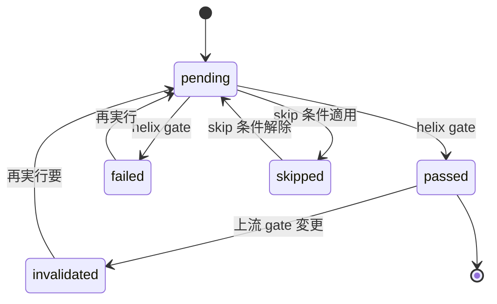
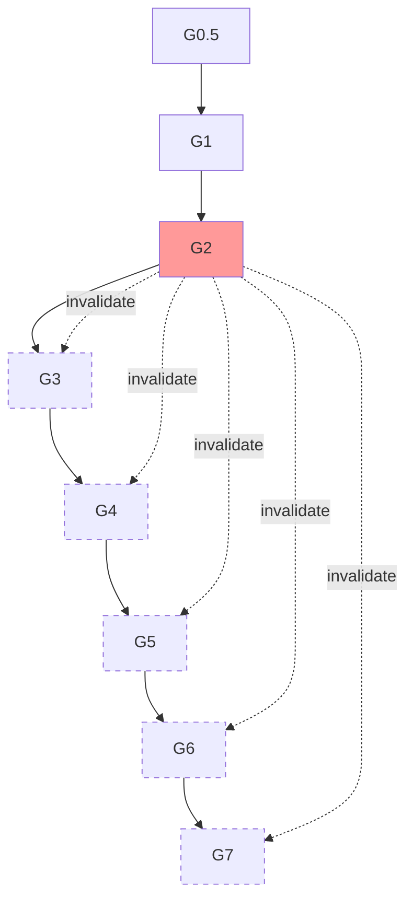

# D-STATE-SPEC: 状態機械遷移仕様

> Status: Accepted
> Date: 2026-04-14
> Authors: TL

---

## 1. 目的

HELIX のフェーズ遷移・ゲート遷移・sprint ステップ遷移を単一の仕様書にまとめる。GAP-025「状態機械の遷移仕様書なし（phase_guard.py 内にハードコード）」の解消を目的とする。

正本:
- `cli/templates/state-machine.yaml` — 状態機械のマシン可読定義
- `cli/lib/phase_guard.py` — 状態遷移の実装

---

## 2. 状態の全体像

HELIX の状態は3階層で構成される:

```
モード (mode)           : forward | reverse | scrum
  └─ フェーズ (phase)   : L1-L11 | R0-R4 | S0-S4
      └─ ゲート (gate)  : G0.5, G1, G1R, G1.5, G2-G11（G8 は存在しない） | RG0-RG3
          └─ sprint     : .1a, .1b, .2, .3, .4, .5, .b1, .b2, .b3
```

---

## 3. Gate ステータス

### 3.1 ステータス種別

| ステータス | 意味 |
|----------|------|
| `pending` | 未実行 / 実行前 |
| `passed` | 通過（成果物完備 + 静的チェック OK） |
| `failed` | 失敗（リトライ可能） |
| `skipped` | 条件付きスキップ（例: UI なしプロジェクトの G5） |
| `invalidated` | 上流変更により再検証必要 |

### 3.2 ステータス遷移



### 3.3 有効遷移マトリクス

`state-machine.yaml` 定義:

```yaml
valid_transitions:
  pending:      [passed, failed, skipped]
  passed:       [invalidated]
  failed:       [pending]
  skipped:      [pending]
  invalidated:  [pending]
```

不正な遷移（例: `failed → passed` を直接）は `phase_guard.py` が拒否する。

---

## 4. Gate 依存関係と invalidation カスケード

### 4.1 依存関係定義

```yaml
gates:
  G0.5: { prereqs: [],       on_pass_phase: L1 }
  G1:   { prereqs: [],       on_pass_phase: L2, on_invalidate: [] }
  G1.5: { prereqs: [],       on_pass_phase: null }  # 条件付きゲート
  G1R:  { prereqs: [],       on_pass_phase: null }  # 条件付きゲート
  G2:   { prereqs: [G1],     on_pass_phase: L3, on_invalidate: [G3,G4,G5,G6,G7] }
  G3:   { prereqs: [G2],     on_pass_phase: L4, on_invalidate: [G4,G5,G6,G7] }
  G4:   { prereqs: [G3],     on_pass_phase: L5, on_invalidate: [G5,G6,G7] }
  G5:   { prereqs: [G4],     on_pass_phase: L6, on_invalidate: [G6,G7] }
  G6:   { prereqs: [G5],     on_pass_phase: L7, on_invalidate: [G7] }
  G7:   { prereqs: [G6],     on_pass_phase: L8, on_invalidate: [] }
```

### 4.2 Invalidation カスケード

上流 gate が `passed → invalidated` に遷移すると、下流 gate は連鎖的に invalidated になる:



### 4.3 カスケード発動条件

- **G2 の再審査**: 設計凍結解除 → G3-G7 を invalidated
- **G3 の再審査**: API 契約変更 → G4-G7 を invalidated
- **G4 の再審査**: 実装変更 → G5-G7 を invalidated
- **Freeze-break 検知**: `freeze_checker.py` が freeze 違反検知 → 該当 gate + 下流を invalidate

---

## 5. フェーズ遷移

### 5.1 Forward HELIX フェーズ

```
L1 ──G0.5+G1──> L2 ──G2──> L3 ──G3──> L4 ──G4──> L5 ──G5──> L6 ──G6──> L7 ──G7──> L8
                                       ↑
                                   sprint (.1a→.5)
```

### 5.2 Reverse HELIX フェーズ

```
R0 ──RG0──> R1 ──RG1──> R2 ──RG2──> R3 ──RG3──> R4 ──RG3──> Forward
                                                    ↑
                                           (R3 と同一ゲート、ADR-013 参照)
```

### 5.3 モード間遷移

```
forward ─────helix mode reverse────→ reverse
forward ─────helix mode scrum─────→ scrum
reverse ─R4完了──helix mode forward→ forward
scrum ──confirmed──helix mode forward→ forward
```

---

## 6. Sprint ステップ遷移

### 6.1 Forward L4 sprint（be/fe/db/agent 駆動）

```
.1a (設計Review) → .1b (CI green) → .2 (実装) → .3 (テスト) → .4 (refactor) → .5 (commit)
```

### 6.2 Fullstack L4 sprint（Phase A → Phase B）

```
Phase A:
  BE Track:  .1a(be) → .1b(be) → .2(be) → .3(be) → .4(be) → .5(be)
  FE Track:  .1a(fe) → .1b(fe) → .2(fe) → .3(fe) → .4(fe) → .5(fe)  ← 並行実施

Phase B (L4.5 結合):
  .b1 (結合テスト設計) → .b2 (結合実装) → .b3 (E2E確認)
```

昇格条件:
- Phase A → Phase B: 両 Track の `.5` が完了
- Phase B → L5: `.b3` 完了 + G4 通過

---

## 7. エラーハンドリング

### 7.1 不正遷移検知

`phase_guard.py` が以下を検知:

| エラー種別 | 検知条件 | 対処 |
|----------|---------|------|
| `invalid_transition` | valid_transitions テーブル外の遷移 | エラー終了（exit 4） |
| `missing_prereq` | prereq gate が passed でない | エラー終了 + prereq gate を通すよう指示 |
| `phase_skip` | 現在フェーズを飛ばす遷移 | エラー終了 + 中間 gate の実行を指示 |
| `freeze_violation` | 凍結 gate 後の成果物変更 | 警告 + gate を invalidated に設定 |

### 7.2 リカバリ手順

- **failed → pending**: 失敗原因を修正後、`helix gate <G>` を再実行
- **invalidated → pending**: 上流変更内容を確認、再検証を実施
- **skipped → pending**: `helix gate <G>` を再実行（強制チェック）

---

## 8. 監査ログ

全 gate 遷移は `helix.db.gate_runs` テーブルに記録:

```sql
CREATE TABLE gate_runs (
    id INTEGER PRIMARY KEY,
    gate TEXT,
    result TEXT,           -- passed/failed/skipped
    task_run_id INTEGER REFERENCES task_runs(id),
    details TEXT,          -- JSON
    created_at TEXT
);
```

`helix log report` / `helix bench` で可視化される。

---

## 9. 今後の拡張

| 項目 | 内容 | 優先度 |
|------|------|------|
| Process Guard | リソース制限（トークン・時間）での gate 強制停止 | P2（GAP-012 関連） |
| Output Guard | 秘密情報検出・契約適合チェック | P2 |
| 並列 gate 実行 | G5（UI なし skip）と G6 の並行評価 | P3 |
| 状態遷移の可視化 | `helix status --graph` でリアルタイム遷移図 | P3 |

---

## 10. References

- `cli/templates/state-machine.yaml` — 状態機械正本
- `cli/lib/phase_guard.py` — 状態遷移実装
- `cli/lib/freeze_checker.py` — 凍結検知
- [ADR-005: YAML-SQLite Dual State](../adr/ADR-005-yaml-sqlite-dual-state.md)
- [ADR-007: 3モード統合](../adr/ADR-007-three-mode-integration.md)
- [ADR-011: helix-test 重複管理](../adr/ADR-011-test-duplication.md)
- [ADR-013: R4 専用ゲート要否](../adr/ADR-013-r4-gate-design.md)
