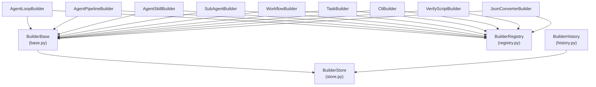

# L2 設計書: Builder System

> フェーズ: L2 全体設計
> ステータス: Accepted
> 作成日: 2026-04-05
> 対象: `cli/lib/builders/` (14 モジュール)

---

## 1. 目的

Builder System は HELIX CLI における成果物の自動生成パイプラインを提供する。テンプレートメソッドパターンにより `validate_input -> generate -> validate_output` の 3 段階で成果物を生成し、全実行を SQLite に記録することで再現性と品質追跡を実現する。

### 1.1 解決する課題

| 課題 | Builder System による解決 |
|------|--------------------------|
| 成果物生成の再現性がない | execution_id で全実行を追跡。seed（過去の実行結果）から再生成可能 |
| 品質の定量評価ができない | validation_summary + quality_score を自動記録 |
| 生成パターンの蓄積ができない | pattern_tags + input_hash によるパターン分類。Learning Engine と連携 |
| 秘密情報の漏洩リスク | Store 層で redaction を自動適用 |

---

## 2. アーキテクチャ

### 2.1 クラス構成

```
BuilderBase (base.py)           テンプレートメソッドパターンの基底クラス
    |
    +-- BuilderRegistry (registry.py)   BUILDER_TYPE -> クラスの名前解決
    +-- BuilderStore (store.py)         SQLite 永続化（builder_executions テーブル）
    +-- BuilderHistory (history.py)     成功履歴からの類似パターン検索
    |
    +-- AgentLoopBuilder           (agent_loop.py)
    +-- AgentPipelineBuilder       (agent_pipeline.py)
    +-- AgentSkillBuilder          (agent_skill.py)
    +-- SubAgentBuilder            (sub_agent.py)
    +-- WorkflowBuilder            (workflow_builder.py)
    +-- TaskBuilder                (task_builder.py)
    +-- CliBuilder                 (cli.py)
    +-- VerifyScriptBuilder        (verify_script.py)
    +-- JsonConverterBuilder       (json_converter.py)
```

### 2.2 モジュール依存関係



---

## 3. BuilderBase（テンプレートメソッド）

### 3.1 ライフサイクル

```
build(task_id, input_params, seed_execution_id?)
  |
  +-- start(task_id, input_params)          execution_id を発行、Store に running 状態で登録
  |
  +-- validate_input(input_params) -> dict  入力パラメータの検証。不正なら例外
  |     +-- step("validate_input", {valid: true})
  |
  +-- [seed_execution_id があれば]
  |     +-- store.get_execution(seed_execution_id)  過去の実行結果を取得
  |
  +-- generate(validated, seed) -> list[dict]  成果物の生成。seed があればそれを起点に再生成
  |     +-- step("generate", {artifact_count: N})
  |
  +-- validate_output(artifacts) -> dict    出力の検証。quality_score を含む
  |     +-- step("validate_output", validation)
  |
  +-- finish(success=True, artifacts, validation)  Store を completed に更新
  |
  +-- return {execution_id, artifacts}
```

**エラー時**: `finish(success=False, error=str(exc))` で Store を failed に更新してから例外を再送出する。

### 3.2 サブクラスの実装契約

| メソッド | 入力 | 出力 | 責務 |
|---------|------|------|------|
| `validate_input(params)` | 生のユーザー入力 dict | 検証済み dict | 必須フィールドの存在確認、型チェック |
| `generate(params, seed)` | 検証済み入力 + 過去の seed | `list[dict]` (成果物リスト) | 実際の成果物生成ロジック |
| `validate_output(artifacts)` | 生成された成果物リスト | validation dict (quality_score 含む) | 出力の構造・品質チェック |

### 3.3 BUILDER_TYPE と SCHEMA_VERSION

各サブクラスはクラス変数で宣言する:

```python
class AgentLoopBuilder(BuilderBase):
    BUILDER_TYPE = "agent-loop"
    SCHEMA_VERSION = "1.0"
```

`BUILDER_TYPE` は空文字の場合 `start()` 時に `ValueError` を送出する。

---

## 4. 8 つのビルダータイプ

| BUILDER_TYPE | モジュール | 生成対象 |
|--------------|----------|---------|
| `agent-loop` | agent_loop.py | エージェントループ定義（ループ実行パターンの構造化） |
| `agent-pipeline` | agent_pipeline.py | エージェントパイプライン定義（直列実行パターンの構造化） |
| `agent-skill` | agent_skill.py | エージェントスキル定義（SKILL.md テンプレートの生成） |
| `sub-agent` | sub_agent.py | サブエージェント定義（委譲先エージェントの構造化） |
| `workflow` | workflow_builder.py | ワークフロー定義（HELIX フェーズに沿ったワークフローの生成） |
| `task` | task_builder.py | タスク定義（Task OS 用タスクの構造化） |
| `verify-script` | verify_script.py | 検証スクリプト生成（Bash テストスクリプトの自動生成） |
| `json-converter` | json_converter.py | JSON 変換（YAML/Markdown から JSON への構造変換） |

---

## 5. BuilderRegistry（名前解決）

### 5.1 インターフェース

```python
class BuilderRegistry:
    @classmethod
    def register(cls, builder_cls: type) -> None
        # BUILDER_TYPE をキーとしてクラスを登録

    @classmethod
    def get(cls, builder_type: str) -> type
        # BUILDER_TYPE からクラスを取得。未登録なら ValueError

    @classmethod
    def list_types(cls) -> list[str]
        # 登録済み BUILDER_TYPE のソート済みリスト
```

### 5.2 設計判断

- **シングルトンパターン**: `_builders` はクラス変数で、アプリケーション全体で 1 つのレジストリを共有する
- **遅延登録**: ビルダーモジュールの import 時に `BuilderRegistry.register()` を呼ぶことで登録。明示的な初期化処理は不要

---

## 6. BuilderStore（SQLite 永続化）

### 6.1 スキーマ

```sql
CREATE TABLE IF NOT EXISTS builder_executions (
    id INTEGER PRIMARY KEY AUTOINCREMENT,
    execution_id TEXT UNIQUE NOT NULL,       -- "be-YYYYMMDDHHMMSS-XXXXXXXX"
    builder_type TEXT NOT NULL,
    builder_name TEXT DEFAULT '',
    task_id TEXT DEFAULT '',
    status TEXT NOT NULL DEFAULT 'running',  -- running | completed | failed
    success INTEGER DEFAULT 0,
    schema_version TEXT DEFAULT '1.0',
    input_signature_json TEXT DEFAULT '{}',  -- 入力パラメータのキー一覧
    input_hash TEXT DEFAULT '',              -- SHA-256 先頭 16 文字
    pattern_tags_json TEXT DEFAULT '[]',     -- パターン分類タグ
    artifact_refs_json TEXT DEFAULT '[]',    -- 生成成果物の参照
    current_step TEXT DEFAULT '',
    step_count INTEGER DEFAULT 0,
    step_trace_json TEXT DEFAULT '[]',       -- ステップ実行トレース
    quality_score REAL DEFAULT 0.0,
    validation_summary_json TEXT DEFAULT '{}',
    source_execution_id TEXT DEFAULT '',     -- seed 元の execution_id
    error_text TEXT DEFAULT '',
    started_at TEXT NOT NULL,
    finished_at TEXT DEFAULT '',
    created_at TEXT NOT NULL,
    updated_at TEXT NOT NULL
);
```

### 6.2 インデックス

| インデックス | カラム | 用途 |
|-------------|--------|------|
| `idx_be_type_success` | `(builder_type, success, finished_at)` | タイプ別成功履歴の高速検索 |
| `idx_be_task` | `(task_id)` | タスク ID による検索 |
| `idx_be_hash` | `(input_hash)` | 入力ハッシュによる重複検出 |

### 6.3 セキュリティ: 自動 Redaction

Store は全データ書き込み時に秘密情報の redaction を適用する:

- **キーワードベース**: password, token, secret, apikey, credential, authorization, bearer, /home 等
- **パターンベース**: Bearer トークン、sk-*、ghp_*、xoxb-*、xoxp-*、SSH 秘密鍵
- 検出された値は `[REDACTED]` に置換される

### 6.4 WAL モードと排他制御

```python
PRAGMA_JOURNAL_MODE = "WAL"
PRAGMA_BUSY_TIMEOUT_MS = 5000
```

WAL（Write-Ahead Logging）モードにより並行読み書きをサポートする。busy_timeout 5000ms で他プロセスのロック待ちに対応する。

---

## 7. BuilderHistory（パターン検索）

### 7.1 スコアリングアルゴリズム

成功履歴から類似パターンを検索する。5 軸 100 点満点のスコアリング:

| 軸 | 重み | 算出方法 |
|----|------|---------|
| structural | 40 | 入力パラメータキーの Jaccard 類似度 |
| tag | 25 | pattern_tags の overlap 率 |
| role_skill | 15 | `role:*` / `skill:*` タグの overlap 率 |
| quality | 10 | quality_score / 100.0 |
| recency | 10 | 90 日以内なら線形減衰（1.0 -> 0.0） |

### 7.2 Recipe 検索向けスコアリング

`search_recipe_candidates()` は recipe 専用のスコアリングを提供する:

| 要素 | 重み | 算出方法 |
|------|------|---------|
| text_score | 65 | recipe テキスト内のトークン一致率 |
| tag_score | 25 | recipe タグとのトークン一致率 |
| quality_score | 10 | quality_score / 100.0 |
| summary_score | 15 | summary 内のトークン一致率 |
| verification_bonus | +10 | テスト全 pass(+5), schema_valid(+3), lint clean(+2) |

---

## 8. seed による再生成

Builder System の特徴的な機能として、過去の実行結果（seed）を起点にした再生成がある。

```
build(task_id, input_params, seed_execution_id="be-20260405-abcd1234")
  |
  +-- store.get_execution("be-20260405-abcd1234")
  |     -> { artifacts: [...], step_trace: [...], quality_score: 85.0, ... }
  |
  +-- generate(validated_input, seed)
        seed の artifacts を参考に、改善された成果物を生成
```

これにより「前回の結果を踏まえた改善」が構造化される。

---

## 9. Learning Engine との連携

```
Builder 実行完了
  |
  v
BuilderStore に記録（builder_executions）
  |
  v
learning_engine.analyze_success() / analyze_failure()
  |  builder_row_id を負数エンコード (-1 * row_id) で task_run_id と区別
  |
  v
recipe 生成（.helix/recipes/*.json）
  |
  v
global_store.sync_from_local() -> ~/.helix/global.db
```

Builder の実行結果は `_encode_builder_execution_run_id()` により負の ID に変換され、Learning Engine の通常タスク実行ログ（正の ID）と区別される。

---

## 10. 公開 API（__init__.py）

```python
from .base import BuilderBase
from .store import BuilderStore
from .history import BuilderHistory
from .registry import BuilderRegistry

__all__ = ["BuilderBase", "BuilderStore", "BuilderHistory", "BuilderRegistry"]
```

外部モジュールはこの 4 クラスのみを通じて Builder System を利用する。

---

## 11. 関連文書

| 文書 | パス |
|------|------|
| CLI アーキテクチャ設計 | `docs/design/L2-cli-architecture.md` |
| Learning Engine 設計 | `docs/design/L2-learning-engine.md` |
| ADR-006 テンプレートコピーアーキテクチャ | `docs/adr/ADR-006-template-copy-architecture.md` |
| R2 As-Is Design | `.helix/reverse/R2-as-is-design.md` |
