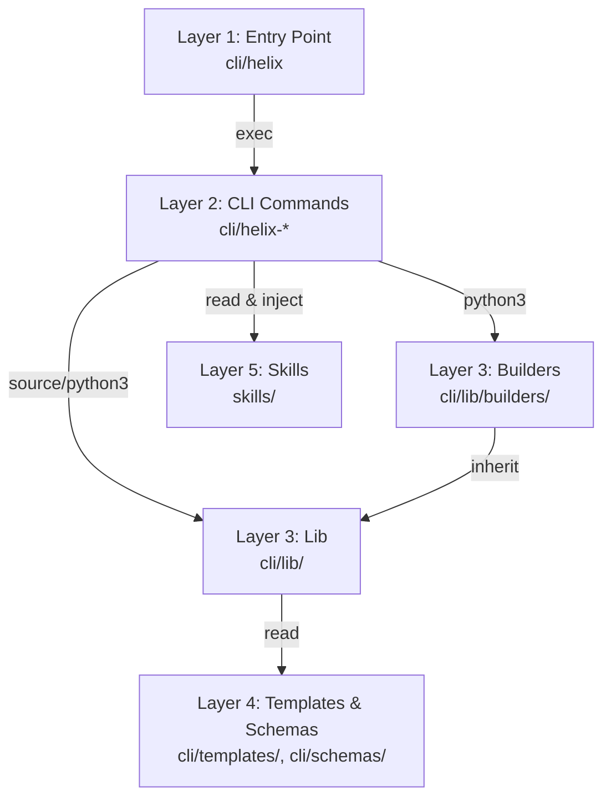
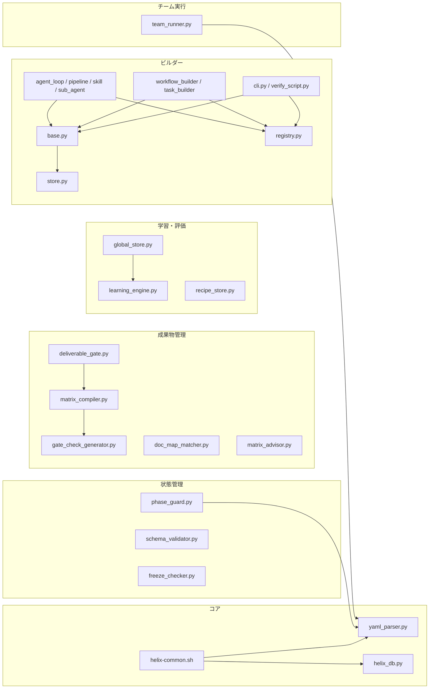

# L2 設計書: HELIX CLI アーキテクチャ

> フェーズ: L2 全体設計
> ステータス: Accepted
> 作成日: 2026-04-05
> 対象: HELIX CLI v3 (`~/ai-dev-kit-vscode/cli/`)

---

## 1. 目的

HELIX CLI は AI エージェント駆動の開発ワークフローを統制するコマンドラインフレームワークである。本書はその全体アーキテクチャ（レイヤー構造、コマンドグルーピング、データフロー、状態管理、拡張ポイント）を定義する。

---

## 2. レイヤー構造

HELIX CLI は 5 層のレイヤー構造を採る。上位レイヤーは下位レイヤーのみに依存し、逆方向の依存は禁止する。

```
Layer 5: Skills          55 SKILL.md — AI エージェントの専門知識ライブラリ
Layer 4: Templates & Schemas  YAML テンプレート + JSON Schema 定義
Layer 3: Lib             Python/Bash モジュール群 — 状態管理・DB・検証・学習
Layer 2: CLI Commands    Bash スクリプト群 — ユーザーインターフェース
Layer 1: Entry Point     helix — 統一ディスパッチャー
```

### 2.1 各レイヤーの責務

| レイヤー | パス | 言語 | ファイル数 | 責務 |
|---------|------|------|-----------|------|
| Entry Point | `cli/helix` | Bash | 1 | サブコマンド名を受け取り `exec` で子コマンドに委譲する。引数パース・ヘルプ表示のみ担当 |
| CLI Commands | `cli/helix-*` | Bash | 30 | 引数解析、ユーザー対話、lib 呼び出し、標準出力への結果整形。ビジネスロジックは持たない |
| Lib | `cli/lib/*.py`, `cli/lib/*.sh` | Python/Bash | 14 | 状態管理（yaml_parser, phase_guard）、DB 操作（helix_db）、検証（schema_validator, deliverable_gate, freeze_checker）、学習（learning_engine, global_store, recipe_store）、マトリクス（matrix_compiler, gate_check_generator, doc_map_matcher, matrix_advisor）、チーム実行（team_runner）、共通関数（helix-common.sh） |
| Builders | `cli/lib/builders/*.py` | Python | 14 | 成果物の自動生成パイプライン（BuilderBase + Registry + Store + 具体ビルダー群）。詳細は `L2-builder-system.md` 参照 |
| Templates & Schemas | `cli/templates/`, `cli/schemas/` | YAML/JSON/MD | ~35 | プロジェクト初期化時にコピーされるテンプレート群。JSON Schema による構造検証定義 |
| Roles | `cli/roles/*.conf` | INI-like | 可変（`cli/roles/` 配下） | Codex CLI 呼び出し時のロール別設定（model, skills, system_prompt） |
| Skills | `skills/**` | Markdown | 55+ | AI エージェントへの専門知識注入。triggers ベースで必要時のみ読み込み |

### 2.2 レイヤー依存関係図



---

## 3. コマンドグルーピング

30 のサブコマンドを 5 つの機能グループに分類する。

### 3.1 プロジェクト管理（6 コマンド）

プロジェクトの初期化・状態確認・環境診断を担当する。

| コマンド | 説明 |
|---------|------|
| `helix init` | `.helix/`、`CLAUDE.md`、`AGENTS.md` を作成し、テンプレートをコピーしてプロジェクトを初期化 |
| `helix status` | phase.yaml + SQLite から現在のフェーズ・ゲート状態・スプリント進捗を表示 |
| `helix mode` | Forward / Reverse / Scrum の開発モードを切替（phase.yaml の `current_mode` 更新） |
| `helix matrix` | 成果物マトリクスの compile / auto-detect / 表示 |
| `helix doctor` | 環境診断（依存ツール・DB 整合性・テンプレート差分）と修復 |
| `helix debug` | デバッグ情報の収集・出力 |

### 3.2 ワークフロー（7 コマンド）

HELIX フェーズの進行制御を担当する。

| コマンド | 説明 |
|---------|------|
| `helix gate` | ゲート自動検証（fail-close）。mandatory/advisory/AI チェックの実行と判定 |
| `helix size` | タスクサイジング（S/M/L の 3 軸判定 + フェーズスキップ決定） |
| `helix sprint` | L4 マイクロスプリントの進行管理（.1a → .1b → .2 → .3 → .4 → .5） |
| `helix plan` | 設計計画の作成・レビュー・凍結（draft → review → finalize） |
| `helix reverse` | Reverse HELIX パイプライン（R0 → R4）の実行 |
| `helix scrum` | 検証駆動開発（PoC スプリント: init → backlog → plan → poc → verify → decide → review） |
| `helix interrupt` | 作業中断の記録と復帰管理 |

### 3.3 実行・委譲（5 コマンド）

AI エージェントへのタスク委譲と成果物生成を担当する。

| コマンド | 説明 |
|---------|------|
| `helix codex` | Codex CLI へのロール別タスク委譲。`cli/roles/` 配下のロールに対応。roles/*.conf からモデル・スキル・プロンプトを自動注入 |
| `helix task` | Task OS の操作（catalog / plan / run / observe）。63 タスク / 27 アクション型 / 295 アクション |
| `helix team` | エージェントチーム実行。teams/*.yaml の定義に従い複数エージェントを協調実行 |
| `helix builder` | 成果物ビルダーの呼び出し。BuilderRegistry 経由で 8 タイプのビルダーを実行 |
| `helix pr` | PR 自動生成（diff 解析 → タイトル・本文生成 → gh pr create） |

### 3.4 データ・学習（7 コマンド）

実行履歴の記録・分析・学習を担当する。

| コマンド | 説明 |
|---------|------|
| `helix log` | SQLite ログの操作（init / feedback / report） |
| `helix bench` | メトリクスベンチマークのスナップショット取得・比較 |
| `helix debt` | 技術負債台帳の管理（追加・一覧・優先度付け） |
| `helix retro` | レトロスペクティブの記録（G2/G4/L8 通過時のミニレトロ） |
| `helix learn` | 成功/失敗パターンの学習と recipe 生成 |
| `helix promote` | recipe のグローバル共有への昇格 |
| `helix discover` | グローバル recipe DB からのパターン検索 |

### 3.5 検証（2 コマンド）

フレームワーク自身の品質検証を担当する。

| コマンド | 説明 |
|---------|------|
| `helix test` | Python ユニットテスト + verify スクリプトのセルフテスト実行 |
| `helix verify-all` | 全レイヤー検証（unit → integration → edge case → E2E） |

---

## 4. データフロー

### 4.1 メインデータフロー

```
ユーザー入力
    |
    v
helix <subcommand>          <- Layer 1: exec で子コマンドに委譲
    |
    v
helix-<cmd>                 <- Layer 2: 引数パース -> lib 呼び出し
    |
    +---> yaml_parser.py     <- Layer 3: phase.yaml R/W（排他ロック + atomic rename）
    +---> helix_db.py        <- Layer 3: SQLite R/W（WAL モード、19 テーブル）
    +---> matrix_compiler.py <- Layer 3: matrix.yaml -> index.json / deliverables.json
    +---> phase_guard.py     <- Layer 3: フェーズ違反チェック（pre-commit hook 経由）
    +---> schema_validator.py<- Layer 3: JSON Schema バリデーション
    +---> deliverable_gate.py<- Layer 3: 成果物状態ゲート判定
    |
    v
出力（stdout / phase.yaml 更新 / SQLite 記録）
```

### 4.2 Codex CLI 連携フロー

```
helix codex --role <role> --task "..."
    |
    +-- roles/<role>.conf      読み込み（model, skills, system_prompt）
    +-- skills/***/SKILL.md    スキル注入
    +-- prompts/*.md           共通ドキュメント注入
    |
    v
codex exec "<prompt>" -m <model> -s <sandbox>
    |
    v
Codex (GPT-5.x) 実行 -> 結果 -> cost_log 記録
```

### 4.3 テンプレート -> ランタイム変換フロー

`helix init` 実行時にテンプレートファイルを `.helix/` と project root にコピーし、以降は `matrix_compiler.py` 等がランタイムファイルを派生生成する。

```
cli/templates/                      .helix/ (ランタイム)
  phase.yaml           --[cp]-->    phase.yaml
  matrix.yaml          --[cp]-->    matrix.yaml
  gate-checks.yaml     --[cp]-->    gate-checks.yaml
  config.yaml          --[cp]-->    config.yaml
  doc-map.yaml         --[cp]-->    doc-map.yaml
  state-machine.yaml   --[cp]-->    state-machine.yaml
  rules/*.yaml         --[cp]-->    rules/*.yaml

cli/templates/docs/                 docs/ (管理ドキュメント)
  L1-requirements.md   --[size]-->  docs/requirements/L1-requirements.md
  L2-design.md         --[size]-->  docs/design/L2-design.md
  L3-detailed-design.md --[size]--> docs/design/L3-detailed-design.md
  L3-schedule-wbs.md   --[size]-->  docs/design/L3-schedule-wbs.md
  L4-*-sprint-guide.md --[size]-->  docs/sprint/
  L5-visual-design.md  --[size]-->  docs/design/L5-visual-design.md

.helix/matrix.yaml
  |--[matrix_compiler.py compile]-->      .helix/runtime/index.json
  |--[matrix_compiler.py auto-detect]-->  .helix/state/deliverables.json
  |--[gate_check_generator.py]-->         .helix/gate-checks.yaml (更新)
  |--[gate_check_generator.py]-->         .helix/doc-map.yaml (更新)
```

### 4.4 3 つの状態ストア

| ストア | ファイル | 形式 | 用途 | アクセス方式 |
|--------|---------|------|------|-------------|
| phase.yaml | `.helix/phase.yaml` | YAML | フェーズ・ゲート状態・スプリント進捗 | yaml_parser.py（排他ロック + atomic rename） |
| helix.db | `.helix/helix.db` | SQLite (WAL) | 実行ログ・評価・フィードバック・技術負債 | helix_db.py（19 テーブル、v4 スキーマ） |
| config.yaml | `.helix/config.yaml` | YAML | プロジェクト設定（ゲートスキップ、駆動タイプ等） | yaml_parser.py |

---

## 5. 状態管理モデル

### 5.1 phase.yaml（フェーズ状態機械）

プロジェクトのフェーズとゲート状態を保持する中心的な状態ファイル。

```yaml
project: "project-name"
current_mode: forward | reverse | scrum
current_phase: L1 | L2 | ... | L8

gates:
  G0.5: { status: pending | passed | failed | skipped | invalidated, date: "..." }
  G1:   { status: ... }
  ...
  G7:   { status: ... }

sprint:
  current_step: null | .1a | .1b | .2 | .3 | .4 | .5 | completed
  status: active
  drive: null | be | fe | db | fullstack | agent
  tracks:                    # fullstack 専用
    be:  { stage: .1a, status: active }
    fe:  { stage: .1a, status: active }
    contract: { ci: pending | pass }
  phase: null | A | B        # fullstack: A=並行実装, B=結合

reverse_gates:
  RG0: { status: pending | passed | failed }
  ...
  RG3: { status: ... }

reverse:
  status: null | completed
  completed_at: null | "2026-04-05"
```

**読み書き**: `yaml_parser.py` 経由。`fcntl.flock` による排他ロックと atomic rename（一時ファイルに書き込み後リネーム）で安全に更新する。PyYAML は使用しない。

### 5.2 state-machine.yaml（遷移ルール定義）

ゲート間の前提条件、通過時のフェーズ遷移、invalidation カスケードを宣言的に定義する。

```yaml
gate_statuses: [pending, passed, failed, skipped, invalidated]
gates:
  G0.5: { prereqs: [],   on_pass_phase: L1, on_invalidate: [] }
  G1:   { prereqs: [],   on_pass_phase: L2, on_invalidate: [] }
  G2:   { prereqs: [G1], on_pass_phase: L3, on_invalidate: [G3,G4,G5,G6,G7] }
  G3:   { prereqs: [G2], on_pass_phase: L4, on_invalidate: [G4,G5,G6,G7] }
  G4:   { prereqs: [G3], on_pass_phase: L5, on_invalidate: [G5,G6,G7] }
  G5:   { prereqs: [G4], on_pass_phase: L6, on_invalidate: [G6,G7] }
  G6:   { prereqs: [G5], on_pass_phase: L7, on_invalidate: [G7] }
  G7:   { prereqs: [G6], on_pass_phase: L8, on_invalidate: [] }
valid_transitions:
  pending: [passed, failed, skipped]
  passed: [invalidated]
  failed: [pending]
  skipped: [pending]
  invalidated: [pending]
```

**設計原則**:
- **前方参照のみ**: ゲートは後方のゲートのみを invalidate する
- **fail-close**: mandatory チェック 1 件でも失敗すれば FAIL
- **手動リセット**: `helix gate --undo` で invalidated -> pending に戻せる

### 5.3 3 つの開発モード

| モード | 遷移フロー | 用途 | 切替トリガー |
|--------|-----------|------|-------------|
| **Forward** | L1 -> G0.5 -> G1 -> L2 -> G2 -> ... -> L8 | 通常の新規開発 | デフォルト |
| **Reverse** | R0 -> RG0 -> R1 -> RG1 -> R2 -> RG2 -> R3 -> RG3 -> R4 -> Forward 接続 | 既存コードの設計復元 | `helix reverse R0` |
| **Scrum** | init -> backlog -> plan -> poc -> verify -> decide -> review -> (next sprint) | 検証駆動開発（PoC） | `helix scrum init` |

モード切替は自動。各モードの入口コマンド実行時に `phase.yaml` の `current_mode` が更新される。

### 5.4 SQLite helix.db

19 テーブル、WAL モード、スキーマバージョン管理（v1 -> v4）。

主要テーブル群:

| カテゴリ | テーブル | 役割 |
|---------|---------|------|
| タスク実行 | `task_runs`, `action_logs`, `observations` | タスク実行ログ、アクション単位ログ、オブザーバー結果 |
| 評価 | `task_evaluations`, `task_selections`, `feedback` | タスク品質評価、PM タスク選択ログ、ユーザーフィードバック |
| ゲート | `gate_runs` | ゲート実行ログ |
| レトロ | `retro_items` | レトロスペクティブアクションアイテム |
| 計画 | `plan_reviews` | 設計レビュー記録 |
| 中断 | `interrupts` | 中断・復帰記録 |
| 負債 | `debt_items` | 技術負債台帳 |
| インフラ | `hook_events`, `cost_log`, `bench_snapshots` | Git hook イベント、Codex コスト、ベンチマーク |
| 要件 | `requirements`, `req_impl_map`, `req_test_map`, `req_changes` | 要件定義とトレーサビリティ |
| メタ | `schema_version` | マイグレーション管理 |

**グローバル DB** (`~/.helix/global.db`): `global_store.py` が管理。`recipe_index` + `promotion_records` の 2 テーブルで、プロジェクト横断のパターン蓄積・昇格を行う。

---

## 6. lib モジュール間の依存関係



---

## 7. 拡張ポイント

### 7.1 新コマンドの追加

1. `cli/helix-<新コマンド名>` を作成（Bash スクリプト）
2. `cli/helix` の `case` 文にディスパッチを追加
3. `source helix-common.sh` で共通関数（`ensure_helix_dir`, `resolve_project_root` 等）を利用

### 7.2 新ビルダーの追加

1. `cli/lib/builders/<新ビルダー>.py` を作成
2. `BuilderBase` を継承し `BUILDER_TYPE`, `validate_input`, `generate`, `validate_output` を実装
3. `BuilderRegistry.register()` で登録

### 7.3 新ゲートチェックの追加

1. `cli/templates/gate-checks.yaml` の対象ゲートセクションにチェック定義を追加
2. mandatory（必須）/ advisory（警告のみ）/ AI チェックのいずれかを指定
3. `gate_check_generator.py` が matrix.yaml から自動生成するチェックと競合しないことを確認

### 7.4 新ロールの追加

1. `cli/roles/<新ロール>.conf` を作成（model, skills, system_prompt を定義）
2. `cli/ROLE_MAP.md` に追記

### 7.5 新スキルの追加

1. `skills/<カテゴリ>/<スキル名>/SKILL.md` を作成
2. `skills/SKILL_MAP.md` のスキル群配置テーブルに追記
3. metadata.helix_layer を必須記載

### 7.6 新 SQLite テーブルの追加

1. `cli/lib/helix_db.py` のスキーマ定義に `CREATE TABLE IF NOT EXISTS` を追加
2. `schema_version` テーブルのバージョンを更新
3. マイグレーション関数を追加

### 7.7 テンプレートの追加

1. `cli/templates/<新テンプレート>` を配置
2. `cli/helix-init` のコピー処理に追加

---

## 8. 品質属性

### 8.1 テスト体系

| カテゴリ | テスト数 | パス | 範囲 |
|---------|---------|------|------|
| Python unit tests | 43 | `cli/lib/tests/test_*.py` | DB, learning_engine, yaml_parser, schema_validator |
| Verify (unit) | 10 | `verify/001-010*.sh` | 基本機能 |
| Verify (integration) | 11 | `verify/h101-h105, h201-h206*.sh` | コマンド間連携 |
| Verify (edge case) | 10 | `verify/h301-h310*.sh` | 境界条件 |
| Verify (E2E) | 1 | `verify/h401*.sh` | エンドツーエンド |

### 8.2 セキュリティ

- ゲート G2/G4/G6/G7 の 4 段階でセキュリティチェックを実行
- G4: SQL インジェクション検出、XSS 検出、秘密情報ハードコード検出、Bearer/秘密鍵混入検出、.env git 追跡防止
- learning_engine / builder store に秘密情報 redaction 機構を内蔵

### 8.3 並行安全性

- phase.yaml: `fcntl.flock` + atomic rename
- SQLite: WAL モード + busy_timeout 5000ms
- builder store: WAL モード + busy_timeout 5000ms

---

## 9. 関連文書

| 文書 | パス |
|------|------|
| Builder System 設計 | `docs/design/L2-builder-system.md` |
| Learning Engine 設計 | `docs/design/L2-learning-engine.md` |
| ADR-004 Bash-Python ハイブリッド | `docs/adr/ADR-004-bash-python-hybrid.md` |
| ADR-005 YAML-SQLite 二重状態管理 | `docs/adr/ADR-005-yaml-sqlite-dual-state.md` |
| ADR-006 テンプレートコピーアーキテクチャ | `docs/adr/ADR-006-template-copy-architecture.md` |
| R2 As-Is Design | `.helix/reverse/R2-as-is-design.md` |
| SKILL_MAP | `skills/SKILL_MAP.md` |
