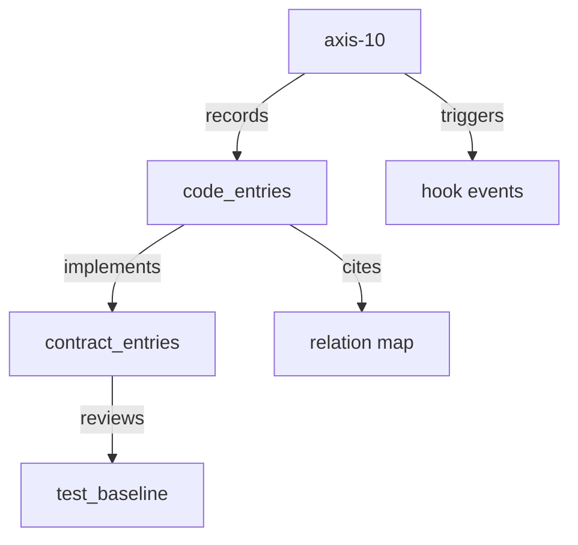

# HELIX dashboard 詳細設計（Phase F 可視化）

Status: draft
Phase: Phase F（dashboard CLI 完成）
Mode: 設計提示（実装は Phase F）
Primary FR: FR-EM01-06（全件）

関連: `docs/v2/L1-REQUIREMENTS.md`, `docs/v2/A-audit/audit-summary.md`,
`docs/v2/B-design/sessionstart-detail.md`, `cli/ROLE_MAP.md`

---

## 0. 目的

Phase F は FR-EM01〜FR-EM06 を実装可能レベルで定義し、
次を満たす。

1. dashboard 統合表示で 5+ 観点を 1view 化（FR-EM01）
2. axis-10 relation graph を現実反映で mermaid 出力（FR-EM02）
3. `helix report dev-state` の export（markdown/json）追加（FR-EM03）
4. SessionStart から 1 秒以内 quick 表示（FR-EM04）
5. PLAN 別 vmodel-dashboard の導入（FR-EM05）
6. 全 PLAN 横断 top/bottom/trend（FR-EM06）

---

## 1. 対象範囲

- 対象: `helix detect`, `helix qa`, `helix report`, SessionStart 起点
- 非対象: DB schema 新規作成、GUI 実装、外部 SaaS 連携
- 依存: `docs/v2/L1-REQUIREMENTS.md` FR-EM01〜06 / NFR-10 / NFR-12

---

## 2. glossary

- quick view: cache read だけで返す最小表示（1秒目標）
- full view: 必要時の高密度集計（通常タイムアウト 30 秒）
- vmodel score: 4-layer chain（contract→code→test_design→test_baseline）起点の整合率
- cost split: Codex / Claude / role 別の週次比率
- detector verdict: pass/warn/fail（axis-01〜14）
- freshness: キャッシュの新鮮度

---

## 3. 要件マッピング（trace）

| FR | 対応章 |
|---|---|
| FR-EM01 | 4 |
| FR-EM02 | 5 |
| FR-EM03 | 6 |
| FR-EM04 | 7 |
| FR-EM05 | 5 |
| FR-EM06 | 5 |
| NFR-10 | 11 |
| NFR-12 | 7 |

audit 根拠: `docs/v2/A-audit/audit-summary.md` §2 (設計ドライバ) と `§7` (監査課題)

---

## 4. FR-EM01 dashboard 統合 view

### 4.1 表示観点（5+）

1. V-model 整合度（be/fe/db/fullstack）
2. Detector verdict 14 軸集計
3. 委譲履歴（Codex/Claude/role）
4. skill hit rate
5. gate 通過率
6. freshness / fallback / warning（運用補助）
7. top risk plan（運用意思決定）

### 4.2 CLI

```text
helix detect dashboard
helix detect dashboard --quick
helix detect dashboard --format text|markdown|mermaid|json
helix detect dashboard --plan-id PLAN-NNN
helix detect dashboard --hours 24|168
```

`--quick` は 1 秒 budget 前提。`--format mermaid` は可視化補助で full path へ遷移しうる。

### 4.3 ASCII mockup

```text
HELIX dev-state dashboard
========================================================
V-model integrity: [be 85%] [fe 72%] [db 90%] [fullstack 78%]
Detector verdict:   axis-01 ✓ axis-02 ⚠ axis-07 ✗ ... axis-14 ✓
Cost (week):       codex $XX (62%) / claude $XX (34%) / other $XX (4%)
Skill hit rate:     78% (target 80%) | hit 39 / suggest 50
Gate status:        G1 ✓ G2 ✓ G3 ⚠ G4 - G5 - G6 -
Top risk plans:     PLAN-043 (score 61) / PLAN-056 (stale detector)
Updated: 2026-05-14T12:03:10Z | cache_gen=... | stale=14m
```

### 4.4 セクション順

- ヘッダ: 生成時刻・キャッシュ情報
- vmodel
- detector
- cost
- skill
- gate
- plan top/bottom
- warnings
- next action

### 4.5 出力データ

- primary: `vmodel_scores`, `detector_runs`, `cost_log`, `skill_usage`, `design_review`
- fallback: `plan_state`（更新失敗時でも最低限の状態表示）

---

## 5. FR-EM02 / FR-EM05 / FR-EM06（relation graph・plan 統計）

### 5.1 relation graph

`helix detect dashboard` に graph mode を追加し、
`detector × code × contract × hook` を可視化する。

#### 5.1.1 コマンド

```text
helix detect dashboard --plan-id PLAN-NNN --graph relation --axis axis-10
helix qa vmodel-dashboard --plan-id PLAN-NNN --include relation
helix qa vmodel-score --all
helix qa vmodel-score --all --top 10 --bottom 10 --format json
```

### 5.1.2 mermaid サンプル



### 5.1.3 生成ルール

- ノードは `detector/code/contract/hook` のみ（過密時は集約）
- relation edge は `derive/cover/trigger/validate` 4 種
- max nodes: 120（上限超過時は aggregated ノード）
- max depth: 4（デフォルト）

### 5.1.4 現実反映確認

- 参照 ID が実ファイル / plan / hook 実体と一致
- stale node は `stale@` プレフィックス
- エッジ重みが 0 なら表示抑制
- 不正な循環依存は warning のみ

### 5.2 vmodel-dashboard（PLAN 単位）

`helix qa vmodel-dashboard --plan-id PLAN-NNN` で返す内容:

- chain 充足率
- score 内訳（missing_test_design, missing_baseline, failing_baseline, chain_break）
- 改善提案 3 点
- gate / detector 連携情報

### 5.3 vmodel-score 全体

`helix qa vmodel-score --all` は全 PLAN score を集約し

- top-10, bottom-10
- trend（1d/7d/30d）
- gate pass ratio
- fail axis

を返却する。

---

## 6. FR-EM03 report dev-state export

### 6.1 API

```text
helix report dev-state --format markdown
helix report dev-state --format json
helix report dev-state --plan-id PLAN-NNN --format json
helix report dev-state --since 2026-05-01 --until 2026-05-14
```

### 6.2 Markdown（PR 向け）

- header（生成時刻、期間、scope）
- vmodel（drive別）
- detector summary
- cost split
- skill hit
- gate status
- plan score table（低下順）
- warnings / recommendations

### 6.3 JSON schema（v1）

```json
{
  "generated_at":"RFC3339",
  "format_version":"1.0",
  "scope":{"plan_id":"ALL|PLAN-XXX","since":"RFC3339","until":"RFC3339"},
  "summary":{"vmodel":{"be":0,"fe":0,"db":0,"fullstack":0},"detector":{"pass":0,"warn":0,"fail":0,"axes":[]},"cost":{"codex":0,"claude":0,"other":0},"skill_hit":{"rate":0,"hit":0,"total":0},"gates":{"g1":"passed","g2":"passed","g3":"warn"}},
  "plan_scores":[],
  "recommendations":[]
}
```

### 6.4 PR / CI 利用

- PR: `--format markdown` を body 添付
- CI: `--format json` を取り込んで lint
  - required keys: generated_at / format_version / summary / plan_scores
  - score 破綻検知（例: delta <- 10）を警告

---

## 7. FR-EM04 SessionStart quick dashboard

### 7.1 パス

`SessionStart` → cache check → quick render → background sync

- quick では `helix detect dashboard --quick` を foreground
- 重い sync は `helix sync --auto --quiet` を background
- 失敗時は stop しない（fail-open）

### 7.2 incremental update / キャッシュ

#### 更新対象

- `dashboard_aggregate_cache.json`
- `plan_score_snapshot.json`
- `cost_weekly_cache.json`
- `skill_hit_cache.json`

#### 更新トリガ

- file hash 変化
- plan 追加/更新
- detector run 完了
- コスト記録追加

#### TTL

- aggregate: 300s
- plan score: 300s
- cost: 300s
- report: 120s

### 7.3 fallback

- cache miss: 最小ヘッダ + phase 表示
- lock 競合: warning のみ
- db 参照失敗: quick 失敗扱いせず degraded を返す
- timeout 超過: 1 秒以内で degraded を返却

---

## 8. FR-EM05 / FR-EM06 実行仕様（詳細）

### 8.1 vmodel-dashboard score 内訳の定義

- `missing_test_design = (#required design artifacts without test_design) / total_design_requirements`
- `missing_baseline = (#design artifacts without baseline) / total_design_artifacts`
- `failing_baseline = (#failed baseline tests) / total_baselines`
- `chain_break = (required chain links missing) / total_links`
- `score = clamp(100 - 15*missing_test_design - 10*missing_baseline - 20*failing_baseline - 25*chain_break)`

### 8.2 all 版の trend

- delta 計算: 直近完了点 vs 7日前基準
- 計算不能プラン: `trend=no-data`
- top-10 / bottom-10 ソート: score desc/asc → gate fail ratio → fail axis count

---

## 9. データフロー

```text
[DB / Filesystem] 
   -> collector (read-only readers)
      -> aggregate cache builder (incr/epoch)
         -> dashboard formatter (json/text/markdown/mermaid)
            -> cli output

[SessionStart]
  -> aggregate cache read
  -> quick output
  -> async sync trigger
  -> return
```

### 9.1 コマンド別データ源

- `dashboard`:
  `vmodel_scores + detector_runs + cost_log + skill_usage + gate status`
- `vmodel-dashboard`:
  `contract_entries + code_entries + test_design_entries + test_baseline + design_review`
- `vmodel-score --all`:
  各 plan の上記を union し集約
- `report dev-state`:
  上記の superset（全指標）

---

## 10. 結合ポイント

- `helix detect dashboard` は既存 `helix detect` 実体に統合
- `SessionStart` は quick mode でキャッシュ利用（`docs/v2/B-design/sessionstart-detail.md` 準拠）
- `helix qa` は PLAN 別 vmodel と全体 score を既存構成下で公開
- `helix sync --auto` は cache invalidation / refresh 起点

---

## 11. 非機能と性能根拠

### 11.1 NFR-10

- full dashboard 実行: 30 秒以内を目標
- axis と chain を2ストリームに分割
- cache miss の場合でも quick fallback を返却

### 11.2 NFR-12

- SessionStart quick: p95 1000ms 未満
- quick は re-aggregation 禁止
- stale cache でも degraded で返却

### 11.3 観測

- ログ: generation_ms, cache_hit, stale, mode, warnings_count
- しきい値
  - quick p95 > 1000ms 警告
  - full p95 > 30000ms 警告
  - cache miss / stale が高止まり時は alert

---

## 12. エラー、警告、互換

- `invalid argument`: usage を表示し exit 2
- `cache missing`: degraded（warning）で継続
- `graph too large`: compressed graph または json を提案
- `aggregation timeout`: full→quick フォールバック

後方互換ルール:

- `--format text/markdown/mermaid/json` は `helix detect` の既存インターフェースに追加、破壊しない。
- 既存 `--help` に新規オプションを追加表示する。

---

## 13. ガードレール

- cache 破損時は write を止めず warning のみ
- 失敗率増加時は SessionStart quick を優先（作業継続を阻害しない）
- cost 側不整合は report に `unknown` で追記
- score 0 降下時の plan は bottom-10 に固定上位

---

## 14. 実装準備チェック（この設計の受入）

1. `helix detect dashboard` が 5 観点以上表示
2. `--quick` が cache ベースで 1 秒以内
3. `vmodel-dashboard --plan-id` が score 内訳を返す
4. `vmodel-score --all` が top/bottom/trend を返す
5. JSON schema v1 を固定し、markdown と齟齬がない
6. FR-EM01~06 の受入条件を tests/manual で明文化

---

## 15. Phase 紐付け

- Phase 3: 集計用 view / index の下地
- Phase 4: detector verdict 集計連動
- Phase 5: SessionStart quick 起動
- Phase F: dashboard 完成（本設計の実装対象）

---

## 16. 残存リスク

- vmodel score writer が空運用の場合、数値の解釈が薄くなる
- relation graph の巨大化時の可読性は導線別 tuning が必要
- PR/CI で json schema 厳密検証を追加する必要あり

---

## 17. 参照リンク

- [docs/v2/L1-REQUIREMENTS.md](docs/v2/L1-REQUIREMENTS.md)
- [docs/v2/A-audit/audit-summary.md](docs/v2/A-audit/audit-summary.md)
- [docs/commands/index.md](docs/commands/index.md)
- [docs/v2/B-design/sessionstart-detail.md](docs/v2/B-design/sessionstart-detail.md)
- [cli/ROLE_MAP.md](cli/ROLE_MAP.md)
