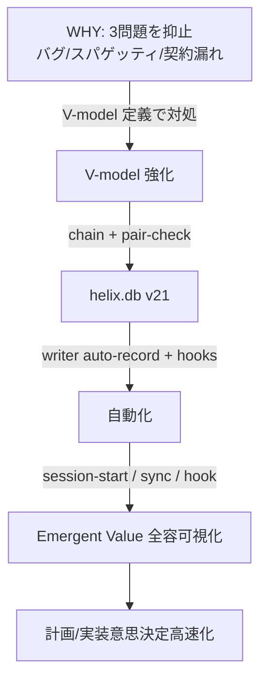
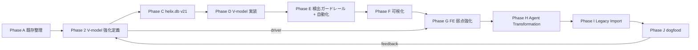
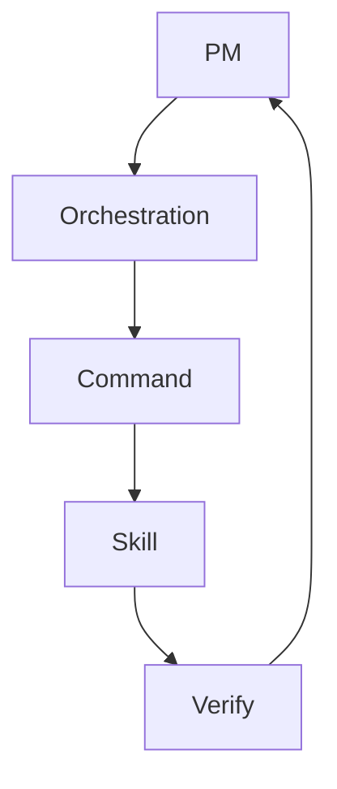
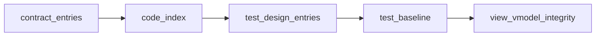
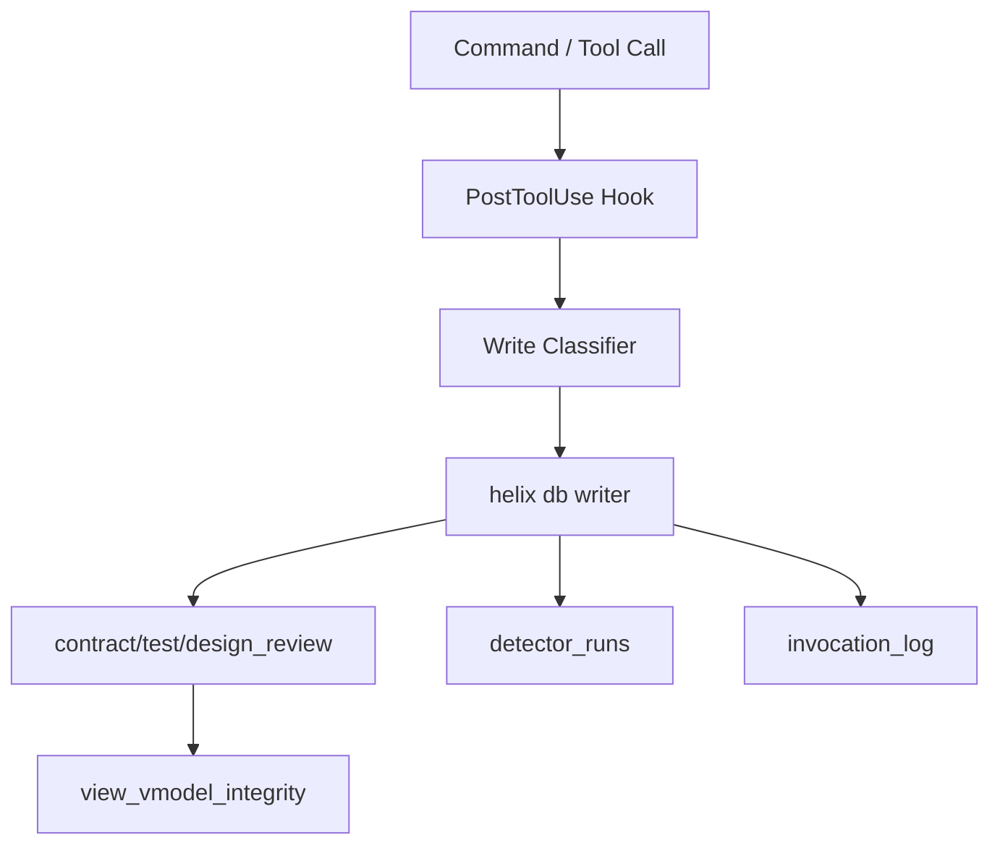
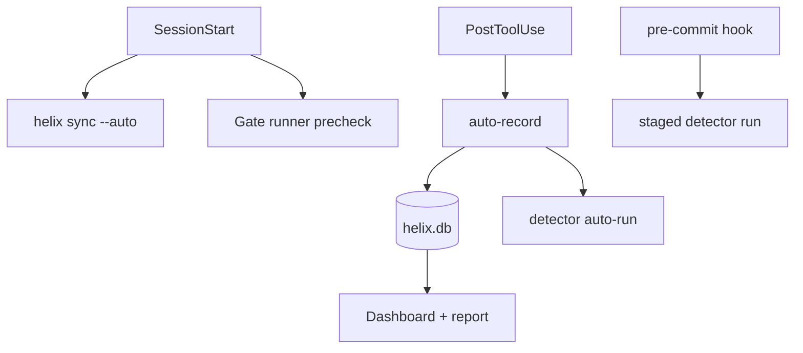
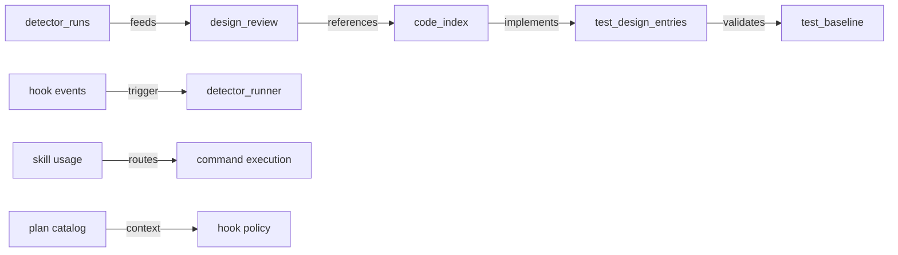
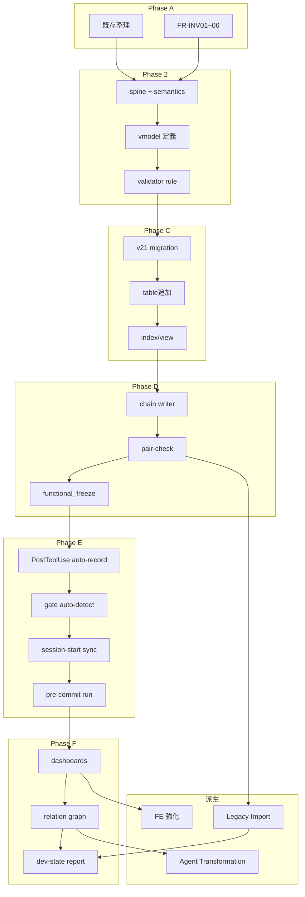

# L2 MASTER Draft — HELIX V2 Architecture (Sketch for MASTER.md)

*Status*: draft sketch (G1 通過後の正本起票用初稿)
*Source of truth*: docs/v2/CONCEPT.md, docs/v2/L1-REQUIREMENTS.md, docs/v2/A-audit/audit-summary.md, docs/v2/B-design/vmodel-semantics-spine.yaml, vmodel-semantics-*.yaml
*Generated*: 2026-05-14

## 変更履歴

- v0.1.0: 初版ドラフト。Phase A 結果 + Phase 2 定義を反映し、L2 起票入力に使える構成に整理。

## 0. スコープと前提

- 本書は実装仕様ではなく設計草案である。
- 参照する FR-INV/FR-VD/FR-V/FR-DB/FR-GR/FR-A/FR-EM/FR-FE/FR-AT/FR-LI/FR-VS と AC-01〜17 は L1 を読み替えた入力群として受ける。
- 14 detector を基本前提とし、FE 追加分は FE ドライバ 5 axis 追加設計で扱う。
- 5 Phase + 派生 G/H/I を前提に、L2 では各 Phase を「入力→処理→成果→依存→期間」の構造で固定する。
- 4 層 chain は `contract_entries → code_index → test_design_entries → test_baseline`。
- helix.db は v20 から v21 migration。

## 1. V2 アーキテクチャ全景

### 1.1 価値連鎖 (Concept §1 反映)

### 1.2 5 Phase + 派生のアーキ図 (草案)

### 1.3 5 層構造

- PM: 方針、依存、PMO、リスク評価。
- Orchestration: handover、ロール分担、allowed-files、routing。
- Command: helix CLI、hook、gate、sync。
- Skill: ドキュメント/設計/実装/検証スキル群。
- Verify: detector、review、test、観測。

### 1.4 helix.db v21 schema 位置づけ

- L2 では DB を中核ではなく **制御バス** として扱い、設計情報・検証情報・運用品質証跡を共通保存する。
- 主要既存テーブル:
  - `contract_entries`
  - `code_index`
  - `design_review`
  - `test_baseline`
  - `detector_runs`
  - `invocation_log`
- 新規追加を想定するテーブル:
  - `er_diagrams`
  - `process_maps`
  - `managed_products`
  - `agent_registry`
  - `design_sprint_entries`
  - `design_sprint_artifact_links`

## 2. Phase 1〜5 各 phase の architecture

### Phase A: 既存整理 / 接続性回収 (Audit 集約)

#### 2.1 入力

- `docs/v2/A-audit/audit-summary.md`
- `docs/v2/CONCEPT.md` の価値連鎖。
- `docs/v2/L1-REQUIREMENTS.md` の Phase 0〜8 付随。
- `docs/v2/A-audit` 配下 20 audit doc。

#### 2.2 主要 component (新規+既存)

- 既存活用
  - audit-summary + capability-matrix + legacy-plans-carry の既存資産。
  - reverse/scrum/docs-integrity/security/cicd/perf-cost の監査結果。
- 新規化対象
  - Phase 切替時点での **audit artifact registry**。
  - `source_of_truth_map`。
  - `doc drift` 可視化の初期テーブル入力。

#### 2.3 出力 (deliverable)

- 既存資産一覧 (14 capability、36 folder 整理候補、33 廃止候補)。
- 5 層×3問題での欠損一覧 (PM/Orch/Cmd/Skill/Verify)。
- FR-INV01〜06 の再定義受入証拠。
- Top-20 DR への mapping table。

#### 2.4 dependency

- G0.5/ G1 で成立した要件状態に依存。
- Phase B は FR-VD/FR-V との crosswalk で動作開始。
- Phase I の Legacy Import は Phase A の carry 分解結果に依存。

#### 2.5 期間目安

- 実装時点を含めても 2〜4 スプリント。
- 監査ドリフトの収束が遅い場合は +1 スプリント。

#### 2.6 構成要素 (詳細化)

- 既存整理は「読み取りだけでなく source-of-truth ルーティング」として扱う。
- すべての監査結果に plan_id を付与し、後続の dashboard で検索可能化する。
- `.helix/tmp` / cache / 廃止候補を即削除しない。まず index 化。
- `.helix/` runtime とドキュメント汚染は PM 判断待ちで分離。
- `deprecated.md` / `deprecated-aggregation.md` の命名差異は Phase A で正規化。

### Phase B: V-model 強化定義 (要件を設計化)

#### 3.1 入力

- Phase A top-20 DR、FR-VD01〜09、4 drive semantics の前提。
- `docs/v2/B-design/vmodel-semantics-spine.yaml`。
- `docs/v2/B-design/vmodel-semantics-be-draft.yaml`
- `docs/v2/B-design/vmodel-semantics-fe-draft.yaml`
- `docs/v2/B-design/vmodel-semantics-db-draft.yaml`
- `docs/v2/B-design/vmodel-semantics-fullstack-draft.yaml`

#### 3.2 主要 component (新規+既存)

- 既存活用
  - spine の 5 layer / 4 drive 構成。
  - design / test / pair の基本形。
  - pair-check を呼ぶ gate の既存ルール。
- 新規
  - spine validator。
  - `vmodel-semantics.yaml` 正規化ルール。
  - role 命名の正規化 (`pg`,`fe`,`dba` 等)。
  - `allowed_detectors` と baseline policy の共通辞書。

#### 3.3 出力

- phase ベースで architecture 5段階に対する design-test 1:1 対応。
- V-model chain の link kind 仕様。
- Functional freeze の実装前提。
- FE axis-10 補強の設計入力。

#### 3.4 dependency

- Phase C のマイグレーションは Phase B で決定する schema 仕様に準拠。
- Phase D 実装と Phase E 自動化はこの段階の semantic 定義に完全従属。

#### 3.5 期間目安

- 3〜6 週間。
- FE 追加語彙調整 (state_events / mock_promotion など) がある場合 +1 週間。

#### 3.6 詳細設計内容

- 80 ブロック整備(4 drive×5 layer×design/test/pair) を前提に、同義語彙を統一。
- axis 対象と detector 名辞書を spine で固定。
- `review_axes` を vertical/horizontal に限定。
- `promotion.append_only=true` を FE / fullstack mock promotion で必須化。
- 事象起点で `pair_test_level` を一意化 (`planning→operational`, ...)。
- `score_weight` 合計 1.0 を drive ごとに固定。
- FR-VD04 mock→implementation lifecycle の append-only を保全。

### Phase C: helix.db v21 schema architecture

#### 4.1 入力

- L1 §3.3 及び §4-6 の schema 要件。
- `docs/v2/B-design/v21-migration-sql-draft.sql`。
- `docs/v2/A-audit/db-schema-current.md`。

#### 4.2 主要 component (新規+既存)

- 既存
  - v20 ベーススキーマ。
  - migration 管理の schema_version。
- 新規
  - `design_sprint_entries`
  - `design_sprint_artifact_links`
  - `er_diagrams`
  - `process_maps`
  - `managed_products`
  - `agent_registry`
  - `view_vmodel_integrity`
  - 追加インデックス群。

#### 4.3 出力

- v20→v21 additive migration。
- `contract_entries/design_review/test_design_entries` に drive/lifecycle 列。
- chain view とスコア集計用の定量軸。
- 参照テーブルに `mermaid_content` を格納可能化。

#### 4.4 dependency

- FR-DB01〜10 すべて。
- FR-A05/A06 で writer 設計を使うため Phase C 完了が前提。
- Phase E の dashboard は schema migration 後に有効。

#### 4.5 期間目安

- 1〜2 週。
- index 調整含めると +3〜4日。

#### 4.6 詳細項目

- `drives` に 4 値制約 (`be|fe|db|fullstack`)。
- `origin_mode` / `evidence_status` / `direction` / `source_phase` の追加。
- `design_sprint_entries` は `pair_status`、`track`、`freeze_gate` を管理。
- vmodel integrity view は欠損/失敗値を score 計算入力に変換。
- 4 層 chain が壊れている場合の chain_break_penalty を明示。
- migration は destructive を避ける additive only。

### Phase D: V-model 実装 (Drive-driven + 4 layer chain)

#### 5.1 入力

- Phase B の semantic。
- `docs/v2/A-audit/audit-summary.md` top-20 の DR-001 / DR-014。
- L1 FR-V01〜07, VS01〜07。

#### 5.2 主要 component (新規+既存)

- 既存
  - `helix gate`
  - `helix qa pair-check`
  - design review テスト系。
- 新規
  - drive aware pair-check。
  - chain integrity validator。
  - functional_freeze サブゲート。
  - vmodel writer route。

#### 5.3 出力

- 4 layer chain が空でない状態。
- 実 design + test の一体化。
- functional_freeze サブゲート運用可能。
- `pair_status` が plan 単位で見える。

#### 5.4 dependency

- Phase C に依存 (`drive/origin columns` がなければ pair-check が効かない)。
- Phase E 自動化は writer が実体化してから。
- Phase F 可視化は Phase D の chain が前提。

#### 5.5 期間目安

- 2〜5 週。
- fullstack/be/db の同時着手で短縮可能。

#### 5.6 詳細

- phase A→B で固めた `design_level` に対して chain を作る。
- `contract_entries` と `code_index` の mapping。
- test_design は `acceptance/integration/unit` を正規化。
- test baseline は `passed`/`failed`/`warn` に対応。
- `FR-VD08` に沿って score weight 計算を明文化。
- `G3.functional_freeze` は size=L で fe/fullstack/db を強制。
- `design_review.direction` と `source_phase` を保持し reverse/scrum の再接続を可能化。

### Phase E: 自動化 architecture (Phase B/D 接続)

#### 6.1 入力

- Phase D の chain 仕様。
- `cicd-audit.md`, `hooks-commands-subagents.md`。
- L1 FR-A01〜A08。

#### 6.2 主要 component (新規+既存)

- 既存
  - PostToolUse, SessionStart, PreToolUse hook。
  - helix gate / pre-commit。
  - `agent routing`。
- 新規
  - `helix sync` 統合入口。
  - auto-record writer。
  - writer-runner。
  - detector-runner 自動連動。

#### 6.3 出力

- 編集完了後 5 秒以内の自動 register。
- gate 実行時の detector 自動実行。
- SessionStart で plan/skill/code catalogs の統一同期。
- acceptance.yaml から test_design entries 抽出。

#### 6.4 dependency

- Phase C DB 追加が完了しないと record 保存が不可。
- `helix sync` がないと gate と実装が分断。
- phase B の detector 命名固定がないと auto-run 判定が破綻。

#### 6.5 期間目安

- 2〜4 週。
- 80%/100% guard、dry-run を含めると +1 週。

#### 6.6 詳細

- PostToolUse
  - Write/Edit 検出で artifact path を分類。
  - 変更ファイルが plan / skill / command / docs かを判別。
  - 対応しないファイルは warning。
- SessionStart
  - 起動時に `--auto` で4 catalog を再生成。
  - 差分を短縮表示。
- Gate runner
  - pair-check / functional_freeze / pair status。
  - 失敗時の fail-close、必要に応じて `--no-verify` と warning。
- pre-commit
  - staged 変更ごとに axis 別ルートを選ぶ。
  - lint 失敗は detector_runs に記録。
- auto-record
  - 既存の `hook` 実装に接続し、`doc_artifacts` も登録。

## 3. helix.db v21 schema architecture

### 7.1 4 layer chain

- contract_entries: 設計契約レベル (plan, layer, drive, origin/evidence)
- code_index: コードとの接続。
- test_design_entries: 検証設計。
- test_baseline: 実行結果。
- view_vmodel_integrity: 4層整合スコアの原理的集計。

### 7.2 v21 新規 table 設計

- `design_sprint_entries`
  - `id, plan_id, sprint_id, sprint_type, layer, drive, track, pair_status, freeze_gate, subgate`
  - スプリント粒度、pair_status、track 分離を保持。
- `design_sprint_artifact_links`
  - sprint↔artifact の紐づけ。
  - `artifact_kind, artifact_ref, link_kind`。
- `er_diagrams`
  - `plan_id, design_level, drive, diagram_path, mermaid_content`。
- `process_maps`
  - `plan_id, design_level, drive, map_kind, map_path, mermaid_content`。
- `managed_products`
  - `product_name, product_path, drive, mode, helix_version`。
- `agent_registry`
  - `agent_kind, role, model, thinking, allowed_paths, cost_budget`。

### 7.3 view / index 戦略

- view `view_vmodel_integrity`
  - missing_code_link / missing_test_design / missing_baseline / failing_baseline。
  - layer weight でスコア再計算可能。
- Index 推奨
  - `(introduced_plan, drive, design_level)`
  - `(plan_id, drive, contract_id, test_level)`
  - `(plan_id, drive, layer, review_axis, verdict)`
  - `(plan_id, drive, layer, sprint_type, pair_status)`

### 7.4 migration strategy v20→v21

- 事前
  - v20 バックアップ、read-only 側の整合確認。
- Step 追加
  - 新規列追加は既存値の default 付与。
  - 新規 table は `CREATE TABLE IF NOT EXISTS`。
  - view は `DROP VIEW IF EXISTS` 後再作成。
- 期間
  - migration time で書き込み競合回避 (single writer / WAL / busy timeout)。
- rollback
  - destructive 無し方針。失敗時は transaction rollback。
- 検証
  - schema_version が 21。
  - drive 列と新規 lifecycle 列が存在。
  - FR/AC 参照系 SQL が通る。

## 4. vmodel-semantics architecture

### 8.1 spine + 4 drive yaml

- spine は 5 layer の semantic を共通契約として規定。
- drive は `be`, `fe`, `db`, `fullstack`。
- 各 cell は design / test / pair の 3 sibling。
- pair は `horizontal_rule` と `vertical_from/to` を保持。

### 8.2 validator

- validator が検査する必須:
  - design: artifacts/review_unit/review_axes/detectors。
  - test: test_level/artifacts/baseline_policy/detectors。
  - pair: horizontal_rule/vertical_from/vertical_to/score_weight/promotion。
- validator チェックの主項目:
  - test_level が spine pair_test_levels と一致。
  - pair score_weight が 0.10〜0.25。
  - promotion が `append_only` を満たす。
  - drives が allowed set。
  - owner_role が ROLE_MAP 準拠。

### 8.3 gate runner 連動

- `helix gate G<N> --pair-check` の drive 引数必須。
- drive が指定されない場合は `be` default。
- 対象 axis 列:
  - DR-001 関連: DRIFT, contract, design/test mismatch。
  - DR-008, DR-009 関連: security/automation closure。
- `G3.functional_freeze` は drive が L かつ fe/fullstack/db で pair_status enforced。

### 8.4 writer 経路 (auto-record)

- Write/Edit/Move/Append のファイル差分を route。
- plan doc / feature doc / schema / skill の更新を検知。
- ドキュメント自動登録 (`doc_artifacts`) は audit 用。

## 5. 検出ガードレール architecture

### 5.1 14 axis + 5 FE 新規 (想定一覧)

- 14 axis (既存)
  - axis-01 dead-code drift
  - axis-02 coverage erosion
  - axis-03 naming confusion
  - axis-04 skill mismatch
  - axis-05 hook bypass risk
  - axis-06 naming consistency
  - axis-07 contract drift
  - axis-08 plan integrity
  - axis-09 test quality
  - axis-10 relation graph quality
  - axis-11 regression
  - axis-12 connection deficiency
  - axis-13 security boundary
  - axis-14 orchestration integrity
- FE new 5
  - axis-15 mock promotion
  - axis-16 design token drift
  - axis-17 a11y regression
  - axis-18 visual regression
  - axis-19 state transition drift

### 5.2 5 層介入機構

- PM
  - handover blocker, escalation policy, PMO role。
- Orchestration
  - routing_decisions テーブルへの上流要求再配分。
- Command
  - fail-close gate policy。
- Skill
  - skill reroute + usage telemetry。
- Verify
  - detector fail → stop / warn を決める。

### 5.3 feedback / stop mechanism

- detector verdict は `warn` を介して同一 axis 反復率を抑止。
- fail は即時 stop: destruct/secret/plan divergence。
- warn が 2 回連続なら次回 hook で強化（freeze suggestion）。
- stop 時は代替 runbook を提示。
- FE の state-transition axis は `mock` 未凍結条件で特に強め。

### 5.4 guardrail 暴走防止

- opt-out flag / dry-run / false-positive threshold。
- dry-run は first-run / CI とセットで許容。
- 80% guard 到達時に再計画。
- 100% guard で自動停止。

## 6. 自動化 architecture

### 6.1 実行経路

### 6.2 統一 helix sync

- 引数
  - `--auto`
  - `--plans`
  - `--skills`
  - `--code`
  - `--detectors`
  - `--force`
- 期待動作
  - PLAN 変更差分 import。
  - skill index を再構築。
  - code 索引化。
  - detector cache 再計算。

### 6.3 80%/100% guard

- phase progress と cost guard を連動。
- 80% 到達時に `plan_guard` を raise。
- 100% 到達時に `blocker=hard_stop`。

### 6.4 CLI 命令フロー

- `Write/Edit` => `PostToolUse` => `auto-record`。
- `Plan 作成` => `SessionStart` => `auto-sync`。
- `helix gate G<n>` => `pair-check + detector auto-run`。
- `pre-commit` => `stage-aware detector run`。
- CI は最終的に `helix sync --auto --force` を前提に。

### 6.5 自動化観点の品質

- 2段階目: writer failure は `invocation_log` へ trace。
- 3段階目: detector 実行失敗は再試行ポリシー。
- 4段階目: 重大 fail は `stop` で作業者へ返却。

## 7. 可視化 architecture (Emergent value)

### 7.1 dashboard

- 表示対象
  - `vmodel_score(plan)`。
  - detector verdict summary。
  - 委譲履歴。
  - cost / guard 進捗。
- 速度目標
  - quick view 1秒以内。

### 7.2 relation graph (axis-10)

### 7.3 dev-state report

- plan 単位で以下を export
  - chain score
  - missing artifacts
  - latest stop reasons
  - unresolved review pairs
- `markdown` と `json` の二重出力。
- `helix report dev-state --format markdown|json` を想定。

### 7.4 可視化の実運用

- 起動 1 秒以内で quick。
- 深掘り時は relation graph を drill down。
- FE と db の drift を別タブ。
- Plan 横断の heat map を追加。

## 8. 派生 architecture

### 8.1 FE 弱点強化 (Phase G)

- contract type を5種追加:
  - component_props / state_events / visual_token / a11y_requirement / screen_transition。
- detector 5種追加:
  - mock_promotion / design_token_drift / a11y_regression / visual_regression / state_transition_drift。
- command 5種追加:
  - visual-diff / a11y-check / playwright-run / snapshot-update / state-events-validate。
- `mock→promoted` の append-only を固定。
- FE の functional_freeze を本線化。

### 8.2 Agent Transformation (Phase H)

- BaseAgent 統一 interface。
- LLM router 集約。
- cost guard 監視統合。
- `agent_registry` に allowed tools/paths を固定化。
- role 許可外の tool 呼び出しは hook で拒否。

### 8.3 Legacy Import (Phase I)

- `docs/plans/PLAN-019~027` 等の分散文書を phase map 化。
- carry を history 保持しつつ V2 phase へ再帰付与。
- 未実装 carry を `LI01-03` として残す。
- 削除は「keep/deprecate/new-plan」経由。

### 8.4 工程転換 (V-model スプリント化)

- 基本設計とシステム統合テスト設計を同スプリントで pair。
- 詳細設計と結合テスト設計の同時凍結。
- 機能設計と単体テスト設計の G3 functional_freeze 連携。
- `design_sprint_entries` と `design_sprint_artifact_links` で track/size を追跡。
- fullstack は be/fe/contract shared track 並列。

## 9. dependency map

## 10. risk と対策

### 10.1 L1 §9 からの反映リスク

- risk-001: v21 migration 後の destructive rollback 見落とし
  - 対策: additive migration と transaction rollback。
- risk-002: spine validator の命名ゆれ
  - 対策: glossary と canonical schema 先行。
- risk-003: FE axis 未整備
  - 対策: axis-15〜19 を v3 ではなく V2 に固定。
- risk-004: 既存 hook/source-of-truth 多重化
  - 対策: source-of-truth map と role based routing。
- risk-005: .helix runtime ガバナンス未決
  - 対策: PM 判断タスクで明文化し、Phase ごとに移行。
- risk-006: fullstack track 同期遅延
  - 対策: track state を sprint entry で可視化。
- risk-007: cost/guard の false positive
  - 対策: 80%/100% guard と閾値調整。
- risk-008: doc artifact 実在と参照不整合
  - 対策: post-write auto-register + `doc artifact drift` detector。
- risk-009: 3 問題の重複検知
  - 対策: axis 分類後の重複除外ルール。
- risk-010: legacy carry 再現性不足
  - 対策: I-phase で old→new mapping テーブル。

### 10.2 技術リスク対策

- vmodel score 不安定: layer weight 監査と chain_break penalty を明文化。
- gate fail-close で開発停滞: warning / escalate の二段構え。
- pre-commit 長時間化: staged diff 判定と increment のみ処理。
- PostToolUse 遅延: async queue + timeout。

## 11. G2 凍結条件

### 11.1 L2 設計凍結時の必須 doc

- `docs/v2/CONCEPT.md` と入力整合性。
- `docs/v2/L1-REQUIREMENTS.md` の FR 74 / AC17 参照。
- `docs/v2/B-design/vmodel-semantics-spine.yaml`。
- 本 `docs/v2/B-design/l2-master-sketch.md`。
- `docs/v2/B-design/vmodel-semantics-*` draft と統一ルール。
- `docs/v2/A-audit/audit-summary.md` top-20 への追随。

### 11.2 review item 一覧 (G2 前提)

- [ ] Phase1〜5 と派生の dependency map が矛盾なし。
- [ ] 5 layer と 4 drive の role/validator 定義。
- [ ] 4 layer chain の schema/indices/view が一体設計。
- [ ] drive 列と lifecycle 列の存在確認。
- [ ] auto-record と gate auto-detect の連結経路。
- [ ] FE 追加 axis と command/contract/ detector が揃っている。
- [ ] 80%/100% guard と cost guard の policy。
- [ ] phase map の output/delivery 定義と期間がある。
- [ ] 保留項目・リンク切れ・未定義用語がない。

### 11.3 G2 受入項目 (L1 AC 連携)

- AC-01〜AC-17 対応度を section 1:1 で追えること。
- とくに AC-08、AC-11、AC-15、AC-16、AC-17 をレビュー時点でチェック可能。
- `docs/v2/A-audit/` の 4 doc 完備を再確認。

## 附録 A. リンク整合チェック計画

### A.1 内部リンク

- この文書は次を指す。
  - `docs/v2/CONCEPT.md`
  - `docs/v2/L1-REQUIREMENTS.md`
  - `docs/v2/A-audit/audit-summary.md`
  - `docs/v2/A-audit/audit-summary.md#§5-v2-設計ドライバ-top-20`
  - `docs/v2/B-design/vmodel-semantics-spine.yaml`
  - `docs/v2/B-design/vmodel-semantics-be-draft.yaml`
  - `docs/v2/B-design/vmodel-semantics-fe-draft.yaml`
  - `docs/v2/B-design/vmodel-semantics-db-draft.yaml`
  - `docs/v2/B-design/vmodel-semantics-fullstack-draft.yaml`
  - `docs/v2/B-design/v21-migration-sql-draft.sql`

### A.2 保留項目検査

- この草案の保留項目を原則 0 件に保つ。
- 追加実務に移す保留項目は「未定義項目」節へ移送。

### A.3 今後の参照順 (MASTER 正本化時)

- 本草案を `docs/v2/MASTER.md` に丸ごと採用する場合、Phase map の見出しを 1 対 1 で置き換え。
- FR/AC の対応行は別付録に展開。
- 実装前に Phase A / Phase B の `input deliverable` を変更不可とする。
