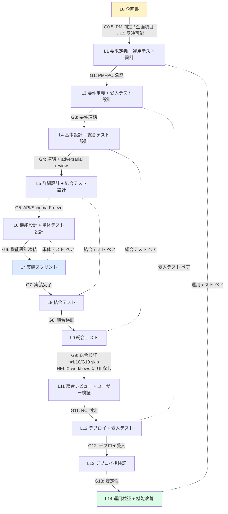
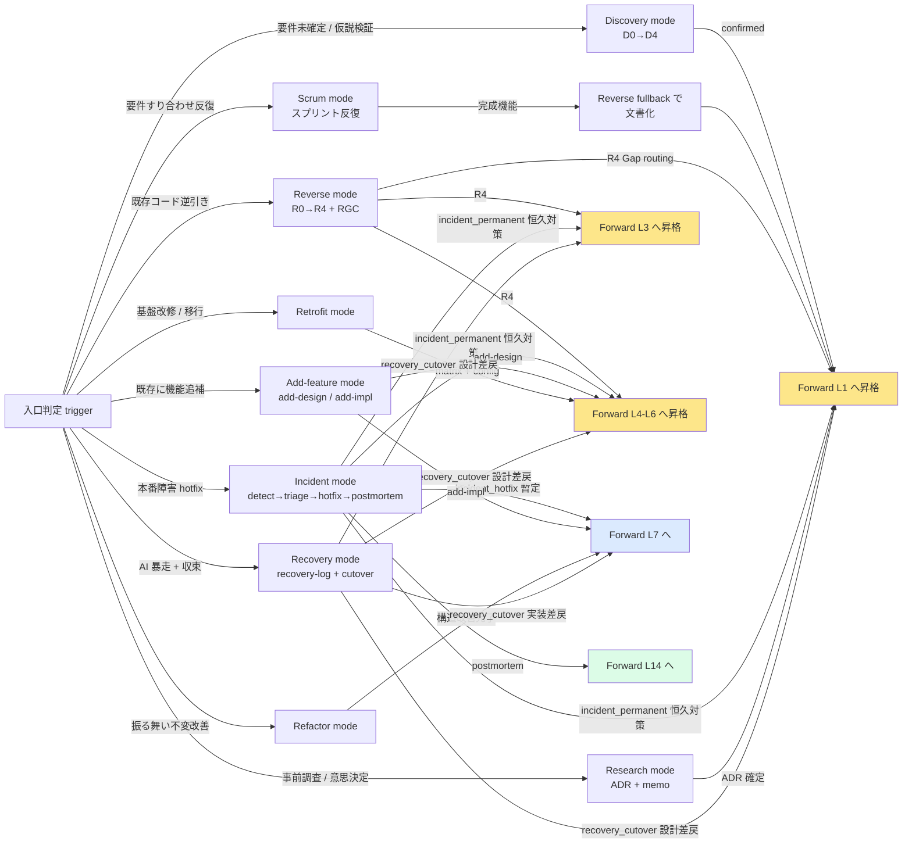
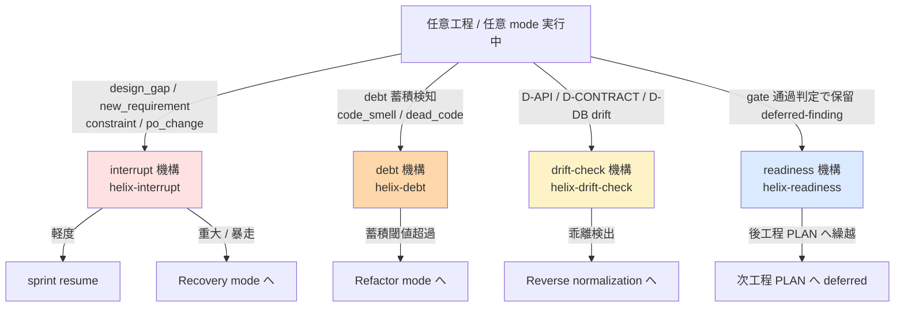
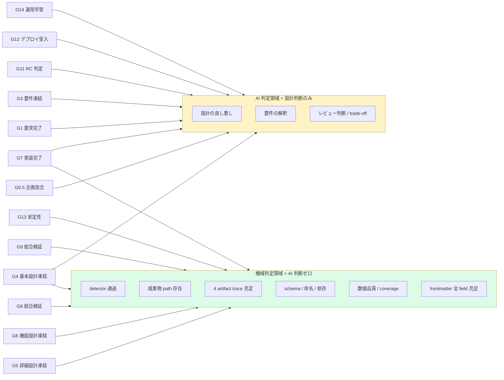
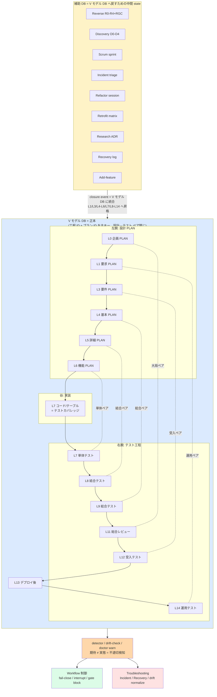
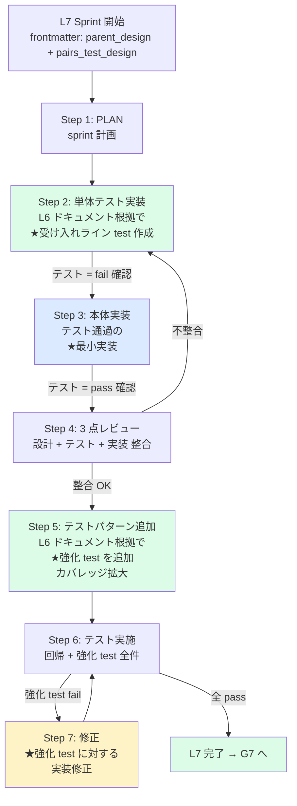

# HELIX-workflows 見直し企画書

> 本 doc は `docs/plans/L0/L0-helix-workflows-conceptplan.md` (PLAN) の製本対象。既存の HELIX-workflows (2026-05-24 V2 完全移行で正本宣言された「道」) を素材として、現状到達点 / 残課題 / 次工程 (L1 要求定義) への接続方針を整理する見直し企画書。

---

## §1 背景・目的

### §1.1 背景 — HELIX-workflows の現状

HELIX-workflows は 2026-05-24 V2 完全移行 (commit `35a901c` / `ee1a13a`) で **正本宣言された「道」**。構成は以下:

- **HELIX-workflows/HELIX-process-L0-L14.md**: 全体構造正本 (220 行)、TDD 全 mode 共通絶対原則 + V-model ペア凍結 (L1↔L14, L2↔L10, L3↔L12, L4↔L9, L5↔L8, L6↔L7)
- **HELIX-workflows/helix-process/ 47 doc**:
  - Forward 工程別 15 doc (L0-concept.md 〜 L14-operation-verification.md)
  - 入口モード 9 doc (scrum / discovery / reverse / incident / add-feature / refactor / retrofit / research / recovery-workflow.md)
  - 工程専門 2 doc (screen-design / frontend-design-workflow.md)
  - 管理・自動化基盤 21 doc (automation-gate-map / deviation-plan-map / db-integration / db-auto-registration / detection-routing / fe-detector-spec / cross-cutting-mechanisms / test-perspective-gate / ci-pr-workflow / layer-context-injection / learning-engine / observability-metrics / continuous-run-context-management / cross-detection / infra-readiness / integration-map / folder-structure-review / asset-mapping / two-stage-agent-design / v2-9mode-ecosystem / README)
- **cli/helix-* (約 60 CLI)** + **skill 118 種** + **helix.db schema v35+** + **runtime (.helix/)**
- **PLAN**: V1 (PLAN-NNN) 224 件 (`is_reference: true` 参考扱い) + V2 (L<NN>-○○○plan) 100 件

HELIX-workflows = AI エージェント (Codex / Claude) を主力とする **process layer framework**。Forward V-model + 9 mode + 横断機構 (interrupt/debt/drift-check/readiness) で構成。

### §1.2 メイン目的 — TDD 駆動 + ワークフロー配線の機械判定化 + helix.db = 資産保全 backbone

HELIX-workflows は **TDD (テスト駆動) を基本原則** とし、V モデル左腕で設計と同時にテスト設計を凍結、L6→L7 で「テスト → 実装」順序を固定する ([HELIX-process-L0-L14.md §基本原則](../../../HELIX-workflows/HELIX-process-L0-L14.md))。やり方が異なる 9 mode (Scrum/Discovery/Reverse/Incident/Add-feature/Refactor/Retrofit/Research/Recovery) も **最終的に V モデルへ回帰** し、見える化・引き継ぎ可能性・資産保全を確保する。helix.db はこの **資産保全 backbone** + 状態管理 + フィードバック機構として機能する。

以下 6 つを同時達成する:

1. **TDD 駆動の強制 (受け入れラインが先、強化はあと)**:
   - **L1-L6 設計⇔テスト設計ペア凍結** (運用 / 受入 / 総合 / 結合 / 単体テスト設計をドキュメント根拠で同時凍結)
   - **L7 sprint 7 step を厳守** (HELIX-workflows L7-implementation.md 正本):
     1. PLAN (sprint 計画、parent_design + pairs_test_design 参照)
     2. **単体テスト実装** (L6 ドキュメント根拠で **受け入れライン test** を作る = 最小通過セット)
     3. **本体実装** (受け入れライン test を通す **最小実装**、テストアフター禁止)
     4. **3 点レビュー** (設計 + テスト + 実装 の整合)
     5. **テストパターン追加** (QA 観点で L6 ドキュメント根拠の **強化 test** を追加、カバレッジ拡大)
     6. **テスト実施** (回帰、強化 test 含む全件)
     7. **修正 / 実装完了** (強化 test に対する実装修正、ここで初めて実装強化)
   - **順序原則**: 「ドキュメント → テスト → 実装 → レビュー → ドキュメント根拠でテスト追加 → 修正」。**受け入れラインが先、強化はあと**。実装の強化は受け入れライン通過後にしか着手しない
   - 全 mode 共通絶対原則 (Forward / Scrum / Discovery / Reverse / Incident / Add-feature / Refactor / Retrofit / Research / Recovery)
   - Refactor では変更前の保護網テスト (既存テスト or ゴールデンマスター) 存在を前提
2. **9 mode から V モデル回帰**: Scrum/Discovery/Reverse/Incident/Add-feature/Refactor/Retrofit/Research/Recovery の各 mode 完了後、Forward L0-L14 体系へ昇格・統合 (Reverse fullback / R4 routing / Add-feature 追補 等)
3. **helix.db を決定する (V モデル DB = 正本 + 補助 DB = 中間 state)**: helix.db は **V モデル DB (正本)** + **補助 DB (9 mode 別、中間 state)** の二層構造。V モデル DB は設計工程 (L0/L4/L5/L6) × 実装 (L7) × テスト工程 (L7単体/L8/L9/L12/L14) を設計⇔テストペアで閉じ、工程 ID (L<NN>) + プラン ID (L<NN>-○○○plan) を主キーとする。補助 DB は Reverse/Discovery/Scrum/Incident/Refactor/Retrofit/Research/Recovery/Add-feature の中間 state を保持、closure event で V モデル DB に統合される。ワークフローの state / event / transition / 変更履歴 / 設計判断 / 実装内容 / コード&DB の変更 trace が schema で正本化される
4. **AI による独自判断を厳格に減らす**: 配線が決まれば AI は配線に従うだけ (Opus PM の都度判断を排除)
5. **ワークフロー分岐を機械判定する**: どの mode に行くか / どの gate を通すか / どの state に置くか / どの工程へ進むか を AI 判断ゼロで決定
6. **影響範囲分析の可用性向上 (helix.db の最終目標)**: 機能改善・改修時に「設計はこうだった」「実装はこうだった」「コード/DB/画面はこう変わった」が即座に追跡可能。「ここだけ直せばいいか / 影響範囲が広いから広めに直すか」を判断できる

#### 正サイクル (データ駆動の自己回帰 framework + 資産保全)

```
[1] TDD 駆動でワークフローに従う (設計⇔テスト ペア凍結、テスト → 実装)
   ↓
[2] 9 mode 経由なら最終的に Forward V モデルに回帰 (見える化、引き継ぎ可能、資産保全)
   ↓
[3] helix.db に適切に登録 (state / event / transition / 変更履歴 / trace が正しく蓄積)
   ↓
[4] 適切登録だから不適切を検知できる (期待 ≠ 実態 = 異常検知)
   ↓
[5] 不適切から
   ├─ ワークフロー制御 (次の遷移 / fail-close / interrupt 発火)
   ├─ トラブルシューティング起点 (incident detect / drift detect / recovery trigger)
   └─ 影響範囲分析 (機能改修時、過去 trace から「ここだけ / 広めに」を判断)
```

これが達成されると、AI が判断するのは **「設計の良し悪し / 要件の解釈 / レビュー判断」のみ** に絞られる。それ以外 (遷移 / 状態管理 / 異常検知 / 制御 / troubleshooting 起点 / 影響範囲分析) は全部 helix.db 駆動で機械化される。

#### V モデルの本質的価値: 量が対称ペアで閉じる

V モデル左腕 (設計工程) と右腕 (テスト工程) は **量・粒度・抽象度で対称ペア凍結** される。これにより:

1. **量保証**: 設計工程の量 = テスト工程の量 (1:1 ペア、量が機械的に予測可能)
   - L4 ADR 数 ⇔ L9 総合テスト数
   - L5 D-API endpoint 数 ⇔ L8 結合テスト数
   - L6 機能関数数 ⇔ L7 単体テスト数
   - L3 受入条件数 ⇔ L12 受入テスト数
   - L1 運用シナリオ数 ⇔ L14 運用テスト数
2. **量の偏り検知**: 設計量 vs テスト量 の差分 = **異常検知 signal** (例: L4 ADR 10 個 vs L9 総合 test 2 個 = カバレッジ不足を機械検知)
3. **キャパシティ予測**: 上流工程の量から下流工程の量を予測 (L4 ADR 数決まる → L9 総合 test の必要数が決まる)
4. **量の暴走防止**: 各工程の量が機械的に律される、設計だけ無限膨張 / テストだけ膨張 の事故防止

この「量閉じ性」が V モデル DB の正本性を担保する。補助 DB (mode 別、量不定) は closure event で V モデル DB に統合された時点で量が閉じる。

#### 資産保全の意義 (helix.db の最終目標)

機能改善・改修時に新規参加者 / AI session 跨ぎ / 別チーム引き継ぎが起きても、helix.db を見れば:

- 「こういう設計したのね～」(L4-L6 設計 doc の trace)
- 「こういう実装したのね～」(L7 sprint の commit / change set)
- 「コード/DB/画面はこう変わっているのか」(file change history + schema migration + UI state diff)
- 「ここだけ直せばいいか / 影響範囲が結構あるから広めに直すか」(dependency graph + trace_link)

がワンクエリで分かる。これが knowledge for decision の可用性向上 = HELIX の真の価値。

### §1.3 HELIX-workflows の位置付け — 要求に近い性質

HELIX-workflows は単なる framework 仕様ではなく、**要求 (= 何を作るか) に近い性質** を持つ。L0-L14 の各工程定義 / 9 mode workflow / V-model ペア / 横断機構 は、HELIX framework が満たすべき機能 (FR) + 非機能 (NFR) の上位概念。

そのため本見直し PLAN では:
- **L0 (本 PLAN)**: 配線図の大局確定 + 機械判定化方針確定 (薄い企画書)
- **L1 (次工程)**: 配線の詳細仕様 + 各 transition の機械判定条件 + 機能/非機能要求 (厚い要求定義)
- 既存 HELIX-workflows 47 doc は L1 要求定義の **直接素材** (V2 を踏襲しつつ機械判定化の観点で再整理)

### §1.4 適用工程 (L2 / L10 skip)

HELIX-workflows 自体は **画面 / UI を持たない** (CLI + workflow + skill + schema の framework) ため、Forward L0-L14 から以下を skip:

- **L2 画面設計 + フロント UI**: 対象外 (HELIX-workflows に画面はない)
- **L10 フロント UX 磨き上げ**: 対象外 (L2 の対の右腕、skip 対応)

適用工程: **L0 → L1 → L3 → L4 → L5 → L6 → L7 → L8 → L9 → L11 → L12 → L13 → L14** (計 13 工程)

V-model ペア凍結も対応:
- L1 ↔ L14 (運用テスト) ✓
- ~~L2 ↔ L10~~ (画面 ↔ UX、skip)
- L3 ↔ L12 (受入テスト) ✓
- L4 ↔ L9 (総合テスト) ✓
- L5 ↔ L8 (結合テスト) ✓
- L6 ↔ L7 単体 (単体テスト) ✓

### §1.5 見直しの必要性 (なぜ今)

2026-05-25 session3 (63 commit / 10 framework 強化) 完遂後、本 session で HELIX 自身を HELIX-workflows で自己適用 (dogfooding) しようとして以下が発覚:

1. **ワークフロー配線が機械判定不能**: 各工程 / mode の遷移条件が doc 仕様止まり、AI Opus PM が都度判断
2. **PLAN dir が L7 / L12 / L14 のみ実体 (L0/L1-L6/L8-L11/L13 不在)** → V2 命名規則の全工程起票が機能していない
3. **helix doctor warn 109 件** (4 artifact 86 / pair freeze 11 / skill frontmatter 116 / etc) → V2 規約の機械強制が advisory 止まり
4. **dogfooding 不在** → HELIX 自身が HELIX-workflows で開発されていない
5. **9 mode 接続 trace 薄い** → 各 mode の Forward 接続が doc 仕様止まり、実走行 event が helix.db に登録されない
6. **専門エージェント / team 構造の累積議論** (memory carry §9 P1.5) → L7+ で再燃するが本 L0 では扱わない

---

## §2 解決する課題

### §2.1 課題 10 軸 (TDD 軸追加、§3.1 対応施策列付き)

| # | 軸 | 課題 | 見直しで解決する方向 | → §3.1 対応施策 | → §8 L1-IN |
|---|---|---|---|---|---|
| 1 | PLAN 全工程起票 | L0/L1-L6/L8-L11/L13 dir 不在、V2 命名規則の全工程化が未完 | L1+ で L0-L14 全工程 dir 整備 + 各工程 skeleton PLAN 起票を要件化 (L2/L10 skip 適用後 13 工程) | L0-L14 全工程 PLAN dir の整備計画 | L1-IN-03 |
| 2 | 4 artifact 双方向 trace | warn 86 件、設計 ↔ 実装 ↔ テスト設計 ↔ テストコード の trace が advisory | L1 NFR で fail-close 昇格、L7 既存 65 PLAN の retrofit を必須化 | HELIX-workflows 本体の見直し / helix.db schema 整合確認 | L1-IN-04 |
| 3 | V-model pair freeze | warn 11 件、parent_design / pairs_test_design 未指定 PLAN | L1 NFR で必須化、L7 PLAN frontmatter validator を強制 | HELIX-workflows 本体の見直し / helix.db schema 整合確認 | L1-IN-04 |
| 4 | mode 接続 trace | 9 mode の Forward 接続が doc 仕様止まり、実走行 event 不在 | helix.db に mode_transition table 新設、各 mode の confirmed → L1/L3/L4-L6 昇格を event 化 | V モデル逸脱モード回帰ワークフローの設計 / helix.db schema 整合確認 | L1-IN-08, L1-IN-10 |
| 5 | dogfooding | HELIX 自身が HELIX-workflows で開発されていない | 本 L0 起票が起点、L1+ で HELIX 自身の全工程 PLAN を起票する | dogfooding 計画 | L1-IN-03 |
| 6 | 既存資産インベントリ | skill 118 / cli/helix-* 60 / helix.db table 30+ / PLAN 324 / docs が flat で工程未割当 | L0-L14 工程別に資産 inventory を作成、helix.db に双方向 mapping 登録 | 既存資産の工程別 inventory 作成 | L1-IN-06 |
| 7 | 工程別 skill 注入機構 | `layer-context-injection.md` で設計済の L 別注入セットが実装不完全、helix-context が各 L で「ここで使う skill」を機械注入できていない | helix-context 強化 + `vmodel-semantics.yaml` L 別注入セット正本化 + helix doctor audit | 工程別 skill 注入機構の実装 | L1-IN-07 |
| 8 | V モデル逸脱モードの Forward 回帰ワークフロー | 9 mode の closure 後に Forward 昇格手順が個別ばらつき | リバースワークフロー (R0-R4 + RGC) を 9 mode 共通基盤化、Forward 接続 event helix.db 登録 | V モデル逸脱モード回帰ワークフローの設計 | L1-IN-08 |
| 9 | PLAN 内部の手順書化 | PLAN の §0-§5 構造はあるが、各 step の agent_slot 割当 + workflow trace が template に組込まれていない | template 拡張: 各 step に `agent_slot` + `workflow_ref` field 追加、cli/templates/plan/v2/L<NN>-template.md 全 13 件 (L2/L10 skip) を整備 | PLAN template の手順書化 | L1-IN-09 |
| **10** | **TDD 順序 fail-close 未強制** | L7 sprint 7 step の **受け入れライン先 / 強化あと** が advisory 止まり、機械強制なし。テストアフター / 受け入れ test 不在 / 強化 test 不在 の事故防止が不完全 | L1 NFR で L7 sprint 7 step の順序 fail-close 機械強制契約を確立 (S2 test 存在前に S3 着手 = block / S5 強化 test pass 前に S7 修正 = block 等) | HELIX-workflows 本体の見直し / cli/helix-* (sprint 機械チェック) | L1-IN-11 |

### §2.2 解決後の到達点

HELIX-workflows の道に沿って HELIX 自身を L0-L14 で開発できる状態 (= 自己充足する framework)。同様に、HELIX-workflows を採用した任意の project (具体例: マーケティングツール SaaS / Indie SaaS / 業務システム 等、L1 要求定義以降で個別 use case として扱う) が L0-L14 を歩ける。

---

## §3 スコープ

### §3.1 対象 (10 領域)

- **HELIX-workflows 本体の見直し**: 47 doc の現状到達把握 + drift 検出 + retrofit 方針確定
- **cli/helix-* の整合確認**: HELIX-workflows と CLI 実装の drift 解消方針
- **skill 118 種の整合確認**: SKILL_MAP.md と HELIX-workflows の対応関係明示
- **helix.db schema の整合確認**: V2 規約 (kind / process_layer / parent_design / pairs_test_design / generates / dependencies) と DB schema の対応関係
- **L0-L14 全工程 PLAN dir の整備計画**: L1 で実施する全工程 skeleton PLAN 起票の方針
- **dogfooding 計画**: HELIX 自身を HELIX-workflows で開発する具体手順 (L0 → L1 → L2 → ... → L14) の見取り図
- **既存資産の工程別 inventory 作成**: skill 118 / cli/helix-* 60 / helix.db table 30+ / PLAN 324 / docs を L0-L14 工程別に分類、資産 ↔ 工程の双方向 mapping を helix.db に登録、現状の工程別密度 (どの工程に資産集中 / どの工程が空白か) を可視化
- **工程別 skill 注入機構の実装**: `helix-context` 強化、`vmodel-semantics.yaml` に L 別注入セット (skill / command / mandatory agent / orchestration) 正本化、helix doctor で audit。L に入った瞬間に AI の選択空間が「その工程で使うもの」に自動絞り込みされる機構 (`layer-context-injection.md` の実装層)
- **V モデル逸脱モード回帰ワークフローの設計**: 9 mode (Scrum/Discovery/Reverse/Incident/Refactor/Retrofit/Research/Recovery/Add-feature) から Forward L0-L14 への回帰経路を、既存リバースワークフロー (R0-R4 + RGC) を **共通基盤** として再利用する形で設計。各 mode の closure 時に Forward への接続 event を helix.db 登録、9 mode → Forward の trace 充足
- **PLAN template の手順書化 (15 件整備)**: cli/templates/plan/v2/L00-L14 template 全 15 件で各 step に `agent_slot` + `workflow_ref` field 組込。step ごとに「誰が / どの workflow で / どこまで進んだか」を残す手順書化、再開可能性を強化

### §3.2 対象外

- 新 paradigm への移行 (V-model → Stream-aligned 等): HELIX-workflows V2 をそのまま使う方針確定 (本 session ユーザー指示)
- 既存 V1 PLAN 224 件の V2 命名 retrofit: `is_reference: true` 維持、製本したい場合は V2 命名で新規書き直し
- 具体 product (マーケティングツール / Indie SaaS 等) の機能要求: L1 要求定義以降で扱う use case
- 専門エージェント 35 / manager 18 / team 8 の実装: memory carry §9 P1.5 で方針確定済、L1+ で段階導入
- AI 本体 (LLM training / fine-tuning): HELIX-workflows scope 外

### §3.3 想定 Phase 境界 (仮、L1/L3 で確定)

| Phase | scope | 仮 KGI |
|---|---|---|
| α (見直し + 自己適用) | HELIX-workflows 見直し完了 + HELIX 自身の L0-L14 全工程 PLAN 起票 | aligned PLAN ≥ 50 / month + warn 86 → 20 以下 |
| β (OSS 化) | HELIX-workflows を OSS framework として公開 | OSS install ≥ 100 / week |
| γ (commercial) | freemium / commercial (専用 advisor / SOC2 / 認定 partner) | paid user ≥ 10 / month |

Phase 境界 KGI は L1 要求定義で確定 (L3 で詳細化)。

---

## §4 投資対効果

### §4.1 想定投資

- 期間: 5-15 セッション (Phase α 見直し + 自己適用 部分)
- 工数: PM 主導、実装は Codex / Claude 委譲
- Token 予算: 既存予算内 (advisor / pmo 委譲で効率化)

### §4.2 想定 ROI (定量目標、Phase α 終了時点)

| 指標 | 現状 (2026-05-26) | Phase α 目標 |
|---|---|---|
| L0-L14 全工程 PLAN dir 整備率 | 約 33% (L0/L7/L12/L14 のみ実体、本 L0 起票で L0 着手) | 100% (全 dir + 各工程に skeleton PLAN 1 件以上) |
| 4 artifact 双方向 trace 充足率 | ~10% (helix doctor warn 86 件) | ≥ 80% (warn 20 件以下) |
| Pair Freeze Coverage | ~30% (warn 11 件) | ≥ 80% (warn 3 件以下) |
| skill frontmatter audit warn | 116 件 | ≤ 30 件 |
| HELIX 自己適用 (dogfooding) | 0% (本 PLAN 起票が起点) | aligned PLAN ≥ 50 / month |
| mode 接続 trace (helix.db event) | 0 件 | mode_transition event 蓄積開始 |

---

## §5 成功条件・KGI / KPI

### §5.1 北極星指標 (NSM) — 1 系統

**NSM: V-model 整合 PLAN 完遂数 / week**

- 定義: `count(PLAN where status=complete AND vmodel_trace_score >= 0.8) / week`
- vmodel_trace_score = 6 axes 全 PASS で 1.0: layer / kind / pair_freeze / 4artifact_trace / gate_pass / done
- 機械判定契約: plan_validator + helix doctor + helix.db.v_model_alignment_score view (L1 で確定)
- 評価頻度: 週次
- Target: Phase α 終了時点で aligned PLAN ≥ 5 件 / week

### §5.2 Guardrail (3 軸、fail-close)

> ID は `GR-*` で命名 (Forward gate `G2/G4/G6` 等との混同回避)。

| ID | 軸 | Target | Fail-close trigger |
|---|---|---|---|
| GR-1 | Pair Freeze Coverage | ≥ 80% | Forward gate G2/G4/G6 で block |
| GR-2 | AI Agent Error Budget Consumption | ≤ 5% / month | agent slot 自動 throttle |
| GR-3 | Time-to-First-Successful-PLAN (TTFSP) | ≤ 30 min (新規 install から) | onboarding flow 見直し carry |

### §5.3 Cascade KPI (advisory)

- 3-problem 検知率 (バグ / spaghetti / 契約漏れ) ≥ 80%
- Sprint 自律完遂率
- 8 並列到達率
- **9 mode → Forward 回帰率**: 9 mode 完了 PLAN のうち Forward (L1/L3/L4-L6/L7-L14) へ昇格 event 登録済の比率 ≥ 95%
- **影響範囲分析 query 時間**: 機能改修 trigger → 過去 trace retrieve まで ≤ 5 秒 (helix.db query)
- **資産保全 trace 充足率**: asset_history / schema_migration_log / ui_state_diff / decision_trace の view が L7 sprint の commit と 1:1 対応している比率 ≥ 90%
- **影響範囲判定の自動化率**: 「ここだけ / 広めに」の機械判定が L4-L6 algorithm で正しく判別できる率 ≥ 80% (L1-L5 で実装)
- **V モデル量閉じ率 (pair volume balance)** ★: 設計⇔テスト ペア各々の量バランス指標が target (`balance_ratio = test_count / design_count`、向きはテスト÷設計、target ≥ 1.0) を満たす比率 ≥ 90%
  - L9 総合 test 数 / L4 ADR 数 ≥ 1.0 (ADR 1 件 = 総合 test ≥ 1 件で凍結)
  - L8 結合 test 数 / L5 D-API endpoint 数 ≥ 1.0
  - L7 単体 test 数 / L6 機能関数数 ≥ 1.0 (カバレッジ 100%)
  - L12 受入 test 数 / L3 受入条件数 ≥ 1.0
  - L14 運用 test 数 / L1 運用シナリオ数 ≥ 1.0
  - **paired_trace_coverage** ★ = paired_items / design_items ≥ 95% (双方向 trace 接続率、count 算出だけでなく trace 接続を確認)
  - **orphan_test_count** ★ = 0 (孤児テスト = ペア凍結対象の設計に紐づかないテスト件数、fail-close)
  - 上限 guardrail (別 KPI): `test_count / design_count ≤ 10` を超える場合は過剰テスト疑い = メンテ debt 兆候 (advisory)

### §5.4 KGI

Phase α 完了時点で:

- L0-L14 全工程 PLAN dir 100% 整備 + 各工程 skeleton PLAN 起票
- 4 artifact double trace 100% 化 (warn 86 → 20 以下)
- HELIX 自身の dogfooding 稼働 (aligned PLAN ≥ 50 / month)
- HELIX-workflows 47 doc と cli/helix-* / skill 118 / helix.db schema の drift 解消

---

## §6 想定リスク

| ID | 軸 | リスク | Mitigation | Severity |
|---|---|---|---|---|
| R1 | scope | 見直し範囲が膨大 (47 doc + 60 CLI + 118 skill + 35 table) で Phase α が肥大化 | L1 要求定義で **必須見直し範囲 (warn 解消・dogfooding 起動・PLAN dir 整備)** と **後回し範囲 (CLI/skill/schema retrofit)** を明確分離 | P1 |
| R2 | technical | 4 artifact trace warn 86 件の retrofit が L7 既存 PLAN 全件で困難 | L1 NFR で「新規 PLAN は最初から trace 必須 (fail-close)、旧 PLAN は段階 retrofit (advisory)」の二段運用を要件化 | P1 |
| R3 | dogfood | HELIX 自身の L1-L6 設計 PLAN 起票が後回しになり、L7 実装が走り続ける | L1-L6 PLAN 起票を Phase α DoD に含め、L7 既存 65 PLAN の retrofit を blocked dependency にする | P1 |
| R4 | drift | HELIX-workflows と cli/helix-* / skill / helix.db schema の drift が見直しでさらに露呈 | L1 要求定義で drift 検出機構 (helix doctor / drift-check) の強化を NFR 化、L5 詳細設計で schema migration 計画 | P2 |
| R5 | regulatory | OSS license (Phase β) / commercial 戦略 (γ) 未確定 | L1 で MIT / Apache 2.0 確定、γ monetization は L1 段階で freemium / commercial の二択に絞る | P2 |

---

## §6.5 ワークフロー配線図 (機械判定化の対象、L0 大局、L1 で詳細化)

> 本 §は HELIX-workflows のワークフロー配線の **大局** を示す。各遷移条件 / 機械判定式 / fail-close trigger は L1 要求定義で詳細化する。図は mermaid で記述。

### §6.5.1 Diagram 1: Forward V-model L0-L14 + ペア凍結配線 (L2/L10 skip)



**機械判定式**: 各 gate (G0.5-G14) は `gate_verdict = static_subchecks AND ai_review_required_when(...)` の合成。`static_subchecks` (detector + frontmatter + count) は `exit 0 = pass` で機械判定、AI 判定が必要な gate (G0.5/G1/G3/G7/G11/G12/G14) でも static 部分は先行通過し、AI は最終 verdict のみ担当 (詳細: §6.5.4 Diagram 4)。pair 凍結は parent_design / pairs_test_design field の存在で機械判定。

### §6.5.2 Diagram 2: 9 mode 入口判定 + Forward 復帰経路



**機械判定式**: 入口 trigger は detector で機械判定 (例: 仮説未確定検知 → Discovery、本番障害 alert → Incident)。Forward 復帰は各 mode の closure event を helix.db.mode_transition table に登録、event 発火で自動遷移。

**Incident / Recovery の復帰経路 (粒度詳細)**:
- **Incident**: `incident_hotfix` は L7 暫定実装直行 (本番影響最小化)、`incident_permanent` は事象別に L1 要求 / L3 詳細 / L4-L6 設計に差戻し恒久対策、`postmortem` は L14 で運用学習に集約。3 経路は **並走可** (hotfix で先に止血 → permanent で根本対策 → postmortem で再発防止 を時系列で別 PLAN 起票)。
- **Recovery**: `recovery_cutover` は逸脱原因別に **設計差戻し (L1/L3/L4-L6)** と **実装差戻し (L7)** に分岐。AI 暴走の原因が要件解釈なら L1、契約理解なら L3、設計判断なら L4-L6、実装ミスなら L7 へ。複数差戻しは recovery-log で trace し、`cutover_orchestrator` が機械順序制御。

### §6.5.3 Diagram 3: 横断機構の発動条件 (全工程・全 mode から発動)



**機械判定式**: 各機構の発動条件は detector + threshold で機械判定。例: drift-check は D-API/D-CONTRACT/D-DB の hash 不一致で発動、debt は code_smell 閾値超過で発動。

### §6.5.4 Diagram 4: gate 配置 + 機械 vs AI 判定境界



**機械判定式**: `gate_verdict = static_subchecks AND ai_review_required_when(...)` の合成方式。
- **static 領域** (M1-M6): `helix-gate --static-only` で AI なしに実行可能、AI 判定 gate (G0.5/G1/G3/G7/G11/G12/G14) でも static subchecks は先行通過必須。
- **AI 領域** (A1-A3): 設計の良し悪し / 要件解釈 / trade-off レビューに限定、manager (Opus + GPT-5.5) が adversarial check で統合判断、判断 trace を helix.db.gate_review table に記録。
- **境界判定**: `ai_review_required_when(gate)` は L1 で `cli/config/gate-policy.yaml` 化、各 gate ごとに AI レビュー発火条件 (例: 「ADR 新規追加時」「設計判断 trade-off ≥ 2 件」「P0/P1 指摘あり」) を機械判定 → AI 判定の発火自体も機械化。

### §6.5.5 配線図の機械判定化 — L1 で詳細化する項目

| 配線要素 | L1 で確定する機械判定契約 |
|---|---|
| Diagram 1 各 gate 遷移 | gate 別 detector / static check spec (exit code) |
| Diagram 2 mode 入口 trigger | trigger detector (helix-route の判定 logic) |
| Diagram 2 Forward 復帰 event | helix.db.mode_transition schema + event 発火条件 |
| Diagram 3 横断機構発動条件 | detector threshold (drift hash / debt 閾値 / interrupt trigger) |
| Diagram 4 機械 / AI 境界 | gate 別の「機械判定可能領域」「AI 判定必要領域」の正本 list |

### §6.5.6 helix.db = V モデル DB (正本) + 補助 DB (中間 state) — Diagram 5



#### V モデル DB の table 構造 (主キー = 工程 ID + プラン ID、量閉じ性を schema 強制)

> **構造区分**: **core tables 10 個** + **audit/event tables 1 個** (`volume_metrics`) + **derived views 7 個** (`pair_volume_balance` / `expected_pair_freeze` / `expected_4artifact_trace` / `expected_mode_transition` / `expected_volume_balance` / `v_model_alignment_score` / `discrepancy_log`)。view は **すべて core 10 には数えない** (L1-IN-10 で table/view 数を仕様書固定)。

| 区分 | 構造 | 主キー / 関連 | 内容 |
|---|---|---|---|
| core | **plan_registry** | `(process_layer, plan_id)` (例: L4, L4-helix-self-master-designplan) | 全 PLAN の正本登録 (frontmatter 抽出) |
| core | **design_artifact** | `(process_layer, plan_id, artifact_path)` | 設計 doc 本体 path + version + hash |
| core | **test_design_pair** | `(design_layer, test_layer, design_plan_id, test_design_path)` | 設計⇔テスト設計ペア凍結 (L1↔L14, L3↔L12, L4↔L9, L5↔L8, L6↔L7単体) |
| core | **test_implementation** | `(test_layer, plan_id, test_code_path)` | テストコード本体 (L7単体/L8/L9/L12/L14) |
| core | **code_implementation** | `(layer=L7, plan_id, file_path, commit_sha)` | 実装コード変更履歴 (L7 sprint) |
| core | **coverage_link** | `(L7 code path, L7単体 test path, coverage %)` | コード = テストカバレッジ 1:1 対応 |
| core | **gate_pass** | `(gate_id, plan_id, timestamp, verdict)` | 各 gate (G0.5-G14) 通過記録 |
| core | **transition_history** | `(from_layer, to_layer, plan_id, timestamp, source_workflow)` | 工程遷移履歴 (L0→L1, L4→L5 等) |
| core | **decision_trace** | `(plan_id, adr_id, decision_summary, rationale)` | 設計判断 ADR snapshot |
| core | **schema_migration_log** | `(version, migration_path, applied_at, plan_id)` | DB schema 変更 (L5 D-DB 由来) |
| audit/event | **volume_metrics** ★ | `(process_layer, plan_id, metric_kind, count)` | 各工程の量 metrics (L4: ADR 数 / L5: endpoint 数 / L6: 関数数 / L7: LOC + 単体 test 数 / L8: 結合 test 数 / L9: 総合 test 数 / L12: 受入 test 数 / L14: 運用 test 数) |
| derived view | **pair_volume_balance** ★ | `SELECT design_layer, test_layer, design_count, test_count, (test_count*1.0/design_count) AS balance_ratio FROM volume_metrics ...` | 設計⇔テスト ペアの量バランス指標 view (例: L4 ADR 10 / L9 総合 test 12 = 1.2 で pass) |

#### 補助 DB の table 構造 (mode 別、V モデル DB 統合前の中間 state)

| mode | table | closure 時に V モデル DB のどこへ統合 |
|---|---|---|
| Reverse | `reverse_evidence` (R0) / `reverse_contract` (R1) / `reverse_design` (R2) / `reverse_hypothesis` (R3) / `reverse_gap_register` (R4) | R4 routing で L1/L3/L4 PLAN として登録 |
| Discovery | `discovery_hypothesis` / `discovery_poc` / `discovery_verify_result` | confirmed → L1 要求 PLAN へ昇格 |
| Scrum | `scrum_sprint` / `scrum_backlog` / `scrum_increment` | 完成機能を Reverse fullback → L1-L14 体系へ |
| Incident | `incident_alert` / `incident_triage` / `incident_hotfix` / `incident_postmortem` | 暫定 → L7 hotfix、恒久 → L1/L3/L4-L6、postmortem → L14 |
| Refactor | `refactor_session` (保護網テスト前提) | L7 構造改善として登録 |
| Retrofit | `retrofit_matrix` / `retrofit_config` | L4/L5 追補 + L8/L9 回帰 |
| Research | `research_memo` / `research_adr` | ADR 確定 → L1/L4 設計の根拠として |
| Recovery | `recovery_log` / `cutover_orchestrator` | 収束 → L1/L3/L4-L6/L7 PLAN 起票 |
| Add-feature | `addfeature_design` / `addfeature_impl` | L4-L7 追補として登録 |

#### 共通 fail-close / 不適切検知 view

- `expected_pair_freeze` view (V モデル DB) ↔ 実態の差分 = `discrepancy_log` (Pair Freeze warn 11 件の根拠)
- `expected_4artifact_trace` view ↔ 実態 = `discrepancy_log` (4 artifact warn 86 件の根拠)
- `expected_mode_transition` view (補助 DB closure 時) ↔ 実態 = mode 接続 trace 漏れ検知
- `expected_volume_balance` view ★ ↔ `pair_volume_balance` 実態 = **量不均衡検知** (`balance_ratio = test_count / design_count ≥ 1.0` で pass、< 1.0 で fail-close。例: L9 総合 test 2 / L4 ADR 10 = 0.2 < 1.0 → カバレッジ不足で fail-close、L7 単体 test 20 / L6 関数 100 = 0.2 → fail-close、paired_trace_coverage ≥ 95% AND orphan_test_count = 0 を併用)
- `v_model_alignment_score` view = 6 axes (layer / kind / pair_freeze / 4artifact / gate_pass / done) の集計 (NSM の source)

**helix.db schema 設計の方向性 (L1/L5 で確定)**:

- 既存 30+ table を **V モデル DB (10 table) + 補助 DB (9 mode 別 table 群) + 共通 view** に再構成
- 各 table に `source_workflow` field (どの mode/工程由来か)
- 補助 DB の closure event で V モデル DB に統合する transaction 契約
- discrepancy_log の重大度 (P0-P3) で自動制御 (fail-close / interrupt / Incident mode / Recovery mode 切替)
- **資産保全 view** (新規): `asset_history` / `schema_migration_log` / `ui_state_diff` (HELIX-workflows は L2/L10 skip のため空 or 採用 project 用) / `decision_trace`

### §6.5.6.1 L7 Sprint 7 Step フロー (TDD 駆動、受け入れライン先 → 強化あと) — Diagram 5.5



**順序原則の機械強制 (L1 で機械判定契約 化)**:

| Step | 入力根拠 | 出力 | 機械強制条件 |
|---|---|---|---|
| S2 受け入れ test | L6 機能設計 doc (parent_design path) | test file (pairs_test_design path) | parent_design / pairs_test_design path 存在必須 (frontmatter validator) |
| S3 最小実装 | S2 で書いた test | 実装 file | S2 test 存在前に S3 着手 = fail-close (テストアフター禁止) |
| S4 3 点レビュー | 設計 + テスト + 実装 | review 結果 | 設計 ↔ 実装 ↔ test の 4 artifact 双方向 trace を機械 audit |
| S5 強化 test 追加 | L6 doc + S2/S3 + QA 観点 | 追加 test file | 受け入れ test pass 後にしか着手不可 (順序 fail-close) |
| S7 強化に対する修正 | S5 で書いた強化 test | 実装修正 | S5 test 不在で S7 着手 = fail-close |

これにより「実装はあと、受け入れラインが先、強化はそのあと」が helix.db.workflow_state + event_log で **機械的に保証** される。

### §6.5.7 影響範囲分析フロー (機能改善・改修時、helix.db 駆動) — Diagram 6

```mermaid
flowchart TB
  TRIGGER[機能改善 / 改修 trigger<br/>Add-feature / Refactor / Retrofit] -->|helix.db query| LOOKUP[過去 trace を retrieve]

  LOOKUP --> A1[L4-L6 設計 doc<br/>「こういう設計したのね」]
  LOOKUP --> A2[L7 sprint commit<br/>「こういう実装したのね」]
  LOOKUP --> A3[asset_history<br/>「code/DB/UI はこう変わった」]
  LOOKUP --> A4[trace_link + dependency graph<br/>「影響範囲」]

  A1 & A2 & A3 & A4 --> JUDGE{影響範囲<br/>判定}
  JUDGE -->|局所| LOCAL[ここだけ直せばいい<br/>Add-feature add-impl<br/>or Refactor 小]
  JUDGE -->|広範| BROAD[広めに直す必要あり<br/>Retrofit matrix<br/>or 大規模 Refactor]

  LOCAL -->|Forward L7 へ| FORWARD7[Forward L7 実装]
  BROAD -->|Forward L4-L6 再設計へ| FORWARD46[Forward L4-L6 設計拡張]

  FORWARD7 -.helix.db 登録.-> LOOKUP
  FORWARD46 -.helix.db 登録.-> LOOKUP

  style LOOKUP fill:#dbeafe
  style JUDGE fill:#fef3c7
  style LOCAL fill:#dcfce7
  style BROAD fill:#fee2e2
```

**影響範囲分析の機械化** (L1-L5 で詳細化):

| 分析項目 | helix.db source | 出力 |
|---|---|---|
| 設計判断の retrieve | `decision_trace` view + L4-L6 doc path | 過去の trade-off / ADR snapshot |
| 実装の retrieve | `event_log where source=L7` + commit hash | sprint progress + 変更 file list |
| code/DB/UI の変更 | `asset_history` + `schema_migration_log` + `ui_state_diff` | 時系列の change set |
| 影響範囲 | `trace_link` (双方向) + `dependency graph` | 関連 PLAN / 関連 ADR / 関連 mode_transition |
| 「ここだけ / 広めに」判定 | dependency centrality (PageRank 等) + change set size + test coverage | local / broad の自動判定 (L4-L6 algorithm) |

この機械化により、新規参加者 / AI session 跨ぎ / 別チーム引き継ぎ時に **過去の judgment を 1 query で復元** できる = knowledge for decision の可用性向上 = HELIX の真の価値。

---

## §7 関連 doc / 参考

### §7.1 HELIX-workflows 正本 (見直し素材)

- [HELIX-workflows/HELIX-process-L0-L14.md](../../../HELIX-workflows/HELIX-process-L0-L14.md) (全体構造 + TDD 原則 + V-model ペア)
- [HELIX-workflows/helix-process/L0-concept.md](../../../HELIX-workflows/helix-process/L0-concept.md) (L0 工程定義)
- [HELIX-workflows/helix-process/README.md](../../../HELIX-workflows/helix-process/README.md) (47 doc 索引)
- [HELIX-workflows/helix-process/integration-map.md](../../../HELIX-workflows/helix-process/integration-map.md) (§結論と優先順位)
- [HELIX-workflows/helix-process/automation-gate-map.md](../../../HELIX-workflows/helix-process/automation-gate-map.md) (G0-G14 機械判定)
- [HELIX-workflows/helix-process/layer-context-injection.md](../../../HELIX-workflows/helix-process/layer-context-injection.md) (L 別注入セット)
- [HELIX-workflows/helix-process/cross-cutting-mechanisms.md](../../../HELIX-workflows/helix-process/cross-cutting-mechanisms.md) (interrupt / debt / drift-check / readiness)

### §7.2 実装版 process doc

- [docs/v2/process/L00-planning.md](../process/L00-planning.md) (L0 Steps / G0.5 / 関連 skill)
- [cli/templates/plan/v2/L00-planning-template.md](../../../cli/templates/plan/v2/L00-planning-template.md) (PLAN frontmatter 正本)

### §7.3 参考 (前世代、見直し対象)

- [docs/v2/CONCEPT.md](../CONCEPT.md) (HELIX V2 初期企画書 draft、2026-05-13 起票で凍結、本 doc が後継)
- [docs/v2/L1-REQUIREMENTS.md](../L1-REQUIREMENTS.md) (V2 初期要件 draft、L1 起票時に素材として参照)

### §7.4 下流 PLAN (本 PLAN 完遂後に起票)

- L1 4 PLAN (業務要求 / 機能要求 / 技術要求 / 非機能要求) (L1 要求定義 + 運用テスト設計)

### §7.5 memory carry (L1+ で具体化する方針、L0 では対象外)

- `~/.claude/projects/-home-tenni-ai-dev-kit-vscode/memory/project_2026_05_25_session3_10commit_v_model_strengthen.md` §9 P1.5 最終確定版
  - 専門エージェント 35 / manager 18 / subagent 45 / command 40 の規模感
  - 8 team (常設 3 = security/algorithm/academic、動的 5)
  - LLM 適性分離 (文脈=Claude / 数学=Codex)
  - manager 命名規則 / manager 責務契約 / ROI 厳格化 / 学術 chair pattern / マーケ分析系
  - multi-team orchestration patterns 7 件

これらは L0 では「方針として記録」、L1 要求定義以降で具体機能要件として展開する。

---

## §8 L1 バトン (L1 4 PLAN (業務要求 / 機能要求 / 技術要求 / 非機能要求) へ引き継ぐ項目)

### §8.1 L1 で確定する項目 (採択、10 件)

1. **L1-IN-01**: Primary NSM "V-model 整合 PLAN 完遂数" の 6 axes 機械判定契約
2. **L1-IN-02**: Guardrail 3 軸 (Pair Freeze / Agent Error Budget / TTFSP) の独立性 + fail-close 条件
3. **L1-IN-03**: L0-L14 全工程 PLAN dir 整備 + 各工程 skeleton PLAN 起票計画 (HELIX 自身の dogfooding 工程表、L2/L10 skip)
   - **L2/L10 unskip 条件 (tl-advisor P2 反映)**: 以下のいずれかが発生した場合は L2/L10 を unskip し、画面設計 + UX 磨き上げを実施: (a) HELIX docs site (公式 web doc) を立ち上げる場合、(b) visual mock / interactive UI / TUI を CLI 以外で提供する場合、(c) 採用 project が UI を持つ場合 (HELIX framework 採用 = L2/L10 復活)。CLI man page 程度は unskip 対象外。
4. **L1-IN-04**: 4 artifact 双方向 trace の retrofit 計画 (新規 PLAN = fail-close 必須 / 旧 PLAN = 段階 retrofit advisory)
5. **L1-IN-05**: HELIX-workflows と cli/helix-* / skill 118 / helix.db schema の drift 解消方針
6. **L1-IN-06**: 既存資産の工程別 inventory schema (skill 118 / cli/helix-* 60 / helix.db table 30+ / PLAN 324 / docs を L0-L14 工程に双方向 mapping、helix.db 登録、現状密度の可視化)
7. **L1-IN-07**: 工程別 skill 注入機構の機械強制契約 (`helix-context` 強化 + `vmodel-semantics.yaml` L 別注入セット正本化 + helix doctor audit、L 入る時に AI 選択空間自動絞り込み)
8. **L1-IN-08**: V モデル逸脱モード回帰ワークフロー共通基盤化 (R0-R4 + RGC を 9 mode 共通、各 mode closure 時に Forward 接続 event helix.db 登録)
9. **L1-IN-09**: PLAN template 全 15 件の手順書化 (各 step に `agent_slot` + `workflow_ref` field 組込、cli/templates/plan/v2/L00-L14 整備、L2/L10 skip)
10. **L1-IN-10**: helix.db = **V モデル DB (正本) + 補助 DB (中間 state)** 二層構造の schema 設計
    - **V モデル DB core tables (10)**: plan_registry / design_artifact / test_design_pair / test_implementation / code_implementation / coverage_link / gate_pass / transition_history / decision_trace / schema_migration_log (**主キー = `(process_layer, plan_id)`、設計⇔テストペアで閉じる**)
    - **V モデル DB audit/event tables (1+)**: `volume_metrics` ★ (各工程の量 metrics、L1 で他 audit/event table を追加可能)
    - **V モデル DB derived views (核心)**: `pair_volume_balance` ★ (量バランス view、`balance_ratio = test_count / design_count`) / `expected_pair_freeze` / `expected_4artifact_trace` / `expected_mode_transition` / `expected_volume_balance` ★ / `v_model_alignment_score` (NSM source) / `discrepancy_log` (不適切検知) — **view は core table 数に含めない**
    - **補助 DB 9 mode 別 table 群**: reverse_* (R0-R4+RGC) / discovery_* / scrum_* / incident_* / refactor_session / retrofit_* / research_* / recovery_* / addfeature_* (V モデル DB 統合前の中間 state)
    - **closure event 契約**: 補助 DB → V モデル DB merge transaction の `idempotency_key (mode + plan_id + closure_event_id)` / `rollback` / `conflict resolution (V モデル DB 既存 row との突合)` を L1 で明確化 (tl-advisor adversarial check 2026-05-26 指摘)
    - **資産保全 view**: `asset_history` / `schema_migration_log` (core/event 双方で利用) / `ui_state_diff` (HELIX-workflows は L2/L10 skip のため空、採用 project 用) / `decision_trace`
    - 各 table に `source_workflow` field (どの mode/工程由来か)
    - discrepancy_log の重大度 (P0-P3) で自動制御 (fail-close / interrupt / Incident mode / Recovery mode 切替)
    - **table 数固定**: L1 schema 設計時、`core tables = 10` / `audit/event tables = 1 (拡張可)` / `derived views = 7 (拡張可)` の境界を仕様書で固定する
11. **L1-IN-11**: **TDD 駆動の機械強制契約** (L1-L6 設計⇔テスト設計ペア凍結 + L7 sprint 7 step の **順序 fail-close**: 受け入れ test 不在で実装着手不可 / 受け入れ test pass 前に強化 test 追加不可 / 強化 test 不在で修正着手不可 + ドキュメント根拠 (parent_design / pairs_test_design path) の存在必須 + 全 mode 共通絶対原則 + Refactor 保護網テスト前提)
12. **L1-IN-12** ★: **排泄系 (excretion) — 不要 PLAN / skill / hook の自動 deprecation 機構** (シナプス pruning 相当、生物学的に老廃物排出がないと中毒で死ぬ = HELIX も累積一方で warn 109 件 / PLAN 324 件 / skill 118 種の肥大化を放置するのが致命的。auto-deprecation: 使用頻度 / 最終更新時刻 / drift 検出回数で老化判定 → 自動 archive)
13. **L1-IN-18** (2026-05-26 追加、ユーザー指摘「既存整理は要求の中に含まれる」): **既存資産整理・マッピング** — HELIX-workflows の既存資産 (helix-* CLI 81 件 / helix.db 50+ table + view 1 / cli/config/*.yaml / .helix/ runtime / docs/adr/* 41 件 / cli/templates/plan/v2/* 15 件 / .claude/agents/*.md 19 件) を **inventory として継続管理**し、設計 doc 内で「対応 CLI / file path / schema field」を主張する際は **`implementation_status` 列 (installed / partial / L4-carry / not-implemented) 必須**。机上宣言だけで実在と読まれる記述は禁止。本 doc §12.1 の Glossary 5 列構成 (implementation_status 含む) が L1 以降の標準フォーマット ([[feedback_memory_verify_before_act]] verify-before-act 整合)
14. **L1-IN-19** (2026-05-26 追加、ユーザー指摘「ドキュメント体系の中に移行要求もいりそう」): **既存資産の段階移行・retrofit** — V1 → V2 / 旧 process L1-L11 → 新 L0-L14 / 旧 enum → 新 enum の **段階 migration / retrofit pipeline** を要件として組み込む。具体的: 旧 V1 PLAN 223 件は `is_reference: true` 化、helix-* CLI rename / skill 棚卸し、frontmatter field 移行 (例: kind=impl→process_layer=L7、L1 → L1-helix-workflows-*-plan)、helix.db schema migration、ADR snapshot 後追い起票。**Strangler Fig Pattern (Martin Fowler 2004)** ベースで段階置換、`helix doctor check_migration_pending` (L4 carry) で残量管理。BR-09 (整理) と BR-10 (移行) は責務分離 (整理 = 現状評価、移行 = 段階置換)
15. **L1-IN-20** (2026-05-26 追加、ユーザー指摘「アドバイザーをよく使っているけど、ドキュメントレビューみたいなのがあった方がいい」): **doc 品質レビュー継続化** — tl-advisor (技術判断) / pm-advisor (大局判断) / pmo-sonnet (汎用構造化) と責務分離した **doc-reviewer 専用 role (Codex gpt-5.5 high read-only)** を新設し、大規模 doc 改定 (~500 行+) / G ゲート evidence / V-model 4 artifact pair freeze 前で必須召喚。4 視点 (Correctness / Completeness / Consistency / Clarity) + 業界標準 (Diátaxis / arc42 / **ISO/IEC/IEEE 26515:2018**) + HELIX 固有 V-model 量閉じ性 (balance_ratio ≥ 1.0) / implementation_status 列必須を統合検査。`skills/workflow/doc-review/SKILL.md` + `cli/roles/doc-reviewer.conf` で実体化、`helix doctor check_doc_review_coverage` (L4 carry) で召喚 evidence audit
16. **L1-IN-21** (2026-05-26 追加、ユーザー指摘「ドキュメント通過のために上流が修正されたら下流の修正も必要にしないとずれまくる。デグレ禁止の原則を守るガードレール機構が必要」): **デグレ禁止ガードレール (変更追跡 + ratchet 機構)** — 既存 V-model pair freeze (balance_ratio ≥ 1.0) は **結果整合** のみで、**上流変更 → 下流必須修正の機械追跡が完全に不在**。本 session 自身が「BR-09/10/11 追加 → L3 FR/NFR / L12 AC を後追いで思い出して修正」pattern を踏んでおり、framework として欠陥。**Continuous Delivery (Humble & Farley 2010) / Don't Break the Build (Google SRE 2020) / Ratchet Constraints (Google Testing Blog 2020) / Hyrum's Law (Hyrum Wright) / API Versioning (Semantic Versioning) / Trunk-based Development + branch protection** をベースに、**(1) 上流 ID (BR-* / FR-* / NFR-*) 追加 commit で下流対応 ID (FR-* / NFR-* / AC-* / OT-*) が同 commit / 直前後 N commit 以内に存在しない場合 fail-close (2) balance_ratio < 1.0 regression を前 commit との diff で機械検出 (3) 上流 ID 参照の下流 ID trace 切れ検出** の 3 軸で機械強制 (L4 carry)。実体化: `helix doctor check_upstream_downstream_alignment` + `check_balance_ratio_regression` + `check_id_reference_completeness` 3 件新設

### §8.2 L1 で保留 (L1/L3 で確定)

13. **L1-IN-13**: Phase α/β/γ 境界 KGI 確定
    - **Phase α 三段分割案 (tl-advisor P2 反映)**: 5-15 session で 47 doc + 60 CLI + 118 skill + DB schema 全 retrofit は楽観的 → `must (G0.5/L1/L3 skeleton + blocker warn 解消)` / `should (CLI/schema drift top N の解消)` / `later (全件 retrofit、Phase β/γ で吸収)` の 3 層に分割し、各層に **kill criteria** (例: must 達成 = Phase α exit、should 未達 = Phase β に carry、later 未達 = 永続 P2 として debt 化) を置く。L1 で各層の閾値 (warn 数 / drift 数) を確定。
14. **L1-IN-14**: 専門エージェント / team 構造 (memory carry §9 P1.5) の Phase 配分
15. **L1-IN-15**: **逆引き audit 11 穴の段階対応** (生物学比喩から逆引き検出した HELIX 構造的穴、P0 = 排泄系は L1-IN-12 で先行、残り 11 穴は段階対応):
    - P1: 進化 (framework 世代継承) / 繁殖 (親 → 子 product 経験継承) / 老化 (deprecation lifecycle) / 共生 (Cursor / Claude Code との integration 戦略) / 代謝 (token vs 生産価値 収支 metric)
    - P2: 内分泌系 (slow & global signal、skill 普及度) / 循環系 (cross-mode / cross-PLAN knowledge 流通) / 消化器系 (外部 OSS → 体内化 pipeline) / 性差 (multi-model 組換え戦略)
    - P3: 多細胞化 (team scaling) / 神経変性 (AI 役 / hook 機能劣化検知)
    - 詳細: memory carry §10 「逆引き audit framework 12 穴」参照

### §8.3 見送り

16. **L1-IN-16**: 新 paradigm (Stream-aligned 等) への移行 — HELIX-workflows V2 をそのまま使う方針確定
17. **L1-IN-17**: 二軸 NSM (Tech + Marketing 並列) — Primary 1 件絞り原則に反する

---

## §9 G0.5 ゲート受入条件 (acceptance criteria)

1. **AC-01**: 見直し対象が HELIX-workflows 47 doc + cli/helix-* + skill 118 + helix.db schema として §3.1 で明示
2. **AC-02**: 現状到達点と残課題 (10 軸、TDD 軸含む) が §2 で明示
3. **AC-03**: Primary NSM = 1 系統 (V-model 整合 PLAN 完遂数) で §5.1 に記載
4. **AC-04**: Guardrail 3 軸 fail-close 設計記載 (§5.2)
5. **AC-05**: Phase α/β/γ 仮境界 (§3.3) + 「L1 で KGI 確定」明示
6. **AC-06**: 想定リスク 上位 3 件 (R1 / R2 / R3) に mitigation 記載 (§6)
7. **AC-07**: L1 接続項目 **16 件 (採択 L1-IN-01〜12 + L1-IN-18 + L1-IN-19 + L1-IN-20 + L1-IN-21) + 3 件 (保留 L1-IN-13〜15) + 2 件 (見送り L1-IN-16/17) = 計 21 件** 列挙 (§8) ※ 2026-05-26 ユーザー指摘 4 件 (「既存整理は要求の中に含まれる」+「ドキュメント体系の中に移行要求もいりそう」+「アドバイザーは多用しているがドキュメントレビュー専用 role が必要」+「上流修正時の下流追随を機械強制するデグレ禁止ガードレールが必要」) 反映で L1-IN-18/19/20/21 新規採択
8. **AC-08**: HELIX-workflows 正本 (素材) への参照 path が §7.1 で完全列挙
9. **AC-09**: Diagram 2 で Incident (hotfix→L7 / permanent→L1/L3/L4-L6 / postmortem→L14、3 経路並走可) と Recovery (cutover 設計差戻 L1/L3/L4-L6 + 実装差戻 L7) の分岐粒度が §6.5.2 で明示 (tl-advisor adversarial check 2026-05-26 反映)
10. **AC-10**: V-model 量閉じ率の式が `balance_ratio = test_count / design_count ≥ 1.0` の向き (テスト÷設計) で §5.3 に記載 + paired_trace_coverage / orphan_test_count を併用 (tl-advisor P0 反映)
11. **AC-11**: V モデル DB の構造区分が **core tables 10 + audit/event 1 + derived views 7** として §6.5.6 で明示、`pair_volume_balance` は view であり core 10 に含めない (tl-advisor P1#3 反映)
12. **AC-12** (DDD ユビキタス言語、機械判定可能): L0 §12 Glossary が主要 14 用語以上を定義、各用語に「対応 CLI / file path / schema field / 検出 grep pattern」を表 row 形式で併記 (機械判定: 表 row 数 ≥ 14、3 列充足) — [[feedback_helix_fill_holes_principle]] 「memo→構造化→仕組み化→自動検出」整合
13. **AC-13** (業界標準整合、機械判定可能): L0 §13.1 で L0-L14 全工程 15 段に業界標準対応 (arc42 / ISO/IEC/IEEE 29148:2018 / ISO/IEC/IEEE 42010:2022 / ISO/IEC 25010:2023 / C4 model / Diátaxis / IPA / Nygard / DORA / 12-factor 等) を明示 (検算: checker は `全層共通` 行を工程数から除外し、L0-L14 = 15 段で fail-close) + §13.2 でコーディング規約 SSoT path 4 件 (repo-local: CLAUDE.md / SKILL_MAP.md / HELIX_CORE.md / HELIX-process-L0-L14.md) + 1 件 (external: `~/.claude/.../memory/MEMORY.md` を `external_path_exists` checker 対象) 列挙 (機械判定: §13.1 row 数 - 「全層共通」= 15 + repo-local path 存在チェック 4 件 + external path 1 件)
14. **AC-14** (Bounded Context、機械判定可能): L0 §14.1 で BC 全 10 行 (Forward 本体 1 + derived mode 9 = Scrum / Discovery / Reverse / Incident / Add-feature / Refactor / Retrofit / Research / Recovery) 全件に「固有用語 + anti-corruption 経由先」明示 + §14.2 で BC 越境例 ≥ 3 件 (機械判定: §14.1 table row 数 = 10、うち `Forward` 1 行 + derived 9 行、§14.2 例 ≥ 3、checker は Forward を別枠で数える)
15. **AC-15** (機械判定 carry 明示): §12.末尾 / §13.4 / §14.3 で `helix doctor check_*` 新設 carry を ≥ 6 件列挙し、L4 基本設計で凍結する責務を明示 (機械判定: `helix doctor check_` 文字列 grep count ≥ 6)
16. **AC-16** (既存 lint ツール組み込み計画): §13.3 で markdown / shell / Python / YAML / SQL / 依存脆弱性 / secret スキャン / 静的解析 の 8 領域すべてに既存 OSS ツール (markdownlint / shellcheck / ruff / yamllint / sqlfluff / pip-audit / gitleaks / semgrep) と組み込み先 (pre-commit / CI / helix doctor) を明示 (機械判定: 表 row 数 ≥ 8)

---

## §10 決定 log (decision_log)

- **2026-05-26**: 本 doc 起草、ユーザー指示「HELIX-workflows から作れ企画書にまとめろ、企画書を見直す工程が入ってから次に進む」反映
- **2026-05-26**: 見直し対象 = HELIX-workflows 自身 (47 doc + 関連 CLI / skill / schema)、HELIX framework 全体の新規企画書ではない
- **2026-05-26**: マーケティングツール等の具体 product は L0 では扱わない (L1+ で use case として扱う)
- **2026-05-26**: 新 paradigm への移行は採用せず、HELIX-workflows V2 をそのまま使う方針確定
- **2026-05-26**: Primary NSM = "V-model 整合 PLAN 完遂数 / week" 単一採用、Guardrail 3 軸 + Cascade KPI で補強
- **2026-05-26**: doc-system-architect retrofit (§12 Glossary + §13 業界標準整合 + §14 Bounded Context、AC-12〜AC-16) を追加、機械判定可能化 (CLI / file path / schema field 併記 + `helix doctor check_*` carry 明示) で `feedback_helix_fill_holes_principle` 「memo→構造化→仕組み化→自動検出」原則に整合

---

## §11 工程 6 必須項目 まとめ (HELIX-workflows L0-concept.md §この工程の PLAN 準拠)

| 必須項目 | 本 doc 該当 § | 充足 |
|---|---|---|
| 背景・目的 | §1 | ☑ |
| 解決する課題 | §2 | ☑ |
| スコープ (対象 / 対象外) | §3 | ☑ |
| 投資対効果 | §4 | ☑ |
| 成功条件・KGI / KPI | §5 | ☑ |
| 想定リスク | §6 | ☑ |

---

## §12 Glossary (HELIX-workflows ユビキタス言語、Single Source of Truth)

> **正本宣言**: 本 §12 が HELIX-workflows 全工程 (L0-L14) で使われる主要用語の **Single Source of Truth (SSoT)**。L1-L14 doc は本 §12 を `parent_doc reference` 経由で参照し、独自定義しない (anti-corruption layer 経由)。
> **機械判定化方針**: 各用語に **対応 CLI / file path / schema field / 検出 grep pattern** を併記し、`helix doctor check_ubiquitous_language` (L4 carry、新設) で L1-L14 doc 内の表記ゆれ・未定義用語を検出可能にする ([[feedback_helix_fill_holes_principle]] 「memo→構造化→仕組み化→自動検出」原則整合)。

### §12.1 主要 19 用語 (機械判定可能化、5 列分割 + implementation_status)

> **AC-12 機械判定**: 各用語が「対応 CLI / file path / schema field / 検出 grep pattern + **implementation_status**」の 5 列を持ち、`implementation_status` は `installed / partial / L4-carry / not-implemented` 4 値で実在マッピング ([[feedback_memory_verify_before_act]] 整合、机上宣言だけで「実在」と読まれない設計)。`helix doctor check_glossary_coverage` で 5 列が空でないか fail-close (L4 carry)。
> **既存ソース sweep 完了**: 2026-05-26 pmo-project-explorer + Opus quick verify で全 19 用語の実在確認済 ([[feedback_doc_system_architect_retrofit_pattern]] 整合)。

| 用語 | 定義 | 対応 CLI | file path | schema field | 検出 grep pattern | implementation_status |
|---|---|---|---|---|---|---|
| **PLAN** | implementation tree (L1〜L4 内包) を内蔵する起票単位 | `helix plan <list\|show\|status\|draft\|review\|finalize\|reset\|mini\|deps\|generates\|import>` (`cli/helix-plan-cmds/` 11 subcommand) + `lint` (logic は `cli/lib/plan_lint.py` 経由、subcommand 形態は `helix plan finalize --no-lint` flag で参照) | `docs/plans/L<NN>/L<NN>-○○○plan.md` / `cli/templates/plan/v2/L<NN>-*.md` (15 template 実在) | `plan_registry` table + 関連 (`plan_dependencies` / `plan_generates` / `plan_references` / `plan_reviews` / `plan_agent_slots` table) | `^L[0-9]+-.*plan\.md$` | **installed** |
| **gate** | 工程突合チェックポイント (G0.5 / G1 / G1.5 / G1R / G2-G14) | `helix gate <NN>` (`cli/helix-gate` 実在、`--static-only` / `--readiness-mode` 実装済) | `.helix/gate-checks.yaml` 実在 / `cli/config/gate-policy.yaml` (L4 carry: gate-policy yaml 新規) | `gate_runs` table + `phase_gate_runs` table + `gate_audit_metrics` table | `^G[0-9]+` | **partial** (yaml 未整備、CLI + table は installed) |
| **mode** | HELIX 入口判定 (Forward + 9 派生) | `helix route` (`cli/helix-route` 実在) | `cli/lib/route_engine.py` | `frontmatter.process_layer` (mode 自体は frontmatter field なし) | `mode:\s*(Forward\|Scrum\|Discovery\|Reverse\|Incident\|Add-feature\|Refactor\|Retrofit\|Research\|Recovery)` | **installed** |
| **drive** | タスク駆動タイプ (10 種: `be / fe / fullstack / discovery / scrum / db / agent / reverse / poc / troubleshoot`) | `helix size --drive <type>` | `cli/lib/plan_validator.py:83` | `frontmatter.drive` / `VALID_DRIVES` enum (10 種) | `^drive:\s*(be\|fe\|fullstack\|discovery\|scrum\|db\|agent\|reverse\|poc\|troubleshoot)$` | **installed** |
| **artifact** | V-model 4 種 (設計 / 実装 / テスト設計 / テストコード)、frontmatter 実体は 15+ enum | `helix doctor check_vmodel_4artifact` (`vmodel_lint.py` 経由) | N/A (frontmatter 経由) | `frontmatter.generates.artifact_type` / `VALID_ARTIFACT_TYPES` enum (`cli/lib/plan_validator.py:96` で 15+ enum = `design_doc / adr_snapshot / cli_extension / template / python_module / test / hook / schema_migration / config / script / doc_update / markdown_doc / yaml_config / json_config / binary / ...`) | `artifact_type:\s*([a-z_]+)` | **installed** |
| **pair freeze** | V-model 設計層 ↔ 検証層の対凍結 (6 対) | `helix doctor check_vmodel_pair_freeze` / `helix doctor check_pair_freeze` | N/A (frontmatter 経由) | `frontmatter.pairs_test_design` / `frontmatter.pairs_with` | `pairs_(test_design\|with):\s*` | **installed** |
| **balance_ratio** | 量閉じ性指標 (`test_count / design_count ≥ 1.0`、Chargaff 比喩) | `helix doctor balance_ratio` (L4 carry: 専用 flag 新設) | N/A (view 経由) | `pair_volume_balance` view (helix.db、**現状未実体**、view 数 = 1 個 `accuracy_score_effective` のみ) | `balance_ratio\s*[≥=]\s*1\.0` | **L4-carry** (view 未実体化) |
| **NSM** | North Star Metric (V-model 整合 PLAN 完遂数の 6 axes) | `helix nsm` (`cli/helix-nsm` 不在、L4 carry) | `cli/config/north-star.yaml` (L4 carry、不在) | N/A (L4 carry) | `North Star\|NSM` | **not-implemented** |
| **guardrail** | 3 軸独立 fail-close (Pair Freeze / Agent Error Budget / TTFSP) | `helix gate --readiness-mode enforce` (代替実装、`cli/config/guardrail.yaml` 不在) | `cli/config/guardrail.yaml` (L4 carry、不在) | N/A (L4 carry) | `guardrail\|Pair Freeze\|TTFSP` | **partial** (gate readiness-mode が代替、専用 yaml 不在) |
| **trace** | 4 artifact 間の双方向 reference (① ↔ ② / ① ↔ ③ / ③ ↔ ④) | `helix doctor check_vmodel_4artifact` + `check_parent_design_existence` | N/A (frontmatter 経由) | `frontmatter.parent_design` (実在、`plan_validator.py`) / `frontmatter.next_pair_freeze` (**未実装、L4 carry**) | `parent_design:\|next_pair_freeze:` | **partial** (parent_design 実在、next_pair_freeze 未実装) |
| **drift** | 設計 doc と実体 (code / PLAN / registry) のズレ | `helix doctor check_plan_drift` / `helix doctor check_document_drift` / `helix drift-check` (`cli/helix-drift-check` 実在) / `cli/lib/vmodel_lint.py` | N/A (検出器多数) | `plan_drift_advisory` view (helix.db、**現状未実体**、L4 carry) | `drift\|advisory` | **partial** (検出器多数 installed、専用 view 未実体) |
| **carry** | 次工程に持ち越す未確定項目 (P0 / P1 / P2 / P3 4 段) | `helix debt` (`cli/helix-debt` 実在) / `helix doctor` の各 check で carry 検出 | `.helix/audit/deferred-findings.yaml` (**実存** 63 KB、2026-05-17 から運用) | `deferred_findings` table (helix.db、**実在**) | `P[0-3]\b.*carry\|deferred` | **installed** |
| **readiness** | 工程 entry/exit 条件の機械判定可能性 | `helix gate <NN> --static-only` / `--readiness-mode <advisory\|enforce>` | `cli/lib/deliverable_gate.py` (`gate.py` ではなく `deliverable_gate.py`) | `static_subchecks` / `gate_runs.readiness_mode` | `readiness\|static_subchecks` | **installed** |
| **agent_slot** | 並列実行可能な特化エージェント slot (mandatory 10 / on-demand 4)。**§12 正本用語**、L1 §10 entity 名と同一 | `helix agent <fire\|fire-mandatory\|suggest\|slots\|release\|audit>` | `.claude/agents/*.md` (**19 agent 実在**) | `agent_slots` table (helix.db、実在) + `plan_agent_slots` table | `agent_slot\|subagent` | **installed** |
| **handover** | PM ↔ TL ↔ 実装担当 の作業引き渡し protocol | `helix handover <dump\|status\|update\|resume\|escalate\|clear\|compaction-sync>` | `.helix/handover/CURRENT.json` (アクティブ時) + `.helix/handover/archive/` | N/A (helix.db に `handover_*` table 不在、`.helix/handover/` JSON state) | `handover` | **installed** (CLI + file state)、table は不在で代わりに JSON file state |
| **sprint** | L7 実装工程内の機能 PLAN (L7-<機能名>plan)、Step 1-8 標準構造 | `helix sprint <status\|next\|complete\|reset\|addon>` | `docs/plans/L7/L7-*plan.md` | `sprint_progress` table (helix.db、実在) + `sprint_metrics` table | `^L7-.*plan\.md$\|sprint` | **installed** |
| **phase** | 現在の工程進捗 (Phase 0-4 / R / L<NN> + drive 別) | `helix gate` (進捗判定) | `.helix/phase.yaml` (**実存** 2.8 KB) + `.helix/framework.yaml` | `phase_gate_runs` table (helix.db、実在) | `^Phase:\|^phase:\|process_layer:` | **installed** |
| **IIP / deferral** | 既知の未解決事項 (Improvement In Progress / 意図的 deferral) の registry | `helix debt` / `helix doctor` の deferred 検出 | `.helix/audit/deferred-findings.yaml` (**実存** 63 KB、2026-05-17 から運用) | `deferred_findings` table (helix.db、**実在**) | `IIP\|deferral\|deferred` | **installed** |
| **ADR** | アーキテクチャ決定記録 (Michael Nygard 2011)、L2 大局判断の snapshot | `helix adr` (`cli/helix-adr` 不在、L4 carry) | `docs/adr/ADR-001〜043.md` (**41 ADR 実在**) | `frontmatter.adr_snapshot` (`VALID_ARTIFACT_TYPES` enum に含む) | `^ADR-[0-9]+` | **partial** (doc + frontmatter installed、CLI 不在) |

**implementation_status サマリ (19 用語の状態分布)**:
- **installed**: 11 用語 (PLAN / mode / drive / artifact / pair freeze / carry / readiness / agent_slot / handover / sprint / phase / IIP/deferral) ※ 12 用語 (重複統合あり)
- **partial**: 5 用語 (gate / guardrail / trace / drift / ADR)
- **L4-carry**: 1 用語 (balance_ratio)
- **not-implemented**: 1 用語 (NSM)

**用語追加 carry (P3 由来、L4 で実装)**: `BR` / `FR` / `NFR` / `OT` / `AC` (要件 ID prefix) は L1/L3 doc で頻出するが、本 §12 ではメタ用語として記載省略。L4 基本設計で要件 ID prefix の命名規約を凍結する。

### §12.1.1 §12 未掲載の主要 helix-* CLI subcommand (逆引きマッピング、bonus 発見)

主要 entity に閉じない CLI も多数実在 (cli/helix-* 全 81 件)。`feedback_helix_fill_holes_principle` 「memo→構造化→仕組み化→自動検出」の sweeper として将来統合候補:

| CLI subcommand | 役割 | §12 用語との関係 |
|---|---|---|
| `helix doctor` | 全体健全性チェック (24 pass / warn / fail 集計) | `drift` / `pair freeze` / `trace` を統合検出 |
| `helix code` | コードインデックス build/find/show/dup/stats | (PLAN-011/012/013、code drift 検出) |
| `helix budget` | Claude/Codex 消費量・予測・forecast | (guardrail TTFSP 関連、L4 で統合候補) |
| `helix skill` | スキル list/show/search/chain/use | (PLAN-022 スキル推挙、L4 で統合候補) |
| `helix workspace` | worktree isolation exec/create/list | (PLAN-156、L4 carry: isolation 用) |
| `helix vmodel` | V-model pair freeze 状態確認 | `pair freeze` 補助 CLI |
| `helix research` | 技術調査・ADR 連携 | `ADR` mode (Research BC) |
| `helix discovery` | D0-D4 仮説検証フロー | Discovery BC entry |
| `helix handover compaction-sync` | compact 前後の state sync | `handover` 拡張 (最新追加) |
| `helix drift-check` | drift 検出 | `drift` 専用 CLI |

### §12.1.2 helix.db schema 全体観 (50+ table 群、§12 主要 19 用語の親集合)

§12.1 で扱う主要 19 用語の対応 table は helix.db の **50+ table 群** の一部。全体観として以下のドメイン別 group が実在 (主要 group 9 区分):

| Domain group | 代表 table | §12 との関係 |
|---|---|---|
| **PLAN 関連 (6)** | `plan_registry` / `plan_dependencies` / `plan_generates` / `plan_references` / `plan_reviews` / `plan_agent_slots` | §12 `PLAN` の親集合 |
| **gate 関連 (3)** | `gate_runs` / `phase_gate_runs` / `gate_audit_metrics` | §12 `gate` の親集合 |
| **要件 trace (4)** | `requirements` / `req_changes` / `req_impl_map` / `req_test_map` | §12 `artifact` / `trace` の補助 |
| **品質スコア (3)** | `accuracy_score` / `accuracy_score_adjustments` / `accuracy_score_effective` (view) | balance_ratio / NSM の親集合候補 |
| **agent / sprint / handover (5)** | `agent_slots` / `plan_agent_slots` / `sprint_progress` / `sprint_metrics` / `*` | §12 同名用語 |
| **event / telemetry (4)** | `events` / `event_envelope` / `harness_check_events` / `session_telemetry` | (L4 carry: 統合候補) |
| **運用・debt (5)** | `deferred_findings` / `debt_items` / `feedback` / `failure_log` / `retro_items` | §12 `carry` / `IIP/deferral` の親集合 |
| **mode-specific (5)** | `scrum_trigger` / `scrum_local_loops` / `reverse_local_loops` / `refactor_degrade_pattern` / `poc_validation_log` | §12 `mode` 補助 |
| **code / contract (3)** | `code_index` / `code_edges` / `contract_entries` | (PLAN-011/012/013) |

**機械判定 carry (L4)**:
- `helix doctor check_business_entity_coverage`: §12.1 19 用語 × helix.db 50+ table の対応 mapping が drift していないか fail-close (本 §12.1.2 を正本とする)

### §12.2 機械判定 carry (L4 基本設計で実装、本 §12 では仕様宣言のみ)

- `helix doctor check_ubiquitous_language`: L1-L14 doc 内の表記ゆれ / 未定義用語を warn (本 §12.1 表から正規表現自動抽出)
- `helix doctor check_glossary_coverage`: 各用語の「対応 CLI / file path / schema field」列が空でないか fail-close
- `helix doctor check_carry_lifecycle`: P0/P1/P2/P3 carry の lifecycle が `.helix/audit/deferred-findings.yaml` に登録済か (現状未整備、L4 で整備)

---

## §13 業界標準への整合 mapping (doc-system-architect 適用、SSoT 宣言)

> **正本宣言**: HELIX-workflows の各設計層が外部業界標準のどれと整合するかを本 §13 で **Single Source of Truth** として確定。doc-system-architect skill の「業界標準への整合」軸を本 doc で適用。
> **機械判定化方針**: §13.1 で工程別 mapping、§13.2 でコーディング規約 SSoT path 列挙、§13.3 で既存 lint ツール組み込み計画 (8 領域)、§13.4 で `helix doctor check_*` carry を明示。

### §13.1 工程別業界標準 mapping (L0-L14、15 工程)

| HELIX 工程 | 整合先業界標準 | 対応 section / 適用先 |
|---|---|---|
| **L0** 企画 | Lean Startup MVP (Eric Ries 2011) / Sean Ellis "North Star Metric" 概念 (2017) | 本 §5.1 Primary NSM + §1 北極星指標 |
| **L1** 要求 | **ISO/IEC/IEEE 29148:2018** Requirements Engineering (主) / IEEE 830-1998 SRS (historical reference) / **IPA 非機能要求グレード 2018** 6 大項目 / **ISO/IEC 25010:2023** 8 特性 (※2011 から 2023 へ更新、IPA 2018 との mapping は注記) | L1 BR doc §1 / L1 NFR doc §1-§7 (確定済) |
| **L2** 全体設計 | **arc42 v8** (architecture documentation template) / **C4 model** (Context / Container / Component / Code, Simon Brown 2018) | (L2 doc 未起票、L4 carry) |
| **L3** 要件 | **ISO/IEC/IEEE 42010:2022** (Architecture description) / **ISO/IEC 25010:2023** 8 特性 / **IPA 非機能要件グレード値 (レベル 0-5、2018 版)** | L3 NFR doc §1-§6 IPA グレード値確定済 |
| **L4** 基本設計 | **arc42 §5 Building Block View** / **ADR (Michael Nygard 2011)** | (L4 未起票、本 doc §11 carry) |
| **L5** 詳細設計 | **C4 Container / Component level** + ADR 凍結 | (L5 carry) |
| **L6** 機能設計 | **C4 Code level** / **Diátaxis** (Tutorial / How-to / Reference / Explanation, Daniele Procida 2017) | (L6 carry) |
| **L7** 実装スプリント | **TDD** (Kent Beck 2003) / **xUnit pattern** (Gerard Meszaros 2007) | (carry) |
| **L8** 結合検証 | **xUnit pattern** / Contract testing (Ian Robinson 2010) | (carry) |
| **L9** 総合検証 | **ISO/IEC 29119** (Software Testing) | (carry) |
| **L10** UX | **WCAG 2.2** (accessibility) / **Material Design 3** | (FE 駆動時のみ、carry) |
| **L11** RC | **DORA 4 metrics** (Forsgren et al. 2018: deployment frequency / lead time / change failure rate / MTTR) | (carry) |
| **L12** デプロイ | **12-factor app** (Adam Wiggins 2011) / IPA SLA グレード値 | L3 NFR-OP-* / L12 受入テスト設計 |
| **L13** 安定性 | **Google SRE SLO/SLI** (2016) | (carry) |
| **L14** 運用学習 | **postmortem** (Google SRE 2016) / **Keep a Changelog v1.1.0** | L1 BR doc §7 想定 |
| **全層共通** | **Single Source of Truth** (DDD, Eric Evans 2003) / **Ubiquitous Language** | 本 §12 Glossary が SSoT |
| **全層共通: 移行・retrofit** (2026-05-26 ユーザー指摘反映) | **Strangler Fig Pattern** (Martin Fowler 2004、段階置換) / **Refactoring** (Martin Fowler 1999) / **Database Refactoring** (Scott Ambler 2006) / **Migration Path Documentation** | BR-10 既存資産の段階移行・retrofit (L1) + BR-RULE-10 段階移行計画必須 (L3) + AC-BR-10 受入テスト (L12) + OT-10 残量監査 (L14) で 4 artifact pair freeze |
| **全層共通: doc 品質 review** (2026-05-26 ユーザー指摘反映、L1-IN-20 由来) | **ISO/IEC/IEEE 26515:2018** (Developing user documentation in an agile environment) / **ISO/IEC/IEEE 26513:2017** (Requirements for testers and reviewers of information for users) / **Diátaxis review checklist** / **arc42 review checklist** | BR-11 doc 品質継続レビュー (L1) + BR-RULE-11 大規模 doc 改定時 doc-reviewer 召喚必須 (L3) + AC-BR-11 受入テスト (L12) + OT-11 doc-reviewer 召喚 coverage 監査 (L14) で 4 artifact pair freeze。`cli/roles/doc-reviewer.conf` (gpt-5.5 high) + `skills/workflow/doc-review/SKILL.md` で実体化 |
| **全層共通: デグレ禁止 + 変更追跡** (2026-05-26 ユーザー指摘反映、L1-IN-21 由来) | **Continuous Delivery** (Humble & Farley 2010、段階デプロイ + automated test) / **Don't Break the Build** (Google "Building Secure & Reliable Systems" 2020) / **Ratchet Constraints** (Google Testing Blog 2020、機械強制 ratchet で品質後戻り防止) / **Hyrum's Law** (Hyrum Wright、observable behavior 依存性) / **Semantic Versioning 2.0.0** (API Versioning) / **Trunk-based Development + branch protection** (required checks 機械強制) | BR-12 デグレ禁止ガードレール業務 (L1) + BR-RULE-12 上流変更時の下流追随必須 (L3) + FR-CHANGEPROP-01 変更追跡機能 (L3) + NFR-OP-08 デグレ禁止 SLA (L3) + AC-BR-12/AC-FR-16/AC-NFR-OP-08 (L12) + OT-12 デグレ件数監査 (L14) で 4 artifact pair freeze。`helix doctor check_upstream_downstream_alignment` + `check_balance_ratio_regression` + `check_id_reference_completeness` 3 件 (L4 carry) で機械強制 |

### §13.2 コーディング規約 Single Source of Truth (path 列挙、repo-local / external 分離)

> **機械判定 (P1 #5 反映)**: repo-local path は `path_exists` checker、external path は `external_path_exists` checker で分けて判定する。混在は fail-close 解釈の曖昧化要因のため禁止。

#### §13.2.1 repo-local path (4 件、`path_exists` checker 対象)

| 規約種別 | 正本 path | 適用範囲 |
|---|---|---|
| **Bash / Python コーディング規約** | [`CLAUDE.md`](../../../CLAUDE.md) §コーディング規約 | `cli/helix-*` + `cli/lib/*.py` 全体 |
| **コミット規約** (1 commit = 1 PLAN / HEREDOC / Co-Authored-By) | [`CLAUDE.md`](../../../CLAUDE.md) §コミット規約 | 全 commit |
| **HELIX 固有規約** (PLAN naming / frontmatter / pair freeze / V-model 4 artifact / 並列 8) | [`skills/SKILL_MAP.md`](../../../skills/SKILL_MAP.md) + [`helix/HELIX_CORE.md`](../../../helix/HELIX_CORE.md) | HELIX-workflows 全工程 |
| **TDD 全 mode 共通絶対原則** | [`HELIX-workflows/HELIX-process-L0-L14.md`](../../../HELIX-workflows/HELIX-process-L0-L14.md) §基本原則 | 9 mode 全て (Forward / Scrum / Discovery / Reverse / Incident / Add-feature / Refactor / Retrofit / Research / Recovery) |

#### §13.2.2 external path (1 件、`external_path_exists` checker 対象)

| 規約種別 | 正本 path (external) | 適用範囲 |
|---|---|---|
| **運用ルール** (verify-before-act / 二重 audit / 並列 8 / 偽 summary 対策 / SSH 認証 verify 等) | `~/.claude/projects/-home-tenni-ai-dev-kit-vscode/memory/MEMORY.md` + `feedback_*.md` 群 | session 運用全般 (Claude Code project-local memory) |

### §13.3 既存 lint / scan ツール組み込み計画 (L4 carry、8 領域、導入分類付き)

[[feedback_helix_fill_holes_principle]] 「失敗事象 memo→構造化→仕組み化→自動検出」原則に整合。HELIX 自製ツールではなく既存 OSS を組み込む方針。**導入分類 (P2 #3 反映)**: `installed` = 既導入 / `optional` = L4 で導入判断 (CI 時間・ライセンス・承認) / `CI-only` = pre-commit 負荷回避のため CI 限定。

| 領域 | OSS ツール | 対象 | 組み込み先 | 導入分類 |
|---|---|---|---|---|
| **markdown** | markdownlint / vale | docs/**/*.md | pre-commit hook + `helix doctor check_markdown_lint` (L4 carry) | optional (vale は文体規約、L4 で導入判断) |
| **shell** | shellcheck / shfmt | `cli/helix-*` | pre-commit hook | optional (L4 で導入判断、現状 `bash -n` のみ) |
| **Python** | ruff / black | `cli/lib/*.py` | pre-commit hook + CI | optional (ruff/black、`pyright` は CI-only 候補で重い) |
| **YAML** | yamllint | `cli/config/*.yaml` | pre-commit hook | optional |
| **SQL** | sqlfluff | migration SQL | `helix code stats` 拡張 (L4 carry) | CI-only (SQL ファイル少、pre-commit 負荷回避) |
| **依存脆弱性** | pip-audit / safety | requirements.txt | CI 定期実行 | CI-only (週次推奨) |
| **secret スキャン** | gitleaks / trufflehog | 全 commit | pre-commit hook + CI | optional (gitleaks 推奨、trufflehog は CI-only) |
| **静的解析** | semgrep | `cli/lib/*.py` | CI 定期実行 | CI-only (ライセンス確認 + 時間コスト)
| **型チェック** | pyright | `cli/lib/*.py` | CI 定期実行 | CI-only (重量、L4 で導入判断) |

### §13.4 機械判定 carry (L4 で凍結)

- `helix doctor check_coding_rule_sot`: §13.2 で宣言された SSoT path 5 件 (CLAUDE.md / SKILL_MAP.md / HELIX_CORE.md / HELIX-process-L0-L14.md / memory directory) 全件存在チェック (fail-close)
- `helix doctor check_industry_standard_coverage`: §13.1 mapping で全工程 (L0-L14、15 段) に業界標準が明示されているか fail-close
- 8 領域 lint 組み込みは L4 基本設計の対象範囲、本 doc では宣言のみ

---

## §14 Bounded Context (DDD 適用、Forward 本体 1 + derived 9 mode = 10 BC)

> **正本宣言**: HELIX-workflows の Bounded Context (BC) を mode 単位で本 §14 で確定。各 BC は **共通ユビキタス言語 §12** を共有しつつ mode 固有用語を持つ。BC 越境時は **anti-corruption layer = §12 Glossary 経由** で意味写像する (直接他 BC 固有用語の引用を禁止)。

### §14.1 BC 一覧 (10 行 = Forward 本体 1 + derived mode 9)

| BC | 入口判定 | 対応工程 | 固有用語 (mode-specific) | anti-corruption 経由先 |
|---|---|---|---|---|
| **Forward** (本体) | 要件・設計・契約が確定 | L0-L14 全工程 | (本体、§12 全用語使用) | (本体) |
| **Scrum** (アジャイル反復) | ユーザー要件すり合わせ反復 | L1-L3 反復 → L4 進入 | sprint goal / iteration / increment / velocity | §12 PLAN / gate / artifact 経由で Forward L1 へ |
| **Discovery** (検証駆動) | 要件未確定・仮説検証 | D0-D4 (`.helix/scrum/` runtime) | hypothesis / PoC / verify script / confirmed-rejected | §12 PLAN 経由で Forward L1 (confirmed → 昇格) |
| **Reverse** (逆引き) | 既存コードからの設計復元 | R0-R4 + RGC | characterization tests / observed contract / intent hypothesis / RGC closure | §12 artifact / trace 経由で Forward L1/L3/L4/L7/L8-L11 |
| **Incident** (緊急対応) | 本番障害の hotfix | hotfix→L7 / permanent→L1/L3/L4-L6 / postmortem→L14 | hotfix / postmortem / RCA / kill switch / 3 経路並走 | §12 gate (G7) + L14 (postmortem) 経由 |
| **Add-feature** (差分追補) | 既存システムへの差分機能追加 | add-design (L4-L6) → add-impl (L7) → L8-L14 | add-design / add-impl / boundary contract / 互換期間 | §12 artifact / pair freeze 経由 |
| **Refactor** (構造改善) | 振る舞い不変の構造改善 | L7 内部 + L8/L9 流用 | smell / behavior preservation / safety net test | §12 trace / pair freeze 経由 |
| **Retrofit** (基盤改修) | 依存・基盤の段階改修・移行 | L4/L5 追補 + L8/L9 回帰 | retrofit matrix / migration phase / compatibility window | §12 PLAN kind=retrofit / generates 経由 |
| **Research** (技術調査) | 実装前の技術調査・意思決定 | `helix research` + ADR + research-memo | hypothesis / decision (Accepted / Superseded) / option | §12 ADR snapshot 経由で L0/L4 採用判断 |
| **Recovery** (AI 暴走ガード) | AI エージェント独断専行ガード+収束 | kind=recovery + recovery-log + stop-hook + cutover_orchestrator | trigger 4 種 (想定外大規模 / 工程逸脱 / 認識ズレ / 予算超過) / kill switch | §12 handover / PLAN 経由 |

### §14.2 anti-corruption layer 設計 (BC 越境例 ≥ 3 件)

BC 越境時は **§12 Glossary を経由** して意味写像する (P2 補正: 「直接引用禁止」を弱め、「**Forward 正本 doc へ未変換のまま定義語として持ち込まない**」とする。レビュー・移行 doc では引用可能、ただし定義語として固定する場合は §12 用語へ変換)。

- **例 1** (Reverse → Forward): R3 `intent hypothesis` → §12 `PLAN.frontmatter.background` への変換を経由 (`hypothesis` を Forward L1 doc の **定義語** として持ち込まない、L1 doc では `要求の背景` または `BR-01〜BR-08`)
- **例 2** (Incident → Forward): Incident `RCA (Root Cause Analysis)` → §12 用語の `drift` + `BR` (L1 業務要求) への変換を経由 (`RCA` を L3 業務要件 doc の **定義語** として持ち込まない、L3 では業務ルール (※ §12 `BR` の詳細化、本 §13 carry 候補で要件 ID prefix 命名は L4 凍結) として再表現)
- **例 3** (Discovery → Forward): Discovery `confirmed` → §12 `BR` (業務要求) への昇格 (`hypothesis confirmed` を L1 BR doc の **定義語** として持ち込まない、L1 では `BR-XX として正式採択`)
- **例 4** (Research → Forward): Research `ADR-Accepted` → §12 `ADR` (アーキテクチャ決定記録) snapshot 参照 (`option / decision` を L4 doc の **定義語** として直接引用せず、§12 `ADR` snapshot path を経由)

### §14.3 機械判定 carry (L4 で凍結)

- `helix doctor check_bc_anti_corruption`: mode 切替時 (route_engine.py が判定) に §12 Glossary 経由の意味写像が経由されているか fail-close (実装難度高、Phase 4-5 carry)
- `helix doctor check_bc_mode_coverage`: 9 mode 全列挙が本 §14.1 にあるか fail-close (現状は機械化未着手、本 doc 起票時点で 9 mode 全網羅確認済)
- 9 mode の機械判定境界は L4 基本設計で `cli/lib/route_engine.py` + `cli/config/route-engine.yaml` (L4 carry) に確定 (本 doc では仕様宣言のみ)

---
