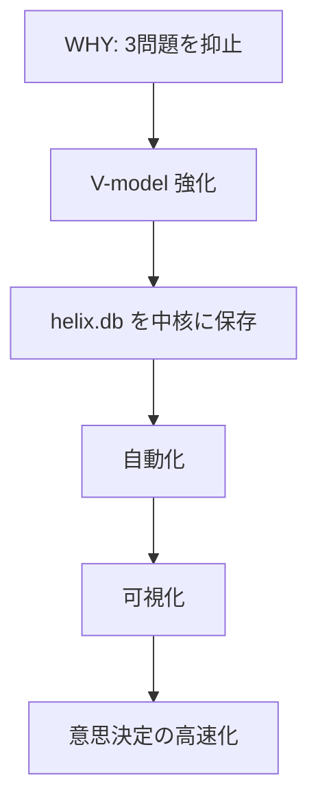
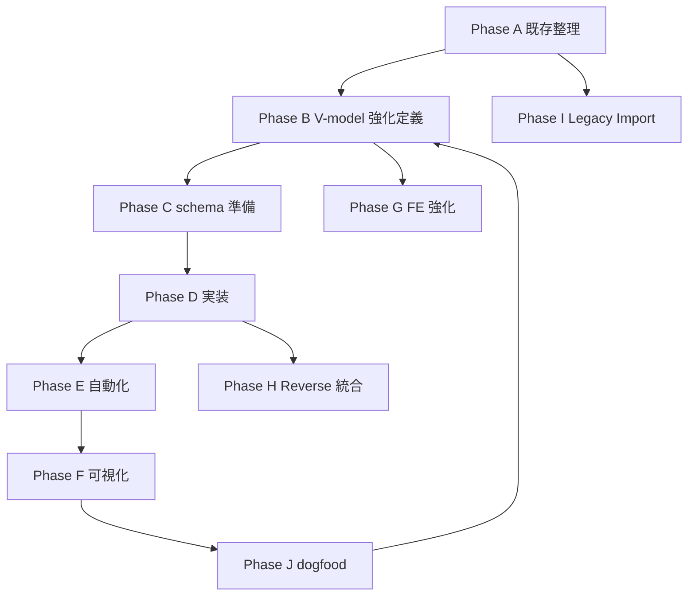

# L2 MASTER.md
本書は HELIX V2 における L2 全体設計の正本である。L1 要件を L2 の工程構造へ接続し、V-model 強化部分を phase / drive / layer / pair の単位で固定する。

## 版情報
| 項目 | 内容 |
|---|---|
| 文書種別 | L2 全体設計 正本 |
| 対象 | HELIX V2 構造改革の V-model 強化部分 |
| 作成日 | 2026-05-15 |
| 状態 | frozen |
| gate_status | G2_approved |
| frozen_at | 2026-05-16 |
| 凍結根拠 | L2 §12 known contradictions (M-01〜M-08) + cross-drive-integrity-check (CI-001〜CI-008) 全 16 件 resolved。pmo-sonnet / Codex tl-advisor 並列 review APPROVE。 |
| 参照正本 | CONCEPT / L1-REQUIREMENTS / v2-gate-overlay / vmodel-semantics spine + 4 draft |

## §0 スコープと前提
本書は L1 と L3 の中継に当たる L2 正本であり、V-model 強化の設計判断をここで固定する。DB schema の詳細、hook の内部実装、可視化 UI の実装手順は扱わず、L2 では概要と接続条件のみを記す。

| 参照正本 | 役割 | 根拠位置 |
|---|---|---|
| `docs/v2/CONCEPT.md` | V2 の価値連鎖と 2 Base 軸 | §1-§4 |
| `docs/v2/L1-REQUIREMENTS.md` | 要件・AC・FR の正本 | §3, §5, §9-§12 |
| `docs/v2/v2-gate-overlay.md` | V2 追加 gate 上書き | §1-§9 |
| `docs/v2/B-design/l2-master-sketch.md` | L2 草案の母体 | §0-§11 |
| `docs/v2/B-design/vmodel-semantics-spine.yaml` | V-model 契約の骨格 | schema / lifecycle / score |
| `docs/v2/B-design/vmodel-semantics-be-draft.yaml` | BE 変種 | planning- functional |
| `docs/v2/B-design/vmodel-semantics-fe-draft.yaml` | FE 変種 | planning- functional |
| `docs/v2/B-design/vmodel-semantics-db-draft.yaml` | DB 変種 | planning- functional |
| `docs/v2/B-design/vmodel-semantics-fullstack-draft.yaml` | Fullstack 変種 | planning- functional |

| 未扱い領域 | L2 の扱い | 理由 |
|---|---|---|
| DB schema 詳細 | 概要参照のみ | Phase C で詳細設計に委譲 |
| hook 実装詳細 | 概要参照のみ | Phase E で自動化設計に委譲 |
| 可視化 UI 詳細 | 概要参照のみ | Phase F で目標状態のみ固定 |
| Event Sourcing / projector | ADR-018/019 で扱う | PLAN-084 で L1 確定、ADR-018 (db 分離 + Event Sourcing + projector 境界) / ADR-019 (HELIX 二重らせん命名原則) で L2 凍結 |
| 設計 doc Web 検索ガード | ADR-021 で扱う | PLAN-087 で L1〜L4 確定、ADR-021 で L2 凍結 (PreToolUse hook fail-close + WebSearch 3 query 必須) |
| TodoWrite × agent slot framework | ADR-022 で扱う | PLAN-088 で L1〜L4 確定、ADR-022 で L2 凍結 (todo_entries v34 table + agent_slots schema) |
| gate fail-close 段階導入 | ADR-023 で扱う | PLAN-089 で L1〜L4 確定、ADR-023 で L2 凍結 (advisory → fail-close 段階遷移) |
| continueOnBlock + active guidance loop | ADR-024 で扱う | PLAN-090 で L1〜L4 確定、ADR-024 で L2 凍結 (Claude Code 2.1.139 新仕様採用) |
| V5 framework 19 要素 3 層 | ADR-025〜032 で扱う | PLAN-091〜099 で L1〜L4 確定、ADR-025〜032 で L2 凍結 (Layer A→B→C 依存順、CONCEPT §10 参照) |
| ADR Decision Graph (Phase 4 P0) | ADR-033 で扱う | PLAN-101 で L1〜L4 (Phase 4 同時実装)、ADR-033 で L2 凍結予定 (adr_decision_graph table + `helix adr graph` CLI、FR-V5-22) |
| V2 doc retrofit (Phase 4 後追い整合) | PLAN-100 で扱う | 既存 99 PLAN + V2 doc 5 件を V5 framework 整合に retrofit (Phase 1 ADR snapshot + Phase 2-4 全 frontmatter + Phase 5 V2 doc 改訂) |

| 用語 | 定義 | 備考 |
|---|---|---|
| `pair` | design / test / pair を 1 単位で固定する結合 | 横軸 review の最小単位 |
| `pair_status` | pending / design_only / test_only / paired / waived / failed | 後退禁止 |
| `functional_freeze` | functional と unit の同時凍結を要求するサブゲート | G3 の内側で評価 |
| `origin_mode` | forward / reverse / scrum | spine 正本採用 |
| `evidence_status` | observed / inferred / confirmed | Reverse / Scrum 連携の監査軸 |
| `waived_reason` | pair_status を waived に遷移させる際に必須な根拠記述 | 再審時の参照用 |
| `preserved` | drive 切替時に前 drive の成果物を引き継ぐ判定 | 証跡保全継続 |
| `waived` | drive 切替時に前 drive 固有の pair を免除する判定 | waived_reason 必須 |
| `failed` | drive 切替時点で failed だった pair の状態を引き継ぐ | 遡及修正禁止 (append-only) |

- 読者対象は G1 通過後に G2 凍結判定を行う TL / PM と、Phase C 以降の実装担当である。
- 本書は L1 の要件を L2 の phase 構造に落とし、L3 以降の詳細設計へ渡す中継契約として扱う。
- L2 で決めるのは pair の結び方、drive ごとの variant、遷移条件、freeze 条件、Reverse / Scrum 接続点である。

## §1 V2 アーキテクチャ全景
V2 は Why → How → Where → 自動化 → 可視化 の流れで構成する。V-model 強化が設計と検証の対応を固定し、helix.db はその証跡を保存し、自動化は記録と検出を省力化し、可視化は全体像を即座に把握できるようにする。

| Base 軸 | 役割 | L2 で固定する内容 |
|---|---|---|
| V-model 強化 | 設計 ↔ 検証の pair を固定 | 5 design layer × 5 test layer の結合、pair_status、freeze 条件 |
| 自動化 | 記録と検出を自動で回す | hook / gate / sync の接続点、手動記録の削減 |

| 時間軸 | フェーズ | 目的 | L2 での扱い |
|---|---|---|---|
| Phase A | 既存整理 | 監査資産の回収 | 入力前提として参照 |
| Phase B | V-model 強化定義 | pair 契約の固定 | 本書の主題 |
| Phase C | schema 準備 | DB の共通保存先 | 概要のみ |
| Phase D | V-model 実装 | 構造化された実装 | L3 以降へ接続 |
| Phase E | 自動化 | 記録と検出の自動化 | 概要のみ |
| Phase F | 可視化 | 全体像の表示 | 目標状態のみ |
| Phase G | FE 強化 | FE 弱点補強 | 派生 |
| Phase H | Reverse 統合 | 既存資産からの書き戻し | 派生 |
| Phase I | Legacy Import | 旧資産の取り込み | 派生 |
| Phase J | dogfood | 実運用での安定化 | G2/G3 後の最終検証、B へフィードバック |

```mermaid
flowchart LR
    A[Phase A 既存整理] --> B[Phase B V-model 定義]
    B --> C[Phase C schema 準備]
    C --> D[Phase D 実装]
    D --> E[Phase E 自動化]
    E --> F[Phase F 可視化]
    F --> G[Phase G FE 強化]
    G --> H[Phase H Reverse 統合]
    H --> I[Phase I Legacy Import]
    I --> J[Phase J dogfood]

```

L2 の役割は、時間軸の各 Phase を横軸の design/test で貫き、drive ごとの差分を明示したまま、同一の gate 規約へ接続することである。

## §2 Phase 構成と依存関係
主系列は Phase A → B → C → D → E → F で進み、G/H/I は派生として接続される。L2 では各 Phase の入出力と、どの Phase がどの後続 Phase を前提にするかを明示する。

| Phase | 入力 | 出力 | 依存 |
|---|---|---|---|
| A | 監査資産 / 既存 PLANS | 整理された参照群 | G0.5/G1 通過済み要件 |
| B | L1 要件 / spine / draft | pair 契約 / drive variant | Phase A の整理結果 |
| C | L2 の schema 仕様 | 共通保存先の準備 | B で固定した契約 |
| D | pair 契約 / schema 準備 | V-model 実装 | C 完了 |
| E | 実装 / hook 設計 | 自動記録と自動検出 | D 完了 |
| F | 実装 / 集計データ | 全容表示 | E 完了 |
| G | FE 弱点の整理 | FE 強化入力 | B と L1 |
| H | Reverse 証跡 | Forward への書き戻し | B と G2/G3 |
| I | 旧資産 / carry | Legacy Import 群 | A の整理結果 |
| J | 運用結果 | dogfood 判定 | D/E/F の成果 |

| Phase | L2 での明示範囲 | 詳細委譲先 |
|---|---|---|
| Phase C | schema 準備まで | L3 でテーブル定義と migration |
| Phase E | 自動化の接続条件まで | hook / CLI の内部実装 |
| Phase F | 目標状態まで | dashboard UI 実装 |
| Phase G | FE 弱点の補強方針 | 実装詳細 |
| Phase H | Reverse の接続点 | R0-R4 の証跡管理 |
| Phase I | Legacy Import の受け口 | 旧資産マッピング |

- Phase A: 既存整理 を担当し、後続 Phase へそのまま渡せる粒度で止める。
- Phase B: V-model 強化定義 を担当し、後続 Phase へそのまま渡せる粒度で止める。
- Phase C: schema 準備 を担当し、後続 Phase へそのまま渡せる粒度で止める。
- Phase D: 実装 を担当し、後続 Phase へそのまま渡せる粒度で止める。
- Phase E: 自動化 を担当し、後続 Phase へそのまま渡せる粒度で止める。
- Phase F: 可視化 を担当し、後続 Phase へそのまま渡せる粒度で止める。
- Phase G: FE 強化 を担当し、後続 Phase へそのまま渡せる粒度で止める。
- Phase H: Reverse 統合 を担当し、後続 Phase へそのまま渡せる粒度で止める。
- Phase I: Legacy Import を担当し、後続 Phase へそのまま渡せる粒度で止める。
- Phase J: dogfood を担当し、後続 Phase へそのまま渡せる粒度で止める。

Phase C は DB 詳細を確定する場所ではなく、schema 準備の責務を持つ。詳細の SQL、index、migration 手順は L3 へ移す。

### §2.5 Phase 期間目安

| Phase | size=S 目安 | size=M 目安 | size=L 目安 | 主成果物 |
|---|---|---|---|---|
| Phase A (audit) | 0.5 sprint | 1 sprint | 1-2 sprint | docs/v2/A-audit/ 4 doc |
| Phase B (design draft) | 0.5 sprint | 1-2 sprint | 2-3 sprint | spine + drafts + L2 MASTER |
| Phase C (db extend) | 0.5 sprint | 1 sprint | 1-2 sprint | helix-db v22/v23 migration |
| Phase D (hook impl) | 0.5 sprint | 1 sprint | 1-2 sprint | PostToolUse hook + 5 層介入 |
| Phase E (UI) | 0.5 sprint | 1 sprint | 1-2 sprint | dashboard / monitor |
| Phase F (verification) | 0.5 sprint | 1 sprint | 1-2 sprint | bats + pytest matrix |
| Phase G (FE axis) | 0.5 sprint | 1 sprint | 1-2 sprint | FE 5 axis detector |
| Phase H (agent defer) | - | - | - | Phase G 以降の拡張候補 |
| Phase J (dogfood) | 0.5 sprint | 0.5-1 sprint | 1 sprint | G2/G3 後の最終検証 |

- 上記は L2 レベルの目安であり、具体的な week 数 / sprint 内訳は L3 工程表で展開する。
- 1 sprint = 1-2 week を標準とし、project 単位で変動する。
- size 判定は L1 G1 通過時に確定する (`helix size` 出力)。

## §3 5 design × 5 test layer 成果物リスト
この章は spine.yaml と 4 つの drive draft から抽出した成果物カタログである。共通骨格、drive 別 variant、baseline policy、promotion 規則を分けて記述し、最後に drive/layer ごとの抽出ログを付ける。

### §3.1 共通骨格表
| design layer | test layer | score_weight | horizontal_rule | 説明 |
|---|---|---|---|---|
| `planning` | `operational` | 0.10 | `conditional` | G0.5/G11 の運用文脈。 |
| `requirement` | `acceptance` | 0.20 | `required` | 要件 ↔ 受入。 |
| `architecture` | `system_integration` | 0.25 | `required` | G2 の中核。 |
| `detailed` | `integration` | 0.20 | `required` | G3 の中核。 |
| `functional` | `unit` | 0.25 | `required` | G4/G3.functional_freeze の中核。 |

出典: `docs/v2/B-design/vmodel-semantics-spine.yaml` docs/v2/B-design/vmodel-semantics-spine.yaml:34-39

### §3.2 drive 別 variant 表
| layer | be | fe | db | fullstack | agent |
|---|---|---|---|---|---|
| `planning` | `plan_goal` / `drive_decision` / `scope_boundary` | `information_architecture` / `wireframe_lo_fi` / `drive_decision` | `data_governance` / `data_lineage_goal` / `scope_boundary` | `api_capability_map` / `be_phase_a_outline` / `wire_outline` | 未定義 (将来拡張) |
| `requirement` | `l1_requirements` / `acceptance_criteria` / `api_capability_map` | `user_journey` / `screen_inventory` / `state_events` | `data_model_requirements` / `referential_integrity_requirements` / `cardinality_constraints` | `api_capability_map` / `domain_boundary` / `wireframes` | 未定義 (将来拡張) |
| `architecture` | `architecture_decision_record` / `api_overview` / `sequence_diagram` | `mock_html` / `design_tokens` / `state-events.md` | `er_diagram` / `schema_version_plan` / `migration_strategy` | `service_boundary` / `sequence_diagram` / `mock_html` | 未定義 (将来拡張) |
| `detailed` | `api_contract` / `service_flow` / `error_contract` | `component_props` / `props_contract` / `a11y_requirement` | `table_schema` / `column_definitions` / `index_strategy` | `api_contract` / `service_flow` / `error_contract` | 未定義 (将来拡張) |
| `functional` | `function_contract` / `code_symbol_map` / `edge_case_matrix` | `component_impl` / `snapshot_fixture` / `visual_baseline` | `stored_procedure_spec` / `view_definition` / `trigger_spec` | `function_contract` / `api_handler_map` / `component_impl_map` | 未定義 (将来拡張) |

agent drive は spine に未定義であり、L2 G2 凍結スコープ外として Phase H 以降に defer する。本書時点では 4 drive (be / fe / db / fullstack) を G2 凍結対象とし、agent は将来拡張候補としてのみ扱う。

### §3.3 baseline_policy 表
| test layer | be | fe | db | fullstack |
|---|---|---|---|---|
| `planning` | `manual_only` | `manual_only` | `regression_corpus` | `manual_only` |
| `requirement` | `golden_fixture` | `golden_fixture` | `golden_fixture` | `golden_fixture` |
| `architecture` | `regression_corpus` | `regression_corpus` | `regression_corpus` | `regression_corpus` |
| `detailed` | `regression_corpus` | `regression_corpus` | `regression_corpus` | `regression_corpus` |
| `functional` | `snapshot` | `snapshot` | `golden_fixture` | `snapshot` |

出典: `docs/v2/B-design/vmodel-semantics-spine.yaml` の allowed_values と `docs/v2/B-design/vmodel-semantics-be-draft.yaml` / `docs/v2/B-design/vmodel-semantics-fe-draft.yaml` / `docs/v2/B-design/vmodel-semantics-db-draft.yaml` / `docs/v2/B-design/vmodel-semantics-fullstack-draft.yaml` の test.baseline_policy

#### family 分類
| baseline_policy | family | 性質 |
|---|---|---|
| `snapshot` | `snapshot_like` | 時点 snapshot を期待値とする |
| `regression_corpus` | `snapshot_like` | 蓄積された corpus を履歴比較する |
| `golden_fixture` | `fixture_like` | 事前定義された期待値と比較する |
| `manual_only` | `fixture_like` | 事前定義 / 人手確認に依存する |

出典: `docs/v2/B-design/vmodel-semantics-spine.yaml` の `baseline_policy_family`

### §3.4 promotion 定義
| drive | promotion kind | append_only | g2 evidence preserved | 備考 |
|---|---|---|---|---|
| be | なし | — | — | 通常 BE では promotion を持たない |
| fe | `mock_to_implementation` | true | true | mock を保持したまま implementation を追記 |
| db | なし | — | — | DB は基本的に promotion なし |
| fullstack | `mock_to_implementation` | true | true | BE / FE / contract の証跡を残したまま遷移 |

`mock_to_implementation` は row 更新ではなく append-only で扱う。G2 で凍結した mock 証跡を消さず、後続の component_impl を別の証跡として追加する。

### §3.5 drive 別抽出ログ

#### §3.5.be `be` drive
drive の要約: Backend/API/logic first drive.
source refs: `docs/v2/A-audit/accumulated-knowledge.md` / `docs/v2/A-audit/audit-summary.md` / `docs/v2/A-audit/capability-inventory.md` / `docs/v2/A-audit/capability-matrix.md` / `docs/v2/A-audit/cicd-audit.md` / `docs/v2/A-audit/cli-ux-audit.md` / `docs/v2/A-audit/db-schema-current.md` / `docs/v2/A-audit/dependencies-audit.md` / `docs/v2/A-audit/deprecated-aggregation.md` / `docs/v2/A-audit/docs-integrity-audit.md` / `docs/v2/A-audit/fe-weakness-analysis.md` / `docs/v2/A-audit/folder-structure-audit.md` / `docs/v2/A-audit/hooks-commands-subagents.md` / `docs/v2/A-audit/legacy-plans-carry.md` / `docs/v2/A-audit/memory-feedback-drift.md` / `docs/v2/A-audit/off-plan-implementations.md` / `docs/v2/A-audit/perf-cost-audit.md` / `docs/v2/A-audit/reverse-scrum-audit.md` / `docs/v2/A-audit/security-audit.md` / `docs/v2/A-audit/skill-quality-audit.md` / `docs/v2/A-audit/test-coverage-audit.md`

### BE / `planning`
根拠範囲: `docs/v2/B-design/vmodel-semantics-be-draft.yaml` docs/v2/B-design/vmodel-semantics-be-draft.yaml:27-87

#### design artifacts
| # | artifact | 用法 | source |
|---|---|---|---|
| 1 | `plan_goal` | design | docs/v2/B-design/vmodel-semantics-be-draft.yaml:27-87 |
| 2 | `drive_decision` | design | docs/v2/B-design/vmodel-semantics-be-draft.yaml:27-87 |
| 3 | `scope_boundary` | design | docs/v2/B-design/vmodel-semantics-be-draft.yaml:27-87 |
| 4 | `phase_strategy` | design | docs/v2/B-design/vmodel-semantics-be-draft.yaml:27-87 |

#### test artifacts
| # | artifact | 用法 | source |
|---|---|---|---|
| 1 | `operational_test_outline` | test | docs/v2/B-design/vmodel-semantics-be-draft.yaml:27-87 |
| 2 | `runbook_acceptance` | test | docs/v2/B-design/vmodel-semantics-be-draft.yaml:27-87 |
| 3 | `learning_metric_plan` | test | docs/v2/B-design/vmodel-semantics-be-draft.yaml:27-87 |

#### pair metadata
| 項目 | 値 | source |
|---|---|---|
| `horizontal_rule` | `conditional` | docs/v2/B-design/vmodel-semantics-be-draft.yaml:27-87 |
| `vertical_from` | `null` | docs/v2/B-design/vmodel-semantics-be-draft.yaml:27-87 |
| `vertical_to` | `requirement` | docs/v2/B-design/vmodel-semantics-be-draft.yaml:27-87 |
| `score_weight` | `0.1` | docs/v2/B-design/vmodel-semantics-be-draft.yaml:27-87 |
| `requires_functional_freeze` | `false` | docs/v2/B-design/vmodel-semantics-be-draft.yaml:27-87 |

#### operational fields
| 項目 | 値 |
|---|---|
| `review_unit` | `plan` |
| `review_axes` | `vertical` / `horizontal` |
| `owner_role` (design) | `tl` |
| `owner_role` (test) | `qa` |
| `test_level` | `operational` |
| `baseline_policy` | `manual_only` |
| `detectors` (design) | `axis-08-plan-integrity` / `axis-14-orchestration-integrity` |
| `detectors` (test) | `axis-11-regression` / `axis-14-orchestration-integrity` |
| `expected_skills` (design) | `design-doc` / `estimation` |
| `expected_skills` (test) | `verification` / `observability-sre` |
| `command_hints` (design) | `helix gate G0.5 --pair-check planning --drive be` / `helix gate G11 --pair-check planning --drive be` |
| `command_hints` (test) | `helix gate G11 --pair-check planning --drive be` |

#### source refs
| # | source ref |
|---|---|
| 1 | `docs/v2/A-audit/audit-summary.md` |
| 2 | `docs/v2/A-audit/legacy-plans-carry.md` |
| 3 | `docs/v2/A-audit/docs-integrity-audit.md` |
| 4 | `docs/v2/A-audit/test-coverage-audit.md` |
| 5 | `docs/v2/A-audit/perf-cost-audit.md` |
| 6 | `docs/v2/A-audit/cicd-audit.md` |

#### examples
| # | example | path / kind |
|---|---|---|
| 1 | `example-plan-goal` | `docs/v2/L1-REQUIREMENTS.md` |

#### note
- `planning` は `design` / `test` / `pair` を同一スプリントの正規成果物として扱う。
- `planning` の pair は `conditional` ルールを前提に、横軸 review を行う。
- `planning` の test は `manual_only` を基準に評価する。
- `planning` は functional_freeze の直接対象ではない。

### BE / `requirement`
根拠範囲: `docs/v2/B-design/vmodel-semantics-be-draft.yaml` docs/v2/B-design/vmodel-semantics-be-draft.yaml:88-146

#### design artifacts
| # | artifact | 用法 | source |
|---|---|---|---|
| 1 | `l1_requirements` | design | docs/v2/B-design/vmodel-semantics-be-draft.yaml:88-146 |
| 2 | `acceptance_criteria` | design | docs/v2/B-design/vmodel-semantics-be-draft.yaml:88-146 |
| 3 | `api_capability_map` | design | docs/v2/B-design/vmodel-semantics-be-draft.yaml:88-146 |
| 4 | `risk_constraints` | design | docs/v2/B-design/vmodel-semantics-be-draft.yaml:88-146 |

#### test artifacts
| # | artifact | 用法 | source |
|---|---|---|---|
| 1 | `acceptance_test_design` | test | docs/v2/B-design/vmodel-semantics-be-draft.yaml:88-146 |
| 2 | `user_visible_scenarios` | test | docs/v2/B-design/vmodel-semantics-be-draft.yaml:88-146 |
| 3 | `api_acceptance_matrix` | test | docs/v2/B-design/vmodel-semantics-be-draft.yaml:88-146 |

#### pair metadata
| 項目 | 値 | source |
|---|---|---|
| `horizontal_rule` | `required` | docs/v2/B-design/vmodel-semantics-be-draft.yaml:88-146 |
| `vertical_from` | `planning` | docs/v2/B-design/vmodel-semantics-be-draft.yaml:88-146 |
| `vertical_to` | `architecture` | docs/v2/B-design/vmodel-semantics-be-draft.yaml:88-146 |
| `score_weight` | `0.2` | docs/v2/B-design/vmodel-semantics-be-draft.yaml:88-146 |
| `requires_functional_freeze` | `false` | docs/v2/B-design/vmodel-semantics-be-draft.yaml:88-146 |

#### operational fields
| 項目 | 値 |
|---|---|
| `review_unit` | `capability` |
| `review_axes` | `vertical` / `horizontal` |
| `owner_role` (design) | `tl` |
| `owner_role` (test) | `qa` |
| `test_level` | `acceptance` |
| `baseline_policy` | `golden_fixture` |
| `detectors` (design) | `axis-07-contract-drift` / `axis-08-plan-integrity` / `axis-12-connection-deficiency` |
| `detectors` (test) | `axis-09-test-quality` / `axis-11-regression` |
| `expected_skills` (design) | `requirements-handover` / `api` |
| `expected_skills` (test) | `testing` / `quality-lv5` |
| `command_hints` (design) | `helix gate G1 --pair-check requirement --drive be` |
| `command_hints` (test) | `helix gate G1 --pair-check requirement --drive be` |

#### source refs
| # | source ref |
|---|---|
| 1 | `docs/v2/A-audit/audit-summary.md` |
| 2 | `docs/v2/A-audit/capability-matrix.md` |
| 3 | `docs/v2/A-audit/security-audit.md` |
| 4 | `docs/v2/A-audit/test-coverage-audit.md` |
| 5 | `docs/v2/A-audit/docs-integrity-audit.md` |

#### examples
| # | example | path / kind |
|---|---|---|
| 1 | `example-acceptance-criteria` | `docs/v2/L1-REQUIREMENTS.md` |

#### note
- `requirement` は `design` / `test` / `pair` を同一スプリントの正規成果物として扱う。
- `requirement` の pair は `required` ルールを前提に、横軸 review を行う。
- `requirement` の test は `golden_fixture` を基準に評価する。
- `requirement` は functional_freeze の直接対象ではない。

### BE / `architecture`
根拠範囲: `docs/v2/B-design/vmodel-semantics-be-draft.yaml` docs/v2/B-design/vmodel-semantics-be-draft.yaml:147-206

#### design artifacts
| # | artifact | 用法 | source |
|---|---|---|---|
| 1 | `architecture_decision_record` | design | docs/v2/B-design/vmodel-semantics-be-draft.yaml:147-206 |
| 2 | `api_overview` | design | docs/v2/B-design/vmodel-semantics-be-draft.yaml:147-206 |
| 3 | `sequence_diagram` | design | docs/v2/B-design/vmodel-semantics-be-draft.yaml:147-206 |
| 4 | `component_diagram` | design | docs/v2/B-design/vmodel-semantics-be-draft.yaml:147-206 |

#### test artifacts
| # | artifact | 用法 | source |
|---|---|---|---|
| 1 | `integration_scenarios` | test | docs/v2/B-design/vmodel-semantics-be-draft.yaml:147-206 |
| 2 | `system_test_plan` | test | docs/v2/B-design/vmodel-semantics-be-draft.yaml:147-206 |
| 3 | `contract_test_design` | test | docs/v2/B-design/vmodel-semantics-be-draft.yaml:147-206 |

#### pair metadata
| 項目 | 値 | source |
|---|---|---|
| `horizontal_rule` | `required` | docs/v2/B-design/vmodel-semantics-be-draft.yaml:147-206 |
| `vertical_from` | `requirement` | docs/v2/B-design/vmodel-semantics-be-draft.yaml:147-206 |
| `vertical_to` | `detailed` | docs/v2/B-design/vmodel-semantics-be-draft.yaml:147-206 |
| `score_weight` | `0.25` | docs/v2/B-design/vmodel-semantics-be-draft.yaml:147-206 |
| `requires_functional_freeze` | `false` | docs/v2/B-design/vmodel-semantics-be-draft.yaml:147-206 |

#### operational fields
| 項目 | 値 |
|---|---|
| `review_unit` | `api_subsystem` |
| `review_axes` | `vertical` / `horizontal` |
| `owner_role` (design) | `tl` |
| `owner_role` (test) | `qa` |
| `test_level` | `system_integration` |
| `baseline_policy` | `regression_corpus` |
| `detectors` (design) | `axis-02-coverage-erosion` / `axis-07-contract-drift` / `axis-10-relation-graph` |
| `detectors` (test) | `axis-09-test-quality` / `axis-11-regression` / `axis-12-connection-deficiency` |
| `expected_skills` (design) | `design-doc` / `api-contract` |
| `expected_skills` (test) | `testing` / `verification` |
| `command_hints` (design) | `helix gate G2 --pair-check architecture --drive be` |
| `command_hints` (test) | `helix gate G2 --pair-check architecture --drive be` |

#### source refs
| # | source ref |
|---|---|
| 1 | `docs/v2/A-audit/db-schema-current.md` |
| 2 | `docs/v2/A-audit/hooks-commands-subagents.md` |
| 3 | `docs/v2/A-audit/capability-inventory.md` |
| 4 | `docs/v2/A-audit/test-coverage-audit.md` |
| 5 | `docs/v2/A-audit/cicd-audit.md` |

#### examples
| # | example | path / kind |
|---|---|---|
| 1 | `example-api-overview` | `docs/example/api-overview.md` |

#### note
- `architecture` は `design` / `test` / `pair` を同一スプリントの正規成果物として扱う。
- `architecture` の pair は `required` ルールを前提に、横軸 review を行う。
- `architecture` の test は `regression_corpus` を基準に評価する。
- `architecture` は functional_freeze の直接対象ではない。

### BE / `detailed`
根拠範囲: `docs/v2/B-design/vmodel-semantics-be-draft.yaml` docs/v2/B-design/vmodel-semantics-be-draft.yaml:207-266

#### design artifacts
| # | artifact | 用法 | source |
|---|---|---|---|
| 1 | `api_contract` | design | docs/v2/B-design/vmodel-semantics-be-draft.yaml:207-266 |
| 2 | `service_flow` | design | docs/v2/B-design/vmodel-semantics-be-draft.yaml:207-266 |
| 3 | `error_contract` | design | docs/v2/B-design/vmodel-semantics-be-draft.yaml:207-266 |
| 4 | `persistence_boundary` | design | docs/v2/B-design/vmodel-semantics-be-draft.yaml:207-266 |

#### test artifacts
| # | artifact | 用法 | source |
|---|---|---|---|
| 1 | `integration_test_design` | test | docs/v2/B-design/vmodel-semantics-be-draft.yaml:207-266 |
| 2 | `contract_fixture_set` | test | docs/v2/B-design/vmodel-semantics-be-draft.yaml:207-266 |
| 3 | `error_path_test_matrix` | test | docs/v2/B-design/vmodel-semantics-be-draft.yaml:207-266 |

#### pair metadata
| 項目 | 値 | source |
|---|---|---|
| `horizontal_rule` | `required` | docs/v2/B-design/vmodel-semantics-be-draft.yaml:207-266 |
| `vertical_from` | `architecture` | docs/v2/B-design/vmodel-semantics-be-draft.yaml:207-266 |
| `vertical_to` | `functional` | docs/v2/B-design/vmodel-semantics-be-draft.yaml:207-266 |
| `score_weight` | `0.2` | docs/v2/B-design/vmodel-semantics-be-draft.yaml:207-266 |
| `requires_functional_freeze` | `false` | docs/v2/B-design/vmodel-semantics-be-draft.yaml:207-266 |

#### operational fields
| 項目 | 値 |
|---|---|
| `review_unit` | `api_endpoint` |
| `review_axes` | `vertical` / `horizontal` |
| `owner_role` (design) | `tl` |
| `owner_role` (test) | `qa` |
| `test_level` | `integration` |
| `baseline_policy` | `regression_corpus` |
| `detectors` (design) | `axis-06-naming-confusion` / `axis-07-contract-drift` / `axis-12-connection-deficiency` |
| `detectors` (test) | `axis-02-coverage-erosion` / `axis-09-test-quality` / `axis-11-regression` |
| `expected_skills` (design) | `api-contract` / `db` |
| `expected_skills` (test) | `testing` / `api-contract` |
| `command_hints` (design) | `helix gate G3 --pair-check detailed --drive be` |
| `command_hints` (test) | `helix gate G3 --pair-check detailed --drive be` |

#### source refs
| # | source ref |
|---|---|
| 1 | `docs/v2/A-audit/db-schema-current.md` |
| 2 | `docs/v2/A-audit/dependencies-audit.md` |
| 3 | `docs/v2/A-audit/security-audit.md` |
| 4 | `docs/v2/A-audit/test-coverage-audit.md` |
| 5 | `docs/v2/A-audit/perf-cost-audit.md` |

#### examples
| # | example | path / kind |
|---|---|---|
| 1 | `example-api-contract` | `docs/features/example/D-API/api-contract.yaml` |

#### note
- `detailed` は `design` / `test` / `pair` を同一スプリントの正規成果物として扱う。
- `detailed` の pair は `required` ルールを前提に、横軸 review を行う。
- `detailed` の test は `regression_corpus` を基準に評価する。
- `detailed` は functional_freeze の直接対象ではない。

### BE / `functional`
根拠範囲: `docs/v2/B-design/vmodel-semantics-be-draft.yaml` docs/v2/B-design/vmodel-semantics-be-draft.yaml:267-329

#### design artifacts
| # | artifact | 用法 | source |
|---|---|---|---|
| 1 | `function_contract` | design | docs/v2/B-design/vmodel-semantics-be-draft.yaml:267-329 |
| 2 | `code_symbol_map` | design | docs/v2/B-design/vmodel-semantics-be-draft.yaml:267-329 |
| 3 | `edge_case_matrix` | design | docs/v2/B-design/vmodel-semantics-be-draft.yaml:267-329 |
| 4 | `code_review_plan` | design | docs/v2/B-design/vmodel-semantics-be-draft.yaml:267-329 |

#### test artifacts
| # | artifact | 用法 | source |
|---|---|---|---|
| 1 | `unit_test_design` | test | docs/v2/B-design/vmodel-semantics-be-draft.yaml:267-329 |
| 2 | `baseline_result` | test | docs/v2/B-design/vmodel-semantics-be-draft.yaml:267-329 |
| 3 | `coverage_target` | test | docs/v2/B-design/vmodel-semantics-be-draft.yaml:267-329 |
| 4 | `regression_guard` | test | docs/v2/B-design/vmodel-semantics-be-draft.yaml:267-329 |

#### pair metadata
| 項目 | 値 | source |
|---|---|---|
| `horizontal_rule` | `required` | docs/v2/B-design/vmodel-semantics-be-draft.yaml:267-329 |
| `vertical_from` | `detailed` | docs/v2/B-design/vmodel-semantics-be-draft.yaml:267-329 |
| `vertical_to` | `null` | docs/v2/B-design/vmodel-semantics-be-draft.yaml:267-329 |
| `score_weight` | `0.25` | docs/v2/B-design/vmodel-semantics-be-draft.yaml:267-329 |
| `requires_functional_freeze` | `false` | docs/v2/B-design/vmodel-semantics-be-draft.yaml:267-329 |

#### operational fields
| 項目 | 値 |
|---|---|
| `review_unit` | `function` |
| `review_axes` | `vertical` / `horizontal` |
| `owner_role` (design) | `tl` |
| `owner_role` (test) | `qa` |
| `test_level` | `unit` |
| `baseline_policy` | `snapshot` |
| `detectors` (design) | `axis-01-dead-code-drift` / `axis-02-coverage-erosion` / `axis-09-refactor-opportunity` |
| `detectors` (test) | `axis-02-coverage-erosion` / `axis-09-test-quality` / `axis-11-regression` |
| `expected_skills` (design) | `coding` / `code-review` |
| `expected_skills` (test) | `testing` / `quality-lv5` |
| `command_hints` (design) | `helix gate G4 --pair-check functional --drive be` / `helix review --uncommitted` |
| `command_hints` (test) | `helix gate G4 --pair-check functional --drive be` |

#### source refs
| # | source ref |
|---|---|
| 1 | `docs/v2/A-audit/test-coverage-audit.md` |
| 2 | `docs/v2/A-audit/capability-inventory.md` |
| 3 | `docs/v2/A-audit/security-audit.md` |
| 4 | `docs/v2/A-audit/test-coverage-audit.md` |
| 5 | `docs/v2/A-audit/perf-cost-audit.md` |

#### examples
| # | example | path / kind |
|---|---|---|
| 1 | `example-code-index` | `cli/lib/tests/test_code_catalog.py` |

#### note
- `functional` は `design` / `test` / `pair` を同一スプリントの正規成果物として扱う。
- `functional` の pair は `required` ルールを前提に、横軸 review を行う。
- `functional` の test は `snapshot` を基準に評価する。
- `size=L × drive=be` は §4 の規模依存例外を参照
- `functional` は functional_freeze の直接対象ではない。

#### §3.5.fe `fe` drive
drive の要約: Frontend/mock-driven first drive.
source refs: `docs/v2/A-audit/audit-summary.md` / `docs/v2/A-audit/fe-weakness-analysis.md` / `docs/v2/L1-REQUIREMENTS.md` / `skills/agent-skills/mock-driven-development/SKILL.md` / `skills/SKILL_MAP.md`

### FE / `planning`
根拠範囲: `docs/v2/B-design/vmodel-semantics-fe-draft.yaml` docs/v2/B-design/vmodel-semantics-fe-draft.yaml:38-94

#### design artifacts
| # | artifact | 用法 | source |
|---|---|---|---|
| 1 | `information_architecture` | design | docs/v2/B-design/vmodel-semantics-fe-draft.yaml:38-94 |
| 2 | `wireframe_lo_fi` | design | docs/v2/B-design/vmodel-semantics-fe-draft.yaml:38-94 |
| 3 | `drive_decision` | design | docs/v2/B-design/vmodel-semantics-fe-draft.yaml:38-94 |
| 4 | `phase_strategy` | design | docs/v2/B-design/vmodel-semantics-fe-draft.yaml:38-94 |

#### test artifacts
| # | artifact | 用法 | source |
|---|---|---|---|
| 1 | `wire_review_checklist` | test | docs/v2/B-design/vmodel-semantics-fe-draft.yaml:38-94 |
| 2 | `mockup_handoff_record` | test | docs/v2/B-design/vmodel-semantics-fe-draft.yaml:38-94 |
| 3 | `pipeline_scorecard` | test | docs/v2/B-design/vmodel-semantics-fe-draft.yaml:38-94 |

#### pair metadata
| 項目 | 値 | source |
|---|---|---|
| `horizontal_rule` | `conditional` | docs/v2/B-design/vmodel-semantics-fe-draft.yaml:38-94 |
| `vertical_from` | `null` | docs/v2/B-design/vmodel-semantics-fe-draft.yaml:38-94 |
| `vertical_to` | `requirement` | docs/v2/B-design/vmodel-semantics-fe-draft.yaml:38-94 |
| `score_weight` | `0.1` | docs/v2/B-design/vmodel-semantics-fe-draft.yaml:38-94 |
| `requires_functional_freeze` | `true` | docs/v2/B-design/vmodel-semantics-fe-draft.yaml:38-94 |

#### operational fields
| 項目 | 値 |
|---|---|
| `review_unit` | `journey_map` |
| `review_axes` | `vertical` / `horizontal` |
| `owner_role` (design) | `tl` |
| `owner_role` (test) | `qa` |
| `test_level` | `operational` |
| `baseline_policy` | `manual_only` |
| `detectors` (design) | `axis-08-plan-integrity` / `axis-14-orchestration-integrity` / `axis-19-state-transition-drift` |
| `detectors` (test) | `axis-11-regression` / `axis-14-orchestration-integrity` / `axis-19-state-transition-drift` |
| `expected_skills` (design) | `design-doc` / `visual-design` / `mock-driven-development` |
| `expected_skills` (test) | `verification` / `testing` |
| `command_hints` (design) | `helix size --drive fe` / `helix gate G0.5 --pair-check planning --drive fe` |
| `command_hints` (test) | `helix gate G0.5 --pair-check planning --drive fe` |

#### source refs
| # | source ref |
|---|---|
| 1 | `docs/v2/A-audit/fe-weakness-analysis.md` |
| 2 | `docs/v2/A-audit/audit-summary.md` |
| 3 | `docs/v2/L1-REQUIREMENTS.md` |
| 4 | `docs/v2/A-audit/fe-weakness-analysis.md` |
| 5 | `docs/v2/A-audit/audit-summary.md` |

#### note
- `planning` は `design` / `test` / `pair` を同一スプリントの正規成果物として扱う。
- `planning` の pair は `conditional` ルールを前提に、横軸 review を行う。
- `planning` の test は `manual_only` を基準に評価する。
- `planning` は functional_freeze の影響を受ける。

### FE / `requirement`
根拠範囲: `docs/v2/B-design/vmodel-semantics-fe-draft.yaml` docs/v2/B-design/vmodel-semantics-fe-draft.yaml:95-151

#### design artifacts
| # | artifact | 用法 | source |
|---|---|---|---|
| 1 | `user_journey` | design | docs/v2/B-design/vmodel-semantics-fe-draft.yaml:95-151 |
| 2 | `screen_inventory` | design | docs/v2/B-design/vmodel-semantics-fe-draft.yaml:95-151 |
| 3 | `state_events` | design | docs/v2/B-design/vmodel-semantics-fe-draft.yaml:95-151 |
| 4 | `acceptance_criteria` | design | docs/v2/B-design/vmodel-semantics-fe-draft.yaml:95-151 |

#### test artifacts
| # | artifact | 用法 | source |
|---|---|---|---|
| 1 | `journey_acceptance_matrix` | test | docs/v2/B-design/vmodel-semantics-fe-draft.yaml:95-151 |
| 2 | `screen_inventory_checklist` | test | docs/v2/B-design/vmodel-semantics-fe-draft.yaml:95-151 |
| 3 | `state_event_acceptance_cases` | test | docs/v2/B-design/vmodel-semantics-fe-draft.yaml:95-151 |

#### pair metadata
| 項目 | 値 | source |
|---|---|---|
| `horizontal_rule` | `required` | docs/v2/B-design/vmodel-semantics-fe-draft.yaml:95-151 |
| `vertical_from` | `planning` | docs/v2/B-design/vmodel-semantics-fe-draft.yaml:95-151 |
| `vertical_to` | `architecture` | docs/v2/B-design/vmodel-semantics-fe-draft.yaml:95-151 |
| `score_weight` | `0.2` | docs/v2/B-design/vmodel-semantics-fe-draft.yaml:95-151 |
| `requires_functional_freeze` | `true` | docs/v2/B-design/vmodel-semantics-fe-draft.yaml:95-151 |

#### operational fields
| 項目 | 値 |
|---|---|
| `review_unit` | `screen_flow` |
| `review_axes` | `vertical` / `horizontal` |
| `owner_role` (design) | `tl` |
| `owner_role` (test) | `qa` |
| `test_level` | `acceptance` |
| `baseline_policy` | `golden_fixture` |
| `detectors` (design) | `axis-08-plan-integrity` / `axis-17-a11y-regression` / `axis-19-state-transition-drift` |
| `detectors` (test) | `axis-09-test-quality` / `axis-17-a11y-regression` / `axis-19-state-transition-drift` |
| `expected_skills` (design) | `requirements-handover` / `mock-driven-development` / `visual-design` |
| `expected_skills` (test) | `testing` / `quality-lv5` |
| `command_hints` (design) | `helix gate G1 --pair-check requirement --drive fe` / `helix fe state-events-validate --stage requirement` |
| `command_hints` (test) | `helix gate G1 --pair-check requirement --drive fe` / `helix fe playwright-run --stage requirement` |

#### source refs
| # | source ref |
|---|---|
| 1 | `docs/v2/A-audit/fe-weakness-analysis.md` |
| 2 | `docs/v2/A-audit/audit-summary.md` |
| 3 | `docs/v2/L1-REQUIREMENTS.md` |
| 4 | `docs/v2/A-audit/fe-weakness-analysis.md` |
| 5 | `docs/v2/L1-REQUIREMENTS.md` |

#### note
- `requirement` は `design` / `test` / `pair` を同一スプリントの正規成果物として扱う。
- `requirement` の pair は `required` ルールを前提に、横軸 review を行う。
- `requirement` の test は `golden_fixture` を基準に評価する。
- `requirement` は functional_freeze の影響を受ける。

### FE / `architecture`
根拠範囲: `docs/v2/B-design/vmodel-semantics-fe-draft.yaml` docs/v2/B-design/vmodel-semantics-fe-draft.yaml:152-227

#### design artifacts
| # | artifact | 用法 | source |
|---|---|---|---|
| 1 | `mock_html` | design | docs/v2/B-design/vmodel-semantics-fe-draft.yaml:152-227 |
| 2 | `design_tokens` | design | docs/v2/B-design/vmodel-semantics-fe-draft.yaml:152-227 |
| 3 | `state-events.md` | design | docs/v2/B-design/vmodel-semantics-fe-draft.yaml:152-227 |
| 4 | `wireframe_hi_fi` | design | docs/v2/B-design/vmodel-semantics-fe-draft.yaml:152-227 |

#### test artifacts
| # | artifact | 用法 | source |
|---|---|---|---|
| 1 | `mock_promotion_audit` | test | docs/v2/B-design/vmodel-semantics-fe-draft.yaml:152-227 |
| 2 | `visual_regression_plan` | test | docs/v2/B-design/vmodel-semantics-fe-draft.yaml:152-227 |
| 3 | `design_token_baseline` | test | docs/v2/B-design/vmodel-semantics-fe-draft.yaml:152-227 |
| 4 | `state_transition_system_scenarios` | test | docs/v2/B-design/vmodel-semantics-fe-draft.yaml:152-227 |

#### pair metadata
| 項目 | 値 | source |
|---|---|---|
| `horizontal_rule` | `required` | docs/v2/B-design/vmodel-semantics-fe-draft.yaml:152-227 |
| `vertical_from` | `requirement` | docs/v2/B-design/vmodel-semantics-fe-draft.yaml:152-227 |
| `vertical_to` | `detailed` | docs/v2/B-design/vmodel-semantics-fe-draft.yaml:152-227 |
| `score_weight` | `0.25` | docs/v2/B-design/vmodel-semantics-fe-draft.yaml:152-227 |
| `requires_functional_freeze` | `true` | docs/v2/B-design/vmodel-semantics-fe-draft.yaml:152-227 |
| `promotion` | `{'from_layer': 'architecture', 'from_artifact_kind': 'mock', 'to_artifact_kind': 'component_impl', 'link_kind': 'derives_from', 'append_only': true, 'g2_evidence_preserved': true}` | docs/v2/B-design/vmodel-semantics-fe-draft.yaml:152-227 |

#### operational fields
| 項目 | 値 |
|---|---|
| `review_unit` | `approved_mock` |
| `review_axes` | `vertical` / `horizontal` |
| `owner_role` (design) | `tl` |
| `owner_role` (test) | `qa` |
| `test_level` | `system_integration` |
| `baseline_policy` | `regression_corpus` |
| `detectors` (design) | `axis-15-mock-promotion` / `axis-16-design-token-drift` / `axis-19-state-transition-drift` |
| `detectors` (test) | `axis-15-mock-promotion` / `axis-18-visual-regression` / `axis-19-state-transition-drift` |
| `expected_skills` (design) | `mock-driven-development` / `design-doc` / `visual-design` |
| `expected_skills` (test) | `testing` / `verification` |
| `command_hints` (design) | `helix gate G2 --pair-check architecture --drive fe` / `helix fe state-events-validate --stage architecture` / `helix fe visual-diff --baseline mock_frozen` |
| `command_hints` (test) | `helix gate G2 --pair-check architecture --drive fe` / `helix fe visual-diff --baseline mock_frozen` / `helix fe playwright-run --stage architecture` |

#### source refs
| # | source ref |
|---|---|
| 1 | `docs/v2/A-audit/fe-weakness-analysis.md` |
| 2 | `docs/v2/A-audit/audit-summary.md` |
| 3 | `docs/v2/L1-REQUIREMENTS.md` |
| 4 | `docs/v2/A-audit/fe-weakness-analysis.md` |
| 5 | `docs/v2/L1-REQUIREMENTS.md` |

#### promotion details
| 項目 | 値 |
|---|---|
| `from_layer` | architecture |
| `from_artifact_kind` | mock |
| `to_artifact_kind` | component_impl |
| `link_kind` | derives_from |
| `append_only` | true |
| `g2_evidence_preserved` | true |

#### note
- `architecture` は `design` / `test` / `pair` を同一スプリントの正規成果物として扱う。
- `architecture` の pair は `required` ルールを前提に、横軸 review を行う。
- `architecture` の test は `regression_corpus` を基準に評価する。
- `architecture` は functional_freeze の影響を受ける。

### FE / `detailed`
根拠範囲: `docs/v2/B-design/vmodel-semantics-fe-draft.yaml` docs/v2/B-design/vmodel-semantics-fe-draft.yaml:228-287

#### design artifacts
| # | artifact | 用法 | source |
|---|---|---|---|
| 1 | `component_props` | design | docs/v2/B-design/vmodel-semantics-fe-draft.yaml:228-287 |
| 2 | `props_contract` | design | docs/v2/B-design/vmodel-semantics-fe-draft.yaml:228-287 |
| 3 | `a11y_requirement` | design | docs/v2/B-design/vmodel-semantics-fe-draft.yaml:228-287 |
| 4 | `screen_transition` | design | docs/v2/B-design/vmodel-semantics-fe-draft.yaml:228-287 |

#### test artifacts
| # | artifact | 用法 | source |
|---|---|---|---|
| 1 | `props_contract_integration_tests` | test | docs/v2/B-design/vmodel-semantics-fe-draft.yaml:228-287 |
| 2 | `a11y_scenario_matrix` | test | docs/v2/B-design/vmodel-semantics-fe-draft.yaml:228-287 |
| 3 | `playwright_state_transition_suite` | test | docs/v2/B-design/vmodel-semantics-fe-draft.yaml:228-287 |
| 4 | `token_drift_regression_set` | test | docs/v2/B-design/vmodel-semantics-fe-draft.yaml:228-287 |

#### pair metadata
| 項目 | 値 | source |
|---|---|---|
| `horizontal_rule` | `required` | docs/v2/B-design/vmodel-semantics-fe-draft.yaml:228-287 |
| `vertical_from` | `architecture` | docs/v2/B-design/vmodel-semantics-fe-draft.yaml:228-287 |
| `vertical_to` | `functional` | docs/v2/B-design/vmodel-semantics-fe-draft.yaml:228-287 |
| `score_weight` | `0.2` | docs/v2/B-design/vmodel-semantics-fe-draft.yaml:228-287 |
| `requires_functional_freeze` | `true` | docs/v2/B-design/vmodel-semantics-fe-draft.yaml:228-287 |

#### operational fields
| 項目 | 値 |
|---|---|
| `review_unit` | `component_surface` |
| `review_axes` | `vertical` / `horizontal` |
| `owner_role` (design) | `pg` |
| `owner_role` (test) | `qa` |
| `test_level` | `integration` |
| `baseline_policy` | `regression_corpus` |
| `detectors` (design) | `axis-06-naming-confusion` / `axis-16-design-token-drift` / `axis-17-a11y-regression` / `axis-19-state-transition-drift` |
| `detectors` (test) | `axis-09-test-quality` / `axis-17-a11y-regression` / `axis-19-state-transition-drift` |
| `expected_skills` (design) | `design-doc` / `mock-driven-development` / `security` |
| `expected_skills` (test) | `testing` / `quality-lv5` |
| `command_hints` (design) | `helix gate G3 --pair-check detailed --drive fe` / `helix fe state-events-validate --stage detailed` |
| `command_hints` (test) | `helix gate G3 --pair-check detailed --drive fe` / `helix fe a11y-check --stage detailed` / `helix fe playwright-run --stage detailed` |

#### source refs
| # | source ref |
|---|---|
| 1 | `docs/v2/A-audit/fe-weakness-analysis.md` |
| 2 | `docs/v2/A-audit/audit-summary.md` |
| 3 | `docs/v2/L1-REQUIREMENTS.md` |
| 4 | `docs/v2/A-audit/fe-weakness-analysis.md` |
| 5 | `docs/v2/L1-REQUIREMENTS.md` |

#### note
- `detailed` は `design` / `test` / `pair` を同一スプリントの正規成果物として扱う。
- `detailed` の pair は `required` ルールを前提に、横軸 review を行う。
- `detailed` の test は `regression_corpus` を基準に評価する。
- `detailed` は functional_freeze の影響を受ける。

### FE / `functional`
根拠範囲: `docs/v2/B-design/vmodel-semantics-fe-draft.yaml` docs/v2/B-design/vmodel-semantics-fe-draft.yaml:288-366

#### design artifacts
| # | artifact | 用法 | source |
|---|---|---|---|
| 1 | `component_impl` | design | docs/v2/B-design/vmodel-semantics-fe-draft.yaml:288-366 |
| 2 | `snapshot_fixture` | design | docs/v2/B-design/vmodel-semantics-fe-draft.yaml:288-366 |
| 3 | `visual_baseline` | design | docs/v2/B-design/vmodel-semantics-fe-draft.yaml:288-366 |
| 4 | `state_transition_trace` | design | docs/v2/B-design/vmodel-semantics-fe-draft.yaml:288-366 |

#### test artifacts
| # | artifact | 用法 | source |
|---|---|---|---|
| 1 | `snapshot_fixture` | test | docs/v2/B-design/vmodel-semantics-fe-draft.yaml:288-366 |
| 2 | `visual_baseline` | test | docs/v2/B-design/vmodel-semantics-fe-draft.yaml:288-366 |
| 3 | `playwright_journey_suite` | test | docs/v2/B-design/vmodel-semantics-fe-draft.yaml:288-366 |
| 4 | `axe_a11y_report` | test | docs/v2/B-design/vmodel-semantics-fe-draft.yaml:288-366 |

#### pair metadata
| 項目 | 値 | source |
|---|---|---|
| `horizontal_rule` | `required` | docs/v2/B-design/vmodel-semantics-fe-draft.yaml:288-366 |
| `vertical_from` | `detailed` | docs/v2/B-design/vmodel-semantics-fe-draft.yaml:288-366 |
| `vertical_to` | `null` | docs/v2/B-design/vmodel-semantics-fe-draft.yaml:288-366 |
| `score_weight` | `0.25` | docs/v2/B-design/vmodel-semantics-fe-draft.yaml:288-366 |
| `requires_functional_freeze` | `true` | docs/v2/B-design/vmodel-semantics-fe-draft.yaml:288-366 |

#### operational fields
| 項目 | 値 |
|---|---|
| `review_unit` | `component_impl` |
| `review_axes` | `vertical` / `horizontal` |
| `owner_role` (design) | `tl` |
| `owner_role` (test) | `qa` |
| `test_level` | `unit` |
| `baseline_policy` | `snapshot` |
| `detectors` (design) | `axis-15-mock-promotion` / `axis-17-a11y-regression` / `axis-18-visual-regression` / `axis-09-refactor-opportunity` |
| `detectors` (test) | `axis-15-mock-promotion` / `axis-17-a11y-regression` / `axis-18-visual-regression` / `axis-19-state-transition-drift` |
| `expected_skills` (design) | `coding` / `mock-driven-development` / `code-review` |
| `expected_skills` (test) | `testing` / `quality-lv5` |
| `command_hints` (design) | `helix gate G4 --pair-check functional --drive fe` / `helix review --uncommitted` / `helix fe visual-diff --stage functional` / `helix fe a11y-check --stage functional` |
| `command_hints` (test) | `helix gate G4 --pair-check functional --drive fe` / `helix fe snapshot-update` / `helix fe visual-diff` / `helix fe playwright-run` / `helix fe a11y-check` |

#### source refs
| # | source ref |
|---|---|
| 1 | `docs/v2/A-audit/fe-weakness-analysis.md` |
| 2 | `docs/v2/A-audit/audit-summary.md` |
| 3 | `docs/v2/L1-REQUIREMENTS.md` |
| 4 | `docs/v2/A-audit/fe-weakness-analysis.md` |
| 5 | `docs/v2/L1-REQUIREMENTS.md` |

#### note
- `functional` は `design` / `test` / `pair` を同一スプリントの正規成果物として扱う。
- `functional` の pair は `required` ルールを前提に、横軸 review を行う。
- `functional` の test は `snapshot` を基準に評価する。
- `functional` は functional_freeze の影響を受ける。

#### §3.5.db `db` drive
drive の要約: Database/model first drive for master-data, ERP, and data-platform work.
source refs: `docs/plans/PLAN-065-qa-strictness.md` / `docs/v2/A-audit/accumulated-knowledge.md` / `docs/v2/A-audit/audit-summary.md` / `docs/v2/A-audit/db-schema-current.md` / `docs/v2/A-audit/reverse-scrum-audit.md` / `docs/v2/A-audit/test-coverage-audit.md`

### DB / `planning`
根拠範囲: `docs/v2/B-design/vmodel-semantics-db-draft.yaml` docs/v2/B-design/vmodel-semantics-db-draft.yaml:31-93

#### design artifacts
| # | artifact | 用法 | source |
|---|---|---|---|
| 1 | `data_governance` | design | docs/v2/B-design/vmodel-semantics-db-draft.yaml:31-93 |
| 2 | `data_lineage_goal` | design | docs/v2/B-design/vmodel-semantics-db-draft.yaml:31-93 |
| 3 | `scope_boundary` | design | docs/v2/B-design/vmodel-semantics-db-draft.yaml:31-93 |
| 4 | `phase_strategy` | design | docs/v2/B-design/vmodel-semantics-db-draft.yaml:31-93 |

#### test artifacts
| # | artifact | 用法 | source |
|---|---|---|---|
| 1 | `operational_recovery_checklist` | test | docs/v2/B-design/vmodel-semantics-db-draft.yaml:31-93 |
| 2 | `lineage_observability_plan` | test | docs/v2/B-design/vmodel-semantics-db-draft.yaml:31-93 |
| 3 | `migration_runbook_acceptance` | test | docs/v2/B-design/vmodel-semantics-db-draft.yaml:31-93 |

#### pair metadata
| 項目 | 値 | source |
|---|---|---|
| `horizontal_rule` | `conditional` | docs/v2/B-design/vmodel-semantics-db-draft.yaml:31-93 |
| `vertical_from` | `null` | docs/v2/B-design/vmodel-semantics-db-draft.yaml:31-93 |
| `vertical_to` | `requirement` | docs/v2/B-design/vmodel-semantics-db-draft.yaml:31-93 |
| `score_weight` | `0.1` | docs/v2/B-design/vmodel-semantics-db-draft.yaml:31-93 |
| `requires_functional_freeze` | `true` | docs/v2/B-design/vmodel-semantics-db-draft.yaml:31-93 |

#### operational fields
| 項目 | 値 |
|---|---|
| `review_unit` | `data_program` |
| `review_axes` | `vertical` / `horizontal` |
| `owner_role` (design) | `tl` |
| `owner_role` (test) | `qa` |
| `test_level` | `operational` |
| `baseline_policy` | `regression_corpus` |
| `detectors` (design) | `axis-07-contract-drift` / `axis-08-plan-integrity` / `axis-14-orchestration-integrity` |
| `detectors` (test) | `axis-11-regression` / `axis-12-migration-safety` / `axis-14-orchestration-integrity` |
| `expected_skills` (design) | `design-doc` / `db` |
| `expected_skills` (test) | `testing` / `verification` |
| `command_hints` (design) | `helix gate G0.5 --pair-check planning --drive db` / `helix gate G11 --pair-check planning --drive db` |
| `command_hints` (test) | `helix gate G11 --pair-check planning --drive db` |

#### source refs
| # | source ref |
|---|---|
| 1 | `docs/v2/A-audit/db-schema-current.md` |
| 2 | `docs/v2/A-audit/audit-summary.md` |
| 3 | `docs/v2/A-audit/accumulated-knowledge.md` |
| 4 | `docs/v2/A-audit/db-schema-current.md` |
| 5 | `docs/v2/A-audit/test-coverage-audit.md` |
| 6 | `docs/plans/PLAN-065-qa-strictness.md` |

#### examples
| # | example | path / kind |
|---|---|---|
| 1 | `example-db-inventory` | `docs/v2/A-audit/db-schema-current.md` |

#### note
- `planning` は `design` / `test` / `pair` を同一スプリントの正規成果物として扱う。
- `planning` の pair は `conditional` ルールを前提に、横軸 review を行う。
- `planning` の test は `regression_corpus` を基準に評価する。
- `planning` は functional_freeze の影響を受ける。

### DB / `requirement`
根拠範囲: `docs/v2/B-design/vmodel-semantics-db-draft.yaml` docs/v2/B-design/vmodel-semantics-db-draft.yaml:94-154

#### design artifacts
| # | artifact | 用法 | source |
|---|---|---|---|
| 1 | `data_model_requirements` | design | docs/v2/B-design/vmodel-semantics-db-draft.yaml:94-154 |
| 2 | `referential_integrity_requirements` | design | docs/v2/B-design/vmodel-semantics-db-draft.yaml:94-154 |
| 3 | `cardinality_constraints` | design | docs/v2/B-design/vmodel-semantics-db-draft.yaml:94-154 |
| 4 | `retention_access_constraints` | design | docs/v2/B-design/vmodel-semantics-db-draft.yaml:94-154 |

#### test artifacts
| # | artifact | 用法 | source |
|---|---|---|---|
| 1 | `acceptance_data_scenarios` | test | docs/v2/B-design/vmodel-semantics-db-draft.yaml:94-154 |
| 2 | `reference_data_set` | test | docs/v2/B-design/vmodel-semantics-db-draft.yaml:94-154 |
| 3 | `referential_integrity_acceptance` | test | docs/v2/B-design/vmodel-semantics-db-draft.yaml:94-154 |

#### pair metadata
| 項目 | 値 | source |
|---|---|---|
| `horizontal_rule` | `required` | docs/v2/B-design/vmodel-semantics-db-draft.yaml:94-154 |
| `vertical_from` | `planning` | docs/v2/B-design/vmodel-semantics-db-draft.yaml:94-154 |
| `vertical_to` | `architecture` | docs/v2/B-design/vmodel-semantics-db-draft.yaml:94-154 |
| `score_weight` | `0.2` | docs/v2/B-design/vmodel-semantics-db-draft.yaml:94-154 |
| `requires_functional_freeze` | `true` | docs/v2/B-design/vmodel-semantics-db-draft.yaml:94-154 |

#### operational fields
| 項目 | 値 |
|---|---|
| `review_unit` | `data_domain` |
| `review_axes` | `vertical` / `horizontal` |
| `owner_role` (design) | `tl` |
| `owner_role` (test) | `qa` |
| `test_level` | `acceptance` |
| `baseline_policy` | `golden_fixture` |
| `detectors` (design) | `axis-07-contract-drift` / `axis-08-plan-integrity` / `axis-12-migration-safety` |
| `detectors` (test) | `axis-09-test-quality` / `axis-11-regression` / `axis-12-migration-safety` |
| `expected_skills` (design) | `requirements-handover` / `db` |
| `expected_skills` (test) | `testing` / `quality-lv5` |
| `command_hints` (design) | `helix gate G1 --pair-check requirement --drive db` |
| `command_hints` (test) | `helix gate G1 --pair-check requirement --drive db` |

#### source refs
| # | source ref |
|---|---|
| 1 | `docs/v2/A-audit/db-schema-current.md` |
| 2 | `docs/v2/A-audit/audit-summary.md` |
| 3 | `docs/v2/A-audit/reverse-scrum-audit.md` |
| 4 | `docs/v2/A-audit/db-schema-current.md` |
| 5 | `docs/v2/A-audit/test-coverage-audit.md` |
| 6 | `docs/plans/PLAN-065-qa-strictness.md` |

#### examples
| # | example | path / kind |
|---|---|---|
| 1 | `example-db-requirement-source` | `docs/v2/A-audit/audit-summary.md` |

#### note
- `requirement` は `design` / `test` / `pair` を同一スプリントの正規成果物として扱う。
- `requirement` の pair は `required` ルールを前提に、横軸 review を行う。
- `requirement` の test は `golden_fixture` を基準に評価する。
- `requirement` は functional_freeze の影響を受ける。

### DB / `architecture`
根拠範囲: `docs/v2/B-design/vmodel-semantics-db-draft.yaml` docs/v2/B-design/vmodel-semantics-db-draft.yaml:155-215

#### design artifacts
| # | artifact | 用法 | source |
|---|---|---|---|
| 1 | `er_diagram` | design | docs/v2/B-design/vmodel-semantics-db-draft.yaml:155-215 |
| 2 | `schema_version_plan` | design | docs/v2/B-design/vmodel-semantics-db-draft.yaml:155-215 |
| 3 | `migration_strategy` | design | docs/v2/B-design/vmodel-semantics-db-draft.yaml:155-215 |
| 4 | `data_boundary_map` | design | docs/v2/B-design/vmodel-semantics-db-draft.yaml:155-215 |

#### test artifacts
| # | artifact | 用法 | source |
|---|---|---|---|
| 1 | `cross_table_referential_integrity` | test | docs/v2/B-design/vmodel-semantics-db-draft.yaml:155-215 |
| 2 | `migration_rollback_test` | test | docs/v2/B-design/vmodel-semantics-db-draft.yaml:155-215 |
| 3 | `system_test_plan` | test | docs/v2/B-design/vmodel-semantics-db-draft.yaml:155-215 |

#### pair metadata
| 項目 | 値 | source |
|---|---|---|
| `horizontal_rule` | `required` | docs/v2/B-design/vmodel-semantics-db-draft.yaml:155-215 |
| `vertical_from` | `requirement` | docs/v2/B-design/vmodel-semantics-db-draft.yaml:155-215 |
| `vertical_to` | `detailed` | docs/v2/B-design/vmodel-semantics-db-draft.yaml:155-215 |
| `score_weight` | `0.25` | docs/v2/B-design/vmodel-semantics-db-draft.yaml:155-215 |
| `requires_functional_freeze` | `true` | docs/v2/B-design/vmodel-semantics-db-draft.yaml:155-215 |

#### operational fields
| 項目 | 値 |
|---|---|
| `review_unit` | `schema_subsystem` |
| `review_axes` | `vertical` / `horizontal` |
| `owner_role` (design) | `tl` |
| `owner_role` (test) | `qa` |
| `test_level` | `system_integration` |
| `baseline_policy` | `regression_corpus` |
| `detectors` (design) | `axis-07-contract-drift` / `axis-10-relation-graph` / `axis-12-migration-safety` |
| `detectors` (test) | `axis-09-test-quality` / `axis-11-regression` / `axis-12-migration-safety` |
| `expected_skills` (design) | `design-doc` / `db` |
| `expected_skills` (test) | `testing` / `verification` |
| `command_hints` (design) | `helix gate G2 --pair-check architecture --drive db` |
| `command_hints` (test) | `helix gate G2 --pair-check architecture --drive db` |

#### source refs
| # | source ref |
|---|---|
| 1 | `docs/v2/A-audit/db-schema-current.md` |
| 2 | `docs/v2/A-audit/audit-summary.md` |
| 3 | `docs/v2/A-audit/reverse-scrum-audit.md` |
| 4 | `docs/v2/A-audit/db-schema-current.md` |
| 5 | `docs/v2/A-audit/test-coverage-audit.md` |
| 6 | `docs/plans/PLAN-065-qa-strictness.md` |

#### examples
| # | example | path / kind |
|---|---|---|
| 1 | `example-er-diagram-source` | `docs/v2/A-audit/db-schema-current.md` |

#### note
- `architecture` は `design` / `test` / `pair` を同一スプリントの正規成果物として扱う。
- `architecture` の pair は `required` ルールを前提に、横軸 review を行う。
- `architecture` の test は `regression_corpus` を基準に評価する。
- `architecture` は functional_freeze の影響を受ける。

### DB / `detailed`
根拠範囲: `docs/v2/B-design/vmodel-semantics-db-draft.yaml` docs/v2/B-design/vmodel-semantics-db-draft.yaml:216-277

#### design artifacts
| # | artifact | 用法 | source |
|---|---|---|---|
| 1 | `table_schema` | design | docs/v2/B-design/vmodel-semantics-db-draft.yaml:216-277 |
| 2 | `column_definitions` | design | docs/v2/B-design/vmodel-semantics-db-draft.yaml:216-277 |
| 3 | `index_strategy` | design | docs/v2/B-design/vmodel-semantics-db-draft.yaml:216-277 |
| 4 | `migration_script` | design | docs/v2/B-design/vmodel-semantics-db-draft.yaml:216-277 |

#### test artifacts
| # | artifact | 用法 | source |
|---|---|---|---|
| 1 | `migration_apply_test` | test | docs/v2/B-design/vmodel-semantics-db-draft.yaml:216-277 |
| 2 | `data_lineage_test` | test | docs/v2/B-design/vmodel-semantics-db-draft.yaml:216-277 |
| 3 | `integration_fixture_set` | test | docs/v2/B-design/vmodel-semantics-db-draft.yaml:216-277 |

#### pair metadata
| 項目 | 値 | source |
|---|---|---|
| `horizontal_rule` | `required` | docs/v2/B-design/vmodel-semantics-db-draft.yaml:216-277 |
| `vertical_from` | `architecture` | docs/v2/B-design/vmodel-semantics-db-draft.yaml:216-277 |
| `vertical_to` | `functional` | docs/v2/B-design/vmodel-semantics-db-draft.yaml:216-277 |
| `score_weight` | `0.2` | docs/v2/B-design/vmodel-semantics-db-draft.yaml:216-277 |
| `requires_functional_freeze` | `true` | docs/v2/B-design/vmodel-semantics-db-draft.yaml:216-277 |

#### operational fields
| 項目 | 値 |
|---|---|
| `review_unit` | `table` |
| `review_axes` | `vertical` / `horizontal` |
| `owner_role` (design) | `dba` |
| `owner_role` (test) | `dba` |
| `test_level` | `integration` |
| `baseline_policy` | `regression_corpus` |
| `detectors` (design) | `axis-06-naming-confusion` / `axis-07-contract-drift` / `axis-12-migration-safety` |
| `detectors` (test) | `axis-07-contract-drift` / `axis-09-test-quality` / `axis-12-migration-safety` |
| `expected_skills` (design) | `api-contract` / `db` |
| `expected_skills` (test) | `testing` / `db` |
| `command_hints` (design) | `helix gate G3 --pair-check detailed --drive db` / `helix gate G3 --subgate functional_freeze --drive db` |
| `command_hints` (test) | `helix gate G3 --pair-check detailed --drive db` |

#### source refs
| # | source ref |
|---|---|
| 1 | `docs/v2/A-audit/db-schema-current.md` |
| 2 | `docs/v2/A-audit/reverse-scrum-audit.md` |
| 3 | `docs/v2/A-audit/test-coverage-audit.md` |
| 4 | `docs/v2/A-audit/db-schema-current.md` |
| 5 | `docs/v2/A-audit/test-coverage-audit.md` |
| 6 | `docs/plans/PLAN-065-qa-strictness.md` |

#### examples
| # | example | path / kind |
|---|---|---|
| 1 | `example-db-schema-test` | `cli/lib/tests/test_helix_db_v20.py` |

#### note
- `detailed` は `design` / `test` / `pair` を同一スプリントの正規成果物として扱う。
- `detailed` の pair は `required` ルールを前提に、横軸 review を行う。
- `detailed` の test は `regression_corpus` を基準に評価する。
- `detailed` は functional_freeze の影響を受ける。

### DB / `functional`
根拠範囲: `docs/v2/B-design/vmodel-semantics-db-draft.yaml` docs/v2/B-design/vmodel-semantics-db-draft.yaml:278-340

#### design artifacts
| # | artifact | 用法 | source |
|---|---|---|---|
| 1 | `stored_procedure_spec` | design | docs/v2/B-design/vmodel-semantics-db-draft.yaml:278-340 |
| 2 | `view_definition` | design | docs/v2/B-design/vmodel-semantics-db-draft.yaml:278-340 |
| 3 | `trigger_spec` | design | docs/v2/B-design/vmodel-semantics-db-draft.yaml:278-340 |
| 4 | `constraint_enforcement_rule` | design | docs/v2/B-design/vmodel-semantics-db-draft.yaml:278-340 |

#### test artifacts
| # | artifact | 用法 | source |
|---|---|---|---|
| 1 | `column_constraint_test` | test | docs/v2/B-design/vmodel-semantics-db-draft.yaml:278-340 |
| 2 | `index_uniqueness_test` | test | docs/v2/B-design/vmodel-semantics-db-draft.yaml:278-340 |
| 3 | `trigger_side_effect_test` | test | docs/v2/B-design/vmodel-semantics-db-draft.yaml:278-340 |

#### pair metadata
| 項目 | 値 | source |
|---|---|---|
| `horizontal_rule` | `required` | docs/v2/B-design/vmodel-semantics-db-draft.yaml:278-340 |
| `vertical_from` | `detailed` | docs/v2/B-design/vmodel-semantics-db-draft.yaml:278-340 |
| `vertical_to` | `null` | docs/v2/B-design/vmodel-semantics-db-draft.yaml:278-340 |
| `score_weight` | `0.25` | docs/v2/B-design/vmodel-semantics-db-draft.yaml:278-340 |
| `requires_functional_freeze` | `true` | docs/v2/B-design/vmodel-semantics-db-draft.yaml:278-340 |

#### operational fields
| 項目 | 値 |
|---|---|
| `review_unit` | `db_object` |
| `review_axes` | `vertical` / `horizontal` |
| `owner_role` (design) | `dba` |
| `owner_role` (test) | `dba` |
| `test_level` | `unit` |
| `baseline_policy` | `golden_fixture` |
| `detectors` (design) | `axis-07-contract-drift` / `axis-09-refactor-opportunity` / `axis-12-migration-safety` |
| `detectors` (test) | `axis-02-coverage-erosion` / `axis-09-test-quality` / `axis-12-migration-safety` |
| `expected_skills` (design) | `coding` / `db` |
| `expected_skills` (test) | `testing` / `quality-lv5` |
| `command_hints` (design) | `helix gate G3 --subgate functional_freeze --drive db` / `helix gate G4 --pair-check functional --drive db` |
| `command_hints` (test) | `helix gate G4 --pair-check functional --drive db` |

#### source refs
| # | source ref |
|---|---|
| 1 | `docs/v2/A-audit/db-schema-current.md` |
| 2 | `docs/v2/A-audit/audit-summary.md` |
| 3 | `docs/v2/A-audit/reverse-scrum-audit.md` |
| 4 | `docs/v2/A-audit/db-schema-current.md` |
| 5 | `docs/v2/A-audit/test-coverage-audit.md` |
| 6 | `docs/plans/PLAN-065-qa-strictness.md` |

#### examples
| # | example | path / kind |
|---|---|---|
| 1 | `example-full-flow-baseline` | `verify/h401-full-flow-integration.sh` |

#### note
- `functional` は `design` / `test` / `pair` を同一スプリントの正規成果物として扱う。
- `functional` の pair は `required` ルールを前提に、横軸 review を行う。
- `functional` の test は `golden_fixture` を基準に評価する。
- `functional` は functional_freeze の影響を受ける。

#### §3.5.fullstack `fullstack` drive
drive の要約: Backend + frontend + contract tracks advance in parallel and merge at L4.5.
source refs: `docs/commands/twin.md` / `docs/design/D-STATE-SPEC.md` / `docs/v2/A-audit/accumulated-knowledge.md` / `docs/v2/A-audit/audit-summary.md` / `docs/v2/A-audit/capability-matrix.md` / `docs/v2/A-audit/cicd-audit.md` / `docs/v2/A-audit/dependencies-audit.md` / `docs/v2/A-audit/fe-weakness-analysis.md` / `docs/v2/A-audit/security-audit.md` / `docs/v2/A-audit/test-coverage-audit.md` / `docs/v2/B-design/vmodel-semantics-be-draft.yaml` / `docs/v2/B-design/vmodel-semantics-spine.yaml` / `docs/v2/L1-REQUIREMENTS.md` / `skills/agent-skills/mock-driven-development/SKILL.md`

### FULLSTACK / `planning`
根拠範囲: `docs/v2/B-design/vmodel-semantics-fullstack-draft.yaml` docs/v2/B-design/vmodel-semantics-fullstack-draft.yaml:46-121

#### design artifacts
| # | artifact | 用法 | source |
|---|---|---|---|
| 1 | `plan_goal` | design | docs/v2/B-design/vmodel-semantics-fullstack-draft.yaml:46-121 |
| 2 | `drive_decision` | design | docs/v2/B-design/vmodel-semantics-fullstack-draft.yaml:46-121 |
| 3 | `twin_track_strategy` | design | docs/v2/B-design/vmodel-semantics-fullstack-draft.yaml:46-121 |
| 4 | `contract_sync_policy` | design | docs/v2/B-design/vmodel-semantics-fullstack-draft.yaml:46-121 |

#### test artifacts
| # | artifact | 用法 | source |
|---|---|---|---|
| 1 | `operational_test_outline` | test | docs/v2/B-design/vmodel-semantics-fullstack-draft.yaml:46-121 |
| 2 | `runbook_acceptance` | test | docs/v2/B-design/vmodel-semantics-fullstack-draft.yaml:46-121 |
| 3 | `phase_transition_checklist` | test | docs/v2/B-design/vmodel-semantics-fullstack-draft.yaml:46-121 |

#### pair metadata
| 項目 | 値 | source |
|---|---|---|
| `horizontal_rule` | `conditional` | docs/v2/B-design/vmodel-semantics-fullstack-draft.yaml:46-121 |
| `vertical_from` | `null` | docs/v2/B-design/vmodel-semantics-fullstack-draft.yaml:46-121 |
| `vertical_to` | `requirement` | docs/v2/B-design/vmodel-semantics-fullstack-draft.yaml:46-121 |
| `score_weight` | `0.1` | docs/v2/B-design/vmodel-semantics-fullstack-draft.yaml:46-121 |
| `requires_functional_freeze` | `true` | docs/v2/B-design/vmodel-semantics-fullstack-draft.yaml:46-121 |

#### operational fields
| 項目 | 値 |
|---|---|
| `review_unit` | `plan` |
| `review_axes` | `vertical` / `horizontal` |
| `owner_role` (design) | `tl` |
| `owner_role` (test) | `qa` |
| `test_level` | `operational` |
| `baseline_policy` | `manual_only` |
| `detectors` (design) | `axis-08-plan-integrity` / `axis-12-connection-deficiency` / `axis-14-orchestration-integrity` |
| `detectors` (test) | `axis-11-regression` / `axis-14-orchestration-integrity` |
| `expected_skills` (design) | `design-doc` / `estimation` / `mock-driven-development` |
| `expected_skills` (test) | `verification` / `observability-sre` |
| `command_hints` (design) | `helix gate G0.5 --pair-check planning --drive fullstack` / `helix sprint status` |
| `command_hints` (test) | `helix gate G11 --pair-check planning --drive fullstack` |

#### source refs
| # | source ref |
|---|---|
| 1 | `docs/v2/L1-REQUIREMENTS.md` |
| 2 | `docs/v2/A-audit/audit-summary.md` |
| 3 | `docs/commands/twin.md` |
| 4 | `docs/v2/A-audit/test-coverage-audit.md` |
| 5 | `docs/design/D-STATE-SPEC.md` |

#### examples
| # | example | path / kind |
|---|---|---|
| 1 | `example-plan-goal` | `docs/v2/L1-REQUIREMENTS.md` |

#### track_specific
| track | artifacts | detectors |
|---|---|---|
| `be` | `api_capability_map` / `be_phase_a_outline` | `axis-08-plan-integrity` / `axis-12-connection-deficiency` |
| `fe` | `wire_outline` / `mockup_outline` | `axis-12-connection-deficiency` / `axis-14-orchestration-integrity` |
| `contract` | `contract_sync_checkpoint` / `freeze_readiness` | `axis-07-contract-drift` / `axis-12-connection-deficiency` |
| `shared` | `phase_strategy` / `risk_constraints` | `axis-08-plan-integrity` / `axis-14-orchestration-integrity` |

#### note
- `planning` は `design` / `test` / `pair` を同一スプリントの正規成果物として扱う。
- `planning` の pair は `conditional` ルールを前提に、横軸 review を行う。
- `planning` の test は `manual_only` を基準に評価する。
- `planning` は functional_freeze の影響を受ける。

### FULLSTACK / `requirement`
根拠範囲: `docs/v2/B-design/vmodel-semantics-fullstack-draft.yaml` docs/v2/B-design/vmodel-semantics-fullstack-draft.yaml:122-196

#### design artifacts
| # | artifact | 用法 | source |
|---|---|---|---|
| 1 | `l1_requirements` | design | docs/v2/B-design/vmodel-semantics-fullstack-draft.yaml:122-196 |
| 2 | `acceptance_criteria` | design | docs/v2/B-design/vmodel-semantics-fullstack-draft.yaml:122-196 |
| 3 | `api_capability_map` | design | docs/v2/B-design/vmodel-semantics-fullstack-draft.yaml:122-196 |
| 4 | `state_event_scope` | design | docs/v2/B-design/vmodel-semantics-fullstack-draft.yaml:122-196 |

#### test artifacts
| # | artifact | 用法 | source |
|---|---|---|---|
| 1 | `acceptance_test_design` | test | docs/v2/B-design/vmodel-semantics-fullstack-draft.yaml:122-196 |
| 2 | `user_visible_scenarios` | test | docs/v2/B-design/vmodel-semantics-fullstack-draft.yaml:122-196 |
| 3 | `cross_track_acceptance_matrix` | test | docs/v2/B-design/vmodel-semantics-fullstack-draft.yaml:122-196 |

#### pair metadata
| 項目 | 値 | source |
|---|---|---|
| `horizontal_rule` | `required` | docs/v2/B-design/vmodel-semantics-fullstack-draft.yaml:122-196 |
| `vertical_from` | `planning` | docs/v2/B-design/vmodel-semantics-fullstack-draft.yaml:122-196 |
| `vertical_to` | `architecture` | docs/v2/B-design/vmodel-semantics-fullstack-draft.yaml:122-196 |
| `score_weight` | `0.2` | docs/v2/B-design/vmodel-semantics-fullstack-draft.yaml:122-196 |
| `requires_functional_freeze` | `true` | docs/v2/B-design/vmodel-semantics-fullstack-draft.yaml:122-196 |

#### operational fields
| 項目 | 値 |
|---|---|
| `review_unit` | `capability` |
| `review_axes` | `vertical` / `horizontal` |
| `owner_role` (design) | `tl` |
| `owner_role` (test) | `qa` |
| `test_level` | `acceptance` |
| `baseline_policy` | `golden_fixture` |
| `detectors` (design) | `axis-07-contract-drift` / `axis-08-plan-integrity` / `axis-12-connection-deficiency` |
| `detectors` (test) | `axis-09-test-quality` / `axis-11-regression` / `axis-12-connection-deficiency` |
| `expected_skills` (design) | `requirements-handover` / `api` / `mock-driven-development` |
| `expected_skills` (test) | `testing` / `quality-lv5` |
| `command_hints` (design) | `helix gate G1 --pair-check requirement --drive fullstack` |
| `command_hints` (test) | `helix gate G1 --pair-check requirement --drive fullstack` |

#### source refs
| # | source ref |
|---|---|
| 1 | `docs/v2/L1-REQUIREMENTS.md` |
| 2 | `docs/v2/A-audit/audit-summary.md` |
| 3 | `docs/v2/A-audit/fe-weakness-analysis.md` |
| 4 | `docs/v2/A-audit/test-coverage-audit.md` |
| 5 | `docs/v2/A-audit/docs-integrity-audit.md` |

#### examples
| # | example | path / kind |
|---|---|---|
| 1 | `example-acceptance-criteria` | `docs/v2/L1-REQUIREMENTS.md` |

#### track_specific
| track | artifacts | detectors |
|---|---|---|
| `be` | `api_capability_map` / `domain_boundary` | `axis-07-contract-drift` / `axis-12-connection-deficiency` |
| `fe` | `wireframes` / `state_event_scope` | `axis-12-connection-deficiency` / `axis-19-state-transition-drift` |
| `contract` | `consumer_journey_map` / `contract_risk_map` | `axis-07-contract-drift` / `axis-12-connection-deficiency` |
| `shared` | `acceptance_criteria` / `risk_constraints` | `axis-08-plan-integrity` / `axis-14-orchestration-integrity` |

#### note
- `requirement` は `design` / `test` / `pair` を同一スプリントの正規成果物として扱う。
- `requirement` の pair は `required` ルールを前提に、横軸 review を行う。
- `requirement` の test は `golden_fixture` を基準に評価する。
- `requirement` は functional_freeze の影響を受ける。

### FULLSTACK / `architecture`
根拠範囲: `docs/v2/B-design/vmodel-semantics-fullstack-draft.yaml` docs/v2/B-design/vmodel-semantics-fullstack-draft.yaml:197-286

#### design artifacts
| # | artifact | 用法 | source |
|---|---|---|---|
| 1 | `architecture_decision_record` | design | docs/v2/B-design/vmodel-semantics-fullstack-draft.yaml:197-286 |
| 2 | `api_overview` | design | docs/v2/B-design/vmodel-semantics-fullstack-draft.yaml:197-286 |
| 3 | `state_events` | design | docs/v2/B-design/vmodel-semantics-fullstack-draft.yaml:197-286 |
| 4 | `d_contract_overview` | design | docs/v2/B-design/vmodel-semantics-fullstack-draft.yaml:197-286 |

#### test artifacts
| # | artifact | 用法 | source |
|---|---|---|---|
| 1 | `integration_scenarios` | test | docs/v2/B-design/vmodel-semantics-fullstack-draft.yaml:197-286 |
| 2 | `contract_test_design` | test | docs/v2/B-design/vmodel-semantics-fullstack-draft.yaml:197-286 |
| 3 | `visual_regression_plan` | test | docs/v2/B-design/vmodel-semantics-fullstack-draft.yaml:197-286 |
| 4 | `l45_phase_b_plan` | test | docs/v2/B-design/vmodel-semantics-fullstack-draft.yaml:197-286 |

#### pair metadata
| 項目 | 値 | source |
|---|---|---|
| `horizontal_rule` | `required` | docs/v2/B-design/vmodel-semantics-fullstack-draft.yaml:197-286 |
| `vertical_from` | `requirement` | docs/v2/B-design/vmodel-semantics-fullstack-draft.yaml:197-286 |
| `vertical_to` | `detailed` | docs/v2/B-design/vmodel-semantics-fullstack-draft.yaml:197-286 |
| `score_weight` | `0.25` | docs/v2/B-design/vmodel-semantics-fullstack-draft.yaml:197-286 |
| `requires_functional_freeze` | `true` | docs/v2/B-design/vmodel-semantics-fullstack-draft.yaml:197-286 |
| `promotion` | `{'kind': 'mock_to_implementation', 'from_layer': 'architecture', 'to_layer': 'functional', 'append_only': true, 'g2_evidence_preserved': true}` | docs/v2/B-design/vmodel-semantics-fullstack-draft.yaml:197-286 |

#### operational fields
| 項目 | 値 |
|---|---|
| `review_unit` | `feature_slice` |
| `review_axes` | `vertical` / `horizontal` |
| `owner_role` (design) | `tl` |
| `owner_role` (test) | `qa` |
| `test_level` | `system_integration` |
| `baseline_policy` | `regression_corpus` |
| `detectors` (design) | `axis-07-contract-drift` / `axis-10-relation-graph` / `axis-12-connection-deficiency` / `axis-14-orchestration-integrity` |
| `detectors` (test) | `axis-09-test-quality` / `axis-11-regression` / `axis-12-connection-deficiency` / `axis-18-visual-regression` |
| `expected_skills` (design) | `design-doc` / `api-contract` / `mock-driven-development` |
| `expected_skills` (test) | `testing` / `verification` / `mock-driven-development` |
| `command_hints` (design) | `helix gate G2 --pair-check architecture --drive fullstack` |
| `command_hints` (test) | `helix gate G2 --pair-check architecture --drive fullstack` |

#### source refs
| # | source ref |
|---|---|
| 1 | `docs/v2/A-audit/audit-summary.md` |
| 2 | `docs/v2/A-audit/fe-weakness-analysis.md` |
| 3 | `docs/design/D-STATE-SPEC.md` |
| 4 | `docs/commands/twin.md` |
| 5 | `docs/v2/A-audit/test-coverage-audit.md` |
| 6 | `docs/v2/A-audit/cicd-audit.md` |

#### examples
| # | example | path / kind |
|---|---|---|
| 1 | `example-state-sync` | `docs/design/D-STATE-SPEC.md` |

#### track_specific
| track | artifacts | detectors |
|---|---|---|
| `be` | `service_boundary` / `sequence_diagram` | `axis-07-contract-drift` / `axis-10-relation-graph` |
| `fe` | `mock_html` / `state_events` / `screen_transition_map` | `axis-15-mock-promotion` / `axis-18-visual-regression` / `axis-19-state-transition-drift` |
| `contract` | `d_contract` / `api_contract` / `contract_freeze_record` | `axis-07-contract-drift` / `axis-12-connection-deficiency` |
| `shared` | `component_diagram` / `integration_boundary` / `phase_b_entry_criteria` | `axis-10-relation-graph` / `axis-14-orchestration-integrity` |

#### promotion details
| 項目 | 値 |
|---|---|
| `kind` | mock_to_implementation |
| `from_layer` | architecture |
| `to_layer` | functional |
| `append_only` | true |
| `g2_evidence_preserved` | true |

#### note
- `architecture` は `design` / `test` / `pair` を同一スプリントの正規成果物として扱う。
- `architecture` の pair は `required` ルールを前提に、横軸 review を行う。
- `architecture` の test は `regression_corpus` を基準に評価する。
- `architecture` は functional_freeze の影響を受ける。

### FULLSTACK / `detailed`
根拠範囲: `docs/v2/B-design/vmodel-semantics-fullstack-draft.yaml` docs/v2/B-design/vmodel-semantics-fullstack-draft.yaml:287-367

#### design artifacts
| # | artifact | 用法 | source |
|---|---|---|---|
| 1 | `api_contract` | design | docs/v2/B-design/vmodel-semantics-fullstack-draft.yaml:287-367 |
| 2 | `d_contract` | design | docs/v2/B-design/vmodel-semantics-fullstack-draft.yaml:287-367 |
| 3 | `state_boundary` | design | docs/v2/B-design/vmodel-semantics-fullstack-draft.yaml:287-367 |
| 4 | `persistence_boundary` | design | docs/v2/B-design/vmodel-semantics-fullstack-draft.yaml:287-367 |

#### test artifacts
| # | artifact | 用法 | source |
|---|---|---|---|
| 1 | `integration_test_design` | test | docs/v2/B-design/vmodel-semantics-fullstack-draft.yaml:287-367 |
| 2 | `api_fixture_set` | test | docs/v2/B-design/vmodel-semantics-fullstack-draft.yaml:287-367 |
| 3 | `ui_contract_fixture_set` | test | docs/v2/B-design/vmodel-semantics-fullstack-draft.yaml:287-367 |
| 4 | `a11y_scenario_matrix` | test | docs/v2/B-design/vmodel-semantics-fullstack-draft.yaml:287-367 |

#### pair metadata
| 項目 | 値 | source |
|---|---|---|
| `horizontal_rule` | `required` | docs/v2/B-design/vmodel-semantics-fullstack-draft.yaml:287-367 |
| `vertical_from` | `architecture` | docs/v2/B-design/vmodel-semantics-fullstack-draft.yaml:287-367 |
| `vertical_to` | `functional` | docs/v2/B-design/vmodel-semantics-fullstack-draft.yaml:287-367 |
| `score_weight` | `0.2` | docs/v2/B-design/vmodel-semantics-fullstack-draft.yaml:287-367 |
| `requires_functional_freeze` | `true` | docs/v2/B-design/vmodel-semantics-fullstack-draft.yaml:287-367 |

#### operational fields
| 項目 | 値 |
|---|---|
| `review_unit` | `feature_contract` |
| `review_axes` | `vertical` / `horizontal` |
| `owner_role` (design) | `tl` |
| `owner_role` (test) | `qa` |
| `test_level` | `integration` |
| `baseline_policy` | `regression_corpus` |
| `detectors` (design) | `axis-06-naming-confusion` / `axis-07-contract-drift` / `axis-12-connection-deficiency` / `axis-19-state-transition-drift` |
| `detectors` (test) | `axis-02-coverage-erosion` / `axis-09-test-quality` / `axis-11-regression` / `axis-17-a11y-regression` |
| `expected_skills` (design) | `api-contract` / `db` / `mock-driven-development` |
| `expected_skills` (test) | `testing` / `api-contract` / `verification` |
| `command_hints` (design) | `helix gate G3 --pair-check detailed --drive fullstack` / `helix gate G3 --subgate functional_freeze --drive fullstack` |
| `command_hints` (test) | `helix gate G3 --pair-check detailed --drive fullstack` |

#### source refs
| # | source ref |
|---|---|
| 1 | `docs/v2/A-audit/dependencies-audit.md` |
| 2 | `docs/v2/A-audit/security-audit.md` |
| 3 | `docs/design/L3-schedule-wbs.md` |
| 4 | `docs/v2/A-audit/test-coverage-audit.md` |
| 5 | `docs/v2/A-audit/perf-cost-audit.md` |

#### examples
| # | example | path / kind |
|---|---|---|
| 1 | `example-api-contract` | `docs/features/example/D-API/api-contract.yaml` |

#### track_specific
| track | artifacts | detectors |
|---|---|---|
| `be` | `api_contract` / `service_flow` / `error_contract` | `axis-07-contract-drift` / `axis-12-connection-deficiency` |
| `fe` | `component_props_contract` / `client_state_model` / `data_fetch_contract` | `axis-17-a11y-regression` / `axis-19-state-transition-drift` |
| `contract` | `d_contract` / `contract_fixture_set` / `consumer_provider_mapping` | `axis-07-contract-drift` / `axis-12-connection-deficiency` |
| `shared` | `state_boundary` / `persistence_boundary` / `phase_b_sequence` | `axis-10-relation-graph` / `axis-14-orchestration-integrity` |

#### note
- `detailed` は `design` / `test` / `pair` を同一スプリントの正規成果物として扱う。
- `detailed` の pair は `required` ルールを前提に、横軸 review を行う。
- `detailed` の test は `regression_corpus` を基準に評価する。
- `detailed` は functional_freeze の影響を受ける。

### FULLSTACK / `functional`
根拠範囲: `docs/v2/B-design/vmodel-semantics-fullstack-draft.yaml` docs/v2/B-design/vmodel-semantics-fullstack-draft.yaml:368-455

#### design artifacts
| # | artifact | 用法 | source |
|---|---|---|---|
| 1 | `function_contract` | design | docs/v2/B-design/vmodel-semantics-fullstack-draft.yaml:368-455 |
| 2 | `code_symbol_map` | design | docs/v2/B-design/vmodel-semantics-fullstack-draft.yaml:368-455 |
| 3 | `component_impl_map` | design | docs/v2/B-design/vmodel-semantics-fullstack-draft.yaml:368-455 |
| 4 | `l45_integration_readiness` | design | docs/v2/B-design/vmodel-semantics-fullstack-draft.yaml:368-455 |

#### test artifacts
| # | artifact | 用法 | source |
|---|---|---|---|
| 1 | `api_unit_test_design` | test | docs/v2/B-design/vmodel-semantics-fullstack-draft.yaml:368-455 |
| 2 | `snapshot_test_design` | test | docs/v2/B-design/vmodel-semantics-fullstack-draft.yaml:368-455 |
| 3 | `visual_regression_suite` | test | docs/v2/B-design/vmodel-semantics-fullstack-draft.yaml:368-455 |
| 4 | `a11y_test_suite` | test | docs/v2/B-design/vmodel-semantics-fullstack-draft.yaml:368-455 |
| 5 | `e2e_contract_exit_suite` | test | docs/v2/B-design/vmodel-semantics-fullstack-draft.yaml:368-455 |

#### pair metadata
| 項目 | 値 | source |
|---|---|---|
| `horizontal_rule` | `required` | docs/v2/B-design/vmodel-semantics-fullstack-draft.yaml:368-455 |
| `vertical_from` | `detailed` | docs/v2/B-design/vmodel-semantics-fullstack-draft.yaml:368-455 |
| `vertical_to` | `null` | docs/v2/B-design/vmodel-semantics-fullstack-draft.yaml:368-455 |
| `score_weight` | `0.25` | docs/v2/B-design/vmodel-semantics-fullstack-draft.yaml:368-455 |
| `requires_functional_freeze` | `true` | docs/v2/B-design/vmodel-semantics-fullstack-draft.yaml:368-455 |

#### operational fields
| 項目 | 値 |
|---|---|
| `review_unit` | `feature_unit` |
| `review_axes` | `vertical` / `horizontal` |
| `owner_role` (design) | `tl` |
| `owner_role` (test) | `qa` |
| `test_level` | `unit` |
| `baseline_policy` | `snapshot` |
| `detectors` (design) | `axis-01-dead-code-drift` / `axis-02-coverage-erosion` / `axis-09-refactor-opportunity` / `axis-15-mock-promotion` |
| `detectors` (test) | `axis-02-coverage-erosion` / `axis-09-test-quality` / `axis-11-regression` / `axis-17-a11y-regression` / `axis-18-visual-regression` |
| `expected_skills` (design) | `coding` / `code-review` / `mock-driven-development` |
| `expected_skills` (test) | `testing` / `quality-lv5` / `verification` |
| `command_hints` (design) | `helix gate G4 --pair-check functional --drive fullstack` / `helix review --uncommitted` |
| `command_hints` (test) | `helix gate G4 --pair-check functional --drive fullstack` |

#### source refs
| # | source ref |
|---|---|
| 1 | `docs/v2/A-audit/accumulated-knowledge.md` |
| 2 | `docs/v2/A-audit/test-coverage-audit.md` |
| 3 | `docs/commands/twin.md` |
| 4 | `docs/v2/A-audit/test-coverage-audit.md` |
| 5 | `docs/v2/A-audit/perf-cost-audit.md` |
| 6 | `docs/design/D-STATE-SPEC.md` |

#### examples
| # | example | path / kind |
|---|---|---|
| 1 | `example-vmodel-pair-check` | `cli/lib/tests/test_design_review_pair_check.py` |

#### track_specific
| track | artifacts | detectors |
|---|---|---|
| `be` | `function_contract` / `api_handler_map` | `axis-01-dead-code-drift` / `axis-02-coverage-erosion` |
| `fe` | `component_impl_map` / `visual_token_binding` / `runtime_state_guards` | `axis-15-mock-promotion` / `axis-18-visual-regression` / `axis-19-state-transition-drift` |
| `contract` | `e2e_contract_matrix` / `contract_ci_gate` | `axis-07-contract-drift` / `axis-12-connection-deficiency` |
| `shared` | `l45_integration_readiness` / `release_review_plan` | `axis-09-refactor-opportunity` / `axis-14-orchestration-integrity` |

#### note
- `functional` は `design` / `test` / `pair` を同一スプリントの正規成果物として扱う。
- `functional` の pair は `required` ルールを前提に、横軸 review を行う。
- `functional` の test は `snapshot` を基準に評価する。
- `functional` は functional_freeze の影響を受ける。

### §3.6 spine semantic summary
| 項目 | 内容 | 出典 |
|---|---|---|
| allowed drives | be / fe / db / fullstack | docs/v2/B-design/vmodel-semantics-spine.yaml:29-31 |
| agent drive | 未定義 (将来拡張) | 本書の扱い |
| pair_test_levels | planning→operational / requirement→acceptance / architecture→system_integration / detailed→integration / functional→unit | docs/v2/B-design/vmodel-semantics-spine.yaml:32-39 |
| baseline_policy set | manual_only / golden_fixture / regression_corpus / snapshot | docs/v2/B-design/vmodel-semantics-spine.yaml:114-121 |
| baseline_policy family | snapshot_like (snapshot, regression_corpus) / fixture_like (golden_fixture, manual_only) | docs/v2/B-design/vmodel-semantics-spine.yaml (baseline_policy_family) |
| promotion kind | mock_to_implementation | docs/v2/B-design/vmodel-semantics-spine.yaml:139-145 |

## §4 工程間遷移条件
pair_status と functional_freeze の遷移は、G2/G3 の停止条件そのものとして扱う。後退は禁止し、waived は例外記録が揃った場合のみ通過扱いにする。

### §4.x requires_functional_freeze の意味論

`requires_functional_freeze` flag は以下の区別で扱う:

- **drive-level flag** (`drive.requires_functional_freeze`): 当該 drive 全体が functional_freeze 適用対象であることを示す宣言。spine.yaml で `size=L × drive in (fe, fullstack, db)` 等を固定する。
- **layer-level enforcement** (`pair.requires_functional_freeze`): G3 subgate `functional_freeze` の実 enforce 対象。`functional` layer の design × `unit` layer の test が `pair_status=paired` であることを検査する。

G3 subgate の実 enforce 対象は **layer-level の functional/unit pair のみ**。drive-level flag は宣言であり、enforce そのものではない。実装時に両者を混同しないこと。

| 状態遷移 | 可否 | 扱い | 備考 |
|---|---|---|---|
| pending → design_only | 可 | 通常 | 設計側だけが先行した状態 |
| pending → test_only | 可 | 通常 | テスト側だけが先行した状態 |
| design_only → paired | 可 | 通常 | 対応テスト側が揃った |
| test_only → paired | 可 | 通常 | 対応設計側が揃った |
| pending → waived | 可 | 例外 | PM 承認を要する |
| design_only/test_only → waived | 可 | 例外 | waived_reason 必須 |
| paired → waived | 可 | 例外 | 再審時のみ、再審証跡必須。L1-REQUIREMENTS.md の遷移図には未記載のため L2-only refinement として `waived_reason` を必須化する。L1 側追記は次回 L1 改訂で対応 |
| paired → design_only/test_only | 不可 | fail-close | 後退禁止 |
| paired → failed | 可 | fail-close | 重大阻害時のみ |
| failed → waived | 不可 | fail-close | 再申請からやり直し |

| 条件 | 判定 | 扱い |
|---|---|---|
| `size=L` × `drive in (fe, fullstack, db)` | functional_freeze 必須 | hard fail-close |
| `size=S/M` × `drive in (fe, fullstack, db)` | waived 記録があれば通過可 | 記録必須 |
| `size=L` × `drive=be` | 例外運用 | 規模依存 |
| `size` 未定義 | 再取得要求 | fail-close |

| review 方向 | 軸 | 判定内容 | fail-close 条件 |
|---|---|---|---|
| vertical | 要件→設計→実装 | 粒度の連鎖整合 | 上位層の欠落 |
| horizontal | design↔test | 1:1 の pair 整合 | test_design 欠落 / pair_status 不成立 |

- G2 は architecture / system_integration の同時凍結を要する。
- G3 は detailed / integration の同時凍結を要し、さらに functional_freeze を同時に確認する。
- G3.functional_freeze は functional / unit の同時凍結を確認する内側の停止条件である。
- waived を使う場合は、理由、対象、承認者、再開条件を evidence として残す。
- design_only / test_only のまま paired に到達しない場合は、通過ではなく保留として扱う。

## §5 工程転換 (V-model スプリント化)
V1 では設計とテストが別々に後追いされがちだったが、V2 では同一上位 sprint 内で design と対応 test design を pair 凍結する。これにより L4.5 相当の結合点を明示し、後からのすり合わせを減らす。

| 観点 | V1 | V2 |
|---|---|---|
| 設計と検証 | 別々に進みやすい | 同一 sprint で pair 凍結 |
| fullstack | BE/FE を分断しがち | BE track ∥ FE track ∥ contract track を同時管理 |
| freeze | 設計後にテスト側を追いかける | G2/G3 で pair_status を停止条件にする |
| 証跡 | 会話に散在 | append-only の記録 |

| size | sprint 粒度 | 扱い |
|---|---|---|
| S | 最小 | 必要 pair だけを凍結 |
| M | 標準 | 主要 pair を通す |
| L | 厳格 | functional_freeze を強制 |

| drive | track model | 備考 |
|---|---|---|
| be | 単線 | ロジック中心 |
| fe | mock→implementation | mock の append-only を保持 |
| db | schema→migration→validation | 破壊的変更回避 |
| fullstack | BE track ∥ FE track ∥ contract track | L4.5 で接続 |

- G3.functional_freeze は Phase J 完了後に public gate 化を検討するが、本書では subgate として扱う。
- fullstack では Phase B で contract_freeze を先に固め、Phase A の BE / FE 並列進行と接続する。
- BE / FE の片方だけが進み、contract が凍結しない場合は L4.5 で fail-close とする。

## §6 ガードレール概要 (5 層介入機構)
ガードレールは PM / Orchestration / Command / Skill / Verify の 5 層で介入する。UserPromptSubmit から SessionEnd までの各段階で、止めるべきものは止め、警告でよいものは警告に留める。

| 層 | 責務 | fail-close の典型 |
|---|---|---|
| PM | 判断と承認 | 本番影響 / 認証 / PII / ライセンス |
| Orchestration | 役割分担と経路 | 工程表外の変更 |
| Command | CLI / hook / gate | 禁止コマンド / 失敗遷移 |
| Skill | 設計と文書 | 正本から外れた記述 |
| Verify | detector / review / test | pair 不成立 / regression fail |

| hook 触発順 | 目的 | L2 での扱い |
|---|---|---|
| UserPromptSubmit | 入力段階の制約 | 計画承認前の逸脱を防ぐ |
| PreToolUse | 危険なコマンドの抑止 | raw CLI / unsafe write を止める |
| PostToolUse | 変更の記録 | 自動 record の起点 |
| SessionEnd | 終了時の集計 | 証跡の抜けを確認 |

- fail-close は G ゲートを越えるための停止条件であり、fail-soft は注意喚起として扱う。
- `fail_fix_log` は Phase E で詳細化するが、本書では概要のみ参照する。
- hook の Python 実装や CLI の内部構造はここに書かない。

## §7 可視化概要 (Phase F 目標状態)
Phase F の目標は、dashboard 統合表示、relation graph、dev-state report の 3 点である。UI の実装詳細は置かず、何を見せるかだけを定義する。

| 目標状態 | 内容 | 対応要件 |
|---|---|---|
| dashboard 統合表示 | 全 PLAN の pair 状態を一画面で見る | FR-EM01 / AC-07 |
| relation graph | detector × code × contract × hook を図示 | FR-EM02 |
| dev-state report | markdown / JSON で出力 | FR-EM04 |

- 可視化は Phase F の到達点であり、設計書に UI コンポーネントの細部を載せない。
- FR-EM01〜06 は表示の目標と出力の形を定義するが、画面レイアウトの設計は別工程とする。

## §8 drive 切替時の扱い
drive を切り替えるときは、preserved / waived / failed のどれで扱うかを先に決める。特に FE mock の追加や fullstack の track 分割では、証跡を消さずに次の track へ渡すことが重要である。

| 判定 | 意味 | 記録要件 |
|---|---|---|
| preserved | 既存証跡をそのまま維持 | 変更不要 |
| waived | 例外として通す | waived_reason 必須 |
| failed | 未達として扱う | 後戻りではなく再計画 |

| drive 切替 | 扱い | 注意点 |
|---|---|---|
| be → fe | preserved | mock 証跡の分岐を残す |
| fe → fullstack | waived か preserved | contract_freeze を必須にする |
| db → fullstack | preserved | migration と integration を分けて記録 |
| reverse → forward | preserved | evidence_status を保持 |

- failed の遡及修正は append-only 原則に反するため、更新ではなく新しい証跡を追加する。
- fullstack twin_track では be track と fe track を独立した pair_status で管理し、contract_freeze を必須にする。
- FE の mock_to_implementation は append-only のまま evidence を保全し、AC-16 の証跡条件を満たす。

### §8.x drive 切替時の必須記録項目 (L3 schema 委譲)

drive 切替時の append-only 証跡として、L3 schema (helix-db v22+) で以下の列を必須化する:

| 列 | 型 | 用途 |
|---|---|---|
| `source_entry_id` | string | 切替元の design_sprint_entry ID |
| `target_entry_id` | string | 切替後の design_sprint_entry ID (preserved/waived の場合) |
| `decision` | enum | preserved / waived / failed |
| `decided_by` | string | 判定者 role |
| `reason` | string | 判定理由 (waived_reason と整合) |
| `reopen_condition` | string | failed の場合に再開可能となる条件 (任意) |

L2 では概念のみ定義し、列名・型・migration は L3 で確定する。

## §9 Reverse / Scrum 接続点
Reverse と Scrum は Forward と異なる起源を持つが、L2 では origin_mode / evidence_status / direction を同じ枠で扱う。書き戻しの単位を固定し、確認済みのものだけが Forward の gate に接続できる。

| origin_mode | evidence_status | gate での扱い | 備考 |
|---|---|---|---|
| forward | confirmed | 通常経路 | 標準の進行 |
| reverse | observed | 補助参照 | 追加証跡が必要 |
| reverse | inferred | 補助参照 | paired 再証跡を要求 |
| reverse | confirmed | 接続可 | RG3 完了後の PO 承認を前提 |
| scrum | confirmed | 接続可 | decide --confirmed 後に Forward 接続 |

| 関係 | 書き戻しフィールド | L2 の扱い |
|---|---|---|
| Reverse → Forward | design_review.direction | reverse / forward |
| Reverse → Forward | source_phase | 起点の保持 |
| Scrum → Forward | confirmed | confirmed 前は対象外 |
| Sync cycle | 3 origin_mode の統合管理 | 今後の検討課題 |

- Reverse は R0-R4 の証跡収集と契約抽出を前提とし、L2 ではその接続点だけを決める。
- Scrum は confirmed 前に Forward gate の対象とせず、confirmed 後に接続する。
- sync は Forward / Reverse / Scrum を同型に扱うかの論点であり、L2 では課題として残す。

## §9.5 guard policy 一覧

G2 凍結条件 §10 が参照する閾値・policy 値の本文裏付けを以下に固定する。

| guard | 対象 | 閾値 | 適用条件 |
|---|---|---|---|
| code coverage 80% | core5 (cli/lib 内 5 file) | `helix code stats --scope core5 --fail-under 80` | G4 通過条件 / coverage_eligible bucket のみ母集団 |
| pair_status=paired 100% | 各 drive × 各 layer pair | functional_freeze 対象 layer は G3 entry blocker | size=L 必須、size=S/M は waived_reason 必須 |
| score_weight 合計 1.00 | 5 layer の重み合計 | 0.10 / 0.20 / 0.25 / 0.20 / 0.25 = 1.00 | spine.yaml で固定、変更時は ADR 必須 |
| detector enum allowed | spine.yaml detector | M-02 解消後に正本化 | G3 entry blocker (M-02 参照) |

- 80% guard は coverage gate であり、coverage_eligible bucket (PLAN-013 taxonomy) のみを母集団とする。private_helper / excluded bucket は分母から除外する。
- 100% guard は pair 凍結率であり、layer 単位の pair_status を `paired` または明示 `waived` に固定する。`pending` のまま G3 通過は不可。
- 上記閾値は本書の正本値とし、L3 詳細設計で個別 sprint に展開する。

## §10 G2 凍結条件
G2 は L2 設計凍結のゲートである。ここでは review item を明示し、AC-01〜17 のうち何を確認するかを固定する。

| review item | 確認内容 | 通過条件 |
|---|---|---|
| phase dependency map | Phase A〜J の接続 | 矛盾なし |
| 5 layer × 4 drive | role / validator / track の対応 (be/fe/db/fullstack) | 定義済み |
| agent drive | Phase H 以降 defer | spine 未定義、G2 凍結スコープ外 |
| 4 layer chain | contract → code → test_design → test_baseline | 一体設計 |
| drive 列 / lifecycle 列 | 列存在の確認 | 正本と整合 |
| auto-record / auto-detect | 接続経路 | 省略なし |
| FE 追加 axis | command / contract / detector | 揃っている |
| 80% / 100% guard | 閾値 | policy 明示 |
| period / delivery | 期間と成果物 | 定義済み |

| AC | L2 での確認点 | 章 |
|---|---|---|
| AC-01 | 既存資産の整理 | §2 / §11 |
| AC-02 | 2 Base 軸の結合 | §1 / §2 |
| AC-03 | 新規 4 table | §1 / §11 |
| AC-04 | vmodel-semantics 完備 | §3 |
| AC-05 | 自動 record 稼働 | §6 |
| AC-06 | Gate auto-detect | §6 |
| AC-07 | dashboard 統合表示 | §7 |
| AC-08 | V-model 整合度算出 | §4 / §11 |
| AC-09 | FE 専用 5 種 | §3 |
| AC-10 | docs/v2/A-audit/ 4 doc 完備 | §11 |
| AC-11 | V1 → V2 mapping | 附録 A |
| AC-12 | テスト suite PASS 維持 | §4 / §11 |
| AC-13 | PMO 5 role conf | §0 / §9 |
| AC-14 | dogfood 確認 | §5 / §7 |
| AC-15 | 工程転換 | §5 |
| AC-16 | functional_freeze 動作 | §4 / §8 |
| AC-17 | origin/evidence/direction 列追加 | §0 / §9 |

- G2 通過判定者は TL であり、判定タイミングは L2 設計の終盤である。
- G2 を通すときは、設計の正本が L1 と L2 で食い違っていないことを確認する。
- 通過後の凍結スコープは、L2 の設計判断と結合点であり、L3 の実装詳細ではない。

## §11 リスクと対策
L2 のリスクは、遷移条件の曖昧さ、drive 切替時の証跡欠落、fullstack の track 同期遅延、functional_freeze の過剰負荷などに集約される。以下は優先度付きの管理表である。

| risk | 影響 | 検知方法 | 対策 |
|---|---|---|---|
| v20→v21 migration 互換 | 高 | schema 差分確認 | additive migration を維持 |
| spine validator 命名ゆれ | 中 | validator 失敗 | canonical 名を先に固定 |
| FE axis 未整備 | 高 | FE 5 axis 欠落検査 | Phase G を前倒しで接続 |
| fullstack track 同期遅延 | 高 | track 状態差分 | be/fe/contract を別 track で可視化 |
| functional_freeze 過剰負荷 | 中 | gate 待ち増加 | waived と記録基準を明文化 |
| drive 切替時の証跡欠落 | 高 | append-only 欠損 | preserved / waived / failed を明記 |
| Reverse evidence_status 誤判定 | 中 | origin_mode と不整合 | observed → inferred → confirmed を厳守 |
| Scrum confirmed 後の Forward 接続漏れ | 高 | confirmed 状態未接続 | G2 連携を必須化 |
| hook 暴走 | 高 | 連続発火 | 5 層介入で fail-close |
| 2 段 V の認知負荷 | 中 | 設計レビューの混乱 | 章と表を固定 |

- 検知は必ず対策とセットで扱う。
- 影響が高いものは fail-close、低いものは warning に落とす。
- どのリスクも append-only の証跡を残して追跡する。

## §12 既知矛盾と解消計画
この章は初稿から必須で記載する矛盾の一覧である。G3 実装前に解消が必要なものと、Phase C 以降へ持ち越せるものを分ける。

| ID | CI 番号 | priority | 問題 | 出典 | 採用方針 | 解消フェーズ |
|---|---|---|---|---|---|---|
| M-01 | - | P1 | origin_mode 値不一致 | spine.yaml / helix-db-v21-spec.md | spine の forward/reverse/scrum を正本採用 | **resolved (PLAN-069, commit 62ac1cd)** |
| M-02 | CI-006 | P1 | detector enum 未定義 | spine.yaml detector 定義不足 | spine に allowed_detectors を追加 | **resolved (PLAN-069, commit 62ac1cd)** |
| M-03 | CI-002 | P1 | promotion schema 非対称 | fe-draft / fullstack-draft | fe-draft を正本にして fullstack を揃える | **resolved (PLAN-069, commit 62ac1cd)** |
| M-04 | CI-003 | P1 | role 名不正 | fullstack-draft role 名 | ROLE_MAP 正規名へ置換 | **resolved (PLAN-069, commit 62ac1cd)** |
| M-05 | CI-001 | P2 | artifact ID とファイル名混在 | 各 draft.yaml | snake_case に統一 | **resolved (commit 9fd9af1, fe-draft state_events 統一)** |
| M-06 | - | P2 | horizontal_rule 型不一致 | spine.yaml / vmodel-semantics-spec.md | spine の列挙型を採用 | **resolved (commit 9fd9af1, spec.md §4.1 enum 化)** |
| M-07 | CI-008 | P3 | functional baseline_policy の drive 間差 | spine.yaml | spine に baseline_policy_family (snapshot_like / fixture_like) を追加 | **resolved (commit e6d575c, baseline_policy_family 追加)** |
| M-08 | - | P2 | l2-master-sketch.md の DB 詳細記述 | l2-master-sketch.md §3 | 概要のみに留め詳細は Phase C 委譲 | 解消済み (本書起票で対応) |

- M-01〜M-04 (P1 4 件) は PLAN-069 (commit 62ac1cd) で resolved。Phase B 末で確定済み、G3 entry blocker は解消。
- M-05 / M-06 (P2 2 件) は L2 設計 doc 整合化として直接 resolved (commit 9fd9af1)。
- M-07 (P3) は spine.yaml に baseline_policy_family を追加して resolved (commit e6d575c)。M-08 は L2 起票で解消済み。
- 全 known contradictions (M-01〜M-08) は Phase B 末で resolved。Phase C 以降は carry なし。
- 矛盾を消すのではなく、どこで解消するかを明記する。

判断保留は本章末尾に集約する。agent drive のように spine / draft で未定義な領域は、Phase G 以降の拡張候補として保留する。

- 判断保留: agent drive は本稿では未定義のまま扱う。
- 判断保留: Phase J 以降の public gate 昇格の可否。
- 判断保留: sync cycle における 3 origin_mode 統合管理の最終方針。

## 附録 A FR/AC 対応表
L1 の FR / AC を L2 の章へ 1:1 に結びつける。章番号だけでなく、どの章が何を固定しているかを一覧化する。

| ID | L2 章 | 対応内容 |
|---|---|---|
| FR-VD01 | §3 / §4 | 5 design × 5 test pair の定義 |
| FR-VD02 | §3 / §1 | 4 drive の定義範囲 |
| FR-VD03 | §3 | drive × layer の必須記述項目 |
| FR-VD04 | §3 / §8 | FE mock promotion lifecycle |
| FR-VD05 | §4 / §5 | 縦軸 review |
| FR-VD06 | §4 / §5 | 横軸 review |
| FR-VD07 | §9 | origin_mode × evidence_status lifecycle |
| FR-VD08 | §4 / §11 | 整合度スコア式 |
| FR-VD09 | §1 / §3 | 4 layer chain |
| FR-VS01 | §3 / §5 | design_sprint_entries |
| FR-VS02 | §3 / §8 | pair_status 管理 |
| FR-VS03 | §4 / §8 | functional_freeze 判定 |
| FR-VS04 | §8 | track 管理 |
| FR-VS05 | §9 | Reverse / Scrum 接続 |
| FR-VS06 | §4 | pair_status 遷移管理 |
| FR-VS06.4 | §4 / §8 | pair_status waived 遷移運用 |
| FR-VS07 | §9 | Reverse / Scrum lifecycle |
| FR-DB01 | §1 / §2 | v21 schema 位置づけ |
| FR-DB02 | §2 / §11 | migration 互換 |
| FR-DB03 | §1 | 付随基盤の整理 |
| FR-DB04 | §2 | table / view / index の準備 |
| FR-DB05 | §3 | baseline policy の保存 |
| FR-DB06 | §6 | 自動 record 保存先 |
| FR-DB07 | §7 | 可視化用集計 |
| FR-DB08 | §9 | Reverse 証跡保存 |
| FR-DB09 | §8 | drive 切替の証跡 |
| FR-DB10 | §11 | 移行リスク |
| AC-01 | §10 / §12 | 既存資産の整理 |
| AC-02 | §1 / §2 | 2 Base 軸の結合 |
| AC-03 | §1 / §10 | 新 4 table |
| AC-04 | §3 | vmodel-semantics 完備 |
| AC-05 | §6 | 自動 record |
| AC-06 | §6 | Gate auto-detect |
| AC-07 | §7 | dashboard 統合表示 |
| AC-08 | §4 / §11 | 整合度算出 |
| AC-09 | §3 | FE 専用 5 種 |
| AC-10 | §10 / §11 | audit doc 完備 |
| AC-11 | §2 / §12 | V1 → V2 mapping |
| AC-12 | §11 | テスト suite PASS |
| AC-13 | §0 / §9 | PMO 5 role conf |
| AC-14 | §5 / §7 | dogfood 確認 |
| AC-15 | §5 | 工程転換 |
| AC-16 | §4 / §8 | functional_freeze |
| AC-17 | §0 / §9 | origin/evidence/direction 列 |

この対応表は、G2 以降の凍結時に「どの章がどの要件を担保しているか」を即時確認するための索引である。

## 付記: 検証用索引
以下は本書の作成根拠を点検するための簡易索引である。読みやすさよりも、何を見て確認したかを残すことを優先する。

| 点検対象 | 確認結果 | 備考 |
|---|---|---|
| 抽象命名 | 未使用 | 比喩的な命名を使わない |
| agent drive | 未定義 | Phase G 以降へ保留 |
| DB 詳細 | 概要のみ | Phase C へ委譲 |
| hook 実装 | 概要のみ | Phase E へ委譲 |
| UI 実装 | 概要のみ | Phase F へ委譲 |
