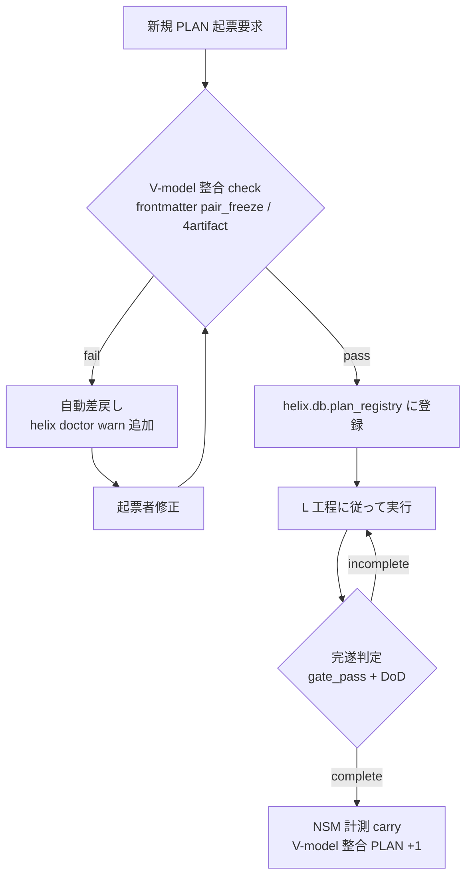
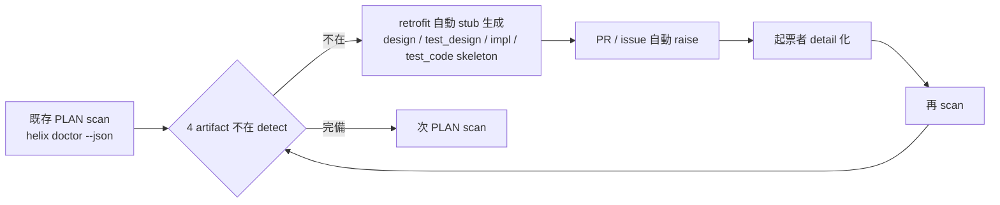
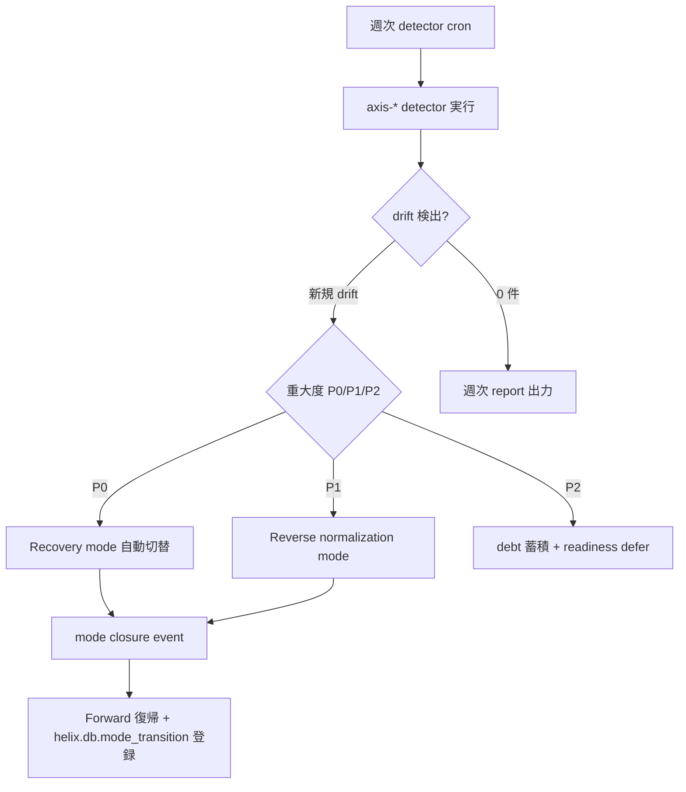

# HELIX-workflows V2 業務要件 (確定版、L3 詳細化)

> **本 doc の位置づけ**: L1 [業務要求 doc](../L1-requirements/helix-workflows-business-requirements.md) BR-01〜BR-08 を **業務フロー (確定版) + 業務ルール + 対象業務範囲** で実装可能な粒度に詳細化した L3 業務要件正本。L12 [受入テスト設計](../L12-test-design/helix-workflows-acceptance-test-design.md) §1 と V-model **L3↔L12 ペア凍結** (AC-BR-* と 1:1 対応)。
>
> **scope**: 業務フロー (mermaid + step) / 業務ルール (条件分岐 / 制約 / 例外) / 対象業務範囲 (in/out scope) まで。**機能仕様 / 入出力定義** は L3 機能要件 doc で、**システム機能設計** は L4-L6 で行う。

> **SSoT 参照** (2026-05-26 doc-system-architect retrofit): ユビキタス言語 = [L0 §12 Glossary](../L0-helix-workflows/concept.md) / 業界標準整合 = §13 / Bounded Context = §14。本 doc は L0 §12-§14 を parent_doc reference とし、用語独自定義は行わない (anti-corruption layer)。

## §1 業務フロー (確定版、BR-* 詳細化)

### §1.1 BR-01 dogfooding 稼働 業務フロー

**step-by-step**:
1. 新規 PLAN 起票要求 (PM / SE / Codex 委譲)
2. frontmatter V-model 整合 check (`parent_design` / `pairs_test_design` / 4 artifact trace)
3. pass → `helix.db.plan_registry` に登録 / fail → 自動差戻し + warn 追加
4. L 工程に従って実行 (Phase D の adversarial check 等)
5. 完遂判定 (gate_pass + DoD) → NSM カウント +1

### §1.2 BR-02 4 artifact retrofit 業務フロー

**step-by-step**:
1. `helix doctor --json` で既存 PLAN 324 件 scan
2. 4 artifact 不在検出 → retrofit 自動 stub 生成
3. PR / issue で起票者に通知 → manual detail 化
4. 再 scan で warn 減少を確認 (target: 86 → 20 以下、Phase α 完了条件)

### §1.3 BR-03 drift 解消 業務フロー

### §1.4 BR-04〜BR-08 業務フロー (要約)

| BR | 業務フロー要約 |
|---|---|
| BR-04 9 mode → Forward 回帰 | mode closure event 発火 → `helix.db.mode_transition` 登録 → 適切 L 工程 (L1/L3/L4-L6/L7) 自動接続 |
| BR-05 ペア凍結監査 | 起票時 frontmatter lint → `parent_design` / `pairs_test_design` 不在で fail-close → 起票者修正 |
| BR-06 影響範囲分析 | 機能改修 trigger (PLAN edit / branch 作成) → `helix code impact-range --plan-id` → 4 artifact 双方向 trace query → 影響範囲視覚化 |
| BR-07 AI agent 配線 | L 工程 entry → `helix-context` が `vmodel-semantics.yaml` 読込 → mandatory_skills/commands/agents 自動注入 → AI 選択空間絞り込み |
| BR-08 採用 project 展開 | HELIX-workflows portable package 化 → 採用 project 取込 (`helix init` 等) → 各 project で dogfooding 起動 → 採用 project 報告集約 |

(BR-04〜BR-08 は本 doc では要約、Phase E.B 完了後に詳細 mermaid 追加 carry)

## §2 業務ルール (条件分岐 / 制約 / 例外処理)

### §2.1 PLAN 起票時の整合 rule

| rule ID | 条件 | アクション | 例外 |
|---|---|---|---|
| BR-RULE-01 | 新規 PLAN.kind in {impl / refactor / retrofit} AND `parent_design` 不在 | fail-close、起票拒否 | `kind=research/poc/recovery` は適用外 |
| BR-RULE-02 | 新規 PLAN.pairs_test_design 不在 AND kind in {impl} | fail-close、起票拒否 | L1 の 4 PLAN は L14 を 1 件のみ pair、他は L4 で再 pair |
| BR-RULE-03 | helix doctor warn > 50 | alert (PM 通知)、新規 PLAN 起票一時停止 | hotfix (Incident mode) は適用外 |
| BR-RULE-04 | drift detector P0 検出 | Recovery mode 自動起動、開発中 PLAN 一時 freeze | 起票者が override (--allow-drift) で続行可能 (要 evidence) |

### §2.2 9 mode 入口判定 rule

| rule ID | 条件 | mode 切替 | 例外 |
|---|---|---|---|
| BR-RULE-05 | 仮説未確定 signal (要件 doc 不在 + Spec 未確定) | Discovery mode | requirements-handover skill で先行確認 |
| BR-RULE-06 | 本番 alert + severity P0 | Incident mode (hotfix 直行) | 開発環境 drift は Reverse normalization |
| BR-RULE-07 | AI 暴走 signal (連続 fail-close + intermediate_errors 多発) | Recovery mode (cutover) | TL adversarial review が pass なら継続 |
| BR-RULE-08 | 既存コード逆引き trigger | Reverse mode (R0→R4 + RGC) | code 不在は Discovery mode |

### §2.3 ゲート判定 rule (`gate_verdict = static_subchecks AND ai_review_required_when(...)`)

| gate | static_subchecks (機械判定) | ai_review_required_when (AI 判定発火条件) |
|---|---|---|
| G0.5 | L0 PLAN frontmatter 整合 + concept.md AC 全 11 項目充足 | 常時 (PM + tl-advisor adversarial check 1 回必須) |
| G1 | L1 PLAN 4 件 + L14 pair の整合 + balance_ratio = 1.0 | 常時 (PM + PO + tl-advisor 1 回必須) |
| G3 | L3 PLAN 3 件 + L12 pair の整合 + L1↔L3 trace | 常時 (PM + tl-advisor 1 回必須) |
| G7 | L7 sprint 7 step 全完遂 + 単体 test pass + lint pass | 設計判断 trade-off ≥ 2 件 / P0 指摘あり |
| G14 | OT-01〜OT-10 全 pass + Guardrail 全 healthy | 月次 PM レビュー |

### §2.4 既存資産整理・移行 rule (2026-05-26 ユーザー指摘反映、BR-09/10 L1-IN-18/19 由来)

| rule ID | 条件 | アクション | 例外 |
|---|---|---|---|
| BR-RULE-09 | 設計 doc 内で「対応 CLI / file path / schema field / table / view / config」を主張 AND `implementation_status` 列不在 | fail-close、doc レビュー差戻 (机上宣言禁止、verify-before-act 必須、[[feedback_memory_verify_before_act]]) | reference doc (kind=reference / is_reference: true) は適用外、要件確定前の概念 doc は L0 §12.1 Glossary 5 列構成への準拠で許容 |
| BR-RULE-10 | 既存資産 (V1 PLAN / 旧 CLI / 旧 enum / 旧 process layer / 旧 frontmatter field) を後継 (V2 / 新 enum / L0-L14 / 新 field) に置換 AND 段階移行計画 (Phase 分割 / Strangler Fig path / 残量管理) 不在 | fail-close、L4 基本設計で migration pipeline 凍結まで起票拒否 | hotfix (Incident mode) で旧資産を一時利用する場合は applicable、ただし postmortem で migration carry 化必須 |
| BR-RULE-11 | 大規模 doc 改定 (~500 行+) / G0.5・G1・G3・G7 ゲート evidence / V-model 4 artifact pair freeze 前 AND **doc-reviewer 召喚 evidence 不在** | fail-close、ゲート通過拒否 (`helix codex --role doc-reviewer --task ...` の召喚と判定 (approve / conditional_approve / blocked) 結果を会話 / final report / commit message に残すこと必須) | hotfix (Incident mode) で 1 commit < 50 行の typo 修正のみ等の軽微改定は applicable、ただし postmortem で doc-review carry 化を検討。reference doc (kind=reference / is_reference: true) は適用外 |
| BR-RULE-12 | 上流 ID (BR-* / FR-* / NFR-*) を新規追加または既存 ID を delete / rename した commit AND **同 commit / 直前後 N commit 以内に下流対応 ID (BR-RULE-* / FR-* / NFR-* / AC-* / OT-*) の追加 / 更新 / 削除がない** OR **balance_ratio < 1.0 regression を起こす** | fail-close、commit 拒否 (`helix doctor check_upstream_downstream_alignment` + `check_balance_ratio_regression` + `check_id_reference_completeness` 全 pass まで) | (1) 上流 ID delete が **意図的 deprecation** で deferred-findings.yaml に登録済の場合は applicable (2) 緊急 hotfix で 1 commit 完結する場合は直後 N=3 commit 以内 fixup 必須 (3) reference doc (kind=reference / is_reference: true) 内の ID 変更は適用外 |

### §3.1 in scope

| 対象 | 業務 | 担当 |
|---|---|---|
| **HELIX 自身** | 13 工程 (L0/L1/L3-L9/L11-L14) dogfooding 開発業務 | PM (Opus) + TL/SE (Codex) |
| **採用 project** | HELIX-workflows V2 portable package を取込み、各 project で dogfooding 起動 | 各 project owners |
| **9 mode workflow** | Forward + 8 派生 mode (Scrum / Discovery / Reverse / Incident / Add-feature / Refactor / Retrofit / Research / Recovery) の入口判定 + closure → Forward 復帰 | PM + 各 mode CLI |
| **ペア凍結監査** | V-model 5 pair (L1↔L14, L3↔L12, L4↔L9, L5↔L8, L6↔L7) の量閉じ性週次計測 | 自動 (`helix doctor`) + PM レビュー |
| **影響範囲分析** | 機能改修時の 4 artifact 双方向 trace query | 自動 (`helix code impact-range`) + 起票者判断 |
| **AI agent 配線** | `vmodel-semantics.yaml` 注入セット運用 | 自動 (`helix-context`) + PM 監督 |

### §3.2 out scope (本 業務要件では扱わない)

- **人間の意思決定**: スコープ調整、優先度判断、ビジネス判断は PM + PO の人間判断 (HELIX が代行しない、CLAUDE.md §エスカレーション境界)
- **本番セキュリティ事故対応**: Incident mode は hotfix までを扱うが、根本的セキュリティ事故 (情報漏洩 etc.) は専門チーム (security audit) に escalate
- **採用 project の business logic**: HELIX-workflows V2 は開発フレームワーク、各 project の business logic は project owners 責任
- **画面 UI / TUI**: L2/L10 skip により対象外 (HELIX-workflows は CLI 中心、UI 必要時は L2/L10 unskip carry [L1-IN-03])

## §4 L1 → L3 詳細化 trace

| L1 BR-* (要望レベル) | L3 詳細化 (確定版) | L12 受入テスト pair |
|---|---|---|
| BR-01 dogfooding 稼働 | §1.1 業務フロー + §2.1 BR-RULE-01〜04 + §3.1 in scope (HELIX 自身) | AC-BR-01 |
| BR-02 4 artifact retrofit | §1.2 業務フロー + §3.1 in scope | AC-BR-02 |
| BR-03 drift 解消 | §1.3 業務フロー + §2.1 BR-RULE-04 + §3.1 in scope | AC-BR-03 |
| BR-04 9 mode → Forward 回帰 | §1.4 要約 + §2.2 BR-RULE-05〜08 + §3.1 in scope (9 mode workflow) | AC-BR-04 |
| BR-05 ペア凍結監査 | §1.4 要約 + §2.1 BR-RULE-02 + §2.3 G1/G3 + §3.1 in scope (ペア凍結監査) | AC-BR-05 |
| BR-06 影響範囲分析 | §1.4 要約 + §3.1 in scope (影響範囲分析) | AC-BR-06 |
| BR-07 AI agent 配線 | §1.4 要約 + §3.1 in scope (AI agent 配線) | AC-BR-07 |
| BR-08 採用 project 展開 | §1.4 要約 + §3.1 in scope (採用 project) + §3.2 out scope (各 project business logic) | AC-BR-08 |

## §5 関連 doc

- **上流 L1**: [helix-workflows-business-requirements.md](../L1-requirements/helix-workflows-business-requirements.md) (G1 conditional_approve 取得済、commit aa86a22)
- **PLAN (本 doc を生成)**: [L3-helix-workflows-業務要件plan.md](../../plans/L3/L3-helix-workflows-業務要件plan.md)
- **L12 ペア相手**: [helix-workflows-acceptance-test-design.md](../L12-test-design/helix-workflows-acceptance-test-design.md) §1 業務系 AC-BR-01〜08
- **L1 ペア (運用テスト設計)**: [helix-workflows-operational-test-design.md](../L14-test-design/helix-workflows-operational-test-design.md) (L1↔L14 ペア凍結)
- **HELIX-workflows L3 正本**: [HELIX-workflows/helix-process/L3-requirements-definition.md](../../../HELIX-workflows/helix-process/L3-requirements-definition.md)
- **L0 概念**: [docs/v2/L0-helix-workflows/concept.md](../L0-helix-workflows/concept.md)
- **並走 L3 doc** (Phase E.B 起票済 2026-05-26):
  - [helix-workflows-functional-requirements-detail.md](./helix-workflows-functional-requirements-detail.md) (機能要件 + 入出力 + 技術要求統合、FR-* 28 unique)
  - [helix-workflows-nfr-detail.md](./helix-workflows-nfr-detail.md) (NFR IPA グレード値確定 + ISO 25010 再導出 US/FS、NFR-* 23 + 2)
- **下流 L4**: L4-helix-workflows-基本設計plan (L3 3 PLAN 完遂後)

## §6 carry / 既知の不足

- §1.4 BR-04〜BR-08 の詳細 mermaid 図は Phase E.B 完了後に追加 (機能要件 doc で詳細フローが定義された後、cross-reference で参照)
- §2.3 G ゲート判定 rule は L1 技術要求 doc §gate-policy.yaml 化 carry と整合、L4 基本設計で gate-policy.yaml 実体化
- §3.1 採用 project portable 化は L1-IN-15 (L1 NFR §3 NFR-OP-04 進化系統 trace) と関連、Phase β で確定

## §7 L0 §8 保留 3 件 closure table (2026-05-26 tl-advisor G3 P0 反映、L3 3 PLAN 共通)

L0 [見直し企画書](../L0-helix-workflows-concept.md) §8.2 で「保留 (L1/L3 で確定)」とされた 3 件の L3 closure 状況:

| 保留 ID | 内容 | L3 closure 状況 | L12 AC 対応 | 後続確定タイミング |
|---|---|---|---|---|
| **L1-IN-13** | Phase α/β/γ 境界 KGI + must/should/later 3 層分割 + kill criteria | **L3 部分 closure**: 本 doc §6 carry で Phase α/β/γ への carry 配分明示 (§3.1 採用 project portable 化 = Phase β、§1.4 詳細 mermaid = Phase B 後、§2.3 gate-policy.yaml = L4 実体化)。**未確定の数値閾値** (warn 件数 / drift 件数 / 採用 project 数の must/should/later 区分値) は L3 機能要件 doc §1 FR-DOCTOR-01 + L12 AC-NFR-OP-03 (warn 50 alert / 20 exit) で実数定着、`L4-helix-workflows-基本設計plan` で `cli/config/gate-policy.yaml` + `cli/config/phase-boundaries.yaml` として最終確定 |
| **L1-IN-14** | 専門エージェント / team 構造 (memory carry §9 P1.5) の Phase 配分 | **L3 carry 維持**: 本 L3 工程では確定せず、`L4-helix-workflows-基本設計plan` で確定。L3 で扱う範囲は「PM = Opus / TL = Codex gpt-5.5 / SE = Codex 5.4 / PE = Codex 5.3-spark / QA = Codex / PMO = Sonnet/Haiku の単体 agent 配分」(§4 ステークホルダー L1 業務要求 doc に既明示)。**team 構造** (チームアルゴリズム設計 / チームセキュリティ監査 / ドメインチェック自動化 / コーディングルール自動化等) は L4 基本設計で ROI 評価 + Phase 配分確定 | L12 直接 AC なし (L4 で team 構造 AC 化) | L4-helix-workflows-基本設計plan |
| **L1-IN-15** | 逆引き audit 11 穴段階対応 (P1 進化/繁殖/老化/共生/代謝 + P2 内分泌/循環/消化/性差 + P3 多細胞化/神経変性) | **L3 段階 closure**: L3 NFR doc §3 NFR-OP-04 (進化系統 trace) + §4 NFR-MG-03 (繁殖 = portable package) + §3 NFR-OP-01 (老化 = auto-deprecation) + §6 NFR-SE-02 (共生 = Claude/Codex 両導線) + §2 NFR-PF-04 (代謝 = PLAN 起票時間) で P1 5 穴を L3 で吸収。P2 4 穴 (内分泌/循環/消化/性差) は L7-L9 carry、P3 2 穴 (多細胞化/神経変性) は L13-L14 carry を NFR doc §8 で明示 | AC-NFR-OP-01〜05 / AC-NFR-MG-03 / AC-NFR-SE-02 / AC-NFR-PF-04 で P1 5 穴を L12 受入 | P1 = L3-L4 (一部 L3 closure)、P2 = L7-L9、P3 = L13-L14 |

**G3 通過条件**: 本 §7 で 3 件すべての closure 状況を明示することで、L0 §8 保留 carry が L3 段階で trace 可能となる。L1-IN-13/14 で未確定の数値は L4 で確定し、L1-IN-15 P2/P3 は carry 明示で L7-L14 に引き継ぐ。
