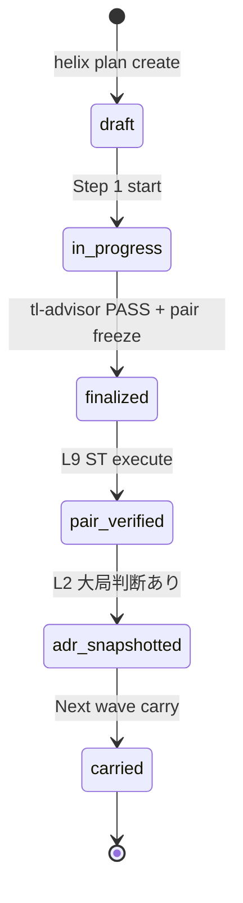
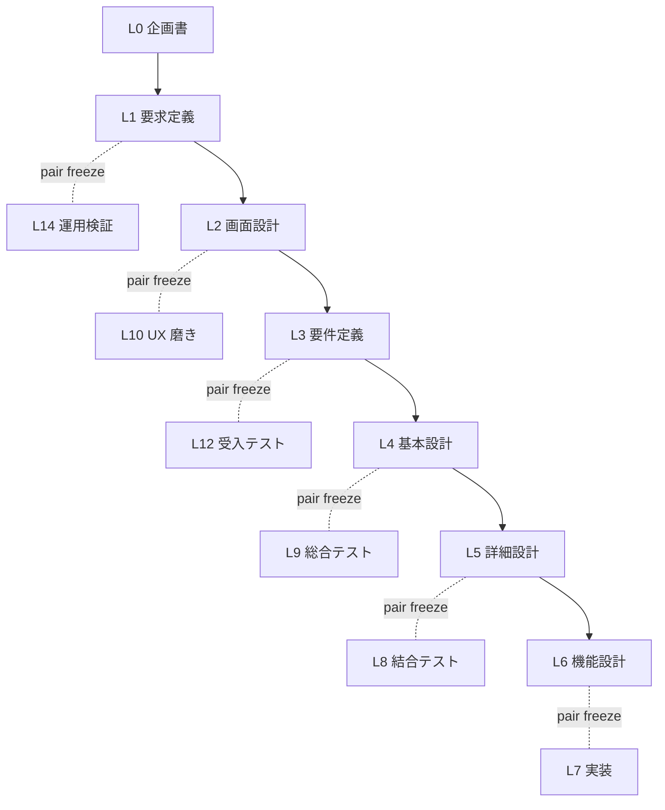
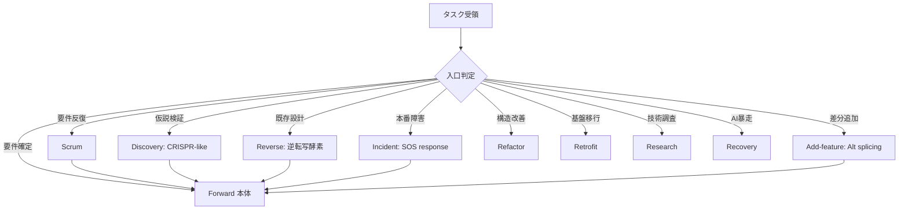
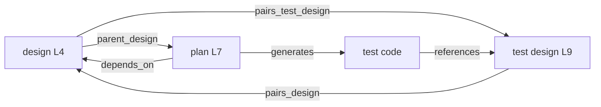
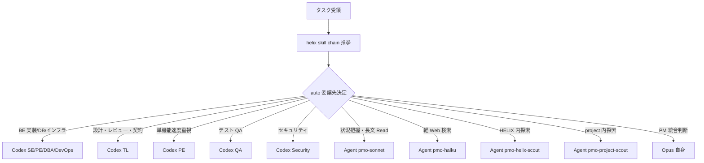
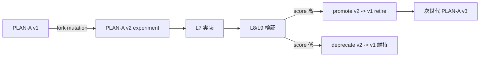
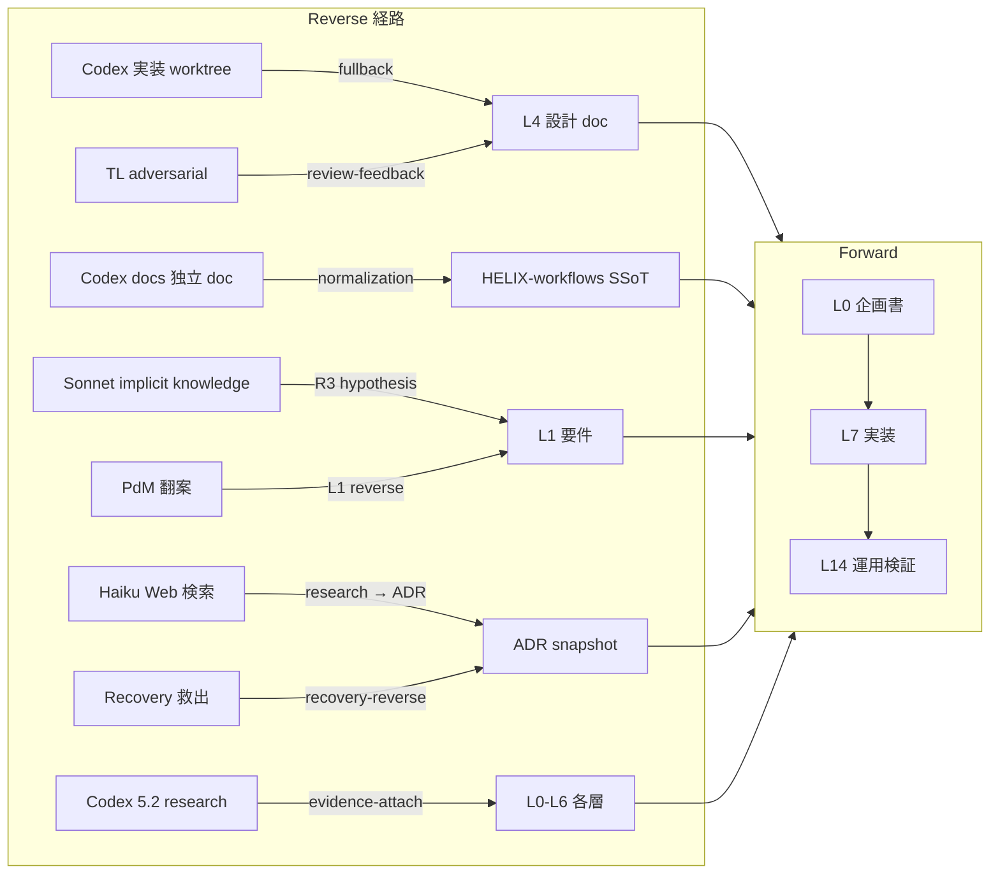

# HELIX-workflows V2 機能設計 (functional design)

## §0 概要

この文書は `docs/v2/L4-architecture/helix-workflows-system-architecture.md`（L4 方式設計）を本体化し、実装と検証に接続できる状態にする L4 機能設計文書である。  
実装対象は L9 ST-F1〜ST-F5 との 1 対 1 で検証され、`helix doctor check_*` / hook / CLI / DB trace schema により「実行可能性」を担保する。

本体化で満たす原則は次のとおり。

- 5 機能領域（F1〜F5）を 4 artifact trace で再構成する
- 対象領域の実装契約（plan/check/guard/schema）を section 粒度で固定する
- `implementation_status` を持つ実行設計（planned / implemented / deferred）へ整理する
- 生物学 metaphor を各 § 末尾に 1 行固定し続ける
- PLAN/L9 との双方向リンクを維持し、pair freeze 再開時の再解釈コストを下げる

### §0.1 生物学対応前提

`README.md` の Cell-level / Cellular response / Tissue-Organ の正本に準拠し、F1〜F5 を生物学対応と同型で扱う。
生物学対応 1 行は各機能節の末尾で明示する（BR-RULE-08）。

### §0.2 期待アウトカム

- F1: ドキュメント体系が 4 ドメイン責務で一貫し、SSoT drift が検知可能
- F2: PLAN frontmatter と template 使用が自動検証可能になる
- F3: skill 推奨と agent 委譲が dispatcher で再現可能
- F4: 9 mode 入口と Forward 接続が DB trace で再現可能
- F5: オーケストレーション（モデル配備・並列・guard・advisor）が hook / CLI で監査可能

### §0.3 参照

- 本体化対象の `HELIX-workflows/` 系統: `HELIX-workflows/HELIX-process-L0-L14.md`  
- 本体化対象の設計骨格: `docs/v2/L4-architecture/helix-workflows-system-architecture.md`  
- 本体化対象の PLAN: `docs/plans/L4/L4-helix-workflows-機能設計plan.md`  
- 本体化対象のテスト設計: `docs/v2/L9-test-design/helix-workflows-functional-test-design.md`
- ADR: `docs/adr/ADR-040-workspace-isolation.md`, `docs/adr/ADR-044-helix-workflows-v2-architecture-snapshot.md`

## §1 ドキュメント体系 (機能 F1、本体化、生物学対応: DNA / 染色体 / 細胞核)

### §1.1 4 ドメイン構造の責務表

| ドメイン | path | 役割 | SSoT | 同期方向 | implementation_status |
|---|---|---|---|---|---|
| HELIX-workflows/ | `HELIX-workflows/` | 工程定義正本（L0-L14 + 9 mode） | yes | 自身が SSoT | implemented |
| docs/v2/ | `docs/v2/L0-XX/` | 製本 doc（L0-L14、L4-architecture / L9-test-design） | no | HELIX-workflows から同期 | implemented |
| docs/plans/L0-L14/ | `docs/plans/L0/.../L14/` | PLAN tree（機能単位起票、`L<NN>-<name>plan`） | no | `helix.db.plan_registry` と sync | implemented |
| docs/adr/ | `docs/adr/ADR-NNN-*.md` | ADR snapshot（L2 大局判断凍結） | no | PLAN tree と双方向 trace | implemented |
| docs/commands/ | `docs/commands/` | CLI 入口の使い方・観測点 | no | 1-way 参照のみ | implemented |

### §1.2 ライフサイクル設計

状態遷移は次図で固定し、`doc_lifecycle` check が受ける前提とする。



### §1.3 SSoT 原則と drift retrofit ルール

| 規則 | 意味 | 違反時対応 | implementation_status |
|---|---|---|---|
| SSoT 主体固定 | `HELIX-workflows/` を唯一真実とする | docs 側の実装差分は `docs/v2` 側から修正提案 | implemented |
| 逆同期禁止 | `docs/v2` 直接編集で `HELIX-workflows/` を更新しない | `helix doctor --check-ssot-sync` で修正差分を出す | implemented |
| drift 証跡化 | すべての drift は `audit_log_id` を付与 | `checks` で block または deferred | implemented |
| pair 実行優先 | L4- L9 で fix-first かつ pair で回収 | plan レベルで block / next action carry | planned |

### §1.4 4 artifact 双方向 trace 運用（製本）

設計（①）・テスト設計（③）・実装（②）・テスト実行（④）の境界を明示し、SSoT と親子参照を固定する。

| artifact | 要求 reference | 必須 frontmatter | 規約 | implementation_status |
|---|---|---|---|---|
| ① 設計 doc | target_plan / pairs_test_design | `doc_id`, `process_layer`, `parent_plan`, `pairs_test_design` | 設計→テスト 1:1 | implemented |
| ③ テスト設計 doc | target_design / pairs_design | `pairs_design`, `parent_design` | テスト設計→設計 1:1 | implemented |
| ② 実装 code | impl plan / dependencies | `implementation_status`, `generates`, `dependencies` | 設計→実装双方向追跡 | planned |
| ④ テスト code | test design case id | `test_case_id`, `parent_design` | 生成物から設計への再追跡 | planned |

#### 参照規則 YAML 例

```yaml
trace_contract:
  design_doc: "docs/v2/L4-architecture/helix-workflows-functional-design.md"
  pairs_test_design:
    - "docs/v2/L9-test-design/helix-workflows-functional-test-design.md"
  implementation_status: "implemented"
  generates:
    - path: "docs/plans/L4/"
      type: "plan-index"
  dependencies:
    parent: "L4-helix-workflows-方式設計plan"
    blocks: []
```

### §1.5 機械処理 mapping（F1）

| check 名 | 役割 | 入力 | 出力 | implementation_status |
|---|---|---|---|---|
| helix doctor --check-doc-lifecycle | draft/in_progress/finalized 整合 | doc frontmatter | OK/NG list | implemented |
| helix doctor --check-4-domain-separation | 4 ドメイン path 違反検出 | git tree | violation list | planned |
| helix doctor --check-ssot-sync | HELIX-workflows ↔ docs/v2 drift | diff | sync report | planned |
| helix doctor --check-4-artifact-trace | 4 artifact 双方向 reference 完備 | frontmatter graph | trace report | planned |
| git hook pre-commit doc-lint | lint + link + frontmatter | changed files | block/ok | planned |
| .helix/db event log | life-cycle event audit | state + doc_id | event row | implemented |

→ pair: L9 ST-F1

### §1.6 受け入れ条件

F1 完了条件:
- 4 ドメイン表の path が plan_id で追える
- `draft / in_progress / finalized / pair_verified / adr_snapshotted` を監査可能
- `check_doc_lifecycle` が設計側最小構成を通過
- `pairs_test_design` が ST 設計を参照

生物学対応: DNA / 染色体 / 細胞核

## §2 PLAN テンプレート規約 (機能 F2、本体化、 生物学対応: 遺伝子 + 遺伝子座 + 遺伝子発現)

### §2.1 必須 frontmatter fields 完全表

| field | 必須? | 型 | 説明 | 工程依存 |
|---|---|---|---|---|
| plan_id | yes | str | `L<NN>-<name>plan` 形式 | 全工程 |
| title | yes | str | `"L<NN>-<name>plan: <description>"` | 全工程 |
| kind | yes | enum | design / requirements / impl / test / recovery / refactor / retrofit / research / add-design / add-impl / poc | 全工程 |
| layer | yes | enum | `L0-L14` | 全工程 |
| process_layer | yes | enum | `L0-L14` | 全工程 |
| parent_process | yes | path | `HELIX-workflows/helix-process/*.md` | 全工程 |
| pairs_test_design | conditional | list[path] | 設計工程のみ (L1-L6) | L1-L6 |
| parent_design | conditional | str | L7 impl のみ | L7 |
| agent_slots | yes | list | mandatory + on_demand 列挙 | 全工程 |
| generates | yes | list[{path, type}] | artifact 列挙 | 全工程 |
| dependencies | yes | {parent, requires, blocks} | DAG | 全工程 |
| related_docs | yes | list[path] | 参照 doc | 全工程 |

### §2.2 命名規則と umbrella 禁止

| 規則 | 記述 | 制約 | implementation_status |
|---|---|---|---|
| L4 example | `L4-helix-workflows-方式設計plan` | 有効（既存 L4 命名） | implemented |
| L4 example | `L4-helix-workflows-機能設計plan` | 有効（本 plan） | implemented |
| L7 example | `L7-<feature>plan` | 有効（実装 PLAN） | implemented |
| umbrella 禁止 | 「基本設計plan」 | helix-workflows L4 では禁止 | implemented |
| process link | parent_process required | 3 層以上の再帰参照禁止 | implemented |

### §2.3 template 15 列挙

| layer | template path | 主要 frontmatter 例 | implementation_status |
|---|---|---|---|
| L0 | `cli/templates/plan/v2/L0-concept.md` | `kind: concept` | implemented |
| L1 | `cli/templates/plan/v2/L1-requirements.md` | `kind: requirements` | implemented |
| L2 | `cli/templates/plan/v2/L2-design.md` | `kind: design` | implemented |
| L3 | `cli/templates/plan/v2/L3-implementation-outline.md` | `kind: requirements` | implemented |
| L4 | `cli/templates/plan/v2/L4-architecture.md` | `kind: design` | implemented |
| L5 | `cli/templates/plan/v2/L5-detail-design.md` | `kind: design` | implemented |
| L6 | `cli/templates/plan/v2/L6-functional-design.md` | `kind: requirements` | implemented |
| L7 | `cli/templates/plan/v2/L7-impl.md` | `kind: impl` | implemented |
| L8 | `cli/templates/plan/v2/L8-integration-test.md` | `kind: test` | implemented |
| L9 | `cli/templates/plan/v2/L9-system-test.md` | `kind: test` | implemented |
| L10 | `cli/templates/plan/v2/L10-ux-polish.md` | `kind: design` | planned |
| L11 | `cli/templates/plan/v2/L11-review.md` | `kind: requirements` | planned |
| L12 | `cli/templates/plan/v2/L12-deploy-acceptance.md` | `kind: requirements` | implemented |
| L13 | `cli/templates/plan/v2/L13-observation.md` | `kind: requirements` | planned |
| L14 | `cli/templates/plan/v2/L14-operations.md` | `kind: requirements` | implemented |

### §2.4 工程表内蔵原則（Step 1-N）

| 要素 | 実装内容 | 記述例 | implementation_status |
|---|---|---|---|
| Step 番号 | 1..N（必須） | Step 1 入口確認、Step 2 実装前レビュー、... | implemented |
| 作業内容 | 前提 / 本体化 / 検証 | 5 機能領域を section 単位に展開 | implemented |
| 進捗マーカー | 状態変更 | `pending / in_progress / done` | planned |
| 再開可能性 | resume メモ | 途中中断時の最短再開 path | implemented |
| 接続規約 | pair trace 更新 | `pairs_test_design` / `parent_design` を更新 | implemented |

### §2.5 PLAN + ADR 運用

| ルール | 運用 | チェック | implementation_status |
|---|---|---|---|
| L2 判定 | plan に ADR snapshot を紐付ける | `helix doctor --check-plan-adr-snapshot` | implemented |
| 差異時 | ADR 優先 | 差分がある場合 L4 で停止、補正後に戻る | implemented |
| 実施順 | PLAN 作成→L1-L6 合意→固定 | gate 前監査 | implemented |
| 反映対象 | plan_id + related_docs | ADR file path 必須 | implemented |

### §2.6 機械処理 mapping（F2）

| CLI | 役割 | 入力 | 出力 | implementation_status |
|---|---|---|---|---|
| helix plan create | PLAN 新規起票（template から） | layer, name | plan file path | implemented |
| helix plan validate | frontmatter/命名/dependency 検証 | path | error/warn list | implemented |
| helix plan status | plan_registry 状態 | filter | status list | implemented |
| helix doctor --check-plan-frontmatter-completeness | 必須 field 検証 | tree | violations | planned |
| helix doctor --check-plan-naming-convention | 命名規約検証 | tree | violations | planned |
| helix doctor --check-plan-adr-snapshot | ADR drift 検出 | PLAN graph | gap list | planned |
| helix db.plan_registry | PLAN dependency graph 構築 | sql/seed | plan_state | implemented |

### §2.7 受け入れ条件

- 15 templates を明示したうえで F2 section で運用する
- 命名規則が `L<NN>-<name>plan` 以外でない
- frontmatter 完全性が check で可観測
- F2 対応 section が ST-F2 の観点を満たす

生物学対応: 遺伝子 + 遺伝子座 + 遺伝子発現

→ pair: L9 ST-F2

## §3 skill 体系 + 推挙 framework (機能 F3、本体化、 生物学対応: 細胞器官 + 細胞分化 + 転写制御)

### §3.1 9 大カテゴリ責務 + 数値管理

| カテゴリ | 役割 | 細胞器官 metaphor | skill 数（現状） | example | implementation_status |
|---|---|---|---|---|---|
| common | 横断基準 | 細胞質基質（cytoplasm） | 12 | coding/testing/security/git/design | implemented |
| workflow | 工程・ADR・仕様監査 | 細胞核核内転写機構 | 39 | design-doc/api-contract/verification | implemented |
| tools | 補助技術選定 | 細胞表面受容体 | 4 | ai-coding/web-search/ide-tools | implemented |
| project | 領域別設計 | 組織化シグナル | 3 | api/db/ui | implemented |
| advanced | 専門設計・移行 | 分化制御因子 | 9 | tech-selection/legacy/migration | implemented |
| automation | 自動化運用 | リボソーム（自動翻訳） | 8 | scheduler/observability | implemented |
| integration | エージェント協調 | 細胞間情報伝達 | 3 | agent-design/agent-teams | implemented |
| writing | ドキュメント品質 | RNA 編集 | 6 | japanese/explain/god-writing | implemented |
| design-tools | 図解 | 形態形成 | 6 | web-system/gpt-image | implemented |
| agent-skills | AI エージェント動線 | リボソーム制御 RNA | 24 | spec-driven-dev/context-engineering | implemented |

### §3.2 推挙 framework 仕様

```yaml
query: "L4 方式設計を機能化し、L9 ST-F1〜F5 を 1:1 で本体化する"
roles:
  - skill_chain: "helix skill chain \"<task description>\""
  - engine: "gpt-5.4-mini"
  - thinking: "low"
output:
  top_skills:
    - "workflow/design-doc"
    - "common/documentation"
    - "workflow/verification"
  recommended_agent: "tl"
  rationale: "設計/検証契約を同時固定できるため"
  cache_key: "sha256(query)"
  cache_ttl: "1h"
implementation_status: implemented
```

### §3.3 skill catalog 運用

`cli/lib/skill_catalog.py` は `.helix/cache/skill-catalog.json` を SKILL.md frontmatter + references 冒頭 blockquote から再生成する。  
再生成後は `helix skill stats` が `skill_usage` table を更新し、L11 運用学習で再利用率を追う。

| operation | 入力 | 出力 | implementation_status |
|---|---|---|---|
| catalog rebuild | none | catalog json | implemented |
| skill search | task | N 件推薦 | implemented |
| skill chain | task | top skill + recommended_agent | implemented |
| usage log | helix.db | skill_usage row | implemented |

### §3.4 skill 組合せルール（責務境界）

| 組合せ | 役割 | 対象 skill | 接続ルール | implementation_status |
|---|---|---|---|---|
| code-review 4 系統 | 品質ガード | common/code-review, workflow/review-stage-routing, agent-skills/code-review-and-quality, workflow/adversarial-review | review-stage-routing は観点分業、5 軸 review は多次元評価 | implemented |
| エージェント設計 4 系統 | 企画〜協調 | integration/agent-cost-design, integration/agent-design, integration/agent-teams, agent-skills/spec-driven-development | before/after 分離 | implemented |
| ドキュメント体系 5 系統 | ドキュメント一貫化 | requirements-handover, doc-system-architect, requirements-deriver, design-doc, documentation | design-doc を起点に doc-system-arch へ戻る | implemented |
| LP/FE/画像統合 | LP/FE/画像 | writing/god-writing, design-tools/gpt-image, design-tools/web-system, common/visual-design | god-writing→design-tools/web-systemの上下流順 | implemented |

### §3.5 skill 使用統計

`helix skill stats --days 30 --by skill_id` の schema.

```yaml
stats_request:
  command: "helix skill stats --days 30 --by skill_id"
  table: "helix.db.skill_usage"
  required_fields:
    - skill_id
    - count
    - avg_recommendation_score
    - updated_at
  output:
    type: ranking
    refresh_policy: "daily"
```

### §3.6 機械処理 mapping（F3）

| CLI / hook | 役割 | 入力 | 出力 | implementation_status |
|---|---|---|---|---|
| helix skill chain <task> | 推挙一気通貫 | task description | recommended skill + agent | implemented |
| helix skill search <task> -n N | top N 推挙 | task | skill list | implemented |
| helix skill use <skill-id> | 単 skill 起動 | skill_id, task | result | implemented |
| helix skill catalog rebuild | catalog 再生成 | none | catalog json | implemented |
| helix skill stats | 使用統計 | filter | report | implemented |
| pretooluse-agent-guard.sh | skill guard | tool input | block/pass | implemented |

### §3.7 受け入れ条件

- 推挙 framework が query → cache → 推奨まで 1 パスで成立
- 組合せルールが 4 系統で参照できること
- `helix skill catalog rebuild` と `helix skill stats` の回路が監査可能
- skill 数値は 116+ の前提で run time を監査ログに残す

生物学対応: 細胞器官 / 細胞分化 / 転写制御

→ pair: L9 ST-F3

## §4 ワークフロー / 9 mode 入口分岐 (機能 F4、本体化、 生物学対応: 9 種細胞応答経路)

### §4.1 Forward V 字 全体図



### §4.2 入口分岐図（9 mode）



### §4.3 V-model 4 artifact trace（mermaid）



### §4.4 9 mode closure と mode_transition schema

| mode | closure event | payload schema | implementation_status |
|---|---|---|---|
| Forward | forward_connected | {mode_to_close, step, plan_id, artifact_pairs} | implemented |
| Scrum | forward_recovered | {origin, sprint_count, carry_refs} | implemented |
| Discovery | discovery_closed | {hypothesis_id, confirmed, reject_reason} | planned |
| Reverse | reverse_routed | {r0_trace, rgc_result, mapped_to} | implemented |
| Incident | incident_reopen | {severity, fixed_in, runbook_ref} | planned |
| Add-feature | addfeature_connected | {delta_layer, impact_scope, carry_plan} | implemented |
| Refactor | refactor_planned | {scope, invariants, no_behavior_change} | planned |
| Retrofit | retrofit_planned | {source_version, migration_steps} | planned |
| Research | research_output | {memo_id, decision, adr_ref} | implemented |
| Recovery | recovery_exit | {trigger, checkpoint, operator} | planned |

### §4.5 工程専門 workflow

| 入口 / 分岐 | 文書 | 連動 | implementation_status |
|---|---|---|---|
| L2 画面設計 | HELIX-workflows/helix-process/screen-design-workflow.md | state-events.md / mock 管理 | implemented |
| L10 UX 磨き上げ | HELIX-workflows/helix-process/frontend-design-workflow.md | design token / a11y | implemented |
| 研究系 | HELIX-workflows/helix-process/research-workflow.md | ADR + memo | implemented |
| Add-feature | HELIX-workflows/helix-process/add-feature-workflow.md | add-design / add-impl 分離 | implemented |
| Recovery | HELIX-workflows/helix-process/recovery-workflow.md | recovery log + guard の二重化 | planned |
| Incident | HELIX-workflows/helix-process/incident-workflow.md | 緊急停止 + forward回収 | implemented |

### §4.6 機械処理 mapping（F4）

| CLI / event | 役割 | 入力 | 出力 | implementation_status |
|---|---|---|---|---|
| helix init | mode 切替と初期化 | drive, mode | .helix/ + CLAUDE.md | implemented |
| helix discovery init / backlog / plan / poc / verify / decide | Discovery flow | hypothesis | confirmed/rejected | implemented |
| helix research | Research mode | task | ADR + memo | implemented |
| helix reverse <type> <step> | Reverse flow | code/db | gap routing | implemented |
| helix sprint <status/next/complete/reset> | L7 sprint 管理 | - | sprint state | implemented |
| mode_transition event | 9 mode → Forward | mode_to_close | helix.db.mode_transition | implemented |

### §4.7 受け入れ条件

- 9 mode 入口が diagram + schema で固定化される
- closure event が mode_transition table に到達する
- 変換不能な入力は必ず forward へ戻る

生物学対応: 9 種細胞応答経路

→ pair: L9 ST-F4

## §5 オーケストレーションルール (機能 F5、本体化、 生物学対応: 中枢神経 + シナプス + 免疫系)

### §5.1 モデル割当表

| role | model | thinking | 担当 | metaphor | implementation_status |
|---|---|---|---|---|---|
| PM | Claude Opus 4.7 | — | 言語化・統合・finalize | 前頭前野（高次中枢） | implemented |
| TL | Codex gpt-5.5 | high | 設計・レビュー・契約 | 運動野 | implemented |
| SE | Codex gpt-5.4 | high | 高度実装・リファクタ | 補足運動野 | implemented |
| PE | Codex gpt-5.3-codex-spark | low-medium | 速度重視実装 | 反射弓 | implemented |
| PMO Sonnet | Claude Sonnet 4.6 | medium | read-only 整合 | 知覚野 | implemented |
| PMO Haiku | Claude Haiku 4.5 | low | 軽 Web 検索・docs | 末梢神経 | implemented |
| Recommender | Codex gpt-5.4-mini | low | skill 推挙 | 連合野 | implemented |

### §5.2 並列実行ルール（default 最大 8）

| 判定項目 | 条件 | 直列化条件 | implementation_status |
|---|---|---|---|
| 衝突 | ファイル衝突 / 後段依存 / 共有状態 | 1 つでも YES なら直列 | implemented |
| 並列 pattern a | Codex N + PMo 並走 | 同一ロール衝突なし | planned |
| pattern b | subagent + Codex 同時 | 依存外タスクのみ | implemented |
| pattern c | 前段中の独立 followup | task 独立時に許可 | planned |
| pattern d | prompt 先行 Write | 書き込み候補が同一でない | implemented |

### §5.3 委譲決定木



### §5.4 Agent tool guard hook

`pretooluse-agent-guard.sh` の fail-close 仕様

| 条件 | 挙動 | exit | implementation_status |
|---|---|---|---|
| subagent_type 未指定 | block | 2 | implemented |
| permit list 外（12種） | block | 2 | implemented |
| tool_input.model 省略 | pass (frontmatter自動) | 0 | implemented |
| model family 不一致 | block | 2 | implemented |
| model family 一致 | pass | 0 | implemented |

### §5.5 advisor 召喚ルール

| advisor | 役割 | 呼び出しコマンド | invocation policy | implementation_status |
|---|---|---|---|---|
| pm-advisor | 大局判断 | `helix claude --role pm-advisor --execute --task` | PM判断が必要時 | implemented |
| tl-advisor | 設計・契約判断 | `helix codex --role tl-advisor --task` | 難判断時 | implemented |
| doc-reviewer | doc 品質 | `helix codex --role doc-reviewer --task` | 大規模 doc / Gゲート前 | implemented |

### §5.6 機械処理 mapping（F5）

| CLI / hook | 役割 | 入力 | 出力 | implementation_status |
|---|---|---|---|---|
| helix codex --role <role> | Codex 委譲 | role, task | result | implemented |
| helix claude --role <role> | Claude 委譲 | role, task | result | implemented |
| helix agent fire-mandatory --phase Lx | mandatory 起動 | phase | event log | implemented |
| helix agent slots / release-stale | slot 管理 | none | slot list | implemented |
| pretooluse-agent-guard.sh | Agent 起動ガード | tool_input | block/pass | implemented |

### §5.7 並列・委譲・audit 監査

| 監査対象 | チェック方法 | 指標 | implementation_status |
|---|---|---|---|
| 並列達成回数 | 実行ログ | 8 達成回数 | planned |
| 委譲精度 | advisor + skill 参照 | human一致率 | planned |
| guard 漏れ | 不正 role | exit code 結果 | implemented |
| ロール整合 | task→agent | 未参照 role 数 | implemented |

### §5.8 受け入れ条件

- 委譲決定木 schema を実装契約として使う
- guard 仕様をテスト観点で再現できる
- advisor 呼び出しの evidence を pair freeze 対象にする

生物学対応: 中枢神経 + シナプス + 免疫系

→ pair: L9 ST-F5

## §6 F6 恒常性（homeostasis、優先度 高）

### §6.1 機能概要

HELIX system 全体の **平衡監視 + 動的調整**。balance_ratio ratchet (F5 内) を拡張し、context 使用率 / workspace 規模 / 委譲 ratio / 並列度 / Codex token 消費 / Opus 残量等の system metrics を一元監視し、閾値超過時に自動 throttle / fallback / 警告を発火させる。

### §6.2 生物学対応

- **homeostasis**: 体温 (37°C) / 血糖 / pH / 電解質 等の **内部環境定数維持**
- **HELIX 対応**: context 使用率 / workspace 規模 / token 消費 / 並列度 等の **system 内部環境定数維持**

### §6.3 監視 metric 一覧

| metric | 健常値 | 異常値 | 動的調整 action | implementation_status |
|---|---|---|---|---|
| context_usage_ratio | <50% | >80% | PreCompact 自動 trigger / SessionStart history 注入縮小 | partial |
| workspace_size_mb | <500MB | >2GB | 古い worktree 自動 clean | planned |
| codex_token_consumption | <70% weekly | >90% weekly | Codex 委譲 → Opus 直 fallback | planned |
| opus_residual_ratio | >30% | <10% | 委譲強化、軽 Read のみ Opus | partial |
| parallel_count | ≤8 | >8 | 直列降格 + 怠慢警告 | implemented |
| balance_ratio (per pair) | ≥1.0 | <1.0 | ratchet fail-close | partial |

### §6.4 機械処理 mapping

| CLI / hook | 役割 | 入力 | 出力 | implementation_status |
|---|---|---|---|---|
| `helix budget --homeostasis` | 全 metric 一覧 + 健常判定 | (none) | metric report + warning list | planned |
| `helix doctor --check-homeostasis` | 平衡監視 + ratchet 統合 | metrics | ok/warn/fail | planned |
| statusLine hook (4 段階) | context 使用率の先回り監視 | session state | warning | implemented |
| PreCompact hook | context 枯渇前 state 永続化 | transcript | snapshot | implemented |

→ pair: L9 ST-F6

## §7 F7 進化（evolution、優先度 中）

### §7.1 機能概要

**変異 (experiment fork)** + **自然選択 (performance-based PLAN promotion)** の機構。skill_usage stats / accuracy_score / G ゲート通過率を測定し、優秀 PLAN を自動 promote、劣後 PLAN を deprecate。skill 推挙 framework (F3) と接続して進化的 framework 改善を実現。

### §7.2 生物学対応

- **変異 (mutation)**: DNA 塩基置換、新規 allele 生成
- **自然選択 (natural selection)**: 環境 fit に応じた allele 頻度変化
- **HELIX 対応**: PLAN fork で experiment 派生 → 実装 / 検証 → accuracy_score で promotion/deprecation

### §7.3 進化サイクル



### §7.4 機械処理 mapping

| CLI / event | 役割 | 入力 | 出力 | implementation_status |
|---|---|---|---|---|
| `helix plan fork <plan_id> --mutation <description>` | PLAN experiment fork | plan_id, description | new PLAN file | planned |
| `helix evolution {score,promote,deprecate} <plan_id>` | accuracy_score 計測 | plan_id | score + metrics | planned |
| skill_usage / accuracy_score 集計 | 自然選択 input | helix.db | rank list | partial |

→ pair: L9 ST-F7

## §8 F8 繁殖（reproduction、優先度 中）

### §8.1 機能概要

HELIX-workflows V2 → V3 等の **version 進化時の遺伝子伝達 + 世代継承**。採用 project が HELIX を取り込んだ後、HELIX 本体が進化 (V→V+1) したとき、過去 PLAN 資産の継承機構 (DNA replication 相当)。version bump 時の migration framework + portable package の伝達。

### §8.2 生物学対応

- **reproduction (繁殖)**: 配偶子形成 → 受精 → 個体形成、DNA replication で遺伝子伝達
- **HELIX 対応**: HELIX-workflows version bump → 採用 project への migration + 過去 PLAN replication

### §8.3 世代継承パターン

| 継承パターン | HELIX 対応 | implementation_status |
|---|---|---|
| 無性生殖 (clonal) | 採用 project が HELIX 本体を git submodule clone | implemented |
| 有性生殖 (recombination) | 採用 project と HELIX 本体の双方向 PR (上流貢献 + 下流取り込み) | partial |
| 遺伝子水平伝播 | skill / template の単独取り込み (V フル取り込みなし) | planned |
| 親世代退化 (apoptosis) | V→V+1 で旧 V の deprecated | planned |

### §8.4 機械処理 mapping

| CLI / event | 役割 | 入力 | 出力 | implementation_status |
|---|---|---|---|---|
| `helix version bump --major/--minor` | HELIX-workflows version 進化 | bump level | version tag + migration plan | planned |
| `helix migrate v<from> --to v<to>` | 採用 project 側 migration | from/to version | upgraded .helix/ | planned |
| `helix portable {export,import,adopt}` | portable package 配布 / 採用 project 側 import / adopt | version / tarball / plan_id | tarball / extracted .helix/ / converted ADR | partial |

→ pair: L9 ST-F8

## §9 F9 排泄（excretion / apoptosis、優先度 高）

### §9.1 機能概要

**PLAN lifecycle 自動終了 (apoptosis 機械化)**。古い PLAN の定期 archive、stale doc の自動 deprecate、helix.db 内 obsolete record の autophagy 機構。superseded / is_reference: true marking を機械的に運用する framework。

### §9.2 生物学対応

- **apoptosis (programmed cell death)**: 古い細胞の programmed death、組織健全性維持
- **autophagy (自食)**: 細胞内 obsolete 部品の能動的分解 + 再利用
- **excretion (排泄)**: 老廃物の系外排出
- **HELIX 対応**: stale PLAN の自動 archive / deprecated marking、helix.db obsolete record の cleanup

### §9.3 lifecycle 終了ルール

| 状態 | 条件 | 自動 action | implementation_status |
|---|---|---|---|
| stale_for_30d | 最終 update から 30 日経過 + status: draft | warning notification | planned |
| superseded | 後続 PLAN が parent reference | is_reference: true 自動 mark | partial |
| completed_archived | status: completed + 90 日経過 | archive/ 配下に移動 | planned |
| deprecated | 明示 deprecate | DB record obsolete marking | planned |
| obsolete_recovery | recovery PLAN 完遂後 | cleanup record | planned |

### §9.4 機械処理 mapping

| CLI / event | 役割 | 入力 | 出力 | implementation_status |
|---|---|---|---|---|
| `helix plan apoptosis --dry-run` | lifecycle 終了候補列挙 | (none) | candidate list | planned |
| `helix plan apoptosis --execute` | 自動 archive / deprecate | candidate list | archived plans | planned |
| `helix db autophagy` | helix.db obsolete cleanup | (none) | cleanup report | planned |
| weekly cron / GitHub Actions | 定期実行 | schedule | apoptosis log | planned |

→ pair: L9 ST-F9

## §10 F10 共生（symbiosis、優先度 低）

### §10.1 機能概要

HELIX-workflows + 他 framework（Rails / Next.js / Spring Boot / Django 等）との **mitochondria 的 endosymbiosis**（取り込み融合）。両者 ADR を共有保持、相互参照可能な状態で並走。採用 project の既存 framework を尊重しつつ HELIX を共生的に組み込む。

### §10.2 生物学対応

- **endosymbiosis (細胞内共生)**: ミトコンドリアの起源、真核細胞が原核細胞を取り込み + 共生
- **mutualism (相利共生)**: 両者 benefit
- **HELIX 対応**: HELIX-workflows + 他 framework の相互利益的 endosymbiosis

### §10.3 共生パターン

| パターン | HELIX 対応 | implementation_status |
|---|---|---|
| obligate (絶対共生) | HELIX が他 framework を必須前提 | not applicable |
| facultative (任意共生) | HELIX + 他 framework を選択的並走 | planned |
| parasitism (寄生) | HELIX が他 framework を支配 | not allowed |
| competition (競合) | HELIX と他 framework が同 scope を争う | mitigated by namespace |

### §10.4 機械処理 mapping

| CLI / event | 役割 | 入力 | 出力 | implementation_status |
|---|---|---|---|---|
| `helix coexist {framework,status,adopt}` | 他 framework との並走宣言 / 一覧取得 / ADR 取り込み | framework name / (none) / path | symbiosis config / list / converted ADR | planned |

→ pair: L9 ST-F10

### §10.8 §10.x フラット配列 index (機械検証補助)

### §10.8.1 列挙形式

- §10.1 | L0 企画書 | common | R
- §10.1 | L0 企画書 | workflow | M
- §10.1 | L0 企画書 | tools | R
- §10.1 | L0 企画書 | project | -
- §10.1 | L0 企画書 | advanced | M
- §10.1 | L0 企画書 | automation | -
- §10.1 | L0 企画書 | integration | M
- §10.1 | L0 企画書 | writing | M
- §10.1 | L0 企画書 | design-tools | M
- §10.1 | L1 要求定義 | common | R
- §10.1 | L1 要求定義 | workflow | M
- §10.1 | L1 要求定義 | tools | R
- §10.1 | L1 要求定義 | project | R
- §10.1 | L1 要求定義 | advanced | R
- §10.1 | L1 要求定義 | automation | -
- §10.1 | L1 要求定義 | integration | R
- §10.1 | L1 要求定義 | writing | M
- §10.1 | L1 要求定義 | design-tools | M
- §10.1 | L2 画面設計 | common | M
- §10.1 | L2 画面設計 | workflow | M
- §10.1 | L2 画面設計 | tools | R
- §10.1 | L2 画面設計 | project | M
- §10.1 | L2 画面設計 | advanced | -
- §10.1 | L2 画面設計 | automation | -
- §10.1 | L2 画面設計 | integration | R
- §10.1 | L2 画面設計 | writing | M
- §10.1 | L2 画面設計 | design-tools | M
- §10.1 | L3 要求定義 | common | R
- §10.1 | L3 要求定義 | workflow | M
- §10.1 | L3 要求定義 | tools | R
- §10.1 | L3 要求定義 | project | M
- §10.1 | L3 要求定義 | advanced | R
- §10.1 | L3 要求定義 | automation | -
- §10.1 | L3 要求定義 | integration | R
- §10.1 | L3 要求定義 | writing | R
- §10.1 | L3 要求定義 | design-tools | M
- §10.1 | L4 基本設計 (本工程) | common | R
- §10.1 | L4 基本設計 (本工程) | workflow | M
- §10.1 | L4 基本設計 (本工程) | tools | R
- §10.1 | L4 基本設計 (本工程) | project | R
- §10.1 | L4 基本設計 (本工程) | advanced | M
- §10.1 | L4 基本設計 (本工程) | automation | -
- §10.1 | L4 基本設計 (本工程) | integration | M
- §10.1 | L4 基本設計 (本工程) | writing | R
- §10.1 | L4 基本設計 (本工程) | design-tools | M
- §10.1 | L5 詳細設計 | common | M
- §10.1 | L5 詳細設計 | workflow | M
- §10.1 | L5 詳細設計 | tools | R
- §10.1 | L5 詳細設計 | project | M
- §10.1 | L5 詳細設計 | advanced | R
- §10.1 | L5 詳細設計 | automation | -
- §10.1 | L5 詳細設計 | integration | R
- §10.1 | L5 詳細設計 | writing | R
- §10.1 | L5 詳細設計 | design-tools | M
- §10.1 | L6 機能設計 | common | M
- §10.1 | L6 機能設計 | workflow | M
- §10.1 | L6 機能設計 | tools | R
- §10.1 | L6 機能設計 | project | M
- §10.1 | L6 機能設計 | advanced | R
- §10.1 | L6 機能設計 | automation | -
- §10.1 | L6 機能設計 | integration | R
- §10.1 | L6 機能設計 | writing | R
- §10.1 | L6 機能設計 | design-tools | M
- §10.1 | L7 実装スプリント | common | M
- §10.1 | L7 実装スプリント | workflow | M
- §10.1 | L7 実装スプリント | tools | M
- §10.1 | L7 実装スプリント | project | M
- §10.1 | L7 実装スプリント | advanced | -
- §10.1 | L7 実装スプリント | automation | R
- §10.1 | L7 実装スプリント | integration | M
- §10.1 | L7 実装スプリント | writing | R
- §10.1 | L7 実装スプリント | design-tools | M
- §10.1 | L8 結合テスト | common | M
- §10.1 | L8 結合テスト | workflow | M
- §10.1 | L8 結合テスト | tools | R
- §10.1 | L8 結合テスト | project | M
- §10.1 | L8 結合テスト | advanced | -
- §10.1 | L8 結合テスト | automation | -
- §10.1 | L8 結合テスト | integration | R
- §10.1 | L8 結合テスト | writing | -
- §10.1 | L8 結合テスト | design-tools | M
- §10.1 | L9 総合テスト | common | M
- §10.1 | L9 総合テスト | workflow | M
- §10.1 | L9 総合テスト | tools | R
- §10.1 | L9 総合テスト | project | M
- §10.1 | L9 総合テスト | advanced | R
- §10.1 | L9 総合テスト | automation | R
- §10.1 | L9 総合テスト | integration | R
- §10.1 | L9 総合テスト | writing | -
- §10.1 | L9 総合テスト | design-tools | M
- §10.1 | L10 UX 磨き | common | M
- §10.1 | L10 UX 磨き | workflow | -
- §10.1 | L10 UX 磨き | tools | R
- §10.1 | L10 UX 磨き | project | M
- §10.1 | L10 UX 磨き | advanced | -
- §10.1 | L10 UX 磨き | automation | -
- §10.1 | L10 UX 磨き | integration | -
- §10.1 | L10 UX 磨き | writing | M
- §10.1 | L10 UX 磨き | design-tools | M
- §10.1 | L11 総合レビュー | common | M
- §10.1 | L11 総合レビュー | workflow | M
- §10.1 | L11 総合レビュー | tools | R
- §10.1 | L11 総合レビュー | project | -
- §10.1 | L11 総合レビュー | advanced | -
- §10.1 | L11 総合レビュー | automation | -
- §10.1 | L11 総合レビュー | integration | R
- §10.1 | L11 総合レビュー | writing | M
- §10.1 | L11 総合レビュー | design-tools | M
- §10.1 | L12 デプロイ | common | M
- §10.1 | L12 デプロイ | workflow | M
- §10.1 | L12 デプロイ | tools | -
- §10.1 | L12 デプロイ | project | -
- §10.1 | L12 デプロイ | advanced | -
- §10.1 | L12 デプロイ | automation | M
- §10.1 | L12 デプロイ | integration | -
- §10.1 | L12 デプロイ | writing | R
- §10.1 | L12 デプロイ | design-tools | M
- §10.1 | L13 デプロイ後検証 | common | -
- §10.1 | L13 デプロイ後検証 | workflow | M
- §10.1 | L13 デプロイ後検証 | tools | -
- §10.1 | L13 デプロイ後検証 | project | -
- §10.1 | L13 デプロイ後検証 | advanced | -
- §10.1 | L13 デプロイ後検証 | automation | M
- §10.1 | L13 デプロイ後検証 | integration | -
- §10.1 | L13 デプロイ後検証 | writing | R
- §10.1 | L13 デプロイ後検証 | design-tools | M
- §10.1 | L14 運用検証 | common | -
- §10.1 | L14 運用検証 | workflow | M
- §10.1 | L14 運用検証 | tools | -
- §10.1 | L14 運用検証 | project | -
- §10.1 | L14 運用検証 | advanced | M
- §10.1 | L14 運用検証 | automation | M
- §10.1 | L14 運用検証 | integration | -
- §10.1 | L14 運用検証 | writing | R
- §10.1 | L14 運用検証 | design-tools | M
- §10.2 | L0 | 必須 CLI | `helix init` `helix size`
- §10.2 | L0 | 補助 CLI / hook | `helix budget` `helix skill chain`
- §10.2 | L0 | 入口 hook | SessionStart
- §10.2 | L1 | 必須 CLI | `helix plan create` `helix plan validate`
- §10.2 | L1 | 補助 CLI / hook | `helix skill chain` `helix budget`
- §10.2 | L1 | 入口 hook | SessionStart
- §10.2 | L2 | 必須 CLI | `helix plan create` `helix gate G2`
- §10.2 | L2 | 補助 CLI / hook | `helix skill use visual-design/design`
- §10.2 | L2 | 入口 hook | SessionStart
- §10.2 | L3 | 必須 CLI | `helix plan create` `helix gate G3`
- §10.2 | L3 | 補助 CLI / hook | `helix skill use design-doc/api-contract`
- §10.2 | L3 | 入口 hook | SessionStart
- §10.2 | L4 | 必須 CLI | `helix plan create` `helix gate G4` `helix codex --role tl-advisor`
- §10.2 | L4 | 補助 CLI / hook | `helix doctor` `helix skill chain`
- §10.2 | L4 | 入口 hook | SessionStart
- §10.2 | L5 | 必須 CLI | `helix plan create` `helix gate G5`
- §10.2 | L5 | 補助 CLI / hook | `helix codex --role tl` `helix doctor`
- §10.2 | L5 | 入口 hook | SessionStart
- §10.2 | L6 | 必須 CLI | `helix plan create` `helix gate G6`
- §10.2 | L6 | 補助 CLI / hook | `helix codex --role tl`
- §10.2 | L6 | 入口 hook | SessionStart
- §10.2 | L7 | 必須 CLI | `helix sprint {status,next,complete,reset}` `helix code {find,build,stats}` `helix test` `helix codex --role se/pg/qa` `helix gate G7`
- §10.2 | L7 | 補助 CLI / hook | `helix review --uncommitted` `helix handover {dump,update,resume,clear}` `helix doctor`
- §10.2 | L7 | 入口 hook | SessionStart / PreToolUse / PostToolUse
- §10.2 | L8 | 必須 CLI | `helix test` `helix gate G8`
- §10.2 | L8 | 補助 CLI / hook | `helix codex --role qa` `helix review --uncommitted`
- §10.2 | L8 | 入口 hook | SessionStart
- §10.2 | L9 | 必須 CLI | `helix test` `helix gate G9` `helix codex --role security`
- §10.2 | L9 | 補助 CLI / hook | `helix review` `helix doctor` `helix code stats --uncovered`
- §10.2 | L9 | 入口 hook | SessionStart
- §10.2 | L10 | 必須 CLI | `helix gate G10`
- §10.2 | L10 | 補助 CLI / hook | `helix codex --role docs` `helix codex --role fe`
- §10.2 | L10 | 入口 hook | SessionStart
- §10.2 | L11 | 必須 CLI | `helix gate G11` `helix review --uncommitted`
- §10.2 | L11 | 補助 CLI / hook | `helix codex --role tl-advisor` `helix doctor`
- §10.2 | L11 | 入口 hook | SessionStart
- §10.2 | L12 | 必須 CLI | `helix pr` `helix gate G12` `helix codex --role devops`
- §10.2 | L12 | 補助 CLI / hook | `helix handover {dump,clear}`
- §10.2 | L12 | 入口 hook | pre-commit / pre-push / CI
- §10.2 | L13 | 必須 CLI | `helix gate G13`
- §10.2 | L13 | 補助 CLI / hook | `helix codex --role devops` `helix doctor --json`
- §10.2 | L13 | 入口 hook | CI / scheduled
- §10.2 | L14 | 必須 CLI | `helix gate G14` `helix reverse <type> R0`
- §10.2 | L14 | 補助 CLI / hook | `helix codex --role docs` `helix postmortem`
- §10.2 | L14 | 入口 hook | weekly cron
- §10.3 | Forward (V字) | common | R
- §10.3 | Forward (V字) | workflow | M
- §10.3 | Forward (V字) | tools | R
- §10.3 | Forward (V字) | project | R
- §10.3 | Forward (V字) | advanced | R
- §10.3 | Forward (V字) | automation | R
- §10.3 | Forward (V字) | integration | R
- §10.3 | Forward (V字) | writing | R
- §10.3 | Forward (V字) | design-tools | R
- §10.3 | Scrum (アジャイル) | common | R
- §10.3 | Scrum (アジャイル) | workflow | M
- §10.3 | Scrum (アジャイル) | tools | R
- §10.3 | Scrum (アジャイル) | project | R
- §10.3 | Scrum (アジャイル) | advanced | -
- §10.3 | Scrum (アジャイル) | automation | -
- §10.3 | Scrum (アジャイル) | integration | M
- §10.3 | Scrum (アジャイル) | writing | R
- §10.3 | Scrum (アジャイル) | design-tools | R
- §10.3 | Discovery (仮説検証) | common | R
- §10.3 | Discovery (仮説検証) | workflow | M
- §10.3 | Discovery (仮説検証) | tools | M
- §10.3 | Discovery (仮説検証) | project | R
- §10.3 | Discovery (仮説検証) | advanced | M
- §10.3 | Discovery (仮説検証) | automation | -
- §10.3 | Discovery (仮説検証) | integration | M
- §10.3 | Discovery (仮説検証) | writing | R
- §10.3 | Discovery (仮説検証) | design-tools | M
- §10.3 | Reverse (既存→設計復元) | common | R
- §10.3 | Reverse (既存→設計復元) | workflow | M
- §10.3 | Reverse (既存→設計復元) | tools | M
- §10.3 | Reverse (既存→設計復元) | project | R
- §10.3 | Reverse (既存→設計復元) | advanced | M
- §10.3 | Reverse (既存→設計復元) | automation | -
- §10.3 | Reverse (既存→設計復元) | integration | -
- §10.3 | Reverse (既存→設計復元) | writing | R
- §10.3 | Reverse (既存→設計復元) | design-tools | M
- §10.3 | Incident (障害対応) | common | M
- §10.3 | Incident (障害対応) | workflow | M
- §10.3 | Incident (障害対応) | tools | M
- §10.3 | Incident (障害対応) | project | -
- §10.3 | Incident (障害対応) | advanced | -
- §10.3 | Incident (障害対応) | automation | M
- §10.3 | Incident (障害対応) | integration | -
- §10.3 | Incident (障害対応) | writing | M
- §10.3 | Incident (障害対応) | design-tools | M
- §10.3 | Add-feature (差分追加) | common | R
- §10.3 | Add-feature (差分追加) | workflow | M
- §10.3 | Add-feature (差分追加) | tools | R
- §10.3 | Add-feature (差分追加) | project | M
- §10.3 | Add-feature (差分追加) | advanced | -
- §10.3 | Add-feature (差分追加) | automation | -
- §10.3 | Add-feature (差分追加) | integration | R
- §10.3 | Add-feature (差分追加) | writing | R
- §10.3 | Add-feature (差分追加) | design-tools | R
- §10.3 | Refactor (構造改善) | common | M
- §10.3 | Refactor (構造改善) | workflow | M
- §10.3 | Refactor (構造改善) | tools | R
- §10.3 | Refactor (構造改善) | project | -
- §10.3 | Refactor (構造改善) | advanced | -
- §10.3 | Refactor (構造改善) | automation | -
- §10.3 | Refactor (構造改善) | integration | -
- §10.3 | Refactor (構造改善) | writing | -
- §10.3 | Refactor (構造改善) | design-tools | M
- §10.3 | Retrofit (基盤改修) | common | R
- §10.3 | Retrofit (基盤改修) | workflow | M
- §10.3 | Retrofit (基盤改修) | tools | R
- §10.3 | Retrofit (基盤改修) | project | R
- §10.3 | Retrofit (基盤改修) | advanced | M
- §10.3 | Retrofit (基盤改修) | automation | M
- §10.3 | Retrofit (基盤改修) | integration | -
- §10.3 | Retrofit (基盤改修) | writing | R
- §10.3 | Retrofit (基盤改修) | design-tools | M
- §10.3 | Research (技術調査) | common | -
- §10.3 | Research (技術調査) | workflow | M
- §10.3 | Research (技術調査) | tools | M
- §10.3 | Research (技術調査) | project | -
- §10.3 | Research (技術調査) | advanced | M
- §10.3 | Research (技術調査) | automation | -
- §10.3 | Research (技術調査) | integration | M
- §10.3 | Research (技術調査) | writing | R
- §10.3 | Research (技術調査) | design-tools | M
- §10.4 | Forward | 必須 CLI | `helix plan` `helix gate <G0.5-G14>` `helix sprint` `helix test` `helix codex --role <31 種>` `helix claude --role pmo`
- §10.4 | Forward | 補助 CLI / event | `helix budget` `helix doctor` `helix skill chain` `helix code` `helix handover`
- §10.4 | Scrum (旧名) | 必須 CLI | `helix sprint` `helix plan`
- §10.4 | Scrum (旧名) | 補助 CLI / event | `helix codex --role pg/se` `helix backlog`
- §10.4 | Discovery | 必須 CLI | `helix discovery init` `helix discovery backlog` `helix discovery plan` `helix discovery poc` `helix discovery verify` `helix discovery decide`
- §10.4 | Discovery | 補助 CLI / event | `helix codex --role research` `helix budget`
- §10.4 | Reverse | 必須 CLI | `helix reverse code R0` 〜 `helix reverse code R4` `helix reverse rgc` `helix reverse design R0-R4` `helix reverse upgrade` `helix reverse normalization` `helix reverse fullback`
- §10.4 | Reverse | 補助 CLI / event | `helix codex --role legacy/research` `helix code find`
- §10.4 | Incident | 必須 CLI | `(CLI 未整備) PLAN kind=incident + workflow doc`
- §10.4 | Incident | 補助 CLI / event | `helix codex --role security` `helix handover escalate`
- §10.4 | Add-feature | 必須 CLI | `helix plan create` `helix gate G4-G7`
- §10.4 | Add-feature | 補助 CLI / event | `helix codex --role se/qa`
- §10.4 | Refactor | 必須 CLI | `(CLI 未整備) PLAN kind=refactor + workflow doc`
- §10.4 | Refactor | 補助 CLI / event | `helix codex --role tl` `helix review --uncommitted` `helix test`
- §10.4 | Retrofit | 必須 CLI | `(CLI 未整備) PLAN kind=retrofit + workflow doc`
- §10.4 | Retrofit | 補助 CLI / event | `helix codex --role dba/devops/legacy` `helix code stats --uncovered`
- §10.4 | Research | 必須 CLI | `helix research`
- §10.4 | Research | 補助 CLI / event | `helix codex --role research` `helix budget simulate`
## §11 F6-F10 補助設計

### §11.1 F6 実行監査観点

- 監視対象は session start / pre-tool-use / periodic drift の 3 レイヤーで記録する
- 指標欠損時は warning のみ収集し、2 度連続で critical へ昇格
- metric 逸脱時の throttle 判定は `statusCode: HOMEOSTASIS_DEGRADED` として audit に残す
- `helix budget --homeostasis` は `--json` 出力を前提に CI 解析し、各指標の 95 パーセンタイルを監査対象にする
- `context_usage_ratio` と `opus_residual_ratio` は相反する指標として同時に可視化する
- `parallel_count` は SessionStart 時点だけでなく task switch 時の再計測を追加し、再帰的増幅を検知する
- `balance_ratio` が 1.0 未満の連続時刻を集約し、`ratchet_fail_close` による実行可否制御のトレースを残す

### §11.2 F7 進化運用の安全境界

- フォークの実行権限は F1-F5 の既存実装担当と同じ範囲に限定する
- `mutation` 生成は `score_threshold` と `retire_threshold` を明示する
- `helix evolution {promote,deprecate}` の両 event を監査ログに必須記録する
- 2 回連続で score 低下時のみ deprecate 判定を成立とし、単発ノイズを抑止する
- `accuracy_score` の算出式は `docs/plans/L4` と同一スキーマで維持する
- PLAN fork は `PLAN_PARENT_ID` を保持して履歴再現性を担保し、複数 experiment の衝突を回避する
- `skill_usage` は evaluation 前提期間 7 日移動平均で評価し、短期変動を丸める

### §11.3 F8 バージョン進化時の継承順序

- migration は `schema_version` と `plan_version` の二層で分離し、順序を固定する
- `helix version bump` の実行順は `major` と `minor` を厳密比較し、互換性情報を `migration plan` に残す
- `helix portable {export,import,adopt}` の tarball は `manifest.json` と `plan_index.md` を必須同梱する
- `helix portable {export,import,adopt}` は署名付き manifest 検証後に `.helix/` 上書きを開始する
- 各採用 project は `helix migrate --from <from> --to <to>` 実行ログを保存し、過去 PLAN の移行率を追跡する
- `recombination` 期待時は PR 並走ログを `helix.db.version_coevolution` へ保持し、上下流 merge の監査性を確保する
- `obsoleted version` は `deprecated` タグを付与し、即時削除せず一定期間保持する

### §11.4 F9 PLAN lifecycle 失効処理の例外制御

- stale 判定は `last_updated` と `state` を複合条件化し、誤検知を抑制する
- `stale_for_30d` 検知時の archive は必ず `warning` 先行、`execute` 後に `archive` 更新を返す
- `superseded` と `deprecated` は上位方針で同居しないため排他判定を実装する
- `obsolete_recovery` は `recovery_plan_id` を取得しないと実行不可とする
- weekly cron は idempotent で再実行しても二重 archive が発生しないように `status=archived` でガードする
- `helix db autophagy` は削除対象と保護対象を明示リストで区別し、再利用可能 PLAN を保護する
- 監査ログには `archived_plan_id`, `action`, `dryrun`, `execute` を統一キーで残す

### §11.5 F10 共生フレームワークの競合回避規約

- フレームワーク追加時の `namespace` は `helix coexist` で明示指定し、既定値衝突を禁止する
- `obligate` を禁止した代わりに `facultative` を前提とし、選択的並走の同意を取りやすくする
- `parasitism` 判定は「互換ファイル上書き」と「権限拡張」の 2 指標で検知し、発生時は `not allowed` を返す
- `namespace` 競合は `competition` に変換し、`helix coexist {framework,status,adopt}` で可視化して from/to mapping を提示する
- `helix coexist {framework,status,adopt}` は既存 ADR を壊さず参照リンク化し、新規 ADR のみを追加で管理する
- 共生状態での ADR 参照は `ADR-044` を含む関連 docs を mandatory とし、片方向依存を禁止する
- 共生設定の監査は L9 non-functional の `reliability` と `maintainability` と連動して評価する

## §12 F6-F10 追加監査詳細

### §12.1 共通監査項目

1. **trace 完全性**: `pair: L4 §N` の存在と `test-design` 側 1:1 対応
2. **実装状態**: 実装対象は planned / partial / implemented を明示し、遷移時に carry へ反映
3. **監査ログ同時記録**: action 発火と event 生成を同時刻で保存
4. **fixture 依存**: planned 機能は固定 fixture で再現可能であることを確認
5. **DB 一貫性**: 関連テーブルの row count 変動を step 毎に記録
6. **CLI idempotency**: dry-run と execute の実行結果に再現性があること
7. **policy 逸脱時**: guard でエラー化し、次 wave carry へ回す
8. **ADR 参照整合**: `ADR-044` への新規追加候補を表記

### §12.2 F6 恒常性の観測詳細

- 監視周期: SessionStart, Task switch, PreCompact 前後の 3 点
- `context_usage_ratio` が 80% 超で 3 回連続した場合のみ `homeostasis throttle` を起動
- `workspace_size_mb` が 2GB 超で 10 分継続した場合のみ `workspace clean` を実行
- `codex_token_consumption` は 7 日移動平均を採用し、`>90%` で Opus 直実行へ切替
- `parallel_count` は 8 を超える場合に1分間隔で再計測し、再開可能時のみ並列を戻す
- 失敗時の既定反応: まず `precompact` 通知、次に throttle、最後に SessionStart 警告
- `balance_ratio` は runlet 単位で収集し、`pair_fail_count` を同時に記録
- 対応 `hook`: statusLine hook, PreCompact hook

### §12.3 F7 進化の観測詳細

- mutation は新規 plan id に親子関係を保持した構造で登録
- `helix evolution {score,promote,deprecate}` は実行時間、検証 pass 率、G ゲート結果を重み付け
- `promote` は少なくとも 1 つの成功証跡がある時のみ実施
- `deprecate` は失敗時のロールバックが可能な状態を維持
- 失敗時は `partition` 表に退避し、再試行イベントを 1 週間で 2 回まで許容
- `helix plan fork` は実行可能者のみ許可する guard を追加
- seed 選定ルールは `accuracy_score` + `g_pass_ratio` で固定

### §12.4 F8 繁殖の観測詳細

- `version bump` の種類が minor の場合は `helix portable {export,import,adopt}` のみ、major の場合は `migration full` を必須化
- `helix migrate` 実行前に plan registry の export check を実施
- `portable package` には schema 互換レベルを明記し、受け取り側の不一致を検知
- 既存 PLAN 継承チェックは ID map 差分で再現する
- `rollback` 時は `version_tag` を戻しつつ audit log を `migration_revert` で残す
- 規約上の親子 project は `reproduction map` を更新し、追従可能な状態を担保
- 新規 project onboarding 時は `obligate` 判定を明示的に禁止し、facultative 始動のみ許可

### §12.5 F9 排泄の観測詳細

- stale candidate は最終更新日、status、reference 有無でフィルタ
- 5 状態の判定順序は warning → archive/deprecate → cleanup の順
- `completed_archived` は実体移動の成功ログを record しない限り完了扱いにしない
- `deprecated` event は明示 deprecate 以外では発火しない
- autophagy 実行は週次ジョブで、dry-run 結果を先行保存
- 失敗時は `obsolete_recovery` で再試行可能時間を残す
- `weekly cron` は重複処理回避のため 1 インスタンス制御を維持
- `obsoleted record` は 30 日保管後に完全削除を検討

### §12.6 F10 共生の観測詳細

- `helix coexist {framework,status,adopt}` 実行時は対象 framework 名、目的、 namespace を必須
- `helix coexist {framework,status,adopt}` は ADR 参照と namespace 衝突を同時表示
- `helix coexist {framework,status,adopt}` は ADR 取り込み後に import レポートを必ず残す
- `competition` 検知時は並走対象と共通 ADR を起点に調整
- `obligate` と `parasitism` は例外状態として lint 失敗扱い
- namespace 競合は既存 route 名、task tag、artifact 名の3次元で判定
- adopt 失敗時は旧状態を維持し、namespace リソースをクリーンアップ
- 共生完了は `namespace_conflict = 0` 条件を満たした場合のみ承認

## §13 実装観点の拡張チェックリスト (F6-F10)

### F6

- [ ] `context_usage_ratio` が 50% 以上で throttle しないことを確認
- [ ] 80% 超時に warning ログが emit されること
- [ ] `workspace_size_mb` 2GB 超の検知閾値が実行されること
- [ ] `codex_token_consumption` 90% 超で fallback が起きること
- [ ] `opus_residual_ratio` 10% 未満で Opus 役割縮退が起きること
- [ ] `parallel_count` 8 を超えても statusLine 警告のみで開始しないこと
- [ ] `balance_ratio` 1.0 未満時の fail-close が 1 件以上発火すること
- [ ] 監査ログに `homeostasis` タグを付与できること

### F7

- [ ] PLAN fork で mutation と parent link が保存されること
- [ ] plan accuracy score を 72 時間で再計測できること
- [ ] promote/deprecate の decision を 1 行以上保存できること
- [ ] 劣後 PLAN の mark が rollback 可能であること
- [ ] `helix evolution {score,promote,deprecate}` を 1 回以上計測できること
- [ ] 実験 PLAN から F7 への trace が切れないこと
- [ ] `Gゲート` 情報と紐づいた履歴を保持すること
- [ ] plan history で ranking の偏りがないこと

### F8

- [ ] `helix version bump --minor` 後に migration plan が生成されること
- [ ] migrate 実行前後で plan count 差分が監査可能であること
- [ ] `helix portable {export,import,adopt}` が tarball を作成すること
- [ ] `helix portable {export,import,adopt}` が `.helix/` へ展開すること
- [ ] 既存 PLAN の参照 ID が維持されること
- [ ] 旧 V の deprecated 記録が消失しないこと
- [ ] 逆流時に version rollback が追跡可能であること

### F9

- [ ] `helix plan apoptosis --dry-run` が candidate を返すこと
- [ ] `stale_for_30d` が想定どおり検知されること
- [ ] superseded 指示が is_reference と整合すること
- [ ] completed_archived が archive へ移動されること
- [ ] deprecated を明示指定して deprecate されること
- [ ] obsolete_recovery を通過後に cleanup が実行されること
- [ ] 週次 cron が重複処理を起こさないこと

### F10

- [ ] 共生 framework 宣言が namespace 指定なしで成立しないこと
- [ ] 競合検知時に parasitism が拒否されること
- [ ] `helix coexist {framework,status,adopt}` に一覧が表示されること
- [ ] `helix coexist {framework,status,adopt}` の ADR 取り込みが完了すること
- [ ] namespace 競合が 0 件であること
- [ ] namespace 競合時に競合解消フローを通知すること
- [ ] 互換 ADR 参照で循環参照がないこと

## §14 10 機能領域 × 機械処理 mapping 統合表 (cross-reference)

> **implementation_status 凍結ルール**: 本表は **pair test design (L9 ST-F1〜F10) が全て planned / partial / implemented で構成**される。L7 実装で個別 ST が実装完了した時点で implemented へ遷移する。本表は §1.5/§2.6/§3.6/§4.6/§5.6 および §6-§10 の個別 mapping (planned 項目含む) と整合的に運用する。
>
> **業界 standard 対応 (ADR-044 §Compliance / arc42 / C4 cross-reference)**:
> - **arc42 §5 Building Block View**: F1-F5 (機能構成、本 doc §1-§5)
> - **arc42 §6 Runtime View**: F4 ワークフロー (9 mode 入口 + 状態遷移、本 doc §4)
> - **arc42 §9 Decisions**: F8 繁殖 (version migration)
> - **arc42 §10 Quality**: F6 恒常性 (health monitor)
> - **arc42 §11 Risk**: F7 進化 / F9 排泄 (selection / lifecycle)
> - **arc42 §3 Context**: F10 共生 (framework coexistence)
> - **C4 Level 2 Container**: F1 ドキュメント体系 + F4 ワークフロー (4 永続化 + 9 mode)
> - **C4 Level 3 Component**: F2 PLAN + F3 skill + F5 orchestration (各 CLI / 推挙 / 役割)
> - **ADR-044 Decision-1** (三層構造) ↔ F1 / F3、**Decision-2** (永続化 4 種) ↔ F1、**Decision-3** (BR-12 ratchet) ↔ F2、**Decision-4** (二重/三重 audit) ↔ F5、**ADR-045 Decision-1** (homeostasis governance) ↔ F6、**ADR-045 Decision-2** (survival operations) ↔ F9
>
> **balance_ratio 数値引用 (L4 機能設計plan §6 + L4 方式設計 (system-architecture.md) §0.2 参照)**: BR 12 / FR core 16 / NFR 27 / AC 57 / OT 12 (本 wave で新規追加なし)

| F | 領域 | 主要 check | 主要 hook | 主要 CLI | DB schema | 生物学 metaphor | arc42 § | C4 Level | ADR-044 Decision | implementation_status |
|---|---|---|---|---|---|---|---|---|---|---|
| F1 | doc | check_doc_lifecycle / check_4_domain_separation / check_ssot_sync / check_4_artifact_trace | pre-commit doc lint | helix doctor | event_log / audit_link | DNA / 染色体 / 細胞核 | §5 | L2 Container | Decision-1, Decision-2 | partial |
| F2 | PLAN | check_plan_frontmatter_completeness / check_plan_naming / check_plan_adr_snapshot | pre-commit plan validate | helix plan {create,validate,status} | plan_registry | 遺伝子 / 遺伝子発現 | §5 | L3 Component | Decision-3 | partial |
| F3 | skill | check_skill_catalog_freshness / check_skill_usage | post-task skill log | helix skill {chain,search,use,stats} | skill_usage | 細胞器官 / 分化 | §5 | L3 Component | Decision-1 | partial |
| F4 | workflow | check_mode_transition / check_pair_freeze | SessionStart mode hint | helix {init,discovery,research,reverse,sprint} | mode_transition | 細胞応答経路 | §6 Runtime | L2 Container | ADR-044 Decision-1 | partial |
| F5 | orchestration | check_role_assignment / check_parallel_compliance | pretooluse-agent-guard | helix {codex,claude,agent} | role_audit | 中枢神経 / 免疫系 | §5, §6 | L3 Component | ADR-044 Decision-4 | partial |
| F6 | homeostasis | check_homeostasis | statusLine + PreCompact | helix budget --homeostasis | metrics_log | 恒常性 (体温/血糖/pH) | §10 Quality | L2 Container | ADR-045 Decision-1 | planned |
| F7 | evolution | check_evolution_promotion | (none) | helix plan fork / helix evolution {score,promote,deprecate} | plan_history | 変異 + 自然選択 | §11 Risk | L3 Component | ADR-045 Decision-3 | planned |
| F8 | reproduction | check_version_migration | (none) | helix version bump / migrate / helix portable {export,import,adopt} | version_tag | DNA replication / 世代継承 | §9 Decisions | L1 System Context | ADR-045 Decision-4 | planned |
| F9 | excretion / apoptosis | check_plan_apoptosis | weekly cron | helix plan apoptosis / helix db autophagy | obsolete_record | apoptosis / autophagy / 排泄 | §11 Risk | L3 Component | ADR-045 Decision-2 | planned |
| F10 | symbiosis | check_framework_coexist | (none) | helix coexist {framework,status,adopt} | coexist_config | endosymbiosis / mutualism | §3 Context | L1 System Context | ADR-045 Decision-5 | planned |

## §15 残課題（本 wave carry）

- §14 の template 15 列挙の v2 実体との差分監査を実装 wave で再検証
- §4.4 の mode_transition schema を実運用 JSON schema 化（追加 1 ファイル）
- F5 の委譲決定木 schema 化（YAML と JSON 版）を実装 wave で追加
- F2 planned CLI の L5 詳細設計を実装 wave へ引き継ぎ
- ST-F* 固定観点（fixture, coverage target）の最終数値確定を L7/L9 carry へ送付

生物学対応: 5 機能は本 wave で本体化済、残課題は委譲 carry

## §16 4 artifact trace リキャスト補助 (実装観点)

### §16.1 章間 link map

| functional-design 節 | test-design 節 | implementation_status |
|---|---|---|
| §1 | §2 ST-F1 | implemented |
| §2 | §2 ST-F2 | implemented |
| §3 | §2 ST-F3 | implemented |
| §4 | §2 ST-F4 | implemented |
| §5 | §2 ST-F5 | implemented |
| §6 | §2 ST-F6 | planned |
| §7 | §2 ST-F7 | planned |
| §8 | §2 ST-F8 | planned |
| §9 | §2 ST-F9 | planned |
| §10 | §2 ST-F10 | planned |

### §16.2 例: 対象ケース参照

```yaml
pair_map:
  F1: ST-F1
  F2: ST-F2
  F3: ST-F3
  F4: ST-F4
  F5: ST-F5
  F6: ST-F6
  F7: ST-F7
  F8: ST-F8
  F9: ST-F9
  F10: ST-F10
source: "docs/v2/L9-test-design/helix-workflows-functional-test-design.md"
schema: "v2-pair-link-v1"
implementation_status: implemented
```

### §16.3 実装担当コメント

- 本文書の設計項目は実装 wave で `implementation_status: implemented` へ移行する
- 当面は planned 実装項目として `pair_verified` 時点の carry を最小化
- 実装順は ST-F1 → ST-F10 を推奨
- pair 方向: L4 → L9 の fixed pairing は維持

（§16.3 は §14 統合表全体への補助節。§1〜§5 の各ペア定義を正規 trace とする）

## §17 機能カタログ (F1-F10 × subfunction 全機能 INDEX)

> 本節は HELIX-workflows V2 dogfooding の **全機能を 1 画面で俯瞰する INDEX**。各機能 ID `F<N>.<M>` は親機能 F<N> 配下のサブ機能 §<N>.<M> と 1:1 対応。implementation_status は §14 統合表の partial 凍結ルール準拠 (L7 実装で個別 implemented 遷移)。

### §17.1 機能カタログ table

| 機能 ID | 親 F | 機能名 | 主要 CLI / hook / check | pair ST | 生物学 metaphor | implementation_status |
|---|---|---|---|---|---|---|
| **F1 ドキュメント体系** (DNA / 染色体 / 細胞核、→ ST-F1) | | | | | | |
| F1.1 | F1 | 4 ドメイン構造 (HELIX-workflows / docs/v2 / docs/plans / docs/adr) | check_4_domain_separation | ST-F1 | DNA 4 塩基配列 | implemented |
| F1.2 | F1 | ドキュメントライフサイクル (draft → in_progress → finalized → pair_verified → adr_snapshotted → carried) | check_doc_lifecycle | ST-F1 | 細胞周期 | implemented |
| F1.3 | F1 | SSoT 原則 + drift retrofit | check_ssot_sync | ST-F1 | DNA template strand | implemented |
| F1.4 | F1 | 4 artifact 双方向 trace 運用 | check_4_artifact_trace | ST-F1 | DNA double helix | planned |
| F1.5 | F1 | 機械処理 mapping (6 check) | helix doctor 統合 | ST-F1 | DDR (BER/NER/MMR) | partial |
| **F2 PLAN テンプレート規約** (遺伝子 / 遺伝子座 / 遺伝子発現、→ ST-F2) | | | | | | |
| F2.1 | F2 | 必須 frontmatter fields (plan_id / title / kind / layer / process_layer 等 12 fields) | check_plan_frontmatter_completeness | ST-F2 | 遺伝子の構造 (exon/intron/promoter) | partial |
| F2.2 | F2 | 命名規則 L<NN>-<name>plan + umbrella 禁止 | check_plan_naming_convention | ST-F2 | 遺伝子座 (chromosome locus) | implemented |
| F2.3 | F2 | cli/templates/plan/v2/ 15 template (L0-L14) | helix plan create | ST-F2 | 遺伝子発現の template DNA | implemented |
| F2.4 | F2 | 工程表内蔵原則 (Step 1-N + 実装計画) | (frontmatter format) | ST-F2 | 遺伝子発現の調節領域 | implemented |
| F2.5 | F2 | PLAN ⊃ ADR レイヤー併存 | check_plan_adr_snapshot | ST-F2 | 遺伝子 + 制御 region | partial |
| F2.6 | F2 | 機械処理 mapping (7 CLI / check) | helix plan {create,validate,status} 統合 | ST-F2 | 転写制御因子 | partial |
| **F3 skill 体系 + 推挙 framework** (細胞器官 / 細胞分化、→ ST-F3) | | | | | | |
| F3.1 | F3 | 9 大カテゴリ責務分離 (common/workflow/tools/project/advanced/automation/integration/writing/design-tools/agent-skills) | helix skill list | ST-F3 | 10 種細胞器官 | implemented |
| F3.2 | F3 | skill 推挙 framework (Codex gpt-5.4-mini recommender) | helix skill chain | ST-F3 | 細胞分化制御 (転写因子) | implemented |
| F3.3 | F3 | skill catalog (.helix/cache/skill-catalog.json) | helix skill catalog rebuild | ST-F3 | mRNA library | implemented |
| F3.4 | F3 | skill 組合せルール (責務境界 4 系統 × 4) | helix skill use | ST-F3 | tissue formation | partial |
| F3.5 | F3 | skill 使用統計 (skill_usage table v5) | helix skill stats | ST-F3 | 遺伝子発現量 measurement | implemented |
| F3.6 | F3 | 機械処理 mapping (6 CLI) | helix skill {chain,search,use,catalog,stats} 統合 | ST-F3 | 細胞分化制御回路 | partial |
| **F4 ワークフロー / 9 mode 入口分岐** (9 種細胞応答経路 / 細胞分裂、→ ST-F4) | | | | | | |
| F4.1 | F4 | Forward V字 全体図 (L0-L14 + 6 pair freeze) | (process layer) | ST-F4 | 細胞分裂サイクル (G1/S/G2/M) | implemented |
| F4.2 | F4 | 9 mode 入口分岐 | helix init --mode | ST-F4 | 9 種細胞応答経路 | implemented |
| F4.3 | F4 | V-model 4 artifact 双方向 trace | check_4_artifact_trace | ST-F4 | DNA double helix antiparallel | partial |
| F4.4 | F4 | 9 mode → Forward 回帰 (mode_transition event) | check_mode_transition | ST-F4 | 細胞応答経路の最終収束 | partial |
| F4.5 | F4 | 工程専門 workflow (FE/UX/Discovery 等 45+ file INDEX) | (path map) | ST-F4 | 専門細胞分化 | implemented |
| F4.6 | F4 | 機械処理 mapping (6 CLI / event) | helix {init,discovery,research,reverse,sprint} 統合 | ST-F4 | 細胞応答経路統合制御 | partial |
| **F5 オーケストレーションルール** (中枢神経 / シナプス / 免疫系、→ ST-F5) | | | | | | |
| F5.1 | F5 | モデル割当表 (PM=Opus / TL=Codex5.5 / SE/PE/QA/PMO/Recommender) | cli/config/models.yaml | ST-F5 | 中枢神経野 (前頭/運動/補足/感覚) | implemented |
| F5.2 | F5 | 並列実行ルール default 上限 8 + 衝突判定 | check_parallel_compliance | ST-F5 | 神経束の並列発火 | implemented |
| F5.3 | F5 | 委譲決定木 (skill chain → 自動 role 推奨) | helix skill chain | ST-F5 | 神経反射弓 (decision tree) | implemented |
| F5.4 | F5 | Agent tool guard hook (pretooluse-agent-guard.sh、fail-close) | pretooluse-agent-guard.sh | ST-F5 | 自然免疫 (innate immunity) | implemented |
| F5.5 | F5 | advisor 召喚ルール (pm-advisor / tl-advisor / doc-reviewer) | helix {codex,claude} --role | ST-F5 | 高次中枢 (前頭前野) | implemented |
| F5.6 | F5 | 機械処理 mapping (5 CLI / hook) | helix {codex,claude,agent} 統合 | ST-F5 | 中枢-末梢神経統合 | partial |
| **F6 恒常性 (homeostasis)** (体温/血糖/pH、→ ST-F6) | | | | | | |
| F6.1 | F6 | system 平衡監視 + 動的調整 | helix budget --homeostasis | ST-F6 | 恒常性維持系 | planned |
| F6.2 | F6 | 監視 metric 6 種 (context / workspace / token / opus 残量 / parallel / balance_ratio) | check_homeostasis | ST-F6 | 血糖・体温・pH 等の定数監視 | partial |
| F6.3 | F6 | statusLine hook 4 段階 (>50% / 30-50% / ≤30% / ≤20%) | statusLine hook | ST-F6 | ホメオスタシス警告 (発熱・低血糖) | implemented |
| F6.4 | F6 | PreCompact hook (context 枯渇前 state 永続化) | PreCompact hook | ST-F6 | 細胞保護機構 | implemented |
| **F7 進化 (evolution)** (変異 + 自然選択、→ ST-F7) | | | | | | |
| F7.1 | F7 | PLAN experiment fork (変異 mutation) | helix plan fork --mutation | ST-F7 | DNA 塩基置換 | planned |
| F7.2 | F7 | accuracy_score 計測 | helix evolution {score,promote,deprecate} | ST-F7 | 適応度 fitness | planned |
| F7.3 | F7 | promote / deprecate cycle (自然選択) | helix evolution {score,promote,deprecate} | ST-F7 | 自然選択 + allele 頻度 | planned |
| F7.4 | F7 | skill_usage / accuracy_score 集計 (進化 input) | helix.db v5 | ST-F7 | 集団遺伝学 | partial |
| **F8 繁殖 (reproduction)** (DNA replication + 世代継承、→ ST-F8) | | | | | | |
| F8.1 | F8 | HELIX-workflows version bump (V → V+1) | helix version bump --major/--minor | ST-F8 | 世代交代 | planned |
| F8.2 | F8 | 採用 project migration framework | helix migrate v<from> --to v<to> | ST-F8 | 親世代 → 子世代 遺伝子伝達 | planned |
| F8.3 | F8 | portable package export/import (clonal reproduction) | helix portable {export,import,adopt} | ST-F8 | 無性生殖 cloning | partial |
| F8.4 | F8 | 親世代 deprecated (V→V+1 で旧 V apoptosis) | (F9 と連動) | ST-F8 | 親世代退化 | planned |
| **F9 排泄 (excretion / apoptosis)** (programmed cell death + autophagy、→ ST-F9) | | | | | | |
| F9.1 | F9 | stale PLAN 自動 detection (30 日以上 + status:draft) | helix plan apoptosis --dry-run | ST-F9 | 細胞老化 senescence | planned |
| F9.2 | F9 | superseded marking (is_reference: true) | (frontmatter auto-update) | ST-F9 | 細胞 marking for apoptosis | partial |
| F9.3 | F9 | completed PLAN archive (90 日以上) | helix plan apoptosis --execute | ST-F9 | apoptosis (programmed cell death) | planned |
| F9.4 | F9 | helix.db obsolete record cleanup | helix db autophagy | ST-F9 | autophagy (self-eating) | planned |
| F9.5 | F9 | weekly cron / GitHub Actions 定期実行 | scheduled job | ST-F9 | 定期 細胞 turnover | planned |
| **F10 共生 (symbiosis)** (endosymbiosis / mutualism、→ ST-F10) | | | | | | |
| F10.1 | F10 | 他 framework 並走宣言 | helix coexist {framework,status,adopt} | ST-F10 | facultative symbiosis | planned |
| F10.2 | F10 | 共生 framework 一覧 | helix coexist {framework,status,adopt} | ST-F10 | symbiont registry | planned |
| F10.3 | F10 | 既存 framework ADR の取り込み | helix coexist {framework,status,adopt} | ST-F10 | 水平遺伝子伝播 (HGT) | planned |
| F10.4 | F10 | namespace 競合回避 | check_framework_coexist | ST-F10 | niche partitioning | planned |

### §17.2 機能カタログ集計 (implementation_status 分布)

| status | 件数 | 比率 |
|---|---:|---:|
| **implemented** | 20 | 40% |
| **partial** | 14 | 28% |
| **planned** | 16 | 32% |
| **計** | 50 機能 | 100% |

L7 実装で planned 16 件 + partial 14 件 = 計 30 機能を implemented に遷移するのが scope (50 機能のうち 60% が実装作業 carry)。

### §17.3 機能カタログから機械検出 (BR-RULE-09 整合)

本カタログは frontmatter `implementation_status` 列が **L9 ST-F1〜F10 の test 実行結果** と機械的に整合する。pair test design (L9 ST-F<N>) が all planned のうちは F<N>.<M> も partial 上限。L7 実装で ST が implemented 遷移 → F も implemented 候補に。`helix doctor --check-implementation-status-pair` (planned) で双方向整合を機械検証。

## §18 ワークフロー分布 matrix (skill / CLI / subagent × 工程 / mode)

> 本節は HELIX-workflows V2 のワークフロー内 skill / CLI 分布を機械 lookup 可能にする INDEX。L5 詳細設計 / L7 実装で「この工程・この mode で何の skill / CLI / subagent を使うか」を定義。

### §18.1 L0-L14 × skill 9 大カテゴリ matrix (必須/推奨/任意)

| 工程 | common | workflow | tools | project | advanced | automation | integration | writing | design-tools | agent-skills |
|---|---|---|---|---|---|---|---|---|---|
| L0 企画書 | R | M | R | - | M | - | M | M | M |
| L1 要求定義 | R | M | R | R | R | - | R | M | M |
| L2 画面設計 | M | M | R | M | - | - | R | M | M |
| L3 要求定義 | R | M | R | M | R | - | R | R | M |
| L4 基本設計 (本工程) | R | M | R | R | M | - | M | R | M |
| L5 詳細設計 | M | M | R | M | R | - | R | R | M |
| L6 機能設計 | M | M | R | M | R | - | R | R | M |
| L7 実装スプリント | M | M | M | M | - | R | M | R | M |
| L8 結合テスト | M | M | R | M | - | - | R | - | M |
| L9 総合テスト | M | M | R | M | R | R | R | - | M |
| L10 UX 磨き | M | - | R | M | - | - | - | M | M |
| L11 総合レビュー | M | M | R | - | - | - | R | M | M |
| L12 デプロイ | M | M | - | - | - | M | - | R | M |
| L13 デプロイ後検証 | - | M | - | - | - | M | - | R | M |
| L14 運用検証 | - | M | - | - | M | M | - | R | M |

凡例: **M**=mandatory、**R**=recommended、**O**=optional、**-**=不要。  
※ 具体 skill は `SKILL_MAP.md` の 9 大カテゴリ規約に従い、phase 別 catalog 側で参照。

### §18.2 L0-L14 × 主要 CLI / hook matrix

| 工程 | 必須 CLI | 補助 CLI / hook | 入口 hook |
|---|---|---|---|
| L0 | `helix init` `helix size` | `helix budget` `helix skill chain` | SessionStart |
| L1 | `helix plan create` `helix plan validate` | `helix skill chain` `helix budget` | SessionStart |
| L2 | `helix plan create` `helix gate G2` | `helix skill use visual-design/design` | SessionStart |
| L3 | `helix plan create` `helix gate G3` | `helix skill use design-doc/api-contract` | SessionStart |
| L4 | `helix plan create` `helix gate G4` `helix codex --role tl-advisor` | `helix doctor` `helix skill chain` | SessionStart |
| L5 | `helix plan create` `helix gate G5` | `helix codex --role tl` `helix doctor` | SessionStart |
| L6 | `helix plan create` `helix gate G6` | `helix codex --role tl` | SessionStart |
| L7 | `helix sprint {status,next,complete,reset}` `helix code {find,build,stats}` `helix test` `helix codex --role se/pg/qa` `helix gate G7` | `helix review --uncommitted` `helix handover {dump,update,resume,clear}` `helix doctor` | SessionStart / PreToolUse / PostToolUse |
| L8 | `helix test` `helix gate G8` | `helix codex --role qa` `helix review --uncommitted` | SessionStart |
| L9 | `helix test` `helix gate G9` `helix codex --role security` | `helix review` `helix doctor` `helix code stats --uncovered` | SessionStart |
| L10 | `helix gate G10` | `helix codex --role docs` `helix codex --role fe` | SessionStart |
| L11 | `helix gate G11` `helix review --uncommitted` | `helix codex --role tl-advisor` `helix doctor` | SessionStart |
| L12 | `helix pr` `helix gate G12` `helix codex --role devops` | `helix handover {dump,clear}` | pre-commit / pre-push / CI |
| L13 | `helix gate G13` | `helix codex --role devops` `helix doctor --json` | CI / scheduled |
| L14 | `helix gate G14` `helix reverse <type> R0` | `helix codex --role docs` `helix postmortem` | weekly cron |

### §18.3 10 mode × skill 9 大カテゴリ matrix

| mode | common | workflow | tools | project | advanced | automation | integration | writing | design-tools | agent-skills |
|---|---|---|---|---|---|---|---|---|---|
| Forward (V字) | R | M | R | R | R | R | R | R | R |
| Scrum (アジャイル) | R | M | R | R | - | - | M | R | R |
| Discovery (仮説検証) | R | M | M | R | M | - | M | R | M |
| Reverse (既存→設計復元) | R | M | M | R | M | - | - | R | M |
| Recovery (AI 暴走) | ★ | M | M | R | - | R | M | M | M |
| Incident (障害対応) | M | M | M | - | - | M | - | M | M |
| Add-feature (差分追加) | R | M | R | M | - | - | R | R | R |
| Refactor (構造改善) | M | M | R | - | - | - | - | - | M |
| Retrofit (基盤改修) | R | M | R | R | M | M | - | R | M |
| Research (技術調査) | - | M | M | - | M | - | M | R | M |

### §18.4 10 mode × 主要 CLI matrix

| mode | 必須 CLI | 補助 CLI / event |
|---|---|---|
| Forward | `helix plan` `helix gate <G0.5-G14>` `helix sprint` `helix test` `helix codex --role <31 種>` `helix claude --role pmo` | `helix budget` `helix doctor` `helix skill chain` `helix code` `helix handover` |
| Scrum (旧名) | `helix sprint` `helix plan` | `helix codex --role pg/se` `helix backlog` |
| Discovery | `helix discovery init` `helix discovery backlog` `helix discovery plan` `helix discovery poc` `helix discovery verify` `helix discovery decide` | `helix codex --role research` `helix budget` |
| Reverse | `helix reverse code R0` 〜 `helix reverse code R4` `helix reverse rgc` `helix reverse design R0-R4` `helix reverse upgrade` `helix reverse normalization` `helix reverse fullback` | `helix codex --role legacy/research` `helix code find` |
| Incident | `(CLI 未整備) PLAN kind=incident + workflow doc` | `helix codex --role security` `helix handover escalate` |
| Recovery | `helix recovery --finalize-to-adr` / `helix recover` | `helix codex --role legacy/recovery` `helix doctor --check-recovery-routing` |
| Add-feature | `helix plan create` `helix gate G4-G7` | `helix codex --role se/qa` |
| Refactor | `(CLI 未整備) PLAN kind=refactor + workflow doc` | `helix codex --role tl` `helix review --uncommitted` `helix test` |
| Retrofit | `(CLI 未整備) PLAN kind=retrofit + workflow doc` | `helix codex --role dba/devops/legacy` `helix code stats --uncovered` |
| Research | `helix research` | `helix codex --role research` `helix budget simulate` |

> CLI 未整備の 3 mode (Refactor/Retrofit/Incident) は workflow doc 正本運用、PLAN kind + template で扱う。

### §18.5 subagent × 工程 matrix (PMO 9 + PdM 3 = 12 種許可、mandatory/on-demand 体系を分離)

| subagent | 種別 | mandatory_by_phase | on_demand_by_phase | implementation_status |
|---|---|---|---|---|
| pdm-tech-innovation | PdM Opus | G0.5 | (内部判断) | implemented |
| pdm-marketing-innovation | PdM Opus | G0.5 | (内部判断) | implemented |
| pdm-innovation-manager | PdM Opus | G0.5 / L1 接続 | - | implemented |
| pmo-tech-fork | PMO Sonnet | L2 (OSS 採用判断) | L4 / L7 | implemented |
| pmo-tech-docs | PMO Sonnet | L2 (設計手法精読) | L4 / L5 | implemented |
| pmo-helix-explorer | PMO Sonnet | L2-L7 entry | L9 review | implemented |
| pmo-project-explorer | PMO Sonnet | L3-L7 entry | L9 / L11 review | implemented |
| pmo-helix-scout | PMO Haiku | L2-L7 entry (軽量) | - | implemented |
| pmo-project-scout | PMO Haiku | L7 entry (軽量) | L4 / L5 | implemented |
| pmo-sonnet | PMO Sonnet | G2 / G4 / L8 review | 長文 Read / 判断伴う read-only | implemented |
| pmo-haiku | PMO Haiku | - | 軽 Web 検索 / docs/** 軽修正 | implemented |
| pmo-tech-news | PMO Sonnet | - | 週次定期 sweep | implemented |

### §18.6 分布 matrix 集計

| matrix | 行数 | 列数 | total cells |
|---|---:|---:|---:|
| §18.1 工程 × skill カテゴリ | 15 | 10 | 150 |
| §18.2 工程 × CLI/hook | 15 | 3 | 45 |
| §18.3 mode × skill カテゴリ | 10 | 10 | 100 |
| §18.4 mode × CLI | 10 | 2 | 20 |
| §18.5 subagent × 工程 | 12 | 4 | 48 |
| **計** | — | — | **363 cells** |

### §18.7 機械処理 mapping

- `helix skill chain` は §18.1 + §18.3 を内部参照して推奨 skill を算出（catalog から候補選定）。
- `helix doctor --check-skill-distribution`（planned）で各工程の必須 skill 利用率を機械検証。
- `helix doctor --check-cli-distribution`（planned）で各工程の必須 CLI 起動証跡を `helix.db.event_log` で確認。
- `helix agent fire-mandatory --phase Lx` は §18.5 から該当 subagent を一括起動。

→ pair: ST-F1 (ドキュメント体系内の matrix 整合性) + ST-F3 (skill 体系内の推奨整合) + ST-F4 (workflow 内の mode 整合)

## §19 モデル資産マッピング (model × workflow assets)

> ユーザー指摘「モデル資産マッピング」を解消するため、HELIX モデル群（Opus / Codex 5.5/5.4/5.3-spark/5.3 / Sonnet / Haiku）とワークフロー資産を 5 matrix で記述。

### §19.1 モデル × 工程 (L0-L14) matrix

| 工程 | Opus (PM) | Codex 5.5 (TL) | Codex 5.4 (SE) | Codex 5.3-spark (PE) | Codex 5.3 (Sec/DBA/DevOps/Perf) | Codex 5.2 (Research) | Codex 5.4-mini (Recommender) | Sonnet (PMO) | Haiku (PMO) |
|---|---|---|---|---|---|---|---|---|---|
| L0 企画書 | ★ | ○ | - | - | - | △ | △ | △ | △ |
| L1 要求定義 | ★ | ○ | - | - | △ | △ | △ | ○ | △ |
| L2 画面設計 | ★ | ○ | △ | △ | - | - | △ | ○ | - |
| L3 要件定義 | ★ | ★ | ○ | - | △ | - | △ | ○ | △ |
| L4 基本設計 | ★ | ★ | ○ | - | △ | - | △ | ○ | - |
| L5 詳細設計 | ○ | ★ | ★ | - | △ | - | △ | ○ | - |
| L6 機能設計 | ○ | ★ | ★ | ○ | △ | - | △ | △ | - |
| L7 実装 | △ | ★ | ★ | ★ | ★ | △ | ★ | ○ | △ |
| L8 結合テスト | △ | ○ | ○ | △ | ★ | - | △ | ○ | - |
| L9 総合テスト | ○ | ★ | △ | △ | ★ | - | △ | ★ | △ |
| L10 UX 磨き | ○ | ★ | △ | △ | - | - | △ | ★ | △ |
| L11 総合レビュー | ★ | ★ | △ | - | △ | - | △ | ★ | △ |
| L12 デプロイ | ○ | ○ | △ | - | ★ | - | △ | ○ | - |
| L13 デプロイ後検証 | △ | △ | - | - | ★ | - | △ | ○ | △ |
| L14 運用検証 | ★ | ○ | - | - | △ | △ | △ | ○ | △ |

凡例: **★**=primary、**○**=secondary、**△**=支援、**-**=不使用

### §19.2 モデル × 9 mode matrix

| mode | Opus | Codex 5.5 | Codex 5.4 | Codex 5.3-spark | Codex 5.3 | Codex 5.2 | Codex 5.4-mini | Sonnet | Haiku |
|---|---|---|---|---|---|---|---|---|---|
| Forward | ★ | ★ | ★ | ○ | ○ | △ | ★ | ○ | △ |
| Scrum | ★ | ○ | ★ | ★ | △ | - | ○ | ○ | △ |
| Discovery (CRISPR) | ★ | ★ | △ | ★ | △ | ★ | ○ | ○ | △ |
| Reverse (逆転写) | ○ | ★ | ○ | - | △ | ★ | △ | ○ | △ |
| Incident (SOS) | ★ | ★ | ★ | ★ | ★ | - | △ | ○ | △ |
| Add-feature (alt splicing) | ○ | ★ | ★ | ★ | △ | - | ○ | ○ | △ |
| Refactor | ○ | ★ | ★ | ○ | △ | - | △ | △ | - |
| Retrofit | ○ | ★ | ★ | △ | ★ | △ | △ | ○ | - |
| Research (調査) | ○ | ★ | △ | - | △ | ★ | ○ | ○ | △ |
| Recovery (AI 暴走) | ★ | ★ | △ | - | △ | - | - | ○ | △ |

### §19.3 モデル × skill 9 大カテゴリ matrix

| skill カテゴリ | Opus | Codex 5.5 | Codex 5.4 | Codex 5.3-spark | Codex 5.3 | Codex 5.2 | Codex 5.4-mini | Sonnet | Haiku |
|---|---|---|---|---|---|---|---|---|---|
| common | 統合判断 | 扱う | 扱う | 扱う | 扱う | △ | 推挙 | 整合 review | △ |
| workflow | 統合判断 | 扱う | 扱う | 扱う | 扱う | △ | 推挙 | 構造 check | △ |
| tools | △ | 扱う | 扱う | 扱う | △ | 扱う | 推挙 | △ | 扱う (web-search) |
| project | △ | 扱う | 扱う | 扱う | 扱う | - | 推挙 | △ | - |
| advanced | 統合判断 | 扱う | 扱う | △ | 扱う | 扱う | 推挙 | △ | - |
| automation | △ | 扱う | 扱う | 扱う | 扱う | - | 推挙 | △ | - |
| integration | 統合判断 | 扱う | △ | △ | △ | - | 推挙 | △ | - |
| writing | 扱う | 扱う | △ | △ | - | △ | 推挙 | △ | 扱う |
| design-tools | △ (大局) | 扱う | △ | △ | - | - | 推挙 | △ | 扱う |

### §19.4 モデル × 主要 CLI matrix

| CLI 群 | Opus 起動 | Codex 起動 | Sonnet/Haiku 起動 | 自動 (hook) |
|---|---|---|---|---|
| `helix plan {create,validate,status,list,show}` | 起動 (PM 判断) | - | 起動 (PMO review) | post-commit auto-register |
| `helix gate <G0.5-G14>` | 起動 (PM 承認) | 補助 (TL) | - | CI gate |
| `helix sprint {status,next,complete,reset}` | 起動 (PM 進行) | - | - | - |
| `helix code {find,build,stats,show,dup}` | 起動 (探索) | 起動 (実装前) | 起動 (review) | post-commit code build |
| `helix skill {chain,search,use,catalog,stats}` | 起動 (PM 推挙確認) | - | - | UserPromptSubmit auto chain |
| `helix codex --role <31 種>` | **起動主体** | (Codex 自身が実行) | - | - |
| `helix claude --role <pm/pmo/tl-advisor>` | **起動主体** | - | (PMO 実行) | - |
| `helix agent {slots,fire-mandatory,suggest}` | 起動 | - | - | PreToolUse / phase entry |
| `helix doctor` | 補助 | 補助 | 起動 | pre-commit / CI |
| `helix test` | 補助 | 起動 (QA 実行) | - | CI |
| `helix review --uncommitted` | 起動 (PM 承認前) | 補助 | 起動 (PMO review) | manual |
| `helix budget {status,simulate}` | **起動主体** | - | - | session start |
| `helix discovery / research / reverse / pr / handover` | 起動 (PM mode 判断) | 補助 | - | mode entry |
| `helix init / db / matrix` | 起動 (初期化) | - | - | - |

### §19.5 モデル × subagent (12 種許可) matrix

| subagent | 起動主体 | model family | thinking | 召喚タイミング |
|---|---|---|---|---|
| pmo-sonnet | Opus | Claude Sonnet 4.6 | medium | G2/G4/L8 review / 長文 Read / 判断 read-only |
| pmo-helix-explorer | Opus | Claude Sonnet 4.6 | medium | L2-L7 entry (HELIX 内詳細探索) |
| pmo-project-explorer | Opus | Claude Sonnet 4.6 | medium | L3-L7 entry (project 内詳細探索) |
| pmo-tech-docs | Opus | Claude Sonnet 4.6 | medium | L2 entry (外部 doc 精読) |
| pmo-tech-fork | Opus | Claude Sonnet 4.6 | medium | L2 entry (OSS 採用判断) |
| pmo-tech-news | Opus | Claude Sonnet 4.6 | medium | 週次 sweep |
| pmo-haiku | Opus | Claude Haiku 4.5 | low | docs/** 軽修正 / Web 検索目星 |
| pmo-helix-scout | Opus | Claude Haiku 4.5 | low | L2-L7 entry (軽量目星) |
| pmo-project-scout | Opus | Claude Haiku 4.5 | low | L7 entry (軽量目星) |
| pdm-tech-innovation | Opus | Claude Opus 4.7 | - | G0.5 (技術思想翻案) |
| pdm-marketing-innovation | Opus | Claude Opus 4.7 | - | G0.5 (マーケ思想翻案) |
| pdm-innovation-manager | Opus | Claude Opus 4.7 | - | G0.5 / L1 接続 |

### §19.6 モデル資産マッピング集計

| matrix | 行数 | 列数 | total cells |
|---|---:|---:|---:|
| §19.1 モデル × 工程 | 15 | 9 | 135 |
| §19.2 モデル × mode | 10 | 9 | 90 |
| §19.3 モデル × skill カテゴリ | 10 | 9 | 90 |
| §19.4 モデル × CLI | 14 | 4 | 56 |
| §19.5 モデル × subagent | 12 | 4 | 48 |
| **計** | — | — | **419 cells** |

### §19.7 機械処理 mapping

- `helix budget simulate --task "..."` は §19.1〜§19.4 を内部参照して最適モデル + thinking を機械推奨（現状 implemented）。
- `helix doctor --check-model-distribution`（planned）で各工程の primary model 起動証跡を `helix.db.event_log` で確認。
- Agent tool guard hook (`pretooluse-agent-guard.sh`) は §19.5 を fail-close 強制（現状 implemented）。

→ pair: ST-F5 (オーケストレーション内のモデル配備整合)

## §20 Reverse 経路マッピング (モデル別 contribution → 正本 doc 逆統合)

> 本節は HELIX が生成した成果物 (実装コード / 起草 doc / implicit knowledge / Web 検索結果 / 翻案思想 / 救出変更) を
> `HELIX-workflows` / `docs/v2` / `docs/plans` / `docs/adr` へ逆統合する経路を規定する。

### §20.1 生物学対応 (retrotranscriptase の多様性)

| 生物学 retrotranscriptase | RNA テンプレート | DNA 出力 | HELIX 対応 |
|---|---|---|---|
| RNA virus (HIV 等) reverse transcriptase | viral RNA | proviral DNA (host 統合) | Codex SE 実装 → fullback Reverse → 正本設計 doc |
| Retrotransposon (LINE/SINE) | mRNA | jumping DNA (新規 locus 挿入) | Codex docs 独立 doc → normalization → SSoT 同期 |
| Telomerase | RNA template | telomere DNA extension | 既存 doc 末尾追加 (extension) → 逆統合 |
| Endogenous retroelement | cellular mRNA | endogenous DNA copy | 内部 mRNA (worktree state) → endogenous integration |
| Group II intron | self-splicing RNA | host genome integration | recovery 救出変更 → ADR snapshot 統合 |

各 retrotranscriptase は異なる入口と異なる integration を持つ。HELIX も同様にモデル別入口を持つ。

### §20.2 モデル × Reverse type × 入口経路 matrix

| モデル contribution | 主 Reverse type | 入口 path | 経由 R-step | 統合先 正本 doc | 生物学対応 | implementation_status |
|---|---|---|---|---|---|---|
| Codex SE/PE 実装 worktree code | fullback | worktree HEAD diff | R0 (Evidence) → R1 (Contracts) → R2 (As-Is Design) → R4 (Gap → Forward) | docs/v2/L5-detailed-design/ + docs/v2/L4-architecture/ | RNA virus reverse transcriptase | planned |
| Codex docs 独立起草 doc | normalization | docs/ 配下新規 file | R0 (Evidence) → R2 (drift 検出) → R3 (PO 確認) → R4 (routing) | HELIX-workflows/ + docs/v2/ SSoT sync | Retrotransposon (jumping) | planned |
| Sonnet (pmo-project-explorer) implicit knowledge | R3 hypothesis | .helix/audit/explorer-report.yaml | R3 (Intent Hypotheses) → PO 検証 → R4 routing | docs/v2/L1-requirements/ + docs/v2/L3-requirements/ | Endogenous retroelement | planned |
| Haiku (pmo-haiku) Web 検索外部知見 | research-workflow | .helix/audit/web-search-evidence.yaml | research → ADR draft → L0 統合 | docs/adr/ + docs/v2/L0-helix-workflows/ | Group II intron (外部由来) | planned |
| PdM Opus (pdm-tech-innovation 等) 翻案 | L1 reverse (新規) | .helix/audit/pdm-translation.yaml | R3 hypothesis 相当 → L1 業務要求 統合 | docs/v2/L1-requirements/ | Telomerase (末端追加) | planned |
| Recovery mode 救出変更 | recovery-reverse (新規) | .helix/recovery-log.yaml + ADR-NNN | R0 (Evidence) → R2 (As-Is) → ADR snapshot 統合 | docs/adr/ + 該当 PLAN | Group II intron 救出 | planned |
| Codex 5.5 (TL) adversarial review | review-feedback-reverse (新規) | .helix/audit/tl-advisor-feedback.yaml | R2 (As-Is design 補強) → 該当 doc 修正 | 該当設計 doc / PLAN | DDR 修復 (mismatch repair) | partial |
| Codex 5.2 (Research) 精読結果 | research-evidence-reverse | .helix/audit/research-memo.yaml | research → 該当 PLAN 参照 統合 | docs/v2/L0-L6/ + docs/adr/ | LINE/SINE 遺伝子複製 | planned |

> 補助 route (1): ADR-only contribution (Opus 大局判断) は ADR-only 経路として扱い、`ADR-ONLY` として別枠で追跡する（実装は逆戻し無しのため「主経路」に含めない）。

### §20.3 各 Reverse 経路の CLI / hook / audit trail

| Reverse 経路 | 起動 CLI | trail | trigger | implementation_status |
|---|---|---|---|---|
| fullback (worktree → 正本) | `helix reverse fullback R0` → R4 | git diff + worktree HEAD | L7 sprint complete | partial |
| normalization (drift → SSoT) | `helix reverse normalization R0` → R4 | docs/v2 ↔ HELIX-workflows diff | drift detector | planned |
| R3 hypothesis (implicit → 要件) | `helix reverse code R3` (拡張) | .helix/audit/explorer-report.yaml | pmo-project-explorer 完了 | planned |
| research → ADR (Web 検索 → ADR) | `helix research --route-to-adr` | .helix/audit/web-search-evidence.yaml | pmo-haiku Web 検索完了 | planned |
| L1 reverse (PdM → L1) | `helix reverse pdm-to-l1` (新規) | .helix/audit/pdm-translation.yaml | G0.5 通過後 | planned |
| recovery-reverse (救出 → ADR) | `helix recovery --finalize-to-adr` (新規) | .helix/recovery-log.yaml | recovery PLAN 完了 | planned |
| review-feedback-reverse (TL → 修正) | `helix reverse review-feedback` (新規) | .helix/audit/tl-advisor-feedback.yaml | tl-advisor changes_required | partial |
| research-evidence-reverse | `helix research --evidence-attach <plan_id>` | .helix/audit/research-memo.yaml | Codex 5.2 research 完了 | planned |
### §20.3.1 補助 route (1)

| 補助経路 | 起動 CLI | trail | trigger | implementation_status |
|---|---|---|---|---|
| ADR-only (直接 DNA 編集) | `helix adr create` (既存) | `.helix/audit/adr-only-routing.yaml` | Opus PM 大局判断 (ADR 起票) | implemented |

### §20.4 Reverse 経路の全 cycle (mermaid)



### §20.5 Reverse 経路の audit trail / 統合検証

| 経路 | audit trail file | 統合検証 check | implementation_status |
|---|---|---|---|
| fullback | `.helix/audit/reverse-fullback-<plan_id>.yaml` | `check_fullback_completeness` | planned |
| normalization | `.helix/audit/reverse-normalization-<doc>.yaml` | `check_ssot_sync_after_normalization` | planned |
| R3 hypothesis | `.helix/audit/explorer-hypothesis-<task>.yaml` | `check_hypothesis_routed_to_l1` | planned |
| research → ADR | `.helix/audit/research-to-adr-<topic>.yaml` | `check_research_adr_integration` | planned |
| L1 reverse | `.helix/audit/pdm-translation-<topic>.yaml` | `check_pdm_l1_routing` | planned |
| recovery-reverse | `.helix/recovery-log-<incident>.yaml` | `check_recovery_adr_finalization` | planned |
| review-feedback-reverse | `.helix/audit/tl-advisor-<plan_id>.yaml` | `check_review_feedback_applied` | partial |
| research-evidence | `.helix/audit/research-memo-<topic>.yaml` | `check_research_evidence_attached` | planned |

### §20.6 機械処理 mapping (統合)

| CLI | 役割 | 入力 | 出力 | implementation_status |
|---|---|---|---|---|
| `helix reverse fullback` | worktree → 正本 doc 逆統合 | plan_id, worktree path | 統合済 doc + audit yaml | partial |
| `helix reverse normalization` | drift → SSoT 同期 | drift report | normalized doc + ADR | planned |
| `helix reverse pdm-to-l1` | PdM 翻案 → L1 業務要求 | pdm-translation.yaml | L1 doc 追加分 | planned |
| `helix reverse review-feedback` | TL 指摘 → 該当 doc 修正 | tl-advisor-feedback.yaml | doc 修正 patch | partial |
| `helix recovery --finalize-to-adr` | recovery 救出 → ADR snapshot | recovery-log.yaml | ADR-NNN 起票 | planned |
| `helix research --route-to-adr` | Web 検索結果 → ADR/L0 | web-search-evidence.yaml | ADR draft + L0 update | planned |
| `helix research --evidence-attach <plan_id>` | research → 既存 PLAN 参照追加 | research-memo.yaml | PLAN related_docs 更新 | planned |
| `helix doctor --check-reverse-routing` | 全 Reverse 経路の audit trail 完備性検証 | audit/* | OK/NG list | planned |

### §20.7 Reverse 経路集計

| matrix | 行数 | 列数 | cells |
|---|---:|---:|---:|
| §20.1 retrotranscriptase 対応 | 5 | 4 | 20 |
| §20.2 モデル × Reverse type 入口 | 8 | 7 | 56 |
| §20.3 経路 × CLI/trail/trigger | 8 | 5 | 40 |
| §20.5 経路 × audit trail/check | 8 | 4 | 32 |
| §20.6 機械処理 CLI mapping | 8 | 5 | 40 |
| **計** | — | — | **200 cells** |

### §20.8 Forward / Reverse 全 cycle 統合性

Forward (L0 → L14) + Reverse 経路は双方向 cycle を構成する。L7 実装で生成された成果物
（Codex / Sonnet / Haiku / PdM / Recovery contribution）は **canonical 8 routes + 補助 1 route** の運用で、正本 doc 体系へ逆統合される。これにより:

- 孤立成果物の防止 (worktree / .helix/audit/ で生成され doc 化されない drift を機械検出)
- dogfooding 自己整合 (HELIX-workflows V2 自体が Reverse 経路で改善 cycle を構築)
- 生物学的完全性 (retrotranscriptase 多様性により、いかなる成果物も DNA = 正本 doc に戻る)

L7 実装で追加される `reverse` 監査は次の 4 層に反映される。

1. 文書層: `helix doctor --check-reverse-routing` が経路別 YAML の存在有無を確認し、未作成なら `BLOCK` を出す
2. PLAN 層: plan_registry に `reverse_route` 属性（`type / source_path / target_path / evidence`）を追加
3. DB 層: `helix.db.reverse_event` に trail hash と実行結果を append し再実行耐性を担保
4. 監視層: 月次で `.helix/audit/*` の有効期限をチェックし、stale trail を回収

#### 逆統合の共通ガード

- 入口 path が存在しない場合、`BLOCK` で進行停止し、`block_reason` に再取得手順を明記
- `implementation_status=planned` は `G7` 以降に `partial/implemented` へ昇格することを前提
- `existing evidence hash` が一致しない場合は再逆統合を要求
- `fullback` は worktree 差分が空の場合は `NOOP` として記録

#### 8 ルートの受け入れ条件（実運用）

| reverse route | 必須 evidence | 失敗時アクション | owner |
|---|---|---|---|
| fullback | worktree diff / 逆統合先 doc 差分 | R4 再実行依頼 | se |
| normalization | drift report | ADR 化案の作成待ち | legacy |
| R3 hypothesis | explorer-report.yaml | L1 監査待ち | sonnet |
| research → ADR | web-search-evidence.yaml | PoC 版 ADR draft 追加 | haiku |
| L1 reverse | pdm-translation.yaml | Opus 意思決定待ち | pdm-tech-innovation |
| recovery-reverse | recovery-log.yaml + plan_id | 回収完了後に ADR finalize | recovery |
| review-feedback | tl-advisor-feedback.yaml | 反映ログ差分を作成し再レビュー | tl-advisor |
| research-evidence | research-memo.yaml | PLAN related_docs patch の付与 | research |

#### 生物学比喩の運用ルール

- RNA virus 型: 実装主体モデルの差分は `R0-R4` でまず証跡化し、正本化済み doc と照合する
- Retrotransposon 型: docs 配下の新規作成文書は `SSoT` 同期を通して `HELIX-workflows` に統合
- Telomerase 型: L1 翻案は末端に追記する前提を採用し、既存文脈との競合差分を明示
- Endogenous retroelement 型: implicit knowledge は仮説レイヤーでまず capture し、`PO` で要件化
- Group II intron 型: recovery / 外部由来知見は ADR へ吸収し、PLAN への紐付けを必須化

#### 証跡品質の最小要件

- 各経路は `implementation_status` を `planned -> partial -> implemented` へ遷移させる履歴を残す
- `trail` ファイルは最低 3 項目 `source_path / generated_at / owner` を持つこと
- 逆統合対象が複数 doc にまたがる場合、集約版 ADR-NNN を 1 つ作成する
- 既存 ADR の直接編集は原則しない。変更が必要な場合は新規 ADR を作り `revision` を明示
- 逆統合失敗時は `helix reverse` 再実行と `.helix/audit` 再作成を 1 組み合わせで実施
- `helix doctor --check-reverse-routing` は週次 runbook の必須ジョブに追加
- recovery 経路は通常経路と同じ評価基準でなく、事故 severity を優先して判定
- L7 実装レビュー時は §20 の 8 経路 + 補助 1 経路について 1 つずつ evidence を照合する
- 既存 reverse 5 type と新規 4 type の overlap がある場合は最短で吸収する経路を採択
- すべての経路は `plan_id` もしくは `incident_id` をキーとしてトレース
- 監査証跡の TTL は 180 日、期限切れは次 L0 で更新対象化
- モデル別逆経路は運用前提として pair_design と pair_test_design の両 doc に追記
- 証跡ファイル未作成が連続する場合は `BLOCK` を出し、`Next Action` へ戻す
- `implementation_status` が `implemented` 固定された行は次回以降 `drift guard` で変更検知を必須化

→ pair: L9 ST-F4 (workflow 内の reverse 経路整合) + ST-F9 (apoptosis、孤立成果物の自動 cleanup) + ST-F10 (symbiosis、外部 framework との Reverse 互換)
