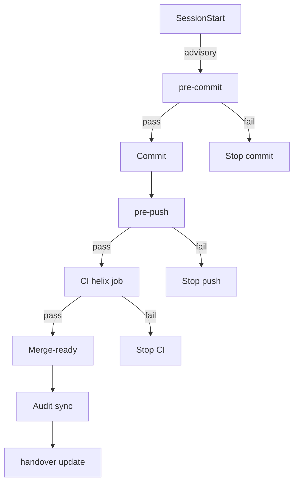
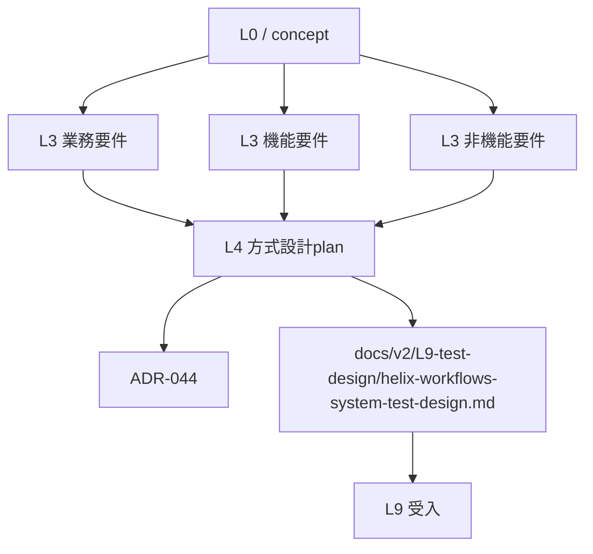
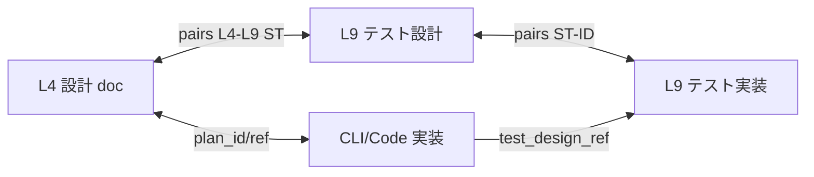

# HELIX-workflows V2 方式設計 (system architecture)

## §0 概要

L4 方式設計は L3 で確定した BR/FR/NFR/AC/OT を実行可能な設計断面に変換し、PLAN と ADR、L9 テスト設計を V-model で双方向 trace する中核文書です。

既存の skeleton は §1〜§7 の本体化を前提に保持されており、§0/§8.1 は本節で industry standard 対応を含めて補完します。

### §0.1 industry standards alignment

#### IEEE 42010:2022 対応

| 要素 | 定義 | HELIX-workflows V2 対応 |
|---|---|---|
| Viewpoint | Architecture 観点を指定するテンプレート。Stakeholder Concerns をフレーム化し複数 view を仕様化 | ADR を Viewpoint として利用し、Decision 1-4 で観点を固定（Decision 1: Architecture layers, Decision 2: persistence, Decision 3: ratchet, Decision 4: distribution） |
| View | Viewpoint に基づく具体的 architecture representation | L4 §1-§7 を View として分割（System Context, Container, Component, Runtime, Audit） |
| Concern | 利害関係者の関心事項（品質、セキュリティ、保守性、相互作用） | BR-09〜12、G3 P1 5 件、NFR/AC で識別し ST mapping へ反映 |
| Stakeholder | 設計決定の影響を受ける関係者 | PM / TL / SE / PO / project owners と auditable role |
| Architecture Aspect | 要件や品質に関わる属性（可用性、保守性、監査、workspace isolation） | helix.db 永続化、ratchet、hook、サブエージェント配線として L1-L14 で反映 |
| Architecture Element | Architecture Description 全要素（Stakeholder, Concern, Viewpoint, View, Model Kind） | PLAN / ADR / SKILL / CLI command / hook / audit artifact をすべて architecture element として登録 |

#### arc42 12 sections 対応

| arc42 § | 章タイトル | 目的 | HELIX-workflows V2 対応 |
|---|---|---|---|
| §1 | Introduction and Goals | システム要件・品質ゴール・主要 stakeholder | L0 企画書 + L1/L3 要件 |
| §2 | Constraints | 設計・実装を制約する条件 | NFR グレード / compliance / external API |
| §3 | Context | 外部境界・相互インターフェース | L4 System Context（cli / skills / helix-workflows） |
| §4 | Solution Strategy | 主要意思決定と rationale | ADR-044 Decision 1-4 |
| §5 | Building Blocks | static structure: modules/subsystem | L4 §3 Container 断面（cli/lib, schemas, plan 構成） |
| §6 | Runtime View | 動的振る舞いと interaction | L5-L6 workflow sequence（agent fire / doctor / gate） |
| §7 | Deployment View | デプロイ/運用環境 | .helix runtime state + helix.db + hook |
| §8 | Concepts | cross-cutting concerns | HELIX-core 共通原則（TDD / ゲート / subagent） |
| §9 | Architecture Decisions | 大型 / リスクの高い決定 | ADR-018〜ADR-044 |
| §10 | Quality Requirements | 性能/セキュリティ/信頼性/保守性 | NFR-MG / AC judge criteria / BR-RULE-09 |
| §11 | Risks and Technical Debt | リスク・技術的負債・対処 | readiness carry / deferred findings register |
| §12 | Glossary | 用語の共通理解 | ROLE_MAP / SKILL_MAP / 用語辞書 |

#### C4 model 対応

| C4 Level | 抽象度 | 説明 | HELIX-workflows V2 対応 |
|---|---|---|---|
| Level 1 | System Context | 全体 landscape での system position と外部 interface | L4 §1.1 三層構造 |
| Level 2 | Container | 実行単位（CLI / DB / workflow） | L4 §1.2 永続化 4 種 + §3 技術基盤 |
| Level 3 | Component | container 内の component / module | L4 §3.1 module 表 + L4 §5 subagent 構成 |
| Level 4 | Code | class/function の内部構造 | L5-L6 詳細設計で扱い、L4 では実装要点の参照先のみ |

詳細 viewpoint mapping は ADR-044 §6 Compliance を参照。

### §0.2 V-model pair freeze 数値基準 (L4 PLAN §6 参照)

- BR: 12 (BR-01〜12)
- FR: 16
- NFR: 27
- AC: 57
- OT: 12
- 本 wave で新規追加なし、PLAN §6 参照

## §1 システム構成

### §1.1 三層構造

#### 1.1.1 層構造表

| 層 | 主要構成 | 責務 | 入口 |
|---|---|---|---|
| HELIX-workflows | `HELIX-workflows/helix-process/*`, `docs/v2/*`, `docs/adr/*` | 工程、ガイド、観測方針の正本管理 | `helix plan/matrix/gate/sprint` |
| cli | `cli/`, `cli/lib/`, `.github/workflows/*` | 実行、監査、DB、hook、役割解決 | `helix` コマンド群 |
| skills | `skills/common`, `skills/workflow`, `skills/tools`, `skills/project`, `skills/advanced` | 知識資産と運用知識、レビュー基準 | `helix codex --role ...` |

#### 1.1.2 cli 内訳

| entrypoint | ファイル / 代表 | 役割 |
|---|---|---|
| helix | `cli/helix` | 全 mode ルータ |
| helix-plan/task/matrix/gate/sprint | `cli/helix-plan` 等 | PLAN, TASK, MATRIX, GATE, SPRINT |
| helix-codex/helix-claude | `cli/helix-codex`, `cli/helix-claude` | 委譲起動、レビュー連携 |
| helix-doctor/helix-agent | `cli/helix-doctor`, `cli/helix-agent` | 医療的観測: ratchet / 監査 / agent 起動 |
| helix-db | `cli/helix-db` | 永続化 DB 操作 |

#### 1.1.3 skills カテゴリ 116+ 内訳

| カテゴリ | 代表的 skill | 役割 |
|---|---|---|
| common | coding, testing, security, git, design, documentation | 横断基準、レビュー共通原則 |
| workflow | api-contract, verification, design-doc, research | 工程、ADR、仕様監査 |
| tools | ai-coding, ide-tools, web-search | 補助技術選定、実行支援 |

### §1.2 永続化 4 種

#### 1.2.1 I/O コマンド例

| 永続化対象 | I/O コマンド | IN (典型) | OUT (典型) |
|---|---|---|---|
| helix.db | `helix db migrate`, `helix db status`, `helix db rollback` | migration version, plan id | schema version, 実行履歴 |
| `.helix/audit/*.yaml` | `helix doctor`, `helix review`, `helix agent fire-mandatory` | payload, evidence path | audit yaml, status |
| git history | `git show`, `git log`, `git merge-base` | hash, branch | commit graph, 変更点 |
| `.helix/handover/*.json` | `helix handover status`, `helix handover update` | task id, owner | session state, next_action |

#### 1.2.2 schema 概要

| 永続化対象 | schema 構造（抜粋） |
|---|---|
| helix.db | `schema_version`, `plan_registry`, `event_log`, `mode_transition`, `audit_link` |
| .helix/audit/*.yaml | `audit_id`, `artifact`, `status`, `evidence`, `retention_until`, `helix_db_event_id` |
| `.helix/audit/balance-ratio-baseline.yaml` | `branch`, `baseline_commit`, `min_ratio`, `source`, `last_updated` |
| `.helix/handover/*.json` | `status`, `mode`, `owner`, `task`, `updated_at`, `stale`, `next_action` |

```yaml
implementation_status: partial
schema_version: 1
audit_snapshot:
  branch: main
audit_records:
  - audit_id: ST1-20260527
    audit_type: layer-separation
    artifact: docs/v2/L4-architecture/helix-workflows-system-architecture.md
    status: pass
    evidence: .helix/audit/l9-system-test-1.yaml
    retention_until: 2026-08-25T00:00:00Z
    helix_db_event_id: 1001
```

### §1.3 Git hook 配線

| Hook | 区分 | 発火順序 | fail-close 条件 | implementation_status |
|---|---|---|---|---|
| SessionStart | advisory | pre-tool-use | context 注入失敗のみ | implemented |
| pre-commit | fail-close | commit 前 | 主要 lint / schema / BR-RULE-09 監査 | implemented |
| pre-push | advisory | push 前 | サイズ超過 / 追加監査欠如 | implemented |
| post-commit | advisory | commit 後 | audit 記録不足 | implemented |
| ci.yml の helix job | fail-close | push 後 | doctor/gate fail / audit hash 不一致 | implemented |



#### hook 2 段 fail-close/アドバイザリ配分

| レイヤ | fail-close | advisory | 備考 |
|---|---|---|---|
| Local 開発 | pre-commit 0.5-2s | pre-commit skip branch | 5 秒目標ではないため、5 秒未満運用を優先 |
| CI | CI 深掘り 20-120s | GitHub Actions の最終検査 | 深掘りで 120秒程度の最遅ライン |

→ pair: L9 §1 ST-1

## §2 アーキテクチャ

### §2.1 PLAN ⊃ ADR レイヤー併存

#### 2.1.1 frontmatter 抜粋

```yaml
plan_id: L4-helix-workflows-方式設計plan
adr_snapshot: docs/adr/ADR-044-helix-workflows-v2-architecture-snapshot.md
pairs_test_design: docs/v2/L9-test-design/helix-workflows-system-test-design.md
parent_process: HELIX-workflows/helix-process/L4-basic-design.md
dependencies:
  - docs/plans/L3/L3-helix-workflows-業務要件plan.md
  - docs/v2/L0-helix-workflows/concept.md
```

#### 2.1.2 依存グラフ



### §2.2 V-model 4 artifact 双方向 trace



| Artifact | identifier 規約 |
|---|---|
| 設計 | `L4-ARCH-<section>-<item>` |
| テスト設計 | `L9-ARCH-<section>-<item>` |
| 実装 | `CLI-<module>-<command>` |
| テスト | `TEST-<scope>-<slug>` |

### §2.3 工程左腕・右腕の V-model ペア凍結 (正本準拠)

正本: [HELIX-workflows/HELIX-process-L0-L14.md §V字の水平対応](../../../HELIX-workflows/HELIX-process-L0-L14.md) / [HELIX_CORE.md §設計⇔テスト対応](../../../helix/HELIX_CORE.md)

V字の水平対応は **設計工程 (左腕) ↔ テスト工程 (右腕) の 6 ペア凍結** のみ。L0 (起点) / L7 (谷) / L11 (総合レビュー) / L13 (デプロイ後検証) は対構造外。

#### 2.3.1 6 ペア凍結表 (左腕 ↔ 右腕、設計⇔テスト)

| 設計層 (左腕) | テスト層 (右腕) | 対応 |
|---|---|---|
| L1 要求定義 / 運用テスト設計 | L14 運用検証 / 機能改善 | **L1 ↔ L14** |
| L2 画面設計 / ワイヤーモック作成 | L10 フロントUX・ビジネスデザイン磨き上げ | **L2 ↔ L10** |
| L3 要件定義 / 受入テスト設計 | L12 デプロイ / 受入テスト / 環境差異巻き取り | **L3 ↔ L12** |
| L4 基本設計 / 総合テスト設計 | L9 総合テスト / 依存関係解消 | **L4 ↔ L9** (本 PLAN 対象) |
| L5 詳細設計 / 結合テスト設計 | L8 結合テスト / 依存関係解消 | **L5 ↔ L8** |
| L6 機能設計 / 単体テスト設計 | L7 実装スプリント (単体テスト実行を内包) | **L6 ↔ L7** |

#### 2.3.2 対構造外の特殊工程

| 工程 | 区分 | 役割 |
|---|---|---|
| **L0** | 起点 | 企画書 (北極星指標・市場仮説)、左右腕の入口 |
| **L7** | 谷 | 実装スプリント (テスト実装 → 本体実装 → 3 点レビュー)、左右腕の交点 |
| **L11** | 右腕 (特殊) | 総合レビュー / ユーザー検証 / 要件巻き取り、**L1 要求定義・L3 要件定義への最終突合** |
| **L13** | 右腕 (特殊) | デプロイ後検証 / 実環境運用、**L9 総合テスト + L12 受入テストの延長** (新規 pair なし) |

### §2.4 9 mode → Forward 回帰

#### 2.4.1 9 mode 一覧

| mode | entry | 終了条件 | Forward 接続 |
|---|---|---|---|
| Forward | 本体化要件確定 | plan freeze | L4→L9 |
| Scrum | 要件反復 | backlog freeze | Forward |
| Discovery | 仮説検証 | D3 evidence | Forward |
| Reverse | 既存設計再発見 | R4 gap map | Forward |
| Incident | 障害対応 | recovery plan | Forward / hotfix |
| Add-feature | 差分追加 | delta plan | Forward |
| Refactor | 構造改善 | regression safe | Forward |
| Research | 先行調査 | research memo | Forward |
| Recovery | run-away recovery | gate unblocked | Forward |

#### 2.4.2 closure event payload

```yaml
mode_transition:
  plan_id: L4-helix-workflows-方式設計plan
  mode_from: Discovery
  mode_to: Forward
  event_id: 3101
  evidence:
    source: docs/v2/L9-test-design/helix-workflows-system-test-design.md
    path: .helix/audit/mode-transition.yaml
  payload_sha: sha256:...
  closed_at: 2026-05-27T00:00:00Z
  closure_state: closed
```

→ pair: L9 §2 ST-2

## §3 技術スタック

### §3.1 CLI / 実装基盤

#### 3.1.1 cli/lib 主要 module

| module | 役割 | implementation_status |
|---|---|---|
| `cli/lib/helix_db.py` | schema 管理 / migration / event 挿入 | implemented |
| `cli/lib/doctor_plan_checks.py` | PLAN 検証（frontmatter / relation） | implemented |
| `cli/lib/audit_validator.py` | audit YAML schema 検証 | implemented |
| `cli/lib/vmodel_pair_freeze.py` | V-model pair 監査 | implemented |
| `cli/lib/harness_monitor.py` | 監査イベント監視 | implemented |

#### 3.1.2 cli 主要 entrypoint

| entrypoint | 用途 |
|---|---|
| `cli/helix` | 9 mode コマンド統合ルータ |
| `cli/helix-plan` / `cli/helix-task` / `cli/helix-matrix` | PLAN / TASK / matrix 管理 |
| `cli/helix-gate` / `cli/helix-sprint` | gate / sprint 管理 |
| `cli/helix-codex` / `cli/helix-claude` | 委譲とレビュー起動 |
| `cli/helix-doctor` / `cli/helix-agent` | doctor / subagent 配線 |
| `cli/helix-db` | DB 参照・監査 |

#### 3.1.3 SQLite schema version 推移

| version | 追加項目 |
|---|---|
| v10 | plan_registry |
| v20 | event_log / mode_transition |
| v24 | audit_link |
| v30 | downstream trace |
| v34 | BR-RULE-09 欠損検出 |
| v35 | dual-write mismatch 検知 |

### §3.2 監査・実行基盤

#### 3.2.1 GitHub Actions

| workflow | 役割 | implementation_status |
|---|---|---|
| `.github/workflows/ci.yml` | lint / test / doctor / gate | implemented |
| `.github/workflows/hotfix.yml` | incident 応答 | implemented |
| `.github/workflows/poc.yml` | PoC 実行 | implemented |

#### 3.2.2 Codex CLI role 一覧（30 role）

`cli/ROLE_MAP.md` と合わせて、L4 で主要確認する role を固定: tl, se, pg, qa, security, dba, devops, docs, research, legacy, perf, fe, recommender, classifier, effort-classifier, pmo-sonnet, pmo-haiku, pdm-tech-innovation, pdm-marketing-innovation, pdm-innovation-manager, impl-sonnet, pm-advisor, tl-advisor, doc-reviewer, pmo-helix-explorer, pmo-helix-scout, pmo-project-explorer, pmo-project-scout, pmo-tech-docs, pmo-tech-fork, pmo-tech-news.

#### 3.2.3 12 種許可 subagent 表（抜粋）

| 種別 | Agent | 実装用途 | implementation_status |
|---|---|---|---|
| mandatory | pmo-helix-explorer | L2-L4 trace | implemented |
| mandatory | pmo-project-explorer | 要件・導線 trace | implemented |
| mandatory | pmo-project-scout | 差分確認 | implemented |
| mandatory | doc-reviewer | 文書監査 | implemented |
| mandatory | pmo-sonnet | Design quality review | implemented |
| mandatory | pmo-helix-scout | 候補確認 | implemented |
| mandatory | pmo-tech-docs | 外部調査補助 | implemented |
| mandatory | pmo-tech-news | 技術情報補足 | implemented |
| on_demand | pmo-haiku | 軽量調査 | implemented |
| on_demand | pm-advisor | PM 近接判断 | implemented |
| on_demand | tl-advisor | 技術判断 | implemented |
| on_demand | pmo-project-explorer | 追加探索 | implemented |

→ pair: L9 §3 ST-3

## §4 BR-12 ratchet 機構の方式

### §4.1 baseline と update policy

```yaml
schema_version: 1
balance_ratio_baseline:
  branch: main
  baseline_commit: HEAD~1
  min_ratio: 1.0
  source: helix doctor --check-changeprop --update
  updated_by: helix-doctor
  updated_at: 2026-05-27T00:00:00Z
checks:
  - id: BR-RULE-12
    command: helix doctor --check-changeprop
    fail_on: ratio_regression
```

#### 入出力

| trigger | IN | OUT | implementation_status |
|---|---|---|---|
| PLAN merge | plan diff, baseline commit | baseline update 必須、event 記録 | implemented |
| commit | commit diff | audit 証跡追加 | implemented |
| manual | commit hash | ADR link + evidence 追加 | partial |

### §4.2 変更分離（read-only と update）

```bash
# read-only
helix doctor --check-changeprop

# write
helix doctor --check-changeprop --update
```

| コマンド | モード | 終了コード | 出力 | fail-close 条件 |
|---|---|---|---|---|
| `helix doctor --check-changeprop` | read-only | 0/1 | ratio_report / mismatch | ratio < 1.0 |
| `helix doctor --check-changeprop --update` | write | 0/2 | ratio_delta / baseline_updated | 更新タイミング逸脱 |

carry note: planned (L7 実装スプリントで CLI flag 実装、現在は L4 設計のみ)

### §4.3 hook 分割

| hook | 種別 | 目標時間 | 役割 | implementation_status |
|---|---|---|---|---|
| pre-commit | fast | 0.5-2s | diff lint / schema / BR-RULE-09 | implemented |
| CI deep | deep | 20-120s | 全体整合 / 回帰 / security | implemented |

#### 違反 yaml 例

```yaml
violations:
  - rule: BR-RULE-09
    level: fail
    path: .helix/audit/balance-ratio-violations.yaml
    observed_at: 2026-05-27T00:00:00Z
    owner: codex
  - rule: BR-RULE-12
    level: warning
    path: .helix/audit/balance-ratio-violations.yaml
    observed_at: 2026-05-27T00:00:00Z
    owner: doc-reviewer
```

### §4.4 SSoT 確定

- path: `.helix/audit/balance-ratio-baseline.yaml`
- source: `helix doctor --check-changeprop --update`
- update policy:
  - PLAN merge 時は PLAN PR 側で更新
  - manual update は ADR snapshot + evidence 更新必須
  - 更新失敗時は block かつ G4 監査時 carry

→ pair: L9 §4 ST-4

### §4.5 BR 実在主張表

| table | 実在主張 | implementation_status |
|---|---|---|
| 4.1 baseline schema | baseline schema example と trigger/policy | implemented |
| 4.4 SSoT update policy | path/source/手順を固定 | implemented |

## §5 mandatory subagent 起動方式

### §5.1 mandatory / on-demand 分離

#### 5.1.1 Phase 別起動表

| Phase | mandatory_by_phase | on_demand_by_phase | implementation_status |
|---|---|---|---|
| L2 | pmo-helix-explorer, pmo-helix-scout | pmo-tech-docs | implemented |
| L3 | pmo-project-explorer, pmo-helix-explorer | pmo-sonnet | implemented |
| L4 | pmo-helix-explorer, pmo-project-explorer, pmo-sonnet, doc-reviewer | pmo-project-scout, pmo-tech-news | implemented |
| L5 | pmo-project-explorer, doc-reviewer | pmo-sonnet | partial |
| L6 | pmo-helix-explorer, pmo-project-scout | pmo-haiku | partial |
| L9 | pmo-sonnet, pmo-helix-explorer, doc-reviewer | pm-advisor | implemented |

doc-reviewer mandatory は G ゲート evidence 観点 (G2/G4/G6) で発火、機械化は L7 carry

#### 5.1.2 mandatory by phase 実在主張

| skill | Lx | mandatory_by_phase | implementation_status |
|---|---|---|---|
| pmo-helix-explorer | L2,L4,L9 | true | implemented |
| pmo-project-explorer | L3,L4,L5,L9 | true | implemented |
| pmo-sonnet | L4,L9 | true | implemented |
| doc-reviewer | L2,L4,L6 (G ゲート evidence) + L9 | true | partial |
| pmo-helix-scout | L2,L5 | true | implemented |
| pmo-project-scout | L4,L6 | true | partial |

### §5.2 `helix agent fire-mandatory --phase Lx`

#### コマンド入出力

```bash
helix agent fire-mandatory --phase L4
```

```yaml
input:
  plan_id: L4-helix-workflows-方式設計plan
  phase: L4
output:
  event_log_id: 101
  spawned_agents:
    - pmo-helix-explorer
    - doc-reviewer
  failed_agents: []
  schema_version: 1
  status: pass
```

#### DB record schema / recovery

| column | 型 | 用途 | 失敗時 recovery |
|---|---|---|---|
| `event_log_id` | int | 呼び出しの trace key | 再実行後に新ID発行 |
| `phase` | text | 対象工程 | 不一致なら fail-close |
| `agent_role` | text | 呼び出し対象 | 重複排除後に再起動 |
| `event_status` | text | pass/fail/warn | 失敗なら next_phase 遷移停止 |
| `evidence_path` | text | 監査 evidence | 30 分以内に再実行 |

### §5.3 監査連動

```yaml
db_audit_link:
  event_log_id: 101
  audit_yaml: .helix/audit/mandatory-agents-l4-entry.yaml
  audit_sha256: "..."
  handover_task_id: "L4-helix-workflows-方式設計plan"
```

欠損は G2 / G4 entry で fail-close。

→ pair: L9 §5 ST-5

## §6 二重/三重 audit pattern

### §6.1 3 重監査の役割分離

| 層 | 読み取り対象 | 役割分離 |
|---|---|---|
| 1st | tl-advisor | 全体設計妥当性・監査方針 |
| 2nd | pmo-sonnet | 実務整合・要件照合 |
| 3rd | doc-reviewer | 文書品質（業界標準 + implementation_status） |

### §6.2 evidence yaml schema

```yaml
doc_review:
  doc_id: docs/v2/L4-architecture/helix-workflows-system-architecture.md
  audit_id: audit-20260527-01
  evidence_path: .helix/audit/l4-arch-doc-review.yaml
  required_fields:
    - reviewer
    - target
    - status
    - helix_db_event_id
    - created_at
  cross_checks:
    - reviewer must be doc-reviewer
    - event_id must match helix_db event_log
```

### §6.3 doc-reviewer evidence YAML schema

```yaml
doc_reviewer_evidence:
  review_id: dr-20260527-01
  target_doc: docs/v2/L4-architecture/helix-workflows-system-architecture.md
  advisor_id: doc-reviewer
  verdict: pass
  retention_days: 90
  created_at: 2026-05-27T00:00:00Z
  retention_until: 2026-08-25T00:00:00Z
  helix_db_fk:
    table: event_log
    event_id: 101
  required_fields:
    - review_id
    - target_doc
    - verdict
    - retention_until
    - helix_db_fk
  missing_required:
    - none
```

- 欠落時は G2 / G4 entry で fail-close。

→ pair: L9 §6 ST-6

## §7 採用 project への配布

### §7.1 portable package 配布対象

| 分類 | 収録対象 |
|---|---|
| framework | `HELIX-workflows/helix-process` |
| command | `cli/helix*`, `.github/workflows/*` |
| config | `cli/config/*`, `cli/roles/*`, `cli/schemas/*` |
| knowledge | `skills/common`, `skills/workflow`, `skills/tools`, `skills/project`, `skills/advanced` |

### §7.2 配布後の更新方針

受入 project は portable package で導入し、既存 git 履歴は再初期化しない。ステップ完了後に `helix init --template` と `helix doctor` を1回通過し、更新ごとに `implementation_status` を再計測する。

### §7.3 BR-09 / BR-10 carry を本体化

#### Strangler Fig 3-stage migration + rollback

| Stage | 目的 | rollback 条件 | 完了 evidence |
|---|---|---|---|
| Stage 1 並行 | 既存資産を壊さず新配列を追加 | 2 回連続 fail-close | Stage 1 migration note |
| Stage 2 置換 | 中核パスを新仕様へ切替 | 重要 KPI 未達 2 回連続 | migration audit summary |
| Stage 3 収束 | 完全移行後の固定 | 回帰劣化 > 許容閾値 | plan-gate report |

- evidence 連動: `docs/v2/L9-test-design/helix-workflows-system-test-design.md`（ST-7）

→ pair: L9 §7 ST-7

## §8 残課題

### §8.1 構造的 carry

- `§2.4` の closure payload で `payload_sha` 生成時の暗号方式を将来統一（現時点では sha256 の記載まで）
- 監査 evidence の 90 日超過時自動 purge ルールの実装実体

### §8.2 実在主張表 retrofit（BR-RULE-09）

| section | 実在主張 | implementation_status |
|---|---|---|
| §1.3 hook 配線 | fail-close / advisory / mermaid | added |
| §3.1 module / entrypoint / schema | implementation 状態追跡 | added |
| §4.1〜§4.4 ratchet | schema / command / hook / SSoT | added |
| §6.3 doc-reviewer evidence schema | 90日 / FK / fail 条件 | added |

### §8.3 採用 project 配布 carry

- §7 配布対象は本体化済み。
- BR-09/BR-10 は Stage 遷移と evidence の carry のみ残存。
