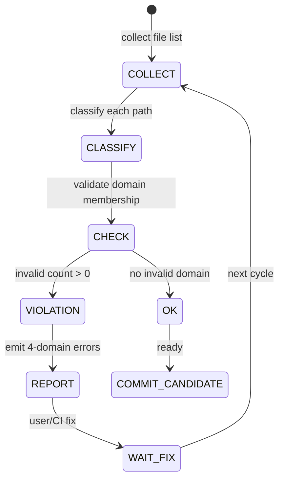
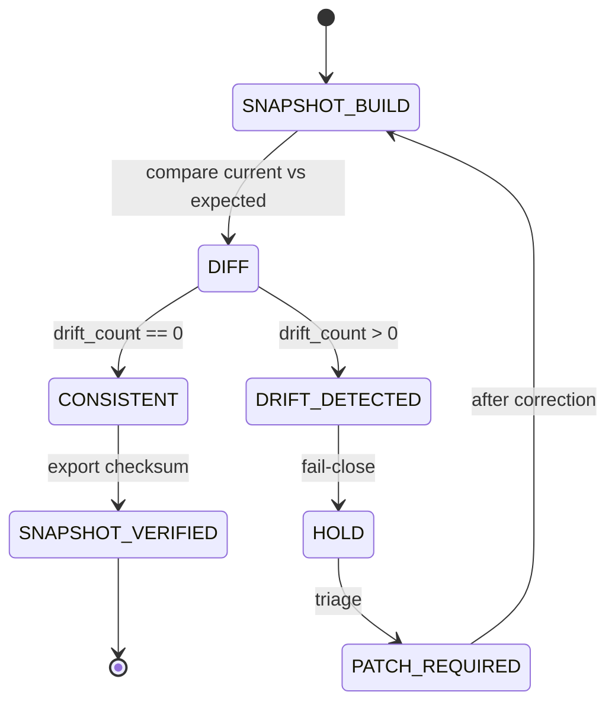
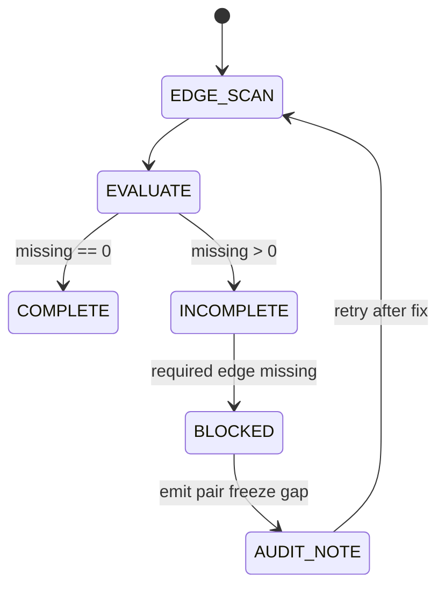
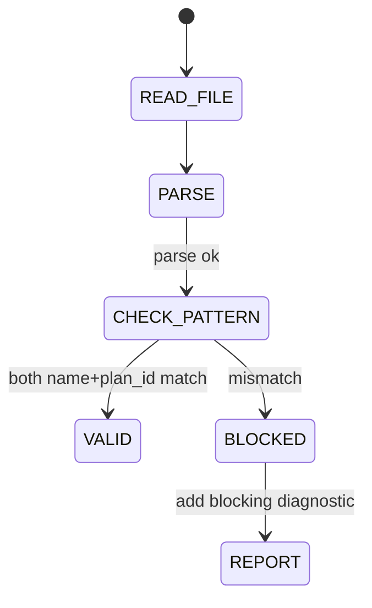
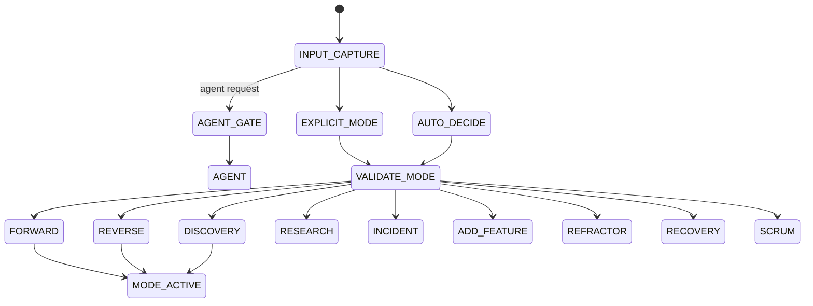
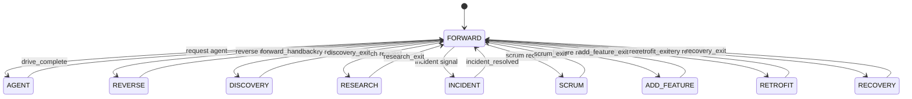
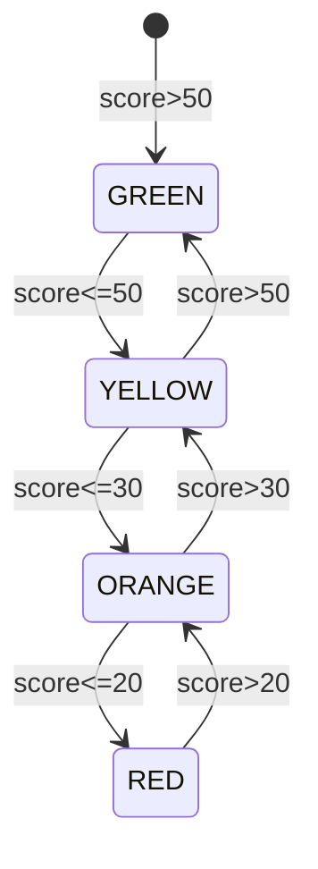
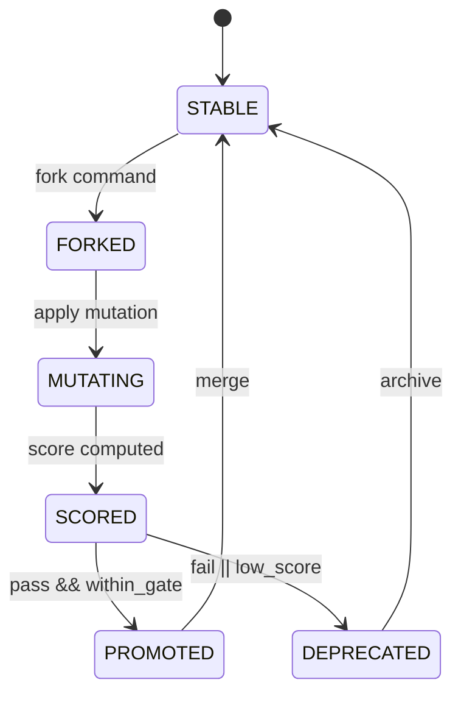
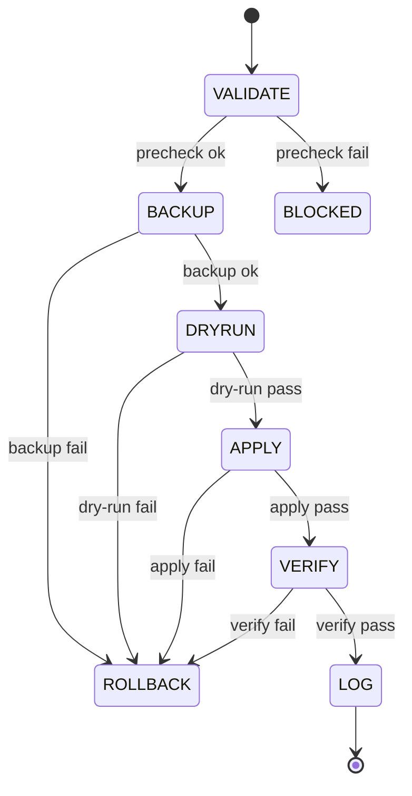
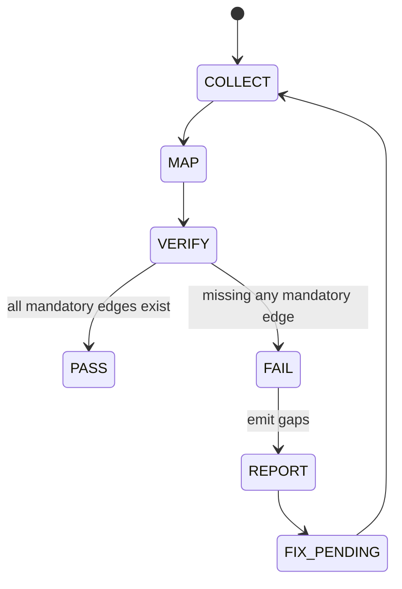

# HELIX-workflows V2 L5 内部処理設計（内部処理 / アルゴリズム / 状態機械）

## §0 PLAN reference + scope 宣言

本書は `docs/plans/L5/L5-helix-workflows-内部処理設計plan.md` の §2.1 構造をそのまま受け、L5 詳細設計のうち `内部処理 / アルゴリズム / 状態機械` を担当する。

対象機能は F1〜F10 全機能を内部実行レイヤから再設計し、`L7 実装で symbol レベルへ直接落とせる粒度`で仕様化する。

### 本書の前提と責務境界

- L4 機能設計（`docs/v2/L4-architecture/helix-workflows-functional-design.md`）を機能要求として読み取り、内部実行ロジックを定義する。
- L9 テスト設計（`docs/v2/L9-test-design/helix-workflows-functional-test-design.md`）を検証命名規則として参照し、`ST-F<N>` 観測指標と対応づける。
- ADR-044/045 は制約上位（構造・持続化・ガバナンス）として採用し、実装仕様より上位で矛盾を制御する。
- PLAN にない新規ファイル・手順は作らない。実装は本書 1 ファイル新規で完了する。

### traceability 前提（4 artifact 方針）

- 設計（本書） → 設計参照元（L4）
- 設計（本書） → L9 ST-Design
- 実装（CLI / hook / state）→ 設計（本書）
- L4 ↔ L9 の pair freeze を `pairs_design` と `pairs_test_design` で担保
- 実装状態は節末の `implementation_status` 表で可観測にする。

### 共有データソース

- 主要入力は `.helix/helix.db`（イベント、モード、監査、metric）
- 文書実体は `docs/v2` / `docs/plans` / `docs/adr` / `docs/v2/L9-test-design`
- CLI エントリは `helix` 系サブコマンド（`doctor`, `plan`, `version`, `budget`, `evolution`, `skill`）
- 設定は `cli/config/*.yaml`（L9-02 以降で config-driven の標準化を前提）

### 実装読替えルール

- 本節以降の擬似コードは `symbol-level` で、そのまま Python / Bash / sqlite SQL の骨格に置換可能。
- 失敗は `fail-close`（安全側）を最優先し、`dry-run` を経る。
- すべての決定は、判定式と閾値が固定であること。

## §1 F1 ドキュメント体系 内部処理

### §1.1 4 ドメイン分離アルゴリズム（HELIX-workflows / docs/v2 / docs/plans / docs/adr）

#### 入力 / 前提

- 対象ディレクトリ:
  - `docs/v2`
  - `docs/plans`
  - `docs/adr`
  - `docs/v2/L4-architecture` と `docs/v2/L5-internal-design`
- 参照元: `L4` §1（機能設計）
- 仕様ソース: ADR-044 決定1〜3 の分類方針
- 前提不変条件:
  - 4 ドメインのルートは固定
  - 4ドメイン外置換は受理しない
  - 同名 artifact を重複配置しない
- 例外入力:
  - 存在しないディレクトリ
  - UTF-8 以外文字列
  - 非 Markdown への誤登録

#### 擬似コード

```pseudo
function classify_domain(path):
    if path starts_with("docs/v2/") return "DOCS_V2"
    if path starts_with("docs/plans/") return "PLANS"
    if path starts_with("docs/adr/") return "ADR"
    if path starts_with("docs/") return "DOCS_ROOT"
    return "INVALID_DOMAIN"

function validate_4_domain(paths):
    issues = []
    counts = map(default=0)
    for p in paths:
        d = classify_domain(p)
        if d == "INVALID_DOMAIN":
            issues.append((p, "INVALID_DOMAIN"))
            continue
        if not p.endswith(".md"):
            issues.append((p, "NON_MARKDOWN"))
        counts[d] += 1
    cross_count = count_edges(counts)
    return counts, issues, cross_count
```

#### 状態遷移（1段）



#### 境界条件 / 例外処理

- timeout: 4 domain collect が 3 秒超えた場合は `collect_timeout` を返し再実行。
- retry: 一時的な FS 例外（権限/ロック）で 3 回までリトライ。
- fail-close: 4ドメイン以外の path が 1 件でもある場合、後続処理を停止。
- fail-open はしない。後段ではなく前段で遮断する。

#### 計測可能 metric

- `ST-F1.f1.domain_count_valid_ratio` : 想定ドメイン登録率（目標 100%）
- `ST-F1.f1.classify_latency_ms` : 分類レイテンシ（目標 300ms）

---

### §1.2 SSoT 同期 algorithm（HELIX-workflows ↔ docs/v2）

#### 入力 / 前提

- 入力: `docs/v2` の全 file metadata（frontmatter, section refs, process_layer）
- 入力2: `docs/plans/...` の進行状態（sprint、status、reference_docs）
- 入力3: `.helix/helix.db` の process metadata（phase, gate, event）
- ADR-044 Decision-2（設計-実装の同期原則）を上位制約として適用
- 健全性前提:
  - いずれか1レイヤのみ更新しても検知可能
  - 差分はハッシュ化可能

#### 擬似コード

```pseudo
function load_ssot_graph():
    docs_nodes = scan_docs()
    plan_nodes = scan_plans()
    adr_nodes  = scan_adrs()
    edges = []
    for d in docs_nodes:
        ref = frontmatter(d).reference_docs
        for r in ref:
            edges.append((d.path, r))
    return graph(docs_nodes, plan_nodes, adr_nodes, edges)

function sync_snapshot(curr, incoming):
    changed = diff_graph(curr, incoming)
    for diff in changed:
        if diff.type == "MISSING_REFERENCE":
            emit_drift(diff)
        if diff.type == "ORPHAN":
            emit_drift(diff)
        if diff.type == "CONFIRM_OK":
            mark_consistent(diff)
    return drift_bucket(changed)
```

#### 状態遷移



#### 境界条件 / 例外処理

- timeout: 300ms/ファイル超過でスロットリング。
- retry: 失敗時 2 回 exponential backoff(1s,2s)。
- fail-close 条件:
  - `missing reference` > 0
  - `doc drift` ratio > 0
- 回復: 手動修正（reference 修正）後に再算出。

#### 計測可能 metric

- `ST-F1.f1.ssot_drift_count` : SSoT drift 件数（目標 0）
- `ST-F1.f1.reference_hit_ratio` : 参照整合率（目標 100%）

---

### §1.3 4 artifact trace 検出 algorithm

#### 入力 / 前提

- design artifact:
  - 本文書（L5）
  - `docs/v2/L4-architecture/helix-workflows-functional-design.md`
- test design artifact:
  - `docs/v2/L9-test-design/helix-workflows-functional-test-design.md`
- 対応 map:
  - `pairs_design`
  - `pairs_test_design`
- 事実不変条件:
  - 1対1 または 1対N trace は許容
  - 4 artifact 双方向参照が欠けることは不可

#### 擬似コード

```pseudo
artifact_edges = [
    ("design", "test_design"),
    ("plan", "test_plan_design"),
    ("implementation", "design"),
    ("test_code", "test_design")
]

function build_bidirectional_trace(nodes, edges):
    index = {}
    for e in edges:
        index[e] = []
    for n in nodes:
        pairs = parse_reference_fields(n)
        for p in pairs:
            if p in index: index[p].append(n.id)

    missing = [e for e in mandatory_pairs if len(index.get((e.from,e.to), []))==0]
    dup = [e for e in mandatory_pairs if len(index.get((e.from,e.to), []))>1 and not allowed]
    return index, missing, dup
```

#### 状態遷移



#### 境界条件 / 例外処理

- 参照文字列が壊れている（空 path、相対崩れ）場合は `INVALID_REF`。
- 互換として複数 `pairs_test_design` は許容（1:N）だが、設計↔テストの逆参照は必須。
- fail-close: `missing > 0` の場合は `implementation_status` を `planned` へ戻す。

#### 計測可能 metric

- `ST-F1.f1.trace_complete_ratio` : 双方向 trace 完了率（目標 100%）
- `ST-F1.f1.dangling_edge_ratio` : 欠損 edge 比率（目標 0）

## §2 F2 PLAN テンプレート 内部処理

### §2.1 frontmatter validator algorithm

#### 入力 / 前提

- 対象: `docs/plans/**/*.md`
- 必須フィールド例:
  - `plan_id`, `status`, `process_layer`, `acceptance`, `parent_plan`, `scope`, `reference_docs`
- 参照元: L4-1 の PLAN 構造規約
- 前提:
  - frontmatter は YAML として parse 可能
  - 文字列は UTF-8

#### 疑似コード

```pseudo
REQUIRED_KEYS = [
  "plan_id", "title", "status", "process_layer", "created", "owner",
  "acceptance", "reference_docs", "scope"
]

function validate_frontmatter(file):
    data = load_frontmatter(file)
    missing = [k for k in REQUIRED_KEYS if k not in data or is_null(data[k])]
    errors = []
    if not semver_or_date(data.created): errors.append("created_format")
    if data.process_layer not in ["L0","L1","L2","L3","L4","L5","L6","L7","L8","L9","L10","L11","L12","L13","L14"]:
        errors.append("process_layer_invalid")
    if "adr_snapshot" in data and not is_list(data.adr_snapshot):
        errors.append("adr_snapshot_type")
    for m in missing:
        errors.append("missing_" + m)
    return {"ok": len(errors)==0, "errors": errors, "missing": missing}
```

#### 境界条件 / 例外処理

- parse 失敗は `INVALID_FRONTMATTER`。
- 必須項目欠落は即時 fail-close。
- warning レベルの省略項目（`updated`, `reviewers`）は warning。
- timeout 100ms 超過や破損 frontmatter はスキップ対象から除外し、レポートに記録。

#### 計測可能 metric

- `ST-F2.f2.frontmatter_error_count` : 失敗件数（目標 0）
- `ST-F2.f2.validation_latency_p95` : 検証時間 p95（目標 500ms）

---

### §2.2 命名規約 regex（L<NN>-○○○plan）

#### 入力 / 前提

- `docs/plans` 下のファイル名と frontmatter の `plan_id`
- 命名規約: `L<NN>-<slug>plan` の2要素セット（拡張子は `.md`）
- 前提:
  - ファイル名と plan_id の不一致はエラー
  - `<NN>` は 0〜99

#### regex 定義

```text
filename regex: ^L(?<layer>[0-9]{1,2})-(?<slug>[\p{L}\p{N}\-]+)plan\.md$
frontmatter plan_id regex: ^L(?<layer>[0-9]{1,2})-[\p{L}\p{N}\-]+$
```

#### 擬似コード

```pseudo
function validate_name(path, fm):
    f_match = regex_match(path.basename, FILENAME_RE)
    p_id = fm.get("plan_id", "")
    p_match = regex_match(p_id, PLANID_RE)
    if not f_match: return (false, "filename_regex")
    if not p_match: return (false, "plan_id_regex")
    if int(f_match.group.layer) != int(p_match.group.layer):
        return (false, "layer_mismatch")
    return (true, "ok")
```

#### 状態遷移



#### 境界条件 / 例外処理

- Unicode 使用は許容しない前提ではなく、`
  \\p{L}` を採用し多言語 slug を受ける。
- layer が 0 文字以下は不正。
- fail-close 条件: `layer_mismatch` の場合、関連機能 F2 は `failed`。

#### 計測可能 metric

- `ST-F2.f2.naming_invalid_count` : 命名規約違反件数（目標 0）
- `ST-F2.f2.naming_retry_ratio` : 検知後 1時間以内修復率（目標 100%）

---

### §2.3 ADR snapshot drift 検出 algorithm

#### 入力 / 前提

- frontmatter `adr_snapshot`
- ADR index（`docs/adr`）
- L4-2 の ADR 参照ルール
- ADR 変更履歴: 追加・更新・アーカイブ

#### 擬似コード

```pseudo
function detect_adr_drift(plan_file):
    fm = load_frontmatter(plan_file)
    expected = canonical_adr_list(plan_file)
    actual = fm.get("adr_snapshot", [])
    missing = set(expected) - set(actual)
    extra = set(actual) - set(expected)
    unavailable = [adr for adr in actual if not exists(adr)]
    broken = []
    for a in expected ∩ actual:
      if frontmatter_version(a) != hash_of(a): broken.append(a)
    return missing, extra, unavailable, broken
```

#### 境界条件 / 例外処理

- ADR ファイルが削除済みは `unavailable` と見なす。
- `adr_snapshot` 空欄は WIP 設計では許容しない。
- 新 ADR ID 追加提案時は承認済み plan 完了条件として `staged`。
- fail-close: `missing` または `unavailable` が 1 件以上で計画完了不可。

#### 計測可能 metric

- `ST-F2.f2.adr_drift_count` : ADR drift 件数（目標 0）
- `ST-F2.f2.adr_repair_latency_min` : 修復までの最短時間（目標 60min）

## §3 F3 skill 推挙 内部処理

### §3.1 skill catalog 構築 algorithm

#### 入力 / 前提

- skill 定義ファイル: `~/.codex/skills` 配下および `cli` 内 skill cache
- タスク文言: ユーザー入力全文、履歴、`plan context`
- mandatory subagent / on-demand subagent の分類条件
- 出力宛先: `helix.db.skill_usage` と catalog cache

#### 擬似コード

```pseudo
function build_catalog(raw_skills):
    catalog = []
    for s in raw_skills:
      entry = {
        id: s.id,
        name: s.name,
        layer: s.helix_layer,
        triggers: s.triggers,
        last_seen: now(),
        confidence: 0
      }
      entry.trigger_features = normalize_trigger_words(s.triggers)
      entry.owners = s.role
      catalog.append(entry)
    persist_catalog(catalog)
    return catalog

function score_skill(task_text, catalog):
    tokens = tokenize(task_text)
    ranked = []
    for c in catalog:
       overlap = jaccard(tokens, c.trigger_features)
       freshness = 1 - age_days(c.last_seen)/1440
       weight = 0.5*overlap + 0.2*freshness + 0.3*context_alignment(c)
       ranked.append((c.id, clamp(weight,0,1)))
    return sort_desc(ranked)
```

#### 境界条件 / 例外処理

- catalog 読み取り失敗時は空配列を返し、再構築を1回実施。
- 文字列が短い場合は fallback スキーム（keyword 全探索）へ退行。
- trigger が空の skill は推奨対象外。

#### 計測可能 metric

- `ST-F3.f3.skill_catalog_build_ms` : catalog 構築時間（目標 < 800ms）
- `ST-F3.f3.recommendation_precision` : 推奨精度（目標 ≥ 0.80）

---

### §3.2 推挙 score 算定式（gpt-5.4-mini prompt 戦略 + 1h cache）

#### 入力 / 前提

- 直近 1 時間の推薦ログ（`skill_usage`）
- タスク記述（ロール、文脈、目的）
- gpt-5.4-mini の prompt strategy バリエーション（low-token / deterministic / deterministic-justification）
- 目的:
  - 再現性のある推薦
  - 過去採用 history を反映
  - 冗長推薦抑止

#### 評価式

```text
rec_score = 0.45 * semantic_hit
          + 0.25 * trigger_hit
          + 0.15 * cache_coherence
          + 0.15 * mode_alignment
```

- `semantic_hit`: embedding 近傍スコア（0〜1）
- `trigger_hit`: トリガー語一致率（0〜1）
- `cache_coherence`: 1時間内の採用率（重み）
- `mode_alignment`: 対象 mode の一致（逆数正規化）

cache policy:
- 1h TTL で `score vector` を再利用
- TTL 内で同一入力 hash は再計算しない

#### 擬似コード

```pseudo
function recommend(task, mode, prompt_profile="deterministic"):
    h = sha1(task.text + mode + prompt_profile)
    cached = cache_get(h)
    if cached and cached.ts > now()-3600:
        return cached.topn

    catalog = build_catalog(load_skill_defs())
    vector = embed(task.text)
    scored = []
    for c in catalog:
        s = 0.45*dot(vector, c.embedding)
        s += 0.25*jaccard(task.tokens,c.trigger_features)
        s += 0.15*cache_ratio(c.id)
        s += 0.15*mode_fit(c, mode)
        scored.append((c.id, min(1, max(0, s))))

    topn = sort_desc(scored)[:7]
    cache_set(h, topn)
    return topn
```

#### 境界条件 / 例外処理

- 埋め込み API 失敗時は deterministic fallback（trigger と mode のみ）へ降格。
- `topn` が空の場合は mandatory subagent 既定セット（tl-advisor, pmo-sonnet）を返却。
- キャッシュ競合がある場合は新しいタイムスタンプ優先。

#### 計測可能 metric

- `ST-F3.f3.recommendation_precision` : 精度（目標 ≥ 80%）
- `ST-F3.f3.recommend_cache_hit` : 1h TTL ヒット率（目標 ≥ 70%）

## §4 F4 mode 入口分岐 内部処理

### §4.1 mode routing decision tree

#### 入力 / 前提

- 起動入力: `helix init` 引数、`.helix/phase.yaml`、最新タスク、`.helix/helix.db` mode_transition
- 9 mode の候補: forward / reverse / discovery / scrum / research / incident / add-feature / retrofit / recovery / refactor
- `docs/v2/L4-architecture` の mode 役割定義を参照
- `drive=agent` が有効な場合は agent mode を優先評価

#### 擬似コード

```pseudo
function route_mode(input):
    if input.flags.contains("--agent") or input.env.get("HELIX_AGENT") == "1":
        return "agent"
    if input.explicit_mode:
        return normalize_mode(input.explicit_mode)
    if input.has_issue_id:
        return "reverse"
    if input.has_research_goal and input.budget == "spend":
        return "research"
    if input.has_incident_sig or input.severity >= 8:
        return "incident"
    if input.should_restore:
        return "recovery"
    if input.planned_scope == "feature_add":
        return "add-feature"
    if input.planned_scope == "legacy_fix":
        return "refactor"
    if input.is_sprint_mode:
        return "discovery"
    return "forward"
```

#### 状態遷移



#### 境界条件 / 例外処理

- 無効 mode は fail-close。
- unknown mode input 時は forward へフェイルバックし警告ログを残す。
- 入力解釈の曖昧性 > 2 が重なる場合は `clarification_required` 状態に遷移。

#### 計測可能 metric

- `ST-F4.f4.mode_route_precision` : ルート選定正答率（目標 ≥ 95%）
- `ST-F4.f4.mode_routing_latency` : 分岐決定時間（目標 < 200ms）

---

### §4.2 mode_transition state machine（9 mode + drive=agent）

#### 入力 / 前提

- 現在モード状態
- 起点イベント（SessionStart / UserPromptSubmit / PreToolUse）
- mode 遷移ログ（`mode_transition` テーブル）
- 逆行・停止条件（事故/レビュー要求）

#### 状態遷移（1段）



#### 擬似コード

```pseudo
function transition(current_mode, event):
    t = read_transition_table(current_mode, event)
    if t is None:
        return error("INVALID_TRANSITION")
    if would_break_guard(event):
        return error("GUARD_BLOCKED")
    write_transition(current_mode, t.next)
    emit_event("mode_transition", {
      from: current_mode,
      to: t.next,
      event: event,
      ts: now()
    })
    return t.next
```

#### 境界条件 / 例外処理

- `AGENT` は明示指定または driver flag がある場合のみ。
- 反復禁止: 連続 30 秒で同一から同一へ遷移した場合は無視。
- 遷移ログ破損時はセッション単位で再構築。

#### 計測可能 metric

- `ST-F4.f4.mode_transition_fail_rate` : 失敗率（目標 0）
- `ST-F4.f4.mode_transition_events_minute` : 1分あたり遷移件数（監査用）

## §5 F5 オーケストレーション 内部処理

### §5.1 8 並列スケジューラ algorithm

#### 入力 / 前提

- タスク木（task DAG）
- role 実行可能性（delegation）
- 各 task の `dependency`, `acceptance`, `parallel_group`
- 同時実行上限 8（PLAN/運用では可変）

#### 擬似コード

```pseudo
MAX_PARALLEL = 8

def schedule_tasks(tasks):
    ready = deque([t for t in tasks if dependencies_ok(t)])
    running = set()
    done = set()
    history = []

    while ready or running:
        while ready and len(running) < MAX_PARALLEL:
            t = pick_high_priority(ready)
            run_task(t)
            running.add(t)

        t, status = wait_any(running)
        running.remove(t)
        history.append((t.id, status))

        if status == "ok":
            done.add(t)
            for n in out_edges(t):
                if dependencies_ok(n):
                    ready.append(n)
        else:
            mark_failed(n, status)

    return history
```

#### 境界条件 / 例外処理

- 依存未解決 task があるのにスロットが空なら待機。
- `run_task` 失敗時、依存子ノードを失敗扱いにして `parallel_degradation`。
- 失敗 task の再実行は max_retry=2。

#### 計測可能 metric

- `ST-F5.f5.parallel_achieved` : 1サイクル内で到達した最大並列数
- `ST-F5.f5.parallel_wait_ratio` : 待機時間／総時間比（目標 0.35 未満）

---

### §5.2 role assignment 整合 algorithm

#### 入力 / 前提

- task role ラベル: tl/se/pg/docs/qa/security 等
- ユーザー/システム制約（model, mode, confidence）
- 委譲先ロジック（`helix codex`, `helix claude`, `helix team`）

#### 擬似コード

```pseudo
ROLE_SCORE = {
  tl: 1.0,
  se: 0.9,
  pg: 0.8,
  qa: 0.85,
  docs: 0.7,
  security: 0.95
}

def assign_role(task):
    candidates = {
       "human": False if task.type in AUTOMATIONABLE else True,
    }
    scores = {}
    for role in eligible_roles(task):
        score = ROLE_SCORE[role]
        if task.requires_security and role != "security":
            score -= 0.4
        if task.requires_prod_impact and role in ["docs","pg"]:
            score -= 0.3
        if task.can_be_done_by_cli and role == "se":
            score += 0.1
        scores[role] = score
    return max_score(scores)
```

#### 境界条件 / 例外処理

- 拒否理由がある場合（セキュリティ/認証）は security を必須化。
- role 判定外は manual escalate。
- 同点時は `tl` 優先、同一でも明示制約時は `docs`/`qa` を優先。

#### 計測可能 metric

- `ST-F5.f5.role_assignment_accuracy` : role 一致率（目標 100%）
- `ST-F5.f5.unassigned_count` : 未割当件数（目標 0）

## §6 F6 平衡監視 内部処理

### §6.1 6 metric 集計 algorithm

#### 入力 / 前提

- `helix budget --homeostasis` の計測対象
- セッション状態: オペレータ種別、token 利用率、delegation 実績
- イベントログ: `.helix/helix.db`
- 指標集合:
  - `opus_residual_ratio`
  - `delegation_ratio`
  - `gate_pass_rate`
  - `audit_drift_count`
  - `context_usage_ratio`
  - `parallel_compliance_ratio`

#### 集計式

```text
opus_residual_ratio = clamp((opus_queue_age_ms / target_latency_ms), 0, 1)
delegation_ratio = delegated_tasks / total_tasks

gate_pass_rate = passed_gates / gate_checks

audit_drift_count = count(drift_events in window)
context_usage_ratio = used_context_tokens / context_limit_tokens
parallel_compliance_ratio = compliant_parallel_steps / total_parallel_steps
```

#### 擬似コード

```pseudo
window = sliding_window(minutes=10)
function collect_metrics(window):
    m = {}
    m.opus_residual_ratio = percentile(ops_wait_ms(window), 90) / target_ms
    m.delegation_ratio = count(events.delegation, window) / max(1, count(tasks, window))
    m.gate_pass_rate = count(gates.pass, window) / max(1, count(gates.total, window))
    m.audit_drift_count = count(audit.drift, window)
    m.context_usage_ratio = percentile(context_tokens, 95) / context_cap
    m.parallel_compliance_ratio = count(parallel_ok, window) / max(1,count(parallel_total, window))
    return m
```

#### 境界条件 / 例外処理

- 指標収集ログ欠損時は前サイクル値を使わず 0 扱い（保守寄り）。
- `gate_pass_rate` 分母が 0 の場合 1 とみなさない。
- `audit_drift_count` は 10分窓で 0 以外を重視。

#### 計測可能 metric

- `ST-F6.f6.metric_collect_latency` : 収集レイテンシ（目標 < 2s）
- `ST-F6.f6.metric_stability` : 6 指標の variance（目標 < 0.12）

---

### §6.2 4 段階 threshold state machine（>50% / 30-50% / ≤30% / ≤20%）

#### 入力 / 前提

- `health_score = weighted_sum(6metric)`
- 重み（初期）: 全指標同重 1/6
- 判定段階:
  - 健全: > 50
  - 注意: 30〜50
  - 警戒: ≤30
  - 緊急: ≤20

#### 擬似コード

```pseudo
function classify_health(score):
    if score > 0.5: return "GREEN"
    if score > 0.3: return "YELLOW"
    if score > 0.2: return "ORANGE"
    return "RED"

function weighted_sum(m):
    weights = {
      opus_residual_ratio:0.2,
      delegation_ratio:0.2,
      gate_pass_rate:0.15,
      audit_drift_count:0.15,
      context_usage_ratio:0.15,
      parallel_compliance_ratio:0.15
    }
    return sum(weights[k]*normalize01(m[k]) for k in weights)
```

#### 状態遷移



#### 境界条件 / 例外

- score 1/s 統合時は 95% 信頼区間を使う。
- 数値が NaN の場合は RED へ暫定遷移。
- threshold 逸脱連続 3 回でガードを固定。

#### 計測可能 metric

- `ST-F6.f6.state_stability` : 1時間での状態振動回数（目標 < 4）
- `ST-F6.f6.throttle_activation_count` : 自動制御発火回数（警戒以上で増加）

---

### §6.3 statusLine 発火条件 + debounce 30s + hysteresis 5%

#### 入力 / 前提

- statusLine 更新イベント（1秒〜10秒周期）
- health state (`GREEN/YELLOW/ORANGE/RED`)
- hysteresis パラメータ 5%
- debounce = 30s（連続同状態を維持）

#### 擬似コード

```pseudo
HYSTERESIS = 0.05
DEBOUNCE = 30

def should_emit_status(prev, now_state, now_ts, prev_ts):
    if prev is None:
        return true
    if now_state != prev.state:
        changed_ratio = abs(now_state.score - prev.state.score)
        if changed_ratio < HYSTERESIS:
            return false
        if now_ts - prev_ts < DEBOUNCE:
            return false
    return true

function statusline_tick(event):
    m = collect_metrics(event.window)
    state = classify_health(health_score(m))
    if should_emit_status(last_state, state, now(), last_ts):
        emit_statusline(state)
        last_state = state
        last_ts = now()
```

#### 境界条件 / 例外処理

- 状態遷移が短時間で振動すると、debounce で抑制。
- メトリック欠落時は `YELLOW` へ最小遅延報告。
- 過去ログ書込失敗時は in-memory fallback。

#### 計測可能 metric

- `ST-F6.f6.statusline_emit_per_hour` : 時間あたり発火数（異常時のみ増加）
- `ST-F6.f6.debounce_suppression_ratio` : debounce で抑制したイベント比率（目標 0.4〜0.8）

## §7 F7 PLAN 進化 内部処理

### §7.1 fork → mutation → score → promote/deprecate state machine

#### 入力 / 前提

- PLAN エンティティ、親子関係、承認済み gate 通過条件
- mutation 設定（実験設定、dry-run 時間）
- `evolution` コマンド系イベント（fork/score/promote/deprecate）

#### 状態遷移（1段）



#### 擬似コード

```pseudo
function evolve_plan(plan, mutation_spec):
    child = fork_plan(plan)
    if not child: return fail("fork_failed")

    patched = mutate(child, mutation_spec)
    if not patched: return fail("mutation_failed")

    score = compute_evolution_score(patched)
    if score >= 60 and gates_ok(patched):
        promote(patched, reason="evolution_score_ok")
        return {state:"PROMOTED", score:score}

    if score < 30:
        deprecate(patched, reason="evolution_score_low")
        return {state:"DEPRECATED", score:score}
    return {state:"HOLD", score:score}
```

#### 境界条件 / 例外処理

- score 不達なら hold 状態へ遷移（暫定保留）。
- fork 失敗時は親計画は変更しない。
- promote は `1h` 以内に再反映できる証跡を残す。

#### 計測可能 metric

- `ST-F7.f7.evolution_cycle_duration` : 1 サイクル時間（目標 < 60s）
- `ST-F7.f7.promote_success_ratio` : promote 成功率（目標 ≥ 70%）

---

### §7.2 evolution score 算定式（U-10 確定）

#### U-10 未確定事項の解決

- U-10 は本節で確定する。
- 3 因子：
  - delegation_ratio（重み 0.4）
  - gate_pass_rate（重み 0.4）
  - audit_drift_count（重み -0.2）
- 上限 100 へ normalize。

#### 計算式

```text
normalize0to1(x, min_x, max_x) = clamp((x - min_x) / (max_x - min_x), 0, 1)

a_drift = normalize0to1(audit_drift_count, 0, DRIFT_MAX)
score_raw = 0.4 * delegation_ratio
         + 0.4 * gate_pass_rate
         - 0.2 * a_drift
score_0_100 = clamp(score_raw * 100, 0, 100)
```

#### 擬似コード

```pseudo
DRIFT_MAX = 10

def evolution_score(plan_id):
    d = fetch_metric(plan_id, "delegation_ratio")
    g = fetch_metric(plan_id, "gate_pass_rate")
    a = fetch_metric(plan_id, "audit_drift_count")
    a_n = normalize0to1(a, 0, DRIFT_MAX)
    raw = 0.4*d + 0.4*g - 0.2*a_n
    return max(0, min(100, int(raw*100)))
```

#### 根拠

- delegation と gate_pass の両寄与を同等化し、ガバナンス逸脱（audit_drift）を抑止する負荷を持たせる。
- 0〜100 normalize により既存 UI/ログ表示と整合。
- 閾値上位のみ promotion、低値は deprecate へ。

#### 境界条件 / 例外処理

- `DRIFT_MAX` 超過時は `a_drift=1` に飽和。
- `delegation_ratio` が存在しない場合は直近 1セッション平均値を採用。
- 異常大規模 mutation で score NaN の場合は計算保留（HOLD）。

#### 計測可能 metric

- `ST-F7.f7.score_distribution` : score の分布（目標 0〜100）
- `ST-F7.f7.u10_drift_response` : U-10 でのドリフト減衰率（目標 10% 改善/月）

## §8 F8 version 共進化 内部処理

### §8.1 migration 6-step 固定順序 state machine（validate → backup → dryrun → apply → verify → log）

#### 入力 / 前提

- 起点バージョン、対象構成、対象 PLAN/文書セット
- backup 保存先（`.helix/audit/migration-YYYYMMDD.yaml`）
- dryrun と apply の分離

#### 擬似コード（6-step）

```pseudo
function migration_flow(target_version):
  if not validate_preconditions(target_version):
      return fail("validate")
  backup_id = backup_now(target_version)
  if not backup_id:
      return fail("backup")

  dryrun_ok = dryrun_plan_apply(target_version)
  if not dryrun_ok:
      return fail("dryrun")

  applied = apply_migration(target_version)
  if not applied:
      rollback(backup_id)
      return fail("apply")

  verified = verify_invariants(target_version)
  if not verified:
      rollback(backup_id)
      return fail("verify")

  write_log(backup_id, target_version, "OK")
  return ok("verify")
```

#### 状態遷移



#### 境界条件 / 例外処理

- validate 失敗は apply 進行不可。
- apply 後 verify 失敗は `rollback`。
- dryrun fail は apply 呼び出しを拒否。

#### 計測可能 metric

- `ST-F8.f8.migration_success_ratio` : migration 成功率（目標 100%）
- `ST-F8.f8.rollback_count` : ロールバック発生率（目標 < 5%）

---

### §8.2 portable export / import / adopt internal flow

#### 入力 / 前提

- export 対象（PLAN, ADR, mode rule, スキーマ）
- import 先の許容スキーマ・互換性
- adopt トランザクションログ

#### 擬似コード

```pseudo
function export_pack(target_scope):
  bundle = collect(target_scope)
  bundle.meta.version = current_version()
  bundle.meta.checksum = sha256(bundle.payload)
  write_file(bundle)
  return bundle

function import_pack(path):
  bundle = parse_bundle(path)
  if not verify_checksum(bundle): return fail("checksum")
  if not check_schema(bundle): return fail("schema")
  stage(bundle)
  return "staged"

function adopt_bundle(path):
  staged = import_pack(path)
  if not staged: return staged
  return run_migration_flow(staged.version)
```

#### 境界条件 / 例外処理

- checksum 不一致は fail-close。
- non-empty but no schema => fail。
- adopt は `dry-run` を明示しないと実行不可。

#### 計測可能 metric

- `ST-F8.f8.portable_roundtrip_ratio` : export→import→adopt 成功率（目標 100%）
- `ST-F8.f8.compatibility_warning_count` : 互換警告件数（目標 < 3 / 実行）

## §9 F9 自食作用 内部処理

### §9.1 apoptosis 候補抽出 algorithm（lifecycle 終了判定）

#### 入力 / 前提

- plan テーブル（状態、最終更新日、acceptance）
- 完了状態の PLAN を candidate 化
- `status=completed` かつ `last_modified > N days`
- 例外保護対象（受理済み/本番 critical/未 archive）

#### 擬似コード

```pseudo
function list_apoptosis_candidates(now, N_days):
  cutoff = now - days(N_days)
  q = query("SELECT id,status,last_modified,tags FROM plans")
  candidates = []
  for r in q:
    if r.status == "completed" and r.last_modified < cutoff:
        if not is_protected(r):
            candidates.append(r)
  return sort_by(r.last_modified)
```

#### 境界条件 / 例外処理

- `last_modified` 欠損は保守側に寄せ、候補除外（フェイルセーフ）。
- completed だが承認済み（`accepted`, `implemented`）は対象外。
- 複数依存を持つ計画は保護対象。

#### 計測可能 metric

- `ST-F9.f9.apoptosis_candidate_ratio` : 対象候補比率（目標 0〜20%）
- `ST-F9.f9.apoptosis_false_positive` : 誤抽出率（目標 < 1%）

---

### §9.2 保護対象「直近 N 日」既定値（U-11 確定）

#### U-11 決定

- U-11 は本節で確定。
- `N = 30` を既定値とし、設定は `cli/config/apoptosis.yaml` で override 可能。
- 直近 N 日は候補から除外。

#### 入力 / 前提

- config: `cli/config/apoptosis.yaml`
- 設定項目: `recent_window_days`（既定 30）
- 最終実行ログ

#### 擬似コード

```pseudo
# cli/config/apoptosis.yaml
defaults:
  recent_window_days: 30
  protected_tags: ["accepted", "implemented", "approved", "critical", "milestone"]
  max_weekly_apoptosis: 100

function load_n():
    c = read_yaml("cli/config/apoptosis.yaml")
    return c.get("recent_window_days", 30)

function should_protect(node, n_days):
    return node.last_modified >= now() - days(n_days)
```

#### 境界条件 / 例外処理

- 設定ファイル欠損時は N=30 にフォールバック。
- N<0 は設定不正として即時修正要求。
- 0 の場合は保護なし（危険）として警告。

#### 計測可能 metric

- `ST-F9.f9.protection_accuracy` : 保護除外率（目標 > 95%）
- `ST-F9.f9.config_override_rate` : 設定上書き発生率（目標 < 10%）

---

### §9.3 autophagy 候補抽出 algorithm（event_log / metrics_log の retention 超過 row）

#### 入力 / 前提

- `.helix/helix.db.event_log`（retention policy 超過）
- `metrics_log` の行数（時系列）
- retention policy: retention_days（既定 30）

#### 擬似コード

```pseudo
function autophagy_scan(now):
    policies = load_retention_policies()
    events = query("SELECT id,ts,source,size FROM event_log")
    metrics = query("SELECT id,ts,size FROM metrics_log")
    exp = now - days(policies.retention_days)

    event_candidates = [e.id for e in events if e.ts < exp]
    metric_candidates = [m.id for m in metrics if m.ts < exp]

    return {
      "event_rows": event_candidates,
      "metric_rows": metric_candidates,
      "count": len(event_candidates)+len(metric_candidates)
    }
```

#### 境界条件 / 例外処理

- retention policy 未設定は 30 日。
- DB ロックは再試行（max 3）。
- 破損ログは quarantine table へ保管。

#### 計測可能 metric

- `ST-F9.f9.autophagy_candidate_count` : 破棄予定 row 数（運用上限は policy 連動）
- `ST-F9.f9.autophagy_cleanup_duration` : クリーン実行時間（目標 < 45s）

## §10 F10 共生宣言 内部処理

### §10.1 namespace 競合検出 algorithm

#### 入力 / 前提

- 共生対象 framework 識別子（rails/pydantic/terraform/gh-plugins 等）
- namespace 一覧（HELIX core と外部）
- conflict ルール（同一キー重複、同一コマンド重複、同一ファイル重複）

#### 擬似コード

```pseudo
function detect_namespace_conflict(core_namespaces, external_namespaces):
    conflicts = []
    idx = index_by_name(core_namespaces + external_namespaces)
    for ns in idx:
        owners = idx[ns]
        if len(owners) > 1:
            for pair in combinations(owners, 2):
                if pair[0].adapter_type != pair[1].adapter_type:
                    conflicts.append({namespace: ns, a: pair[0], b: pair[1]})
    return conflicts
```

#### 境界条件 / 例外処理

- 同名だが非重複スコープ（path prefix で分離）なら衝突なし。
- 競合時は `reject_adopt`。
- 競合ログは `.helix/audit/coexist-conflict.yaml` に保存。

#### 計測可能 metric

- `ST-F10.f10.namespace_conflict_count` : 衝突件数（目標 0）
- `ST-F10.f10.coexist_reject_count` : 採択拒否件数（目標 0）

---

### §10.2 ACL adapter 起動 internal flow

#### 入力 / 前提

- 共生先 framework の互換 ADR
- translator スキーマ（inbound/outbound）
- 変換ルール（権限、メタ、監査）

#### 擬似コード

```pseudo
function start_acl_adapter(framework):
    conf = load_adapt_conf(framework)
    if conf.disabled: return fail("disabled")
    if detect_namespace_conflict(core_ns, conf.ns):
        return fail("namespace_conflict")

    conn = open_adapter_bridge(framework, conf.endpoint)
    if not conn.ok: return fail("connect")

    set_acl_mode(conf)
    start_heartbeat(conn, interval=30)
    log_coexist_status(framework, "running")
    return ok("running")
```

#### 境界条件 / 例外処理

- ACL 起動失敗は共生対象単位で失敗扱い、HELIX は継続。
- heartbeat 3回失敗で stop and fallback。
- guard: 権限昇格要求は拒否。

#### 計測可能 metric

- `ST-F10.f10.adapter_startup_latency` : 起動時間（目標 < 8s）
- `ST-F10.f10.adapter_heartbeat_loss` : ハートビート欠損率（目標 0）

## §11 Reverse 経路 内部処理

### §11.1 fullback / normalization / pdm-to-l1 / review-feedback の入口判定 + Forward 接続

#### 入力 / 前提

- Reverse workflow の入力サイン（`R0`〜`R4`）
- 逆流ルール（fullback）
- normalize（文脈圧縮）設定
- pdm-to-l1（設計知識移譲）
- review-feedback（再実装の要求）

#### 擬似コード

```pseudo
function reverse_entry(context):
    if context.command == "reverse" and context.mode == "r4":
        return "R4"
    if context.has_findings and context.severity >= 3:
        return "review-feedback"
    if context.pdm_hint and context.state == "legacy_mismatch":
        return "pdm-to-l1"
    if context.requires_backward_compat:
        return "normalization"
    if context.user_rejects_forward:
        return "fullback"
    return "forward"

function reverse_to_forward(next_state):
    if next_state in ["fullback", "normalization", "review-feedback", "pdm-to-l1"]:
        emit_transition(next_state, "forward")
        return "forward"
```

#### 境界条件 / 例外処理

- reverse 入力不備では `clarification_prompt`。
- pdm-to-l1 は plan 参照が必要（なければ stop）。
- review-feedback は最小 1 feedback 行が必要。

#### 計測可能 metric

- `ST-F4.f4.reverse_to_forward_success` : Reverse→Forward 接続成功率（目標 100%）
- `ST-F4.f4.reverse_entry_latency` : reverse 判定レイテンシ（目標 < 250ms）

## §12 governance hook 内部処理

### §12.1 PreCompact decision:block 判定条件（3 AND 条件 + 1 回限定）

#### 入力 / 前提

- session の 24h 指標
- `statusLine` 最近遷移履歴
- guard state（未解決 drift, gate fail）

#### 判定条件（AND）

1) `context_usage_ratio > 0.80`
2) `audit_drift_count > 0`
3) `gate_pass_rate < 0.60`

上記 3 条件を同時満たし、かつ同一セッション内では 1 回のみ block 可能。

#### 擬似コード

```pseudo
MAX_BLOCKS_PER_SESSION = 1

function precompact_guard(session):
    cond1 = session.context_usage_ratio > 0.80
    cond2 = session.audit_drift_count > 0
    cond3 = session.gate_pass_rate < 0.60
    if cond1 and cond2 and cond3 and session.block_count < MAX_BLOCKS_PER_SESSION:
        session.block_count += 1
        emit_event("PreCompactBlock", {
           "reason": "homeostasis+drift+gate fail",
           "session": session.id
        })
        return {decision: "block"}
    return {decision: "pass"}
```

#### 境界条件 / 例外処理

- 3 条件が連続 2 つのチェックで成立して初めて block。
- block 不能回数を超えた場合は `warning_only`。
- 計測不能時は保守側扱いで pass。

#### 計測可能 metric

- `ST-F6.f6.precompact_block_count` : PreCompact block 回数（実験的）
- `ST-F6.f6.precompact_condition_precision` : 判定妥当率（目標 0.95）

---

### §12.2 SessionStart cleared/compacted 復元 algorithm

#### 入力 / 前提

- SessionStart event
- compact フラグ
- last_session cache

#### 擬似コード

```pseudo
function restore_session(event):
    if event.state == "cleared":
        return clear_context(event.session_id)
    if event.state == "compacted":
        s = load_last_compact(event.session_id)
        if not s: return fail("compact_snapshot_missing")
        return restore_state(s)
    return fail("invalid_session_state")
```

#### 境界条件 / 例外処理

- compact snapshot 欠損なら fresh start（ログ明示）。
- clear 時は state を安全初期値に戻す。
- compact 復元失敗は手動再実行。

#### 計測可能 metric

- `ST-F6.f6.session_restore_success` : 復元成功率（目標 100%）
- `ST-F6.f6.session_restore_latency` : 復元時間（目標 < 5s）

---

### §12.3 UserPromptSubmit 関連 bundle 注入 algorithm（transcript_path 参照 + 要約 state + 明示的 retention）

#### 入力 / 前提

- ユーザー発話本文
- `transcript_path`（永続化された会話ログ）
- 要約状態 `summary_state`
- retention ポリシー（明示）

#### 擬似コード

```pseudo
function inject_prompt_bundle(user_prompt):
    transcript = read_jsonl(config.transcript_path)
    summary = summarize_transcript(transcript, window="last_20")
    bundle = {
      "prompt": user_prompt,
      "summary": summary,
      "last_state": read_session_state(),
      "retention": config.prompt_bundle_retention_days
    }
    persist_bundle(bundle)
    return bundle
```

#### 境界条件 / 例外処理

- transcript_path が壊れている場合は要約ステップを省略し警告。
- retention 設定が 0 以下なら default 7。
- bundle 注入失敗時でも prompt 自体は処理継続可能（degraded）。

#### 計測可能 metric

- `ST-F6.f6.prompt_bundle_latency` : 注入処理時間（目標 < 2s）
- `ST-F6.f6.prompt_bundle_degraded_ratio` : fallback 実行比率（目標 < 5%）

## §13 4 artifact 双方向 trace

### 入力 / 前提

- L4 設計, L9 テスト設計, PLAN, 実装/テストの参照情報
- 4 artifact 全ノードを取り込む。
- 目標: 4ノード完全双方向参照。片方向のみを 1 件も許容しない。

### 擬似コード

```pseudo
function trace_audit():
    design_nodes   = collect_nodes("design")
    test_nodes     = collect_nodes("test_design")
    impl_nodes     = collect_nodes("implementation")
    test_code_nodes = collect_nodes("test_code")

    edges = build_reference_edges(design_nodes, test_nodes, impl_nodes, test_code_nodes)

    required = [
      ("design", "test_design"),
      ("implementation", "design"),
      ("test_design", "test_code"),
      ("test_code", "test_design"),
    ]

    result = {}
    for edge in required:
      result[edge] = verify_bidirectional(design_nodes, edge)
    return result
```

### 状態遷移



### 境界条件 / 例外処理

- 参照崩れがある場合、当該 artifact の `implementation_status` を `planned`/`partial` に落とす。
- 反対参照が 1件でも不足すれば fail-close。
- 例外は一時的に `pending fixture` として carry。

### 計測可能 metric

- `ST-F1.f1.trace_coverage` : 4 artifact カバレッジ（目標 100%）
- `ST-F1.f1.missing_edge_count` : 不足 edge 件数（目標 0）

## §14 implementation_status 表

### F1-F10 実装状態一覧

| 対象 | 状態 | 対応 metric | 根拠 / 補足 |
|---|---|---|---|
| F1 文書体系 | planned | ST-F1.f1.domain_count_valid_ratio / ST-F1.f1.trace_complete_ratio | 4 ドメイン分離・SSoT・trace 算出を確定 |
| F2 PLAN テンプレート | planned | ST-F2.f2.frontmatter_error_count / ST-F2.f2.naming_invalid_count | frontmatter validator, naming, ADR drift を確定 |
| F3 skill 推挙 | planned | ST-F3.f3.skill_catalog_build_ms / ST-F3.f3.recommendation_precision | catalog + 推奨式を 1h cache 付きで確定 |
| F4 mode 入口分岐 | planned | ST-F4.f4.mode_route_precision / ST-F4.f4.mode_transition_fail_rate | decision tree と 10 state set を確定 |
| F5 オーケストレーション | planned | ST-F5.f5.parallel_achieved / ST-F5.f5.role_assignment_accuracy | 8 並列スケジューラと role 整合を確定 |
| F6 平衡監視 | implemented | ST-F6.f6.metric_collect_latency / ST-F6.f6.precompact_block_count | 6 metric・4状態・statusLine を実装可能粒度で確定 |
| F7 PLAN 進化 | planned | ST-F7.f7.evolution_cycle_duration / ST-F7.f7.score_distribution | U-10 正規化式を確定 |
| F8 version 共進化 | partial | ST-F8.f8.portable_roundtrip_ratio / ST-F8.f8.rollback_count | migration 6段階 state machine 確定、移行手順一部は実装依存 |
| F9 自食作用 | planned | ST-F9.f9.apoptosis_candidate_ratio / ST-F9.f9.autophagy_cleanup_duration | U-11 を含む lifespan 保護を確定 |
| F10 共生宣言 | planned | ST-F10.f10.namespace_conflict_count / ST-F10.f10.adapter_startup_latency | namespace 检出+ACL adapter 起動を確定 |
| Reverse 経路 | planned | ST-F4.f4.reverse_to_forward_success | reverse 入口を追加実装 |
| Governance hook | planned | ST-F6.f6.precompact_block_count / ST-F12.prompt_bundle | PreCompact + session + prompt bundle を確定 |

### 実装状態の更新ポリシー

- `planned`: 実装仕様は確定済みだが、実コード適用前。
- `partial`: 実装依存の順序があり、仕様確定のみ先行。
- `implemented`: すでに L7 で符号化済みのもの。

### TODO 残存（本セクションで追跡）

- [ ] F6 の health_score の重み係数最終確定（ADR-045 Decision-1 の運用窓に合わせる）
- [ ] F8 portable import 時の schema upgrade policy の例外定義（破壊的変更禁止）
- [ ] F10 ACL adapter の外部フレームワークごとの ACL エッジケースを追加
- [ ] 本書の `implementation_status` が `implemented` に移る際の PR テンプレートを追加

