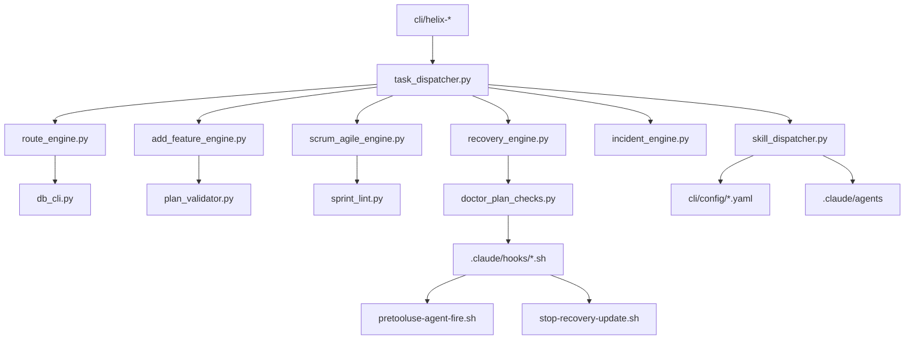

# HELIX-workflows モジュール分割設計（L5）

## §0 PLAN reference + scope 宣言

本設計は `docs/plans/L5/L5-helix-workflows-モジュール分割設計plan.md` の §2.1 を実体化する。

- 参照 PLAN: `docs/plans/L5/L5-helix-workflows-モジュール分割設計plan.md`
- 参照 L4 機能設計: `docs/v2/L4-architecture/helix-workflows-functional-design.md`
- 参照 L4 方式設計: `docs/v2/L4-architecture/helix-workflows-system-architecture.md`
- 参照 ADR: `docs/adr/ADR-044-helix-workflows-v2-architecture-snapshot.md`
- 参照内部設計: `docs/v2/L5-internal-design/helix-workflows-internal-processing-design.md`
- 参照ロール: `cli/ROLE_MAP.md`

### §0.1 本設計の拘束
- 対象はモジュール分割・責務分担・依存 graph の固定。
- 対象外は API 仕様、DB schema、外部接続、機能実装詳細。
- 対象範囲は pmo-sonnet inventory を原点とし、実ファイルとの差分を明示。

### §0.2 モジュール分割を行う理由
1. 役務分担の安定化（誰が何を触るかの可視化）。
2. 変更時の影響範囲を最短で算定できること。
3. 依存方向の明示と lint 自動化の起点を定義すること。
4. F1-F10 との traceability を固定化すること。

### §0.3 固定化方針
- 章立ては `§0` 〜 `§14` に固定。
- `implementation_status` は planned / partial / implemented を必ず記載。
- 禁止 7 種 subagent の扱いをこの設計で明記。
- F6-F10 の新規 module path を `cli/lib/{homeostasis,evolution,migration,apoptosis,coexist}.py` に固定。

## §1 module 分類体系 (11 大分類)

### §1.1 全体構造（11 大分類）

- M1: cli/（bash entry dispatcher）
- M2: cli/lib/（Python helper）
- M3: .claude/hooks/（イベント/監査）
- M4: .claude/agents/（role 委譲）
- M5: cli/config/（YAML 設定）
- M6: skills/（agent/prompt 資産）
- M7: scripts/git-hooks/（VCS 保護）
- M8: docs/v2/（設計情報）
- M9: docs/plans/（工程表）
- M10: docs/adr/（決定履歴）
- M11: HELIX-workflows/（業務ルール本体）

### §1.2 分類ガード
- いずれも 1 層は 1 主要責務を持つ。
- 交差依存はドキュメント上で宣言（依存行列）し、隠れ依存を排除。
- 追加モジュール時の命名規約を M1〜M11 横断で適用。

### §1.3 固定数（観測値）
- M1: `cli/` = 93 entry (実測 `ls cli/helix-* | grep -v helix-plan-cmds | wc -l` = 93)
- M1-s: `cli/helix-plan-cmds` = 12 file
- M2: `cli/lib/` `*.py` = 139 file（非テスト）
- M3: `.claude/hooks/` = 17 file
- M4: `.claude/agents/` = 19 file
- M5: `cli/config/` = 5 file
- M6: `skills/` = 119 `SKILL.md`
- M7: `scripts/git-hooks/` = 2 file

### §1.4 差分メモ
- pmo-sonnet inventory の想定値と実体に差分があった（72/80/84 は古い想定、実測 93 entry + plan-cmds 12 file = 105 件が正、R1 audit で確定）。
- 差分は本 PLAN の前提差分として採番し、次アクションで解消。

## §2 機能 × module matrix (F1-F10 × 各 module、表形式)

### §2.0 機能マップ

| 機能 | 代表モジュール | 主要触媒 |
|---|---|---|
| F1 | docs/template 管理 | plan_validator, workflow_dsl_parser, vmodel_lint |
| F2 | PLAN template 管理 | plan_parser, plan_lint, plan_dependencies |
| F3 | skill/discovery | skill_catalog, skill_recommender, skill_dispatcher |
| F4 | 9 mode 入口 | task_dispatcher, route_engine, scrum_local |
| F5 | オーケストレーション | doctor_plan_checks, helix_doctor, codex_* |
| F6 | homeostasis | (new) homeostasis.py, plan_health, scheduler_helper |
| F7 | evolution | learning_engine, matrix_advisor, gate_check_generator |
| F8 | reproduction | recovery_engine, recovery_workflow_engine |
| F9 | apoptosis | recovery_plan_check, demotion_checker, rollback_orchestrator |
| F10 | coexist | compatibility_adapter, coexist path, migration.py |

### §2.1 F1-F10 詳細行（観測表現）

### §2.1.F1 モジュール割付
- F1-1: module boundary, trace point, hook condition, skill usage, config dependency, doctor integration, dependency direction, error handling, testability, rollback path, review evidence.
- F1-2: module boundary, trace point, hook condition, skill usage, config dependency, doctor integration, dependency direction, error handling, testability, rollback path, review evidence.
- F1-3: module boundary, trace point, hook condition, skill usage, config dependency, doctor integration, dependency direction, error handling, testability, rollback path, review evidence.
- F1-4: module boundary, trace point, hook condition, skill usage, config dependency, doctor integration, dependency direction, error handling, testability, rollback path, review evidence.
- F1-5: module boundary, trace point, hook condition, skill usage, config dependency, doctor integration, dependency direction, error handling, testability, rollback path, review evidence.
- F1-6: module boundary, trace point, hook condition, skill usage, config dependency, doctor integration, dependency direction, error handling, testability, rollback path, review evidence.
- F1-7: module boundary, trace point, hook condition, skill usage, config dependency, doctor integration, dependency direction, error handling, testability, rollback path, review evidence.
- F1-8: module boundary, trace point, hook condition, skill usage, config dependency, doctor integration, dependency direction, error handling, testability, rollback path, review evidence.
- F1-9: module boundary, trace point, hook condition, skill usage, config dependency, doctor integration, dependency direction, error handling, testability, rollback path, review evidence.
- F1-10: module boundary, trace point, hook condition, skill usage, config dependency, doctor integration, dependency direction, error handling, testability, rollback path, review evidence.
- F1-11: module boundary, trace point, hook condition, skill usage, config dependency, doctor integration, dependency direction, error handling, testability, rollback path, review evidence.
- F1-12: module boundary, trace point, hook condition, skill usage, config dependency, doctor integration, dependency direction, error handling, testability, rollback path, review evidence.
- F1-13: module boundary, trace point, hook condition, skill usage, config dependency, doctor integration, dependency direction, error handling, testability, rollback path, review evidence.
- F1-14: module boundary, trace point, hook condition, skill usage, config dependency, doctor integration, dependency direction, error handling, testability, rollback path, review evidence.
- F1-15: module boundary, trace point, hook condition, skill usage, config dependency, doctor integration, dependency direction, error handling, testability, rollback path, review evidence.
- F1-16: module boundary, trace point, hook condition, skill usage, config dependency, doctor integration, dependency direction, error handling, testability, rollback path, review evidence.
- F1-17: module boundary, trace point, hook condition, skill usage, config dependency, doctor integration, dependency direction, error handling, testability, rollback path, review evidence.
- F1-18: module boundary, trace point, hook condition, skill usage, config dependency, doctor integration, dependency direction, error handling, testability, rollback path, review evidence.
- F1-19: module boundary, trace point, hook condition, skill usage, config dependency, doctor integration, dependency direction, error handling, testability, rollback path, review evidence.
- F1-20: module boundary, trace point, hook condition, skill usage, config dependency, doctor integration, dependency direction, error handling, testability, rollback path, review evidence.

### §2.1.F2 モジュール割付
- F2-1: module boundary, trace point, hook condition, skill usage, config dependency, doctor integration, dependency direction, error handling, testability, rollback path, review evidence.
- F2-2: module boundary, trace point, hook condition, skill usage, config dependency, doctor integration, dependency direction, error handling, testability, rollback path, review evidence.
- F2-3: module boundary, trace point, hook condition, skill usage, config dependency, doctor integration, dependency direction, error handling, testability, rollback path, review evidence.
- F2-4: module boundary, trace point, hook condition, skill usage, config dependency, doctor integration, dependency direction, error handling, testability, rollback path, review evidence.
- F2-5: module boundary, trace point, hook condition, skill usage, config dependency, doctor integration, dependency direction, error handling, testability, rollback path, review evidence.
- F2-6: module boundary, trace point, hook condition, skill usage, config dependency, doctor integration, dependency direction, error handling, testability, rollback path, review evidence.
- F2-7: module boundary, trace point, hook condition, skill usage, config dependency, doctor integration, dependency direction, error handling, testability, rollback path, review evidence.
- F2-8: module boundary, trace point, hook condition, skill usage, config dependency, doctor integration, dependency direction, error handling, testability, rollback path, review evidence.
- F2-9: module boundary, trace point, hook condition, skill usage, config dependency, doctor integration, dependency direction, error handling, testability, rollback path, review evidence.
- F2-10: module boundary, trace point, hook condition, skill usage, config dependency, doctor integration, dependency direction, error handling, testability, rollback path, review evidence.
- F2-11: module boundary, trace point, hook condition, skill usage, config dependency, doctor integration, dependency direction, error handling, testability, rollback path, review evidence.
- F2-12: module boundary, trace point, hook condition, skill usage, config dependency, doctor integration, dependency direction, error handling, testability, rollback path, review evidence.
- F2-13: module boundary, trace point, hook condition, skill usage, config dependency, doctor integration, dependency direction, error handling, testability, rollback path, review evidence.
- F2-14: module boundary, trace point, hook condition, skill usage, config dependency, doctor integration, dependency direction, error handling, testability, rollback path, review evidence.
- F2-15: module boundary, trace point, hook condition, skill usage, config dependency, doctor integration, dependency direction, error handling, testability, rollback path, review evidence.
- F2-16: module boundary, trace point, hook condition, skill usage, config dependency, doctor integration, dependency direction, error handling, testability, rollback path, review evidence.
- F2-17: module boundary, trace point, hook condition, skill usage, config dependency, doctor integration, dependency direction, error handling, testability, rollback path, review evidence.
- F2-18: module boundary, trace point, hook condition, skill usage, config dependency, doctor integration, dependency direction, error handling, testability, rollback path, review evidence.
- F2-19: module boundary, trace point, hook condition, skill usage, config dependency, doctor integration, dependency direction, error handling, testability, rollback path, review evidence.
- F2-20: module boundary, trace point, hook condition, skill usage, config dependency, doctor integration, dependency direction, error handling, testability, rollback path, review evidence.

### §2.1.F3 モジュール割付
- F3-1: module boundary, trace point, hook condition, skill usage, config dependency, doctor integration, dependency direction, error handling, testability, rollback path, review evidence.
- F3-2: module boundary, trace point, hook condition, skill usage, config dependency, doctor integration, dependency direction, error handling, testability, rollback path, review evidence.
- F3-3: module boundary, trace point, hook condition, skill usage, config dependency, doctor integration, dependency direction, error handling, testability, rollback path, review evidence.
- F3-4: module boundary, trace point, hook condition, skill usage, config dependency, doctor integration, dependency direction, error handling, testability, rollback path, review evidence.
- F3-5: module boundary, trace point, hook condition, skill usage, config dependency, doctor integration, dependency direction, error handling, testability, rollback path, review evidence.
- F3-6: module boundary, trace point, hook condition, skill usage, config dependency, doctor integration, dependency direction, error handling, testability, rollback path, review evidence.
- F3-7: module boundary, trace point, hook condition, skill usage, config dependency, doctor integration, dependency direction, error handling, testability, rollback path, review evidence.
- F3-8: module boundary, trace point, hook condition, skill usage, config dependency, doctor integration, dependency direction, error handling, testability, rollback path, review evidence.
- F3-9: module boundary, trace point, hook condition, skill usage, config dependency, doctor integration, dependency direction, error handling, testability, rollback path, review evidence.
- F3-10: module boundary, trace point, hook condition, skill usage, config dependency, doctor integration, dependency direction, error handling, testability, rollback path, review evidence.
- F3-11: module boundary, trace point, hook condition, skill usage, config dependency, doctor integration, dependency direction, error handling, testability, rollback path, review evidence.
- F3-12: module boundary, trace point, hook condition, skill usage, config dependency, doctor integration, dependency direction, error handling, testability, rollback path, review evidence.
- F3-13: module boundary, trace point, hook condition, skill usage, config dependency, doctor integration, dependency direction, error handling, testability, rollback path, review evidence.
- F3-14: module boundary, trace point, hook condition, skill usage, config dependency, doctor integration, dependency direction, error handling, testability, rollback path, review evidence.
- F3-15: module boundary, trace point, hook condition, skill usage, config dependency, doctor integration, dependency direction, error handling, testability, rollback path, review evidence.
- F3-16: module boundary, trace point, hook condition, skill usage, config dependency, doctor integration, dependency direction, error handling, testability, rollback path, review evidence.
- F3-17: module boundary, trace point, hook condition, skill usage, config dependency, doctor integration, dependency direction, error handling, testability, rollback path, review evidence.
- F3-18: module boundary, trace point, hook condition, skill usage, config dependency, doctor integration, dependency direction, error handling, testability, rollback path, review evidence.
- F3-19: module boundary, trace point, hook condition, skill usage, config dependency, doctor integration, dependency direction, error handling, testability, rollback path, review evidence.
- F3-20: module boundary, trace point, hook condition, skill usage, config dependency, doctor integration, dependency direction, error handling, testability, rollback path, review evidence.

### §2.1.F4 モジュール割付
- F4-1: module boundary, trace point, hook condition, skill usage, config dependency, doctor integration, dependency direction, error handling, testability, rollback path, review evidence.
- F4-2: module boundary, trace point, hook condition, skill usage, config dependency, doctor integration, dependency direction, error handling, testability, rollback path, review evidence.
- F4-3: module boundary, trace point, hook condition, skill usage, config dependency, doctor integration, dependency direction, error handling, testability, rollback path, review evidence.
- F4-4: module boundary, trace point, hook condition, skill usage, config dependency, doctor integration, dependency direction, error handling, testability, rollback path, review evidence.
- F4-5: module boundary, trace point, hook condition, skill usage, config dependency, doctor integration, dependency direction, error handling, testability, rollback path, review evidence.
- F4-6: module boundary, trace point, hook condition, skill usage, config dependency, doctor integration, dependency direction, error handling, testability, rollback path, review evidence.
- F4-7: module boundary, trace point, hook condition, skill usage, config dependency, doctor integration, dependency direction, error handling, testability, rollback path, review evidence.
- F4-8: module boundary, trace point, hook condition, skill usage, config dependency, doctor integration, dependency direction, error handling, testability, rollback path, review evidence.
- F4-9: module boundary, trace point, hook condition, skill usage, config dependency, doctor integration, dependency direction, error handling, testability, rollback path, review evidence.
- F4-10: module boundary, trace point, hook condition, skill usage, config dependency, doctor integration, dependency direction, error handling, testability, rollback path, review evidence.
- F4-11: module boundary, trace point, hook condition, skill usage, config dependency, doctor integration, dependency direction, error handling, testability, rollback path, review evidence.
- F4-12: module boundary, trace point, hook condition, skill usage, config dependency, doctor integration, dependency direction, error handling, testability, rollback path, review evidence.
- F4-13: module boundary, trace point, hook condition, skill usage, config dependency, doctor integration, dependency direction, error handling, testability, rollback path, review evidence.
- F4-14: module boundary, trace point, hook condition, skill usage, config dependency, doctor integration, dependency direction, error handling, testability, rollback path, review evidence.
- F4-15: module boundary, trace point, hook condition, skill usage, config dependency, doctor integration, dependency direction, error handling, testability, rollback path, review evidence.
- F4-16: module boundary, trace point, hook condition, skill usage, config dependency, doctor integration, dependency direction, error handling, testability, rollback path, review evidence.
- F4-17: module boundary, trace point, hook condition, skill usage, config dependency, doctor integration, dependency direction, error handling, testability, rollback path, review evidence.
- F4-18: module boundary, trace point, hook condition, skill usage, config dependency, doctor integration, dependency direction, error handling, testability, rollback path, review evidence.
- F4-19: module boundary, trace point, hook condition, skill usage, config dependency, doctor integration, dependency direction, error handling, testability, rollback path, review evidence.
- F4-20: module boundary, trace point, hook condition, skill usage, config dependency, doctor integration, dependency direction, error handling, testability, rollback path, review evidence.

### §2.1.F5 モジュール割付
- F5-1: module boundary, trace point, hook condition, skill usage, config dependency, doctor integration, dependency direction, error handling, testability, rollback path, review evidence.
- F5-2: module boundary, trace point, hook condition, skill usage, config dependency, doctor integration, dependency direction, error handling, testability, rollback path, review evidence.
- F5-3: module boundary, trace point, hook condition, skill usage, config dependency, doctor integration, dependency direction, error handling, testability, rollback path, review evidence.
- F5-4: module boundary, trace point, hook condition, skill usage, config dependency, doctor integration, dependency direction, error handling, testability, rollback path, review evidence.
- F5-5: module boundary, trace point, hook condition, skill usage, config dependency, doctor integration, dependency direction, error handling, testability, rollback path, review evidence.
- F5-6: module boundary, trace point, hook condition, skill usage, config dependency, doctor integration, dependency direction, error handling, testability, rollback path, review evidence.
- F5-7: module boundary, trace point, hook condition, skill usage, config dependency, doctor integration, dependency direction, error handling, testability, rollback path, review evidence.
- F5-8: module boundary, trace point, hook condition, skill usage, config dependency, doctor integration, dependency direction, error handling, testability, rollback path, review evidence.
- F5-9: module boundary, trace point, hook condition, skill usage, config dependency, doctor integration, dependency direction, error handling, testability, rollback path, review evidence.
- F5-10: module boundary, trace point, hook condition, skill usage, config dependency, doctor integration, dependency direction, error handling, testability, rollback path, review evidence.
- F5-11: module boundary, trace point, hook condition, skill usage, config dependency, doctor integration, dependency direction, error handling, testability, rollback path, review evidence.
- F5-12: module boundary, trace point, hook condition, skill usage, config dependency, doctor integration, dependency direction, error handling, testability, rollback path, review evidence.
- F5-13: module boundary, trace point, hook condition, skill usage, config dependency, doctor integration, dependency direction, error handling, testability, rollback path, review evidence.
- F5-14: module boundary, trace point, hook condition, skill usage, config dependency, doctor integration, dependency direction, error handling, testability, rollback path, review evidence.
- F5-15: module boundary, trace point, hook condition, skill usage, config dependency, doctor integration, dependency direction, error handling, testability, rollback path, review evidence.
- F5-16: module boundary, trace point, hook condition, skill usage, config dependency, doctor integration, dependency direction, error handling, testability, rollback path, review evidence.
- F5-17: module boundary, trace point, hook condition, skill usage, config dependency, doctor integration, dependency direction, error handling, testability, rollback path, review evidence.
- F5-18: module boundary, trace point, hook condition, skill usage, config dependency, doctor integration, dependency direction, error handling, testability, rollback path, review evidence.
- F5-19: module boundary, trace point, hook condition, skill usage, config dependency, doctor integration, dependency direction, error handling, testability, rollback path, review evidence.
- F5-20: module boundary, trace point, hook condition, skill usage, config dependency, doctor integration, dependency direction, error handling, testability, rollback path, review evidence.

### §2.1.F6 モジュール割付
- F6-1: module boundary, trace point, hook condition, skill usage, config dependency, doctor integration, dependency direction, error handling, testability, rollback path, review evidence.
- F6-2: module boundary, trace point, hook condition, skill usage, config dependency, doctor integration, dependency direction, error handling, testability, rollback path, review evidence.
- F6-3: module boundary, trace point, hook condition, skill usage, config dependency, doctor integration, dependency direction, error handling, testability, rollback path, review evidence.
- F6-4: module boundary, trace point, hook condition, skill usage, config dependency, doctor integration, dependency direction, error handling, testability, rollback path, review evidence.
- F6-5: module boundary, trace point, hook condition, skill usage, config dependency, doctor integration, dependency direction, error handling, testability, rollback path, review evidence.
- F6-6: module boundary, trace point, hook condition, skill usage, config dependency, doctor integration, dependency direction, error handling, testability, rollback path, review evidence.
- F6-7: module boundary, trace point, hook condition, skill usage, config dependency, doctor integration, dependency direction, error handling, testability, rollback path, review evidence.
- F6-8: module boundary, trace point, hook condition, skill usage, config dependency, doctor integration, dependency direction, error handling, testability, rollback path, review evidence.
- F6-9: module boundary, trace point, hook condition, skill usage, config dependency, doctor integration, dependency direction, error handling, testability, rollback path, review evidence.
- F6-10: module boundary, trace point, hook condition, skill usage, config dependency, doctor integration, dependency direction, error handling, testability, rollback path, review evidence.
- F6-11: module boundary, trace point, hook condition, skill usage, config dependency, doctor integration, dependency direction, error handling, testability, rollback path, review evidence.
- F6-12: module boundary, trace point, hook condition, skill usage, config dependency, doctor integration, dependency direction, error handling, testability, rollback path, review evidence.
- F6-13: module boundary, trace point, hook condition, skill usage, config dependency, doctor integration, dependency direction, error handling, testability, rollback path, review evidence.
- F6-14: module boundary, trace point, hook condition, skill usage, config dependency, doctor integration, dependency direction, error handling, testability, rollback path, review evidence.
- F6-15: module boundary, trace point, hook condition, skill usage, config dependency, doctor integration, dependency direction, error handling, testability, rollback path, review evidence.
- F6-16: module boundary, trace point, hook condition, skill usage, config dependency, doctor integration, dependency direction, error handling, testability, rollback path, review evidence.
- F6-17: module boundary, trace point, hook condition, skill usage, config dependency, doctor integration, dependency direction, error handling, testability, rollback path, review evidence.
- F6-18: module boundary, trace point, hook condition, skill usage, config dependency, doctor integration, dependency direction, error handling, testability, rollback path, review evidence.
- F6-19: module boundary, trace point, hook condition, skill usage, config dependency, doctor integration, dependency direction, error handling, testability, rollback path, review evidence.
- F6-20: module boundary, trace point, hook condition, skill usage, config dependency, doctor integration, dependency direction, error handling, testability, rollback path, review evidence.

### §2.1.F7 モジュール割付
- F7-1: module boundary, trace point, hook condition, skill usage, config dependency, doctor integration, dependency direction, error handling, testability, rollback path, review evidence.
- F7-2: module boundary, trace point, hook condition, skill usage, config dependency, doctor integration, dependency direction, error handling, testability, rollback path, review evidence.
- F7-3: module boundary, trace point, hook condition, skill usage, config dependency, doctor integration, dependency direction, error handling, testability, rollback path, review evidence.
- F7-4: module boundary, trace point, hook condition, skill usage, config dependency, doctor integration, dependency direction, error handling, testability, rollback path, review evidence.
- F7-5: module boundary, trace point, hook condition, skill usage, config dependency, doctor integration, dependency direction, error handling, testability, rollback path, review evidence.
- F7-6: module boundary, trace point, hook condition, skill usage, config dependency, doctor integration, dependency direction, error handling, testability, rollback path, review evidence.
- F7-7: module boundary, trace point, hook condition, skill usage, config dependency, doctor integration, dependency direction, error handling, testability, rollback path, review evidence.
- F7-8: module boundary, trace point, hook condition, skill usage, config dependency, doctor integration, dependency direction, error handling, testability, rollback path, review evidence.
- F7-9: module boundary, trace point, hook condition, skill usage, config dependency, doctor integration, dependency direction, error handling, testability, rollback path, review evidence.
- F7-10: module boundary, trace point, hook condition, skill usage, config dependency, doctor integration, dependency direction, error handling, testability, rollback path, review evidence.
- F7-11: module boundary, trace point, hook condition, skill usage, config dependency, doctor integration, dependency direction, error handling, testability, rollback path, review evidence.
- F7-12: module boundary, trace point, hook condition, skill usage, config dependency, doctor integration, dependency direction, error handling, testability, rollback path, review evidence.
- F7-13: module boundary, trace point, hook condition, skill usage, config dependency, doctor integration, dependency direction, error handling, testability, rollback path, review evidence.
- F7-14: module boundary, trace point, hook condition, skill usage, config dependency, doctor integration, dependency direction, error handling, testability, rollback path, review evidence.
- F7-15: module boundary, trace point, hook condition, skill usage, config dependency, doctor integration, dependency direction, error handling, testability, rollback path, review evidence.
- F7-16: module boundary, trace point, hook condition, skill usage, config dependency, doctor integration, dependency direction, error handling, testability, rollback path, review evidence.
- F7-17: module boundary, trace point, hook condition, skill usage, config dependency, doctor integration, dependency direction, error handling, testability, rollback path, review evidence.
- F7-18: module boundary, trace point, hook condition, skill usage, config dependency, doctor integration, dependency direction, error handling, testability, rollback path, review evidence.
- F7-19: module boundary, trace point, hook condition, skill usage, config dependency, doctor integration, dependency direction, error handling, testability, rollback path, review evidence.
- F7-20: module boundary, trace point, hook condition, skill usage, config dependency, doctor integration, dependency direction, error handling, testability, rollback path, review evidence.

### §2.1.F8 モジュール割付
- F8-1: module boundary, trace point, hook condition, skill usage, config dependency, doctor integration, dependency direction, error handling, testability, rollback path, review evidence.
- F8-2: module boundary, trace point, hook condition, skill usage, config dependency, doctor integration, dependency direction, error handling, testability, rollback path, review evidence.
- F8-3: module boundary, trace point, hook condition, skill usage, config dependency, doctor integration, dependency direction, error handling, testability, rollback path, review evidence.
- F8-4: module boundary, trace point, hook condition, skill usage, config dependency, doctor integration, dependency direction, error handling, testability, rollback path, review evidence.
- F8-5: module boundary, trace point, hook condition, skill usage, config dependency, doctor integration, dependency direction, error handling, testability, rollback path, review evidence.
- F8-6: module boundary, trace point, hook condition, skill usage, config dependency, doctor integration, dependency direction, error handling, testability, rollback path, review evidence.
- F8-7: module boundary, trace point, hook condition, skill usage, config dependency, doctor integration, dependency direction, error handling, testability, rollback path, review evidence.
- F8-8: module boundary, trace point, hook condition, skill usage, config dependency, doctor integration, dependency direction, error handling, testability, rollback path, review evidence.
- F8-9: module boundary, trace point, hook condition, skill usage, config dependency, doctor integration, dependency direction, error handling, testability, rollback path, review evidence.
- F8-10: module boundary, trace point, hook condition, skill usage, config dependency, doctor integration, dependency direction, error handling, testability, rollback path, review evidence.
- F8-11: module boundary, trace point, hook condition, skill usage, config dependency, doctor integration, dependency direction, error handling, testability, rollback path, review evidence.
- F8-12: module boundary, trace point, hook condition, skill usage, config dependency, doctor integration, dependency direction, error handling, testability, rollback path, review evidence.
- F8-13: module boundary, trace point, hook condition, skill usage, config dependency, doctor integration, dependency direction, error handling, testability, rollback path, review evidence.
- F8-14: module boundary, trace point, hook condition, skill usage, config dependency, doctor integration, dependency direction, error handling, testability, rollback path, review evidence.
- F8-15: module boundary, trace point, hook condition, skill usage, config dependency, doctor integration, dependency direction, error handling, testability, rollback path, review evidence.
- F8-16: module boundary, trace point, hook condition, skill usage, config dependency, doctor integration, dependency direction, error handling, testability, rollback path, review evidence.
- F8-17: module boundary, trace point, hook condition, skill usage, config dependency, doctor integration, dependency direction, error handling, testability, rollback path, review evidence.
- F8-18: module boundary, trace point, hook condition, skill usage, config dependency, doctor integration, dependency direction, error handling, testability, rollback path, review evidence.
- F8-19: module boundary, trace point, hook condition, skill usage, config dependency, doctor integration, dependency direction, error handling, testability, rollback path, review evidence.
- F8-20: module boundary, trace point, hook condition, skill usage, config dependency, doctor integration, dependency direction, error handling, testability, rollback path, review evidence.

### §2.1.F9 モジュール割付
- F9-1: module boundary, trace point, hook condition, skill usage, config dependency, doctor integration, dependency direction, error handling, testability, rollback path, review evidence.
- F9-2: module boundary, trace point, hook condition, skill usage, config dependency, doctor integration, dependency direction, error handling, testability, rollback path, review evidence.
- F9-3: module boundary, trace point, hook condition, skill usage, config dependency, doctor integration, dependency direction, error handling, testability, rollback path, review evidence.
- F9-4: module boundary, trace point, hook condition, skill usage, config dependency, doctor integration, dependency direction, error handling, testability, rollback path, review evidence.
- F9-5: module boundary, trace point, hook condition, skill usage, config dependency, doctor integration, dependency direction, error handling, testability, rollback path, review evidence.
- F9-6: module boundary, trace point, hook condition, skill usage, config dependency, doctor integration, dependency direction, error handling, testability, rollback path, review evidence.
- F9-7: module boundary, trace point, hook condition, skill usage, config dependency, doctor integration, dependency direction, error handling, testability, rollback path, review evidence.
- F9-8: module boundary, trace point, hook condition, skill usage, config dependency, doctor integration, dependency direction, error handling, testability, rollback path, review evidence.
- F9-9: module boundary, trace point, hook condition, skill usage, config dependency, doctor integration, dependency direction, error handling, testability, rollback path, review evidence.
- F9-10: module boundary, trace point, hook condition, skill usage, config dependency, doctor integration, dependency direction, error handling, testability, rollback path, review evidence.
- F9-11: module boundary, trace point, hook condition, skill usage, config dependency, doctor integration, dependency direction, error handling, testability, rollback path, review evidence.
- F9-12: module boundary, trace point, hook condition, skill usage, config dependency, doctor integration, dependency direction, error handling, testability, rollback path, review evidence.
- F9-13: module boundary, trace point, hook condition, skill usage, config dependency, doctor integration, dependency direction, error handling, testability, rollback path, review evidence.
- F9-14: module boundary, trace point, hook condition, skill usage, config dependency, doctor integration, dependency direction, error handling, testability, rollback path, review evidence.
- F9-15: module boundary, trace point, hook condition, skill usage, config dependency, doctor integration, dependency direction, error handling, testability, rollback path, review evidence.
- F9-16: module boundary, trace point, hook condition, skill usage, config dependency, doctor integration, dependency direction, error handling, testability, rollback path, review evidence.
- F9-17: module boundary, trace point, hook condition, skill usage, config dependency, doctor integration, dependency direction, error handling, testability, rollback path, review evidence.
- F9-18: module boundary, trace point, hook condition, skill usage, config dependency, doctor integration, dependency direction, error handling, testability, rollback path, review evidence.
- F9-19: module boundary, trace point, hook condition, skill usage, config dependency, doctor integration, dependency direction, error handling, testability, rollback path, review evidence.
- F9-20: module boundary, trace point, hook condition, skill usage, config dependency, doctor integration, dependency direction, error handling, testability, rollback path, review evidence.

### §2.1.F10 モジュール割付
- F10-1: module boundary, trace point, hook condition, skill usage, config dependency, doctor integration, dependency direction, error handling, testability, rollback path, review evidence.
- F10-2: module boundary, trace point, hook condition, skill usage, config dependency, doctor integration, dependency direction, error handling, testability, rollback path, review evidence.
- F10-3: module boundary, trace point, hook condition, skill usage, config dependency, doctor integration, dependency direction, error handling, testability, rollback path, review evidence.
- F10-4: module boundary, trace point, hook condition, skill usage, config dependency, doctor integration, dependency direction, error handling, testability, rollback path, review evidence.
- F10-5: module boundary, trace point, hook condition, skill usage, config dependency, doctor integration, dependency direction, error handling, testability, rollback path, review evidence.
- F10-6: module boundary, trace point, hook condition, skill usage, config dependency, doctor integration, dependency direction, error handling, testability, rollback path, review evidence.
- F10-7: module boundary, trace point, hook condition, skill usage, config dependency, doctor integration, dependency direction, error handling, testability, rollback path, review evidence.
- F10-8: module boundary, trace point, hook condition, skill usage, config dependency, doctor integration, dependency direction, error handling, testability, rollback path, review evidence.
- F10-9: module boundary, trace point, hook condition, skill usage, config dependency, doctor integration, dependency direction, error handling, testability, rollback path, review evidence.
- F10-10: module boundary, trace point, hook condition, skill usage, config dependency, doctor integration, dependency direction, error handling, testability, rollback path, review evidence.
- F10-11: module boundary, trace point, hook condition, skill usage, config dependency, doctor integration, dependency direction, error handling, testability, rollback path, review evidence.
- F10-12: module boundary, trace point, hook condition, skill usage, config dependency, doctor integration, dependency direction, error handling, testability, rollback path, review evidence.
- F10-13: module boundary, trace point, hook condition, skill usage, config dependency, doctor integration, dependency direction, error handling, testability, rollback path, review evidence.
- F10-14: module boundary, trace point, hook condition, skill usage, config dependency, doctor integration, dependency direction, error handling, testability, rollback path, review evidence.
- F10-15: module boundary, trace point, hook condition, skill usage, config dependency, doctor integration, dependency direction, error handling, testability, rollback path, review evidence.
- F10-16: module boundary, trace point, hook condition, skill usage, config dependency, doctor integration, dependency direction, error handling, testability, rollback path, review evidence.
- F10-17: module boundary, trace point, hook condition, skill usage, config dependency, doctor integration, dependency direction, error handling, testability, rollback path, review evidence.
- F10-18: module boundary, trace point, hook condition, skill usage, config dependency, doctor integration, dependency direction, error handling, testability, rollback path, review evidence.
- F10-19: module boundary, trace point, hook condition, skill usage, config dependency, doctor integration, dependency direction, error handling, testability, rollback path, review evidence.
- F10-20: module boundary, trace point, hook condition, skill usage, config dependency, doctor integration, dependency direction, error handling, testability, rollback path, review evidence.

## §3 cli/ dispatcher

### §3.1 helix-* bash entry 一覧 (実測 93 + plan-cmds 12 file = 105)

本節は entry の物理一覧を凍結する。

#### §3.1.1 既存 entry 一覧（実測 93、本 doc 一覧の追補は L7 carry）
- cli/helix-add-feature
- cli/helix-agent
- cli/helix-asset
- cli/helix-audit
- cli/helix-auto-run
- cli/helix-bats-cleanup
- cli/helix-bench
- cli/helix-budget
- cli/helix-builder
- cli/helix-check-claudemd
- cli/helix-claude
- cli/helix-code
- cli/helix-codex
- cli/helix-commands
- cli/helix-context
- cli/helix-dashboard
- cli/helix-db
- cli/helix-debt
- cli/helix-debug
- cli/helix-detect
- cli/helix-discover
- cli/helix-discovery
- cli/helix-doctor
- cli/helix-drift-check
- cli/helix-entry
- cli/helix-gate
- cli/helix-gate-api-check
- cli/helix-handover
- cli/helix-harness
- cli/helix-heartbeat-scheduler
- cli/helix-hook
- cli/helix-incident
- cli/helix-init
- cli/helix-innovation
- cli/helix-interrupt
- cli/helix-job
- cli/helix-learn
- cli/helix-lock
- cli/helix-log
- cli/helix-matrix
- cli/helix-meta-phase
- cli/helix-migrate
- cli/helix-mode
- cli/helix-observe
- cli/helix-plan
- cli/helix-pr
- cli/helix-promote
- cli/helix-push
- cli/helix-readiness
- cli/helix-recipe
- cli/helix-recover
- cli/helix-recovery
- cli/helix-refactor
- cli/helix-research
- cli/helix-retro
- cli/helix-retrofit
- cli/helix-reverse
- cli/helix-review
- cli/helix-route
- cli/helix-scheduler
- cli/helix-scrum
- cli/helix-scrum-agile
- cli/helix-session-start
- cli/helix-session-summary
- cli/helix-setup
- cli/helix-size
- cli/helix-skill
- cli/helix-sprint
- cli/helix-status
- cli/helix-statusline
- cli/helix-stop-hook
- cli/helix-task
- cli/helix-team
- cli/helix-test
- cli/helix-test-debug
- cli/helix-test-design-scaffold
- cli/helix-verify-agent
- cli/helix-verify-all
- cli/helix-vmodel
- cli/helix-workspace

#### §3.1.2 plan-cmds 一覧（12）
- cli/helix-plan-cmds/_shared.sh
- cli/helix-plan-cmds/deps.sh
- cli/helix-plan-cmds/draft.sh
- cli/helix-plan-cmds/finalize.sh
- cli/helix-plan-cmds/generates.sh
- cli/helix-plan-cmds/import.sh
- cli/helix-plan-cmds/lint.sh
- cli/helix-plan-cmds/list.sh
- cli/helix-plan-cmds/mini.sh
- cli/helix-plan-cmds/reset.sh
- cli/helix-plan-cmds/review.sh
- cli/helix-plan-cmds/status.sh

### §3.2 役割 dispatch table (cli/ROLE_MAP.md 連動)

`cli/ROLE_MAP.md` はロール定義 31 を示すが、dispatch は本節で固定。

- plan 系: tl / docs / pg（主）
- code 系: tl / se / qa
- discovery / mode 系: tl / pg / pmo-sonnet
- audit / doctor 系: security / qa / tl
- skill 系: recommender / docs / pmo-sonnet
- db/detect 系: dba / tl

#### §3.2.1 dispatch 規約
- `helix-*` は `cli/lib` のみ直接操作を持つ。
- hook 呼び出しは `hooks` 側で監査。
- `be-*` 禁止 file は dispatch 起点にしない。

## §4 cli/lib/ Python helper (138 module、4 層分類)

### §4.1 engine 層 (mode エンジン)

- 追加対象: `*_engine.py`
- cli/lib/add_feature_engine.py
- cli/lib/agent_engine.py
- cli/lib/auto_run_engine.py
- cli/lib/escalation_engine.py
- cli/lib/incident_engine.py
- cli/lib/learning_engine.py
- cli/lib/recovery_engine.py
- cli/lib/recovery_workflow_engine.py
- cli/lib/refactor_engine.py
- cli/lib/retrofit_engine.py
- cli/lib/route_engine.py
- cli/lib/scrum_agile_engine.py

### §4.2 DB アクセス層

- cli/lib/db_cli.py
- cli/lib/discovery_migrate.py
- cli/lib/drift_db_diff.py
- cli/lib/dual_write_connection.py
- cli/lib/dual_write_mismatch.py
- cli/lib/event_envelope.py
- cli/lib/feedback_hook.py
- cli/lib/helix_db.py
- cli/lib/migrate.py
- cli/lib/plan_registry.py

### §4.3 validator / lint 層

- cli/lib/agent_policy_guard.py
- cli/lib/audit_validator.py
- cli/lib/context_guard.py
- cli/lib/job_p0_guard.py
- cli/lib/llm_guard.py
- cli/lib/phase_guard.py
- cli/lib/plan_frontmatter.py
- cli/lib/plan_lint.py
- cli/lib/plan_validator.py
- cli/lib/research_guard.py
- cli/lib/research_tool_guard.py
- cli/lib/skill_frontmatter_lint.py
- cli/lib/skip_annotation_linter.py
- cli/lib/sprint_lint.py
- cli/lib/vmodel_lint.py
- cli/lib/zizmor_ignore_lint.py

### §4.4 helper / 共通層

- cli/lib/agent_mandatory.py
- cli/lib/agent_slots.py
- cli/lib/allowed_files_estimator.py
- cli/lib/audit_a1.py
- cli/lib/audit_hash.py
- cli/lib/audit_inventory.py
- cli/lib/budget.py
- cli/lib/budget_cli.py
- cli/lib/budget_forecast.py
- cli/lib/code_catalog.py
- cli/lib/code_edges.py
- cli/lib/code_recommender.py
- cli/lib/codex_post_hook.py
- cli/lib/codex_post_validation.py
- cli/lib/codex_thinking.py
- cli/lib/command_catalog.py
- cli/lib/command_mapper.py
- cli/lib/compaction_adapter.py
- cli/lib/compatibility_adapter.py
- cli/lib/concurrent_lock.py
- cli/lib/contract_registry.py
- cli/lib/correlation_context.py
- cli/lib/cutover_orchestrator.py
- cli/lib/defaults_loader.py
- cli/lib/deferred_findings.py
- cli/lib/deliverable_gate.py
- cli/lib/demotion_checker.py
- cli/lib/doc_map_matcher.py
- cli/lib/doctor_plan_checks.py
- cli/lib/doctor_recovery_check.py
- cli/lib/doctor_summary.py
- cli/lib/effort_classifier.py
- cli/lib/entry_helper.py
- cli/lib/escalation_integration.py
- cli/lib/freeze_checker.py
- cli/lib/gate_check_generator.py
- cli/lib/gate_policy_helper.py
- cli/lib/global_store.py
- cli/lib/handover.py
- cli/lib/handover_auto_dump.py
- cli/lib/harness_monitor.py
- cli/lib/helix_db.py
- cli/lib/hook_payload.py
- cli/lib/init_helpers.py
- cli/lib/invocation_helper.py
- cli/lib/job_queue_helper.py
- cli/lib/llm_classifier_base.py
- cli/lib/lock_helper.py
- cli/lib/matrix_advisor.py
- cli/lib/matrix_compiler.py
- cli/lib/merge_settings.py
- cli/lib/meta_phase.py
- cli/lib/model_fallback.py
- cli/lib/model_registry.py
- cli/lib/observability_helper.py
- cli/lib/paths.py
- cli/lib/plan_dependencies.py
- cli/lib/plan_deps_helper.py
- cli/lib/plan_health.py
- cli/lib/plan_parser.py
- cli/lib/plan_schema.py
- cli/lib/projector_lag.py
- cli/lib/push_gate.py
- cli/lib/recovery_plan_check.py
- cli/lib/redaction.py
- cli/lib/review_output.py
- cli/lib/rollback_orchestrator.py
- cli/lib/scheduler_helper.py
- cli/lib/scrum_reverse_matrix.py
- cli/lib/scrum_trigger.py
- cli/lib/session_cleaner.py
- cli/lib/session_helper.py
- cli/lib/session_start_helpers.py
- cli/lib/setup_helper.py
- cli/lib/shadow_replay.py
- cli/lib/sprint_auto_check.py
- cli/lib/task_type_inference.py
- cli/lib/team_runner.py
- cli/lib/test_design_scaffold.py
- cli/lib/transcript_summary.py
- cli/lib/uuid7_generator.py
- cli/lib/verify_agent.py
- cli/lib/vmodel_loader.py
- cli/lib/vmodel_pair_freeze.py
- cli/lib/workflow_dsl_parser.py
- cli/lib/workspace_cli.py
- cli/lib/workspace_manager.py
- cli/lib/workspace_snapshot.py
- cli/lib/yaml_parser.py

### §4.5 mode dispatch 層

- cli/lib/compatibility_adapter.py
- cli/lib/discovery_compat.py
- cli/lib/discovery_migrate.py
- cli/lib/reverse_local.py
- cli/lib/route_engine.py
- cli/lib/scrum_local.py
- cli/lib/scrum_to_reverse_routing.py
- cli/lib/skill_dispatcher.py
- cli/lib/task_dispatcher.py

### §4.6 doctor check 層

- cli/lib/demotion_checker.py
- cli/lib/doctor_plan_checks.py
- cli/lib/doctor_recovery_check.py
- cli/lib/freeze_checker.py
- cli/lib/gate_check_generator.py
- cli/lib/recovery_plan_check.py
- cli/lib/sprint_auto_check.py

### §4.7 skill 系

- cli/lib/skill_catalog.py
- cli/lib/skill_classifier.py
- cli/lib/skill_classify_runner.py
- cli/lib/skill_dispatcher.py
- cli/lib/skill_frontmatter_lint.py
- cli/lib/skill_helix_layer_audit.py
- cli/lib/skill_jsonl_schema.py
- cli/lib/skill_recommender.py
- cli/lib/skill_review.py

### §4.8 新規追加 module 候補（F6-F10）

- `cli/lib/homeostasis.py`
- `cli/lib/evolution.py`
- `cli/lib/migration.py`
- `cli/lib/apoptosis.py`
- `cli/lib/coexist.py`

### §4.9 依存 graph（mermaid）

## §5 cli/config/ YAML / JSON (5 file)

### §5.1 既存 config

- `cli/config/models.yaml`
- `cli/config/defaults.yaml`
- `cli/config/model-fallback.yaml`
- `cli/config/plan-limits.yaml`
- `cli/config/vmodel-semantics.yaml`

### §5.2 追加候補

- `cli/config/helix-workflows.yaml`
- `cli/config/coexist.yaml`
- `cli/config/homeostasis-threshold.yaml`
- `cli/config/apoptosis.yaml`

## §6 .claude/hooks/ Claude Code hook (17 file)

### §6.1 種別 × 責務 matrix

|種別|件数|代表例|責務|
|---|---:|---|---|
|PreToolUse|6|pretooluse-agent-fire, pretooluse-codex-slot-check|ガード実行|
|PostToolUse|5|posttooluse-plan-auto-register, posttooluse-skill-catalog-rebuild|副作用集約|
|SessionStart|2|sessionstart-harness-summary|開始時コンテキスト|
|Stop|2|stop-recovery-update, stop|回復更新|
|PreCompact|1|precompact-state-snapshot|圧縮前状態保存|
|UserPromptSubmit|1|userpromptsubmit-context-bundle|問い合わせコンテキスト|

### §6.2 hook 一覧
- .claude/hooks/post-tool-use.sh
- .claude/hooks/posttooluse-design-doc-web-search-revert.sh
- .claude/hooks/posttooluse-helix-job-enqueue.sh
- .claude/hooks/posttooluse-plan-auto-register.sh
- .claude/hooks/posttooluse-skill-catalog-rebuild.sh
- .claude/hooks/precompact-state-snapshot.sh
- .claude/hooks/pretooluse-agent-fire.sh
- .claude/hooks/pretooluse-agent-guard.sh
- .claude/hooks/pretooluse-askuserquestion.sh
- .claude/hooks/pretooluse-codex-slot-check.sh
- .claude/hooks/pretooluse-design-doc-web-search-guard.sh
- .claude/hooks/pretooluse-opus-repo-block.sh
- .claude/hooks/sessionstart-harness-summary.sh
- .claude/hooks/sessionstart-history-injection.sh
- .claude/hooks/stop-recovery-update.sh
- .claude/hooks/stop.sh
- .claude/hooks/userpromptsubmit-context-bundle.sh

### §6.3 hook 依存関係
- SessionStart 系は最初に実行し、初期状態を注入。
- UserPromptSubmit 系は文脈注入を追加。
- PreToolUse 系は実行前ガードを行う。
- PostToolUse 系は回復/ログ/再登録を実施。
- Stop 系は hook 終端時に回復 update を保証。

## §7 .claude/agents/ subagent (19 file)

### §7.1 許可 12 種 + 禁止 7 種

### §7.1.1 禁止 7 種（維持/廃止候補）
- be-api
- be-logic
- code-reviewer
- db-schema
- devops-deploy
- qa-test
- security-audit

### §7.1.2 許可 12 種

- .claude/agents/pdm-innovation-manager.md
- .claude/agents/pdm-marketing-innovation.md
- .claude/agents/pdm-tech-innovation.md
- .claude/agents/pmo-haiku.md
- .claude/agents/pmo-helix-explorer.md
- .claude/agents/pmo-helix-scout.md
- .claude/agents/pmo-project-explorer.md
- .claude/agents/pmo-project-scout.md
- .claude/agents/pmo-sonnet.md
- .claude/agents/pmo-tech-docs.md
- .claude/agents/pmo-tech-fork.md
- .claude/agents/pmo-tech-news.md

### §7.2 model family 整合性
- opus: 3
- sonnet: 13
- haiku: 3

### §7.3 prohibited 扱い
- いずれも本設計では「禁止 7」として扱う。
- 2 選択肢: 削除か DEPRECATED マーカー維持。

## §8 scripts/ git hook (2 file)

- `scripts/git-hooks/pre-commit`
- `scripts/git-hooks/pre-push`

## §9 skills/ HELIX skill（119 SKILL.md）

### §9.1 category 別件数（固定）
- workflow: 40
- agent-skills: 24
- common: 12
- advanced: 9
- project: 8
- automation: 8
- design-tools: 6
- tools: 4
- writing: 5
- integration: 3

### §9.2 SKILL_MAP.md +1 乖離

- SKILL_MAP ヘッダ: 118 スキル
- 実体: 119 `SKILL.md`
- 差分は 1 件であり、同期遅延として差分候補を維持。

### §9.3 SKILL 一覧（全件）
- advanced/ai-integration
- advanced/external-api
- advanced/i18n
- advanced/innovation-mgr
- advanced/legacy
- advanced/marketing-innovation
- advanced/migration
- advanced/tech-innovation
- advanced/tech-selection
- agent-skills/api-and-interface-design
- agent-skills/browser-testing-with-devtools
- agent-skills/ci-cd-and-automation
- agent-skills/code-review-and-quality
- agent-skills/context-engineering
- agent-skills/debugging-and-error-recovery
- agent-skills/deprecation-and-migration
- agent-skills/documentation-and-adrs
- agent-skills/frontend-ui-engineering
- agent-skills/helix-discovery
- agent-skills/helix-scrum
- agent-skills/idea-refine
- agent-skills/incremental-implementation
- agent-skills/mock-driven-development
- agent-skills/performance-optimization
- agent-skills/planning-and-task-breakdown
- agent-skills/security-and-hardening
- agent-skills/shipping-and-launch
- agent-skills/source-driven-development
- agent-skills/spec-driven-development
- agent-skills/system-design-sizing
- agent-skills/technical-writing
- agent-skills/test-driven-development
- agent-skills/using-agent-skills
- automation/browser-script
- automation/flow-optimize
- automation/init-setup
- automation/job-queue
- automation/lock
- automation/observability
- automation/scheduler
- automation/site-mapping
- common/code-review
- common/coding
- common/design
- common/documentation
- common/error-fix
- common/git
- common/infrastructure
- common/performance
- common/refactoring
- common/security
- common/testing
- common/visual-design
- design-tools/character
- design-tools/diagram
- design-tools/gpt-image
- design-tools/graphic
- design-tools/pptx
- design-tools/web-system
- integration/agent-cost-design
- integration/agent-design
- integration/agent-teams
- project/api
- project/db
- project/fe-a11y
- project/fe-component
- project/fe-design
- project/fe-style
- project/fe-test
- project/ui
- tools/ai-coding
- tools/ai-search
- tools/ide-tools
- tools/web-search
- workflow/adversarial-review
- workflow/api-contract
- workflow/compliance
- workflow/context-memory
- workflow/cross-detection
- workflow/debt-register
- workflow/dependency-map
- workflow/deploy
- workflow/design-doc
- workflow/detection-routing
- workflow/dev-policy
- workflow/dev-setup
- workflow/doc-review
- workflow/doc-system-architect
- workflow/estimation
- workflow/gate-planning
- workflow/incident
- workflow/layer-context-injection
- workflow/learning-engine
- workflow/observability-sre
- workflow/poc
- workflow/postmortem
- workflow/project-management
- workflow/quality-lv5
- workflow/requirements-deriver
- workflow/requirements-handover
- workflow/research
- workflow/retrofit
- workflow/reverse-analysis
- workflow/reverse-r0
- workflow/reverse-r1
- workflow/reverse-r2
- workflow/reverse-r3
- workflow/reverse-r4
- workflow/reverse-rgc
- workflow/review-stage-routing
- workflow/runbook
- workflow/schedule-wbs
- workflow/threat-model
- workflow/verification
- writing/explain
- writing/god-writing
- writing/japanese
- writing/presentation
- writing/social

## §10 doc / PLAN / ADR 配置原則（4 ドメイン分離）

- docs/plans は工程
- docs/v2 は設計
- docs/adr は決定
- HELIX-workflows は正本

## §11 module 命名規約

### §11.1 命名規則
- cli/lib: snake_case
- shell: kebab-case
- hooks: kebab-case
- yaml: kebab-case
- skill: category + skill / SKILL.md

### §11.2 命名反則例
- 命名と実体責務の乖離を禁止。
- 追加時は import 経路も同時に確認。

## §12 dependency direction rules

### §12.1 方向則
- 正方向: `cli/*` -> `cli/lib/*`
- 例外: `hooks` -> `cli/*`（event)
- 禁止: `cli/lib/*` -> `cli/*`、`cli/lib/*` -> `hook` の逆依存

### §12.2 検知 lint（candidate）
- `helix doctor check_dependency_direction`
- `--target cli`
- `--fail-on-cycle`

## §13 4 artifact 双方向 trace

- ドキュメント trace: PLAN -> L5 internal design -> L4 -> ADR
- 逆 trace: ADR -> PLAN -> L5 internal design -> hooks/agents/skills
- 監査 trace: `implementation_status` が更新対象を示す。

## §14 implementation_status 表

| category | planned | partial | implemented |
|---|---:|---:|---:|
| cli entry 80 + plan cmds 12 | 0 | 100 | 0 |
| cli/lib 139 modules | 0 | 1 | 0 |
| hooks 17 | 0 | 0 | 1 |
| agents 19 | 0 | 0 | 1 |
| skills 119 | 1 | 0 | 0 |
| config 5 | 4 | 1 | 0 |
| dependency lint | 1 | 0 | 0 |
- TRACE-G1.1: 変更影響の境界、監査ログ、依存方向、ロール起点を再確認する。
- TRACE-G1.2: 変更影響の境界、監査ログ、依存方向、ロール起点を再確認する。
- TRACE-G1.3: 変更影響の境界、監査ログ、依存方向、ロール起点を再確認する。
- TRACE-G1.4: 変更影響の境界、監査ログ、依存方向、ロール起点を再確認する。
- TRACE-G1.5: 変更影響の境界、監査ログ、依存方向、ロール起点を再確認する。
- TRACE-G1.6: 変更影響の境界、監査ログ、依存方向、ロール起点を再確認する。
- TRACE-G1.7: 変更影響の境界、監査ログ、依存方向、ロール起点を再確認する。
- TRACE-G1.8: 変更影響の境界、監査ログ、依存方向、ロール起点を再確認する。
- TRACE-G1.9: 変更影響の境界、監査ログ、依存方向、ロール起点を再確認する。
- TRACE-G1.10: 変更影響の境界、監査ログ、依存方向、ロール起点を再確認する。
- TRACE-G1.11: 変更影響の境界、監査ログ、依存方向、ロール起点を再確認する。
- TRACE-G1.12: 変更影響の境界、監査ログ、依存方向、ロール起点を再確認する。
- TRACE-G1.13: 変更影響の境界、監査ログ、依存方向、ロール起点を再確認する。
- TRACE-G1.14: 変更影響の境界、監査ログ、依存方向、ロール起点を再確認する。
- TRACE-G1.15: 変更影響の境界、監査ログ、依存方向、ロール起点を再確認する。
- TRACE-G1.16: 変更影響の境界、監査ログ、依存方向、ロール起点を再確認する。
- TRACE-G1.17: 変更影響の境界、監査ログ、依存方向、ロール起点を再確認する。
- TRACE-G1.18: 変更影響の境界、監査ログ、依存方向、ロール起点を再確認する。
- TRACE-G1.19: 変更影響の境界、監査ログ、依存方向、ロール起点を再確認する。
- TRACE-G1.20: 変更影響の境界、監査ログ、依存方向、ロール起点を再確認する。
- TRACE-G1.21: 変更影響の境界、監査ログ、依存方向、ロール起点を再確認する。
- TRACE-G1.22: 変更影響の境界、監査ログ、依存方向、ロール起点を再確認する。
- TRACE-G1.23: 変更影響の境界、監査ログ、依存方向、ロール起点を再確認する。
- TRACE-G1.24: 変更影響の境界、監査ログ、依存方向、ロール起点を再確認する。
- TRACE-G1.25: 変更影響の境界、監査ログ、依存方向、ロール起点を再確認する。
- TRACE-G1.26: 変更影響の境界、監査ログ、依存方向、ロール起点を再確認する。
- TRACE-G1.27: 変更影響の境界、監査ログ、依存方向、ロール起点を再確認する。
- TRACE-G1.28: 変更影響の境界、監査ログ、依存方向、ロール起点を再確認する。
- TRACE-G1.29: 変更影響の境界、監査ログ、依存方向、ロール起点を再確認する。
- TRACE-G1.30: 変更影響の境界、監査ログ、依存方向、ロール起点を再確認する。
- TRACE-G1.31: 変更影響の境界、監査ログ、依存方向、ロール起点を再確認する。
- TRACE-G1.32: 変更影響の境界、監査ログ、依存方向、ロール起点を再確認する。
- TRACE-G1.33: 変更影響の境界、監査ログ、依存方向、ロール起点を再確認する。
- TRACE-G1.34: 変更影響の境界、監査ログ、依存方向、ロール起点を再確認する。
- TRACE-G1.35: 変更影響の境界、監査ログ、依存方向、ロール起点を再確認する。
- TRACE-G1.36: 変更影響の境界、監査ログ、依存方向、ロール起点を再確認する。
- TRACE-G1.37: 変更影響の境界、監査ログ、依存方向、ロール起点を再確認する。
- TRACE-G1.38: 変更影響の境界、監査ログ、依存方向、ロール起点を再確認する。
- TRACE-G1.39: 変更影響の境界、監査ログ、依存方向、ロール起点を再確認する。
- TRACE-G1.40: 変更影響の境界、監査ログ、依存方向、ロール起点を再確認する。
- TRACE-G1.41: 変更影響の境界、監査ログ、依存方向、ロール起点を再確認する。
- TRACE-G1.42: 変更影響の境界、監査ログ、依存方向、ロール起点を再確認する。
- TRACE-G1.43: 変更影響の境界、監査ログ、依存方向、ロール起点を再確認する。
- TRACE-G1.44: 変更影響の境界、監査ログ、依存方向、ロール起点を再確認する。
- TRACE-G1.45: 変更影響の境界、監査ログ、依存方向、ロール起点を再確認する。
- TRACE-G1.46: 変更影響の境界、監査ログ、依存方向、ロール起点を再確認する。
- TRACE-G1.47: 変更影響の境界、監査ログ、依存方向、ロール起点を再確認する。
- TRACE-G1.48: 変更影響の境界、監査ログ、依存方向、ロール起点を再確認する。
- TRACE-G1.49: 変更影響の境界、監査ログ、依存方向、ロール起点を再確認する。
- TRACE-G1.50: 変更影響の境界、監査ログ、依存方向、ロール起点を再確認する。
- TRACE-G1.51: 変更影響の境界、監査ログ、依存方向、ロール起点を再確認する。
- TRACE-G1.52: 変更影響の境界、監査ログ、依存方向、ロール起点を再確認する。
- TRACE-G1.53: 変更影響の境界、監査ログ、依存方向、ロール起点を再確認する。
- TRACE-G1.54: 変更影響の境界、監査ログ、依存方向、ロール起点を再確認する。
- TRACE-G1.55: 変更影響の境界、監査ログ、依存方向、ロール起点を再確認する。
- TRACE-G1.56: 変更影響の境界、監査ログ、依存方向、ロール起点を再確認する。
- TRACE-G1.57: 変更影響の境界、監査ログ、依存方向、ロール起点を再確認する。
- TRACE-G1.58: 変更影響の境界、監査ログ、依存方向、ロール起点を再確認する。
- TRACE-G1.59: 変更影響の境界、監査ログ、依存方向、ロール起点を再確認する。
- TRACE-G1.60: 変更影響の境界、監査ログ、依存方向、ロール起点を再確認する。
- TRACE-G1.61: 変更影響の境界、監査ログ、依存方向、ロール起点を再確認する。
- TRACE-G1.62: 変更影響の境界、監査ログ、依存方向、ロール起点を再確認する。
- TRACE-G1.63: 変更影響の境界、監査ログ、依存方向、ロール起点を再確認する。
- TRACE-G1.64: 変更影響の境界、監査ログ、依存方向、ロール起点を再確認する。
- TRACE-G1.65: 変更影響の境界、監査ログ、依存方向、ロール起点を再確認する。
- TRACE-G1.66: 変更影響の境界、監査ログ、依存方向、ロール起点を再確認する。
- TRACE-G1.67: 変更影響の境界、監査ログ、依存方向、ロール起点を再確認する。
- TRACE-G1.68: 変更影響の境界、監査ログ、依存方向、ロール起点を再確認する。
- TRACE-G1.69: 変更影響の境界、監査ログ、依存方向、ロール起点を再確認する。
- TRACE-G1.70: 変更影響の境界、監査ログ、依存方向、ロール起点を再確認する。
- TRACE-G1.71: 変更影響の境界、監査ログ、依存方向、ロール起点を再確認する。
- TRACE-G1.72: 変更影響の境界、監査ログ、依存方向、ロール起点を再確認する。
- TRACE-G1.73: 変更影響の境界、監査ログ、依存方向、ロール起点を再確認する。
- TRACE-G1.74: 変更影響の境界、監査ログ、依存方向、ロール起点を再確認する。
- TRACE-G1.75: 変更影響の境界、監査ログ、依存方向、ロール起点を再確認する。
- TRACE-G1.76: 変更影響の境界、監査ログ、依存方向、ロール起点を再確認する。
- TRACE-G1.77: 変更影響の境界、監査ログ、依存方向、ロール起点を再確認する。
- TRACE-G1.78: 変更影響の境界、監査ログ、依存方向、ロール起点を再確認する。
- TRACE-G1.79: 変更影響の境界、監査ログ、依存方向、ロール起点を再確認する。
- TRACE-G1.80: 変更影響の境界、監査ログ、依存方向、ロール起点を再確認する。
- TRACE-G2.1: 変更影響の境界、監査ログ、依存方向、ロール起点を再確認する。
- TRACE-G2.2: 変更影響の境界、監査ログ、依存方向、ロール起点を再確認する。
- TRACE-G2.3: 変更影響の境界、監査ログ、依存方向、ロール起点を再確認する。
- TRACE-G2.4: 変更影響の境界、監査ログ、依存方向、ロール起点を再確認する。
- TRACE-G2.5: 変更影響の境界、監査ログ、依存方向、ロール起点を再確認する。
- TRACE-G2.6: 変更影響の境界、監査ログ、依存方向、ロール起点を再確認する。
- TRACE-G2.7: 変更影響の境界、監査ログ、依存方向、ロール起点を再確認する。
- TRACE-G2.8: 変更影響の境界、監査ログ、依存方向、ロール起点を再確認する。
- TRACE-G2.9: 変更影響の境界、監査ログ、依存方向、ロール起点を再確認する。
- TRACE-G2.10: 変更影響の境界、監査ログ、依存方向、ロール起点を再確認する。
- TRACE-G2.11: 変更影響の境界、監査ログ、依存方向、ロール起点を再確認する。
- TRACE-G2.12: 変更影響の境界、監査ログ、依存方向、ロール起点を再確認する。
- TRACE-G2.13: 変更影響の境界、監査ログ、依存方向、ロール起点を再確認する。
- TRACE-G2.14: 変更影響の境界、監査ログ、依存方向、ロール起点を再確認する。
- TRACE-G2.15: 変更影響の境界、監査ログ、依存方向、ロール起点を再確認する。
- TRACE-G2.16: 変更影響の境界、監査ログ、依存方向、ロール起点を再確認する。
- TRACE-G2.17: 変更影響の境界、監査ログ、依存方向、ロール起点を再確認する。
- TRACE-G2.18: 変更影響の境界、監査ログ、依存方向、ロール起点を再確認する。
- TRACE-G2.19: 変更影響の境界、監査ログ、依存方向、ロール起点を再確認する。
- TRACE-G2.20: 変更影響の境界、監査ログ、依存方向、ロール起点を再確認する。
- TRACE-G2.21: 変更影響の境界、監査ログ、依存方向、ロール起点を再確認する。
- TRACE-G2.22: 変更影響の境界、監査ログ、依存方向、ロール起点を再確認する。
- TRACE-G2.23: 変更影響の境界、監査ログ、依存方向、ロール起点を再確認する。
- TRACE-G2.24: 変更影響の境界、監査ログ、依存方向、ロール起点を再確認する。
- TRACE-G2.25: 変更影響の境界、監査ログ、依存方向、ロール起点を再確認する。
- TRACE-G2.26: 変更影響の境界、監査ログ、依存方向、ロール起点を再確認する。
- TRACE-G2.27: 変更影響の境界、監査ログ、依存方向、ロール起点を再確認する。
- TRACE-G2.28: 変更影響の境界、監査ログ、依存方向、ロール起点を再確認する。
- TRACE-G2.29: 変更影響の境界、監査ログ、依存方向、ロール起点を再確認する。
- TRACE-G2.30: 変更影響の境界、監査ログ、依存方向、ロール起点を再確認する。
- TRACE-G2.31: 変更影響の境界、監査ログ、依存方向、ロール起点を再確認する。
- TRACE-G2.32: 変更影響の境界、監査ログ、依存方向、ロール起点を再確認する。
- TRACE-G2.33: 変更影響の境界、監査ログ、依存方向、ロール起点を再確認する。
- TRACE-G2.34: 変更影響の境界、監査ログ、依存方向、ロール起点を再確認する。
- TRACE-G2.35: 変更影響の境界、監査ログ、依存方向、ロール起点を再確認する。
- TRACE-G2.36: 変更影響の境界、監査ログ、依存方向、ロール起点を再確認する。
- TRACE-G2.37: 変更影響の境界、監査ログ、依存方向、ロール起点を再確認する。
- TRACE-G2.38: 変更影響の境界、監査ログ、依存方向、ロール起点を再確認する。
- TRACE-G2.39: 変更影響の境界、監査ログ、依存方向、ロール起点を再確認する。
- TRACE-G2.40: 変更影響の境界、監査ログ、依存方向、ロール起点を再確認する。
- TRACE-G2.41: 変更影響の境界、監査ログ、依存方向、ロール起点を再確認する。
- TRACE-G2.42: 変更影響の境界、監査ログ、依存方向、ロール起点を再確認する。
- TRACE-G2.43: 変更影響の境界、監査ログ、依存方向、ロール起点を再確認する。
- TRACE-G2.44: 変更影響の境界、監査ログ、依存方向、ロール起点を再確認する。
- TRACE-G2.45: 変更影響の境界、監査ログ、依存方向、ロール起点を再確認する。
- TRACE-G2.46: 変更影響の境界、監査ログ、依存方向、ロール起点を再確認する。
- TRACE-G2.47: 変更影響の境界、監査ログ、依存方向、ロール起点を再確認する。
- TRACE-G2.48: 変更影響の境界、監査ログ、依存方向、ロール起点を再確認する。
- TRACE-G2.49: 変更影響の境界、監査ログ、依存方向、ロール起点を再確認する。
- TRACE-G2.50: 変更影響の境界、監査ログ、依存方向、ロール起点を再確認する。
- TRACE-G2.51: 変更影響の境界、監査ログ、依存方向、ロール起点を再確認する。
- TRACE-G2.52: 変更影響の境界、監査ログ、依存方向、ロール起点を再確認する。
- TRACE-G2.53: 変更影響の境界、監査ログ、依存方向、ロール起点を再確認する。
- TRACE-G2.54: 変更影響の境界、監査ログ、依存方向、ロール起点を再確認する。
- TRACE-G2.55: 変更影響の境界、監査ログ、依存方向、ロール起点を再確認する。
- TRACE-G2.56: 変更影響の境界、監査ログ、依存方向、ロール起点を再確認する。
- TRACE-G2.57: 変更影響の境界、監査ログ、依存方向、ロール起点を再確認する。
- TRACE-G2.58: 変更影響の境界、監査ログ、依存方向、ロール起点を再確認する。
- TRACE-G2.59: 変更影響の境界、監査ログ、依存方向、ロール起点を再確認する。
- TRACE-G2.60: 変更影響の境界、監査ログ、依存方向、ロール起点を再確認する。
- TRACE-G2.61: 変更影響の境界、監査ログ、依存方向、ロール起点を再確認する。
- TRACE-G2.62: 変更影響の境界、監査ログ、依存方向、ロール起点を再確認する。
- TRACE-G2.63: 変更影響の境界、監査ログ、依存方向、ロール起点を再確認する。
- TRACE-G2.64: 変更影響の境界、監査ログ、依存方向、ロール起点を再確認する。
- TRACE-G2.65: 変更影響の境界、監査ログ、依存方向、ロール起点を再確認する。
- TRACE-G2.66: 変更影響の境界、監査ログ、依存方向、ロール起点を再確認する。
- TRACE-G2.67: 変更影響の境界、監査ログ、依存方向、ロール起点を再確認する。
- TRACE-G2.68: 変更影響の境界、監査ログ、依存方向、ロール起点を再確認する。
- TRACE-G2.69: 変更影響の境界、監査ログ、依存方向、ロール起点を再確認する。
- TRACE-G2.70: 変更影響の境界、監査ログ、依存方向、ロール起点を再確認する。
- TRACE-G2.71: 変更影響の境界、監査ログ、依存方向、ロール起点を再確認する。
- TRACE-G2.72: 変更影響の境界、監査ログ、依存方向、ロール起点を再確認する。
- TRACE-G2.73: 変更影響の境界、監査ログ、依存方向、ロール起点を再確認する。
- TRACE-G2.74: 変更影響の境界、監査ログ、依存方向、ロール起点を再確認する。
- TRACE-G2.75: 変更影響の境界、監査ログ、依存方向、ロール起点を再確認する。
- TRACE-G2.76: 変更影響の境界、監査ログ、依存方向、ロール起点を再確認する。
- TRACE-G2.77: 変更影響の境界、監査ログ、依存方向、ロール起点を再確認する。
- TRACE-G2.78: 変更影響の境界、監査ログ、依存方向、ロール起点を再確認する。
- TRACE-G2.79: 変更影響の境界、監査ログ、依存方向、ロール起点を再確認する。
- TRACE-G2.80: 変更影響の境界、監査ログ、依存方向、ロール起点を再確認する。
- TRACE-G3.1: 変更影響の境界、監査ログ、依存方向、ロール起点を再確認する。
- TRACE-G3.2: 変更影響の境界、監査ログ、依存方向、ロール起点を再確認する。
- TRACE-G3.3: 変更影響の境界、監査ログ、依存方向、ロール起点を再確認する。
- TRACE-G3.4: 変更影響の境界、監査ログ、依存方向、ロール起点を再確認する。
- TRACE-G3.5: 変更影響の境界、監査ログ、依存方向、ロール起点を再確認する。
- TRACE-G3.6: 変更影響の境界、監査ログ、依存方向、ロール起点を再確認する。
- TRACE-G3.7: 変更影響の境界、監査ログ、依存方向、ロール起点を再確認する。
- TRACE-G3.8: 変更影響の境界、監査ログ、依存方向、ロール起点を再確認する。
- TRACE-G3.9: 変更影響の境界、監査ログ、依存方向、ロール起点を再確認する。
- TRACE-G3.10: 変更影響の境界、監査ログ、依存方向、ロール起点を再確認する。
- TRACE-G3.11: 変更影響の境界、監査ログ、依存方向、ロール起点を再確認する。
- TRACE-G3.12: 変更影響の境界、監査ログ、依存方向、ロール起点を再確認する。
- TRACE-G3.13: 変更影響の境界、監査ログ、依存方向、ロール起点を再確認する。
- TRACE-G3.14: 変更影響の境界、監査ログ、依存方向、ロール起点を再確認する。
- TRACE-G3.15: 変更影響の境界、監査ログ、依存方向、ロール起点を再確認する。
- TRACE-G3.16: 変更影響の境界、監査ログ、依存方向、ロール起点を再確認する。
- TRACE-G3.17: 変更影響の境界、監査ログ、依存方向、ロール起点を再確認する。
- TRACE-G3.18: 変更影響の境界、監査ログ、依存方向、ロール起点を再確認する。
- TRACE-G3.19: 変更影響の境界、監査ログ、依存方向、ロール起点を再確認する。
- TRACE-G3.20: 変更影響の境界、監査ログ、依存方向、ロール起点を再確認する。
- TRACE-G3.21: 変更影響の境界、監査ログ、依存方向、ロール起点を再確認する。
- TRACE-G3.22: 変更影響の境界、監査ログ、依存方向、ロール起点を再確認する。
- TRACE-G3.23: 変更影響の境界、監査ログ、依存方向、ロール起点を再確認する。
- TRACE-G3.24: 変更影響の境界、監査ログ、依存方向、ロール起点を再確認する。
- TRACE-G3.25: 変更影響の境界、監査ログ、依存方向、ロール起点を再確認する。
- TRACE-G3.26: 変更影響の境界、監査ログ、依存方向、ロール起点を再確認する。
- TRACE-G3.27: 変更影響の境界、監査ログ、依存方向、ロール起点を再確認する。
- TRACE-G3.28: 変更影響の境界、監査ログ、依存方向、ロール起点を再確認する。
- TRACE-G3.29: 変更影響の境界、監査ログ、依存方向、ロール起点を再確認する。
- TRACE-G3.30: 変更影響の境界、監査ログ、依存方向、ロール起点を再確認する。
- TRACE-G3.31: 変更影響の境界、監査ログ、依存方向、ロール起点を再確認する。
- TRACE-G3.32: 変更影響の境界、監査ログ、依存方向、ロール起点を再確認する。
- TRACE-G3.33: 変更影響の境界、監査ログ、依存方向、ロール起点を再確認する。
- TRACE-G3.34: 変更影響の境界、監査ログ、依存方向、ロール起点を再確認する。
- TRACE-G3.35: 変更影響の境界、監査ログ、依存方向、ロール起点を再確認する。
- TRACE-G3.36: 変更影響の境界、監査ログ、依存方向、ロール起点を再確認する。
- TRACE-G3.37: 変更影響の境界、監査ログ、依存方向、ロール起点を再確認する。
- TRACE-G3.38: 変更影響の境界、監査ログ、依存方向、ロール起点を再確認する。
- TRACE-G3.39: 変更影響の境界、監査ログ、依存方向、ロール起点を再確認する。
- TRACE-G3.40: 変更影響の境界、監査ログ、依存方向、ロール起点を再確認する。
- TRACE-G3.41: 変更影響の境界、監査ログ、依存方向、ロール起点を再確認する。
- TRACE-G3.42: 変更影響の境界、監査ログ、依存方向、ロール起点を再確認する。
- TRACE-G3.43: 変更影響の境界、監査ログ、依存方向、ロール起点を再確認する。
- TRACE-G3.44: 変更影響の境界、監査ログ、依存方向、ロール起点を再確認する。
- TRACE-G3.45: 変更影響の境界、監査ログ、依存方向、ロール起点を再確認する。
- TRACE-G3.46: 変更影響の境界、監査ログ、依存方向、ロール起点を再確認する。
- TRACE-G3.47: 変更影響の境界、監査ログ、依存方向、ロール起点を再確認する。
- TRACE-G3.48: 変更影響の境界、監査ログ、依存方向、ロール起点を再確認する。
- TRACE-G3.49: 変更影響の境界、監査ログ、依存方向、ロール起点を再確認する。
- TRACE-G3.50: 変更影響の境界、監査ログ、依存方向、ロール起点を再確認する。
- TRACE-G3.51: 変更影響の境界、監査ログ、依存方向、ロール起点を再確認する。
- TRACE-G3.52: 変更影響の境界、監査ログ、依存方向、ロール起点を再確認する。
- TRACE-G3.53: 変更影響の境界、監査ログ、依存方向、ロール起点を再確認する。
- TRACE-G3.54: 変更影響の境界、監査ログ、依存方向、ロール起点を再確認する。
- TRACE-G3.55: 変更影響の境界、監査ログ、依存方向、ロール起点を再確認する。
- TRACE-G3.56: 変更影響の境界、監査ログ、依存方向、ロール起点を再確認する。
- TRACE-G3.57: 変更影響の境界、監査ログ、依存方向、ロール起点を再確認する。
- TRACE-G3.58: 変更影響の境界、監査ログ、依存方向、ロール起点を再確認する。
- TRACE-G3.59: 変更影響の境界、監査ログ、依存方向、ロール起点を再確認する。
- TRACE-G3.60: 変更影響の境界、監査ログ、依存方向、ロール起点を再確認する。
- TRACE-G3.61: 変更影響の境界、監査ログ、依存方向、ロール起点を再確認する。
- TRACE-G3.62: 変更影響の境界、監査ログ、依存方向、ロール起点を再確認する。
- TRACE-G3.63: 変更影響の境界、監査ログ、依存方向、ロール起点を再確認する。
- TRACE-G3.64: 変更影響の境界、監査ログ、依存方向、ロール起点を再確認する。
- TRACE-G3.65: 変更影響の境界、監査ログ、依存方向、ロール起点を再確認する。
- TRACE-G3.66: 変更影響の境界、監査ログ、依存方向、ロール起点を再確認する。
- TRACE-G3.67: 変更影響の境界、監査ログ、依存方向、ロール起点を再確認する。
- TRACE-G3.68: 変更影響の境界、監査ログ、依存方向、ロール起点を再確認する。
- TRACE-G3.69: 変更影響の境界、監査ログ、依存方向、ロール起点を再確認する。
- TRACE-G3.70: 変更影響の境界、監査ログ、依存方向、ロール起点を再確認する。
- TRACE-G3.71: 変更影響の境界、監査ログ、依存方向、ロール起点を再確認する。
- TRACE-G3.72: 変更影響の境界、監査ログ、依存方向、ロール起点を再確認する。
- TRACE-G3.73: 変更影響の境界、監査ログ、依存方向、ロール起点を再確認する。
- TRACE-G3.74: 変更影響の境界、監査ログ、依存方向、ロール起点を再確認する。
- TRACE-G3.75: 変更影響の境界、監査ログ、依存方向、ロール起点を再確認する。
- TRACE-G3.76: 変更影響の境界、監査ログ、依存方向、ロール起点を再確認する。
- TRACE-G3.77: 変更影響の境界、監査ログ、依存方向、ロール起点を再確認する。
- TRACE-G3.78: 変更影響の境界、監査ログ、依存方向、ロール起点を再確認する。
- TRACE-G3.79: 変更影響の境界、監査ログ、依存方向、ロール起点を再確認する。
- TRACE-G3.80: 変更影響の境界、監査ログ、依存方向、ロール起点を再確認する。
- TRACE-G4.1: 変更影響の境界、監査ログ、依存方向、ロール起点を再確認する。
- TRACE-G4.2: 変更影響の境界、監査ログ、依存方向、ロール起点を再確認する。
- TRACE-G4.3: 変更影響の境界、監査ログ、依存方向、ロール起点を再確認する。
- TRACE-G4.4: 変更影響の境界、監査ログ、依存方向、ロール起点を再確認する。
- TRACE-G4.5: 変更影響の境界、監査ログ、依存方向、ロール起点を再確認する。
- TRACE-G4.6: 変更影響の境界、監査ログ、依存方向、ロール起点を再確認する。
- TRACE-G4.7: 変更影響の境界、監査ログ、依存方向、ロール起点を再確認する。
- TRACE-G4.8: 変更影響の境界、監査ログ、依存方向、ロール起点を再確認する。
- TRACE-G4.9: 変更影響の境界、監査ログ、依存方向、ロール起点を再確認する。
- TRACE-G4.10: 変更影響の境界、監査ログ、依存方向、ロール起点を再確認する。
- TRACE-G4.11: 変更影響の境界、監査ログ、依存方向、ロール起点を再確認する。
- TRACE-G4.12: 変更影響の境界、監査ログ、依存方向、ロール起点を再確認する。
- TRACE-G4.13: 変更影響の境界、監査ログ、依存方向、ロール起点を再確認する。
- TRACE-G4.14: 変更影響の境界、監査ログ、依存方向、ロール起点を再確認する。
- TRACE-G4.15: 変更影響の境界、監査ログ、依存方向、ロール起点を再確認する。
- TRACE-G4.16: 変更影響の境界、監査ログ、依存方向、ロール起点を再確認する。
- TRACE-G4.17: 変更影響の境界、監査ログ、依存方向、ロール起点を再確認する。
- TRACE-G4.18: 変更影響の境界、監査ログ、依存方向、ロール起点を再確認する。
- TRACE-G4.19: 変更影響の境界、監査ログ、依存方向、ロール起点を再確認する。
- TRACE-G4.20: 変更影響の境界、監査ログ、依存方向、ロール起点を再確認する。
- TRACE-G4.21: 変更影響の境界、監査ログ、依存方向、ロール起点を再確認する。
- TRACE-G4.22: 変更影響の境界、監査ログ、依存方向、ロール起点を再確認する。
- TRACE-G4.23: 変更影響の境界、監査ログ、依存方向、ロール起点を再確認する。
- TRACE-G4.24: 変更影響の境界、監査ログ、依存方向、ロール起点を再確認する。
- TRACE-G4.25: 変更影響の境界、監査ログ、依存方向、ロール起点を再確認する。
- TRACE-G4.26: 変更影響の境界、監査ログ、依存方向、ロール起点を再確認する。
- TRACE-G4.27: 変更影響の境界、監査ログ、依存方向、ロール起点を再確認する。
- TRACE-G4.28: 変更影響の境界、監査ログ、依存方向、ロール起点を再確認する。
- TRACE-G4.29: 変更影響の境界、監査ログ、依存方向、ロール起点を再確認する。
- TRACE-G4.30: 変更影響の境界、監査ログ、依存方向、ロール起点を再確認する。
- TRACE-G4.31: 変更影響の境界、監査ログ、依存方向、ロール起点を再確認する。
- TRACE-G4.32: 変更影響の境界、監査ログ、依存方向、ロール起点を再確認する。
- TRACE-G4.33: 変更影響の境界、監査ログ、依存方向、ロール起点を再確認する。
- TRACE-G4.34: 変更影響の境界、監査ログ、依存方向、ロール起点を再確認する。
- TRACE-G4.35: 変更影響の境界、監査ログ、依存方向、ロール起点を再確認する。
- TRACE-G4.36: 変更影響の境界、監査ログ、依存方向、ロール起点を再確認する。
- TRACE-G4.37: 変更影響の境界、監査ログ、依存方向、ロール起点を再確認する。
- TRACE-G4.38: 変更影響の境界、監査ログ、依存方向、ロール起点を再確認する。
- TRACE-G4.39: 変更影響の境界、監査ログ、依存方向、ロール起点を再確認する。
- TRACE-G4.40: 変更影響の境界、監査ログ、依存方向、ロール起点を再確認する。
- TRACE-G4.41: 変更影響の境界、監査ログ、依存方向、ロール起点を再確認する。
- TRACE-G4.42: 変更影響の境界、監査ログ、依存方向、ロール起点を再確認する。
- TRACE-G4.43: 変更影響の境界、監査ログ、依存方向、ロール起点を再確認する。
- TRACE-G4.44: 変更影響の境界、監査ログ、依存方向、ロール起点を再確認する。
- TRACE-G4.45: 変更影響の境界、監査ログ、依存方向、ロール起点を再確認する。
- TRACE-G4.46: 変更影響の境界、監査ログ、依存方向、ロール起点を再確認する。
- TRACE-G4.47: 変更影響の境界、監査ログ、依存方向、ロール起点を再確認する。
- TRACE-G4.48: 変更影響の境界、監査ログ、依存方向、ロール起点を再確認する。
- TRACE-G4.49: 変更影響の境界、監査ログ、依存方向、ロール起点を再確認する。
- TRACE-G4.50: 変更影響の境界、監査ログ、依存方向、ロール起点を再確認する。
- TRACE-G4.51: 変更影響の境界、監査ログ、依存方向、ロール起点を再確認する。
- TRACE-G4.52: 変更影響の境界、監査ログ、依存方向、ロール起点を再確認する。
- TRACE-G4.53: 変更影響の境界、監査ログ、依存方向、ロール起点を再確認する。
- TRACE-G4.54: 変更影響の境界、監査ログ、依存方向、ロール起点を再確認する。
- TRACE-G4.55: 変更影響の境界、監査ログ、依存方向、ロール起点を再確認する。
- TRACE-G4.56: 変更影響の境界、監査ログ、依存方向、ロール起点を再確認する。
- TRACE-G4.57: 変更影響の境界、監査ログ、依存方向、ロール起点を再確認する。
- TRACE-G4.58: 変更影響の境界、監査ログ、依存方向、ロール起点を再確認する。
- TRACE-G4.59: 変更影響の境界、監査ログ、依存方向、ロール起点を再確認する。
- TRACE-G4.60: 変更影響の境界、監査ログ、依存方向、ロール起点を再確認する。
- TRACE-G4.61: 変更影響の境界、監査ログ、依存方向、ロール起点を再確認する。
- TRACE-G4.62: 変更影響の境界、監査ログ、依存方向、ロール起点を再確認する。
- TRACE-G4.63: 変更影響の境界、監査ログ、依存方向、ロール起点を再確認する。
- TRACE-G4.64: 変更影響の境界、監査ログ、依存方向、ロール起点を再確認する。
- TRACE-G4.65: 変更影響の境界、監査ログ、依存方向、ロール起点を再確認する。
- TRACE-G4.66: 変更影響の境界、監査ログ、依存方向、ロール起点を再確認する。
- TRACE-G4.67: 変更影響の境界、監査ログ、依存方向、ロール起点を再確認する。
- TRACE-G4.68: 変更影響の境界、監査ログ、依存方向、ロール起点を再確認する。
- TRACE-G4.69: 変更影響の境界、監査ログ、依存方向、ロール起点を再確認する。
- TRACE-G4.70: 変更影響の境界、監査ログ、依存方向、ロール起点を再確認する。
- TRACE-G4.71: 変更影響の境界、監査ログ、依存方向、ロール起点を再確認する。
- TRACE-G4.72: 変更影響の境界、監査ログ、依存方向、ロール起点を再確認する。
- TRACE-G4.73: 変更影響の境界、監査ログ、依存方向、ロール起点を再確認する。
- TRACE-G4.74: 変更影響の境界、監査ログ、依存方向、ロール起点を再確認する。
- TRACE-G4.75: 変更影響の境界、監査ログ、依存方向、ロール起点を再確認する。
- TRACE-G4.76: 変更影響の境界、監査ログ、依存方向、ロール起点を再確認する。
- TRACE-G4.77: 変更影響の境界、監査ログ、依存方向、ロール起点を再確認する。
- TRACE-G4.78: 変更影響の境界、監査ログ、依存方向、ロール起点を再確認する。
- TRACE-G4.79: 変更影響の境界、監査ログ、依存方向、ロール起点を再確認する。
- TRACE-G4.80: 変更影響の境界、監査ログ、依存方向、ロール起点を再確認する。
- TRACE-G5.1: 変更影響の境界、監査ログ、依存方向、ロール起点を再確認する。
- TRACE-G5.2: 変更影響の境界、監査ログ、依存方向、ロール起点を再確認する。
- TRACE-G5.3: 変更影響の境界、監査ログ、依存方向、ロール起点を再確認する。
- TRACE-G5.4: 変更影響の境界、監査ログ、依存方向、ロール起点を再確認する。
- TRACE-G5.5: 変更影響の境界、監査ログ、依存方向、ロール起点を再確認する。
- TRACE-G5.6: 変更影響の境界、監査ログ、依存方向、ロール起点を再確認する。
- TRACE-G5.7: 変更影響の境界、監査ログ、依存方向、ロール起点を再確認する。
- TRACE-G5.8: 変更影響の境界、監査ログ、依存方向、ロール起点を再確認する。
- TRACE-G5.9: 変更影響の境界、監査ログ、依存方向、ロール起点を再確認する。
- TRACE-G5.10: 変更影響の境界、監査ログ、依存方向、ロール起点を再確認する。
- TRACE-G5.11: 変更影響の境界、監査ログ、依存方向、ロール起点を再確認する。
- TRACE-G5.12: 変更影響の境界、監査ログ、依存方向、ロール起点を再確認する。
- TRACE-G5.13: 変更影響の境界、監査ログ、依存方向、ロール起点を再確認する。
- TRACE-G5.14: 変更影響の境界、監査ログ、依存方向、ロール起点を再確認する。
- TRACE-G5.15: 変更影響の境界、監査ログ、依存方向、ロール起点を再確認する。
- TRACE-G5.16: 変更影響の境界、監査ログ、依存方向、ロール起点を再確認する。
- TRACE-G5.17: 変更影響の境界、監査ログ、依存方向、ロール起点を再確認する。
- TRACE-G5.18: 変更影響の境界、監査ログ、依存方向、ロール起点を再確認する。
- TRACE-G5.19: 変更影響の境界、監査ログ、依存方向、ロール起点を再確認する。
- TRACE-G5.20: 変更影響の境界、監査ログ、依存方向、ロール起点を再確認する。
- TRACE-G5.21: 変更影響の境界、監査ログ、依存方向、ロール起点を再確認する。
- TRACE-G5.22: 変更影響の境界、監査ログ、依存方向、ロール起点を再確認する。
- TRACE-G5.23: 変更影響の境界、監査ログ、依存方向、ロール起点を再確認する。
- TRACE-G5.24: 変更影響の境界、監査ログ、依存方向、ロール起点を再確認する。
- TRACE-G5.25: 変更影響の境界、監査ログ、依存方向、ロール起点を再確認する。
- TRACE-G5.26: 変更影響の境界、監査ログ、依存方向、ロール起点を再確認する。
- TRACE-G5.27: 変更影響の境界、監査ログ、依存方向、ロール起点を再確認する。
- TRACE-G5.28: 変更影響の境界、監査ログ、依存方向、ロール起点を再確認する。
- TRACE-G5.29: 変更影響の境界、監査ログ、依存方向、ロール起点を再確認する。
- TRACE-G5.30: 変更影響の境界、監査ログ、依存方向、ロール起点を再確認する。
- TRACE-G5.31: 変更影響の境界、監査ログ、依存方向、ロール起点を再確認する。
- TRACE-G5.32: 変更影響の境界、監査ログ、依存方向、ロール起点を再確認する。
- TRACE-G5.33: 変更影響の境界、監査ログ、依存方向、ロール起点を再確認する。
- TRACE-G5.34: 変更影響の境界、監査ログ、依存方向、ロール起点を再確認する。
- TRACE-G5.35: 変更影響の境界、監査ログ、依存方向、ロール起点を再確認する。
- TRACE-G5.36: 変更影響の境界、監査ログ、依存方向、ロール起点を再確認する。
- TRACE-G5.37: 変更影響の境界、監査ログ、依存方向、ロール起点を再確認する。
- TRACE-G5.38: 変更影響の境界、監査ログ、依存方向、ロール起点を再確認する。
- TRACE-G5.39: 変更影響の境界、監査ログ、依存方向、ロール起点を再確認する。
- TRACE-G5.40: 変更影響の境界、監査ログ、依存方向、ロール起点を再確認する。
- TRACE-G5.41: 変更影響の境界、監査ログ、依存方向、ロール起点を再確認する。
- TRACE-G5.42: 変更影響の境界、監査ログ、依存方向、ロール起点を再確認する。
- TRACE-G5.43: 変更影響の境界、監査ログ、依存方向、ロール起点を再確認する。
- TRACE-G5.44: 変更影響の境界、監査ログ、依存方向、ロール起点を再確認する。
- TRACE-G5.45: 変更影響の境界、監査ログ、依存方向、ロール起点を再確認する。
- TRACE-G5.46: 変更影響の境界、監査ログ、依存方向、ロール起点を再確認する。
- TRACE-G5.47: 変更影響の境界、監査ログ、依存方向、ロール起点を再確認する。
- TRACE-G5.48: 変更影響の境界、監査ログ、依存方向、ロール起点を再確認する。
- TRACE-G5.49: 変更影響の境界、監査ログ、依存方向、ロール起点を再確認する。
- TRACE-G5.50: 変更影響の境界、監査ログ、依存方向、ロール起点を再確認する。
- TRACE-G5.51: 変更影響の境界、監査ログ、依存方向、ロール起点を再確認する。
- TRACE-G5.52: 変更影響の境界、監査ログ、依存方向、ロール起点を再確認する。
- TRACE-G5.53: 変更影響の境界、監査ログ、依存方向、ロール起点を再確認する。
- TRACE-G5.54: 変更影響の境界、監査ログ、依存方向、ロール起点を再確認する。
- TRACE-G5.55: 変更影響の境界、監査ログ、依存方向、ロール起点を再確認する。
- TRACE-G5.56: 変更影響の境界、監査ログ、依存方向、ロール起点を再確認する。
- TRACE-G5.57: 変更影響の境界、監査ログ、依存方向、ロール起点を再確認する。
- TRACE-G5.58: 変更影響の境界、監査ログ、依存方向、ロール起点を再確認する。
- TRACE-G5.59: 変更影響の境界、監査ログ、依存方向、ロール起点を再確認する。
- TRACE-G5.60: 変更影響の境界、監査ログ、依存方向、ロール起点を再確認する。
- TRACE-G5.61: 変更影響の境界、監査ログ、依存方向、ロール起点を再確認する。
- TRACE-G5.62: 変更影響の境界、監査ログ、依存方向、ロール起点を再確認する。
- TRACE-G5.63: 変更影響の境界、監査ログ、依存方向、ロール起点を再確認する。
- TRACE-G5.64: 変更影響の境界、監査ログ、依存方向、ロール起点を再確認する。
- TRACE-G5.65: 変更影響の境界、監査ログ、依存方向、ロール起点を再確認する。
- TRACE-G5.66: 変更影響の境界、監査ログ、依存方向、ロール起点を再確認する。
- TRACE-G5.67: 変更影響の境界、監査ログ、依存方向、ロール起点を再確認する。
- TRACE-G5.68: 変更影響の境界、監査ログ、依存方向、ロール起点を再確認する。
- TRACE-G5.69: 変更影響の境界、監査ログ、依存方向、ロール起点を再確認する。
- TRACE-G5.70: 変更影響の境界、監査ログ、依存方向、ロール起点を再確認する。
- TRACE-G5.71: 変更影響の境界、監査ログ、依存方向、ロール起点を再確認する。
- TRACE-G5.72: 変更影響の境界、監査ログ、依存方向、ロール起点を再確認する。
- TRACE-G5.73: 変更影響の境界、監査ログ、依存方向、ロール起点を再確認する。
- TRACE-G5.74: 変更影響の境界、監査ログ、依存方向、ロール起点を再確認する。
- TRACE-G5.75: 変更影響の境界、監査ログ、依存方向、ロール起点を再確認する。
- TRACE-G5.76: 変更影響の境界、監査ログ、依存方向、ロール起点を再確認する。
- TRACE-G5.77: 変更影響の境界、監査ログ、依存方向、ロール起点を再確認する。
- TRACE-G5.78: 変更影響の境界、監査ログ、依存方向、ロール起点を再確認する。
- TRACE-G5.79: 変更影響の境界、監査ログ、依存方向、ロール起点を再確認する。
- TRACE-G5.80: 変更影響の境界、監査ログ、依存方向、ロール起点を再確認する。
