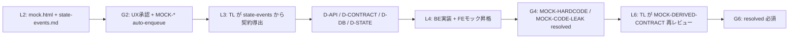
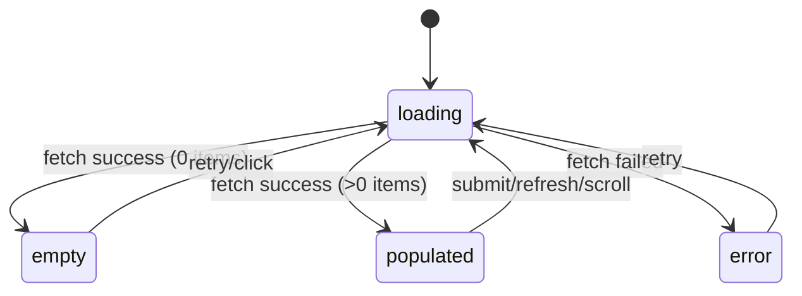

# Mock-Driven Development (モック駆動設計)

## Overview

Mock-Driven Development は、HELIX の fe / fullstack 駆動で L2〜L4 を進める際の中核手法です。
L2 でモックを先に固め、`state-events.md` を通じて TL が L3 で API 契約へ導出します。
実装段階ではモックを throw-away 前提で本実装へ段階昇格し、MOCK-* debt を G4/G6 で解消します。

## When to Use

次の条件に当てはまる場合に適用します。

- 駆動タイプが `fe` のとき
- 駆動タイプが `fullstack` のとき
- UI 中心の要件で、UX 合意を先行したいとき
- 実装前に画面状態・操作イベント・遷移を具体化したいとき
- API 契約を UI イベント起点で導出したいとき

次のケースでは本スキルは主軸にしません。

- `be` 駆動（API/ドメイン主導）
- `db` 駆動（スキーマ主導）
- UI が薄く、UX 先行確認が不要な案件

## Core Concept

モック駆動の基本フローは以下です。



要点は次の 3 点です。

- モックは UX 合意を取るための入力であり、最終コードを直接流用する前提ではない
- API 契約は FE が独断で書かず、TL が `state-events.md` から導出する
- モック由来 debt は自動登録され、G4/G6 で fail-close 条件として処理される

## L2 設計 (モック策定)

L2 では TL 主導で、以下の成果物を作成します。

- デザイントークン
- `mock.html`（Tailwind CDN 使用）
- `state-events.md`（ユーザー操作 → 状態遷移）
- UX 承認ゲート入力

### L2 Step と成果物

| Step | 担当 | 成果物 | 要件 |
|---|---|---|---|
| 2.1 | TL | ブランド方針 + デザイントークン | visual-design の information 具体化 |
| 2.2 | TL | 情報アーキテクチャ | 画面/導線の整理 |
| 2.3 | TL | `.helix/mock/<feature>/mock.html` | HTML + Tailwind CDN、Alpine.js 任意 |
| 2.4 | TL | `state-events.md` | 状態・イベント・遷移図・BE契約導出メモ |
| 2.5 | PM+PO | UX 承認 | G2 通過の必須入力 |

### mock.html テンプレート (Tailwind CDN)

```html
<!doctype html>
<html lang="ja">
  <head>
    <meta charset="UTF-8" />
    <meta name="viewport" content="width=device-width, initial-scale=1.0" />
    <title>Feature Mock</title>
    <script src="https://cdn.tailwindcss.com"></script>
    <!-- 必要時のみ有効化: <script defer src="https://unpkg.com/alpinejs@3.x.x/dist/cdn.min.js"></script> -->
  </head>
  <body class="min-h-screen bg-slate-50 text-slate-900">
    <main class="mx-auto max-w-4xl p-6">
      <header class="mb-6">
        <h1 class="text-2xl font-bold">Feature Mock</h1>
        <p class="text-sm text-slate-600">throw-away prototype in .helix/mock/</p>
      </header>

      <section class="rounded-lg border border-slate-200 bg-white p-4 shadow-sm">
        <h2 class="mb-4 text-lg font-semibold">Screen State: populated</h2>

        <form class="space-y-4">
          <label class="block">
            <span class="mb-1 block text-sm font-medium">Input</span>
            <input
              type="text"
              class="w-full rounded-md border border-slate-300 px-3 py-2"
              placeholder="Type here"
            />
          </label>
          <div class="flex gap-2">
            <button type="button" class="rounded-md bg-slate-900 px-4 py-2 text-white">Click Action</button>
            <button type="submit" class="rounded-md border border-slate-300 px-4 py-2">Submit</button>
            <a href="#next" class="rounded-md border border-slate-300 px-4 py-2">Go Next</a>
          </div>
        </form>
      </section>
    </main>
  </body>
</html>
```

### state-events.md テンプレート

````markdown
# 状態・イベント定義

## 画面状態
| 状態名 | 表示条件 | 主要UI要素 |
|---|---|---|
| loading | 初期ロード中 | スピナー、プレースホルダー |
| empty | データ0件 | 空状態メッセージ、CTA |
| error | API/検証エラー時 | エラーメッセージ、再試行ボタン |
| populated | データ表示可能 | 一覧、操作ボタン、フォーム |

## イベント
| イベント名 | トリガー | 副作用 | 遷移先状態 |
|---|---|---|---|
| click_primary | 主要ボタンクリック | モーダル表示/処理開始 | loading |
| submit_form | フォーム送信 | バリデーション/API呼び出し | loading / error / populated |
| hover_item | 項目ホバー | ツールチップ表示 | populated |
| scroll_list | リスト下端到達 | 追加読込要求 | loading / populated |

## 状態遷移図


## BE契約導出メモ
- このイベントで必要な API エンドポイント仮説: ...
- このイベントで永続化が必要なデータ: ...
````

### L2 での注意

- `mock.html` は throw-away 前提で `.helix/mock/` に置く
- `src/` 側から `.helix/mock/` を import しない
- UX 承認前に L3/L4 を進めない

## L3 詳細設計 (TL による契約導出)

L3 では TL が `state-events.md` を一次入力として契約を導出します。

### TL の導出ステップ

| Step | 入力 | 出力 | 目的 |
|---|---|---|---|
| 3.1 | `state-events.md` | イベント要件一覧 | 状態とイベントの需要抽出 |
| 3.2 | イベント要件 | D-API | イベント→エンドポイント/リクエスト/レスポンス対応 |
| 3.3 | 状態とデータ要件 | D-DB | 永続化要件の設計 |
| 3.4 | 状態境界 | D-STATE | クライアント状態/サーバー状態の責務分離 |
| 3.5 | 契約ドラフト | ドメイン整合性レビュー結果 | 画面都合への過剰最適化を防止 |
| 3.6 | 契約確定版 | D-CONTRACT / D-PLAN / D-TEST | 実装と検証の着手条件固定 |

### L3 成果物

- D-API（API 契約）
- D-CONTRACT（consumer-driven contract）
- D-DB（スキーマ案）
- D-STATE（状態遷移図）

### G3 での追加条件 (fe/fullstack)

- モック凍結済み
- `state-events.md` からの D-API 導出完了
- `fullstack` の場合は D-CONTRACT 凍結も必須

## L4 実装 (モック → 本実装昇格)

L4 は BE/FE 並行実装と、L4.5 結合で進めます。

### 実装の全体像

```text
Phase A (並行)
  BE Sprint: .1a -> .1b -> .2 -> .3 -> .4 -> .5
  FE Sprint: .1a -> .1b -> .2 -> .3 -> .4 -> .5

Phase B
  L4.5 Integration: Contract CI pass 必須
```

### BE 側（D-API 起点）

- D-API を根拠にマイクロスプリント `1a→1b→2→3→4→5` を実行
- 契約逸脱を防ぐため、実装より先に契約を固定
- FE の結合タイミングに合わせて API を提供

### FE 側（mock.html 昇格）

- `.1a` `mock.html` のコンポーネント分解と Props 設計
- `.1b` 本実装フレームワークへ移植（React/Vue/Svelte 等）
- `.2` Tailwind/CSS 統合
- `.3` セキュリティ観点を含むモック由来残存物の除去
- `.4` unit/integration テスト追加
- `.5` モックデータ呼び出しを実 API 呼び出しへ置換

### G4 での追加条件 (fe/fullstack)

- `MOCK-HARDCODE` が resolved
- `MOCK-CODE-LEAK` が resolved

## モック由来 debt のライフサイクル

G2 通過時に `helix gate G2` が `sprint.drive = fe|fullstack` を検出すると、debt-register へ自動登録されます。

### debt 一覧

| debt ID | priority | category | owner | target_sprint | 概要 |
|---|---|---|---|---|---|
| MOCK-HARDCODE | medium | mock-driven | SE | G4 | モック由来のハードコード値残存 |
| MOCK-CODE-LEAK | high | mock-driven | SE | G4 | `.helix/mock/` から本実装への import 禁止 (AST チェック) |
| MOCK-DERIVED-CONTRACT | high | mock-driven | TL | L6 | モック由来 API 契約のドメイン整合性を L6 で TL レビュー |

### 登録と解消のタイミング

| debt ID | 登録タイミング | 解消タイミング | 解消条件 | 未解消時 |
|---|---|---|---|---|
| MOCK-HARDCODE | G2 auto-enqueue | G4 | grep 等でハードコード値残存なし | G4 fail-close |
| MOCK-CODE-LEAK | G2 auto-enqueue | G4 | AST 等で `.helix/mock/` import なし | G4 fail-close |
| MOCK-DERIVED-CONTRACT | G2 auto-enqueue | L6/G6 | TL のドメイン整合性再レビュー完了 | G6 fail-close |

### 注意

- `be` / `db` / `agent` 駆動では MOCK-* は auto-enqueue されない
- fail-close 条件が適用されるのは `fe` / `fullstack` 駆動のみ

## 責務分担表

| 役割 | L2 | L3 | L4 | L6 |
|---|---|---|---|---|
| PM | 駆動タイプ選定 | 要件整理 | 統合判断 | 最終承認 |
| TL (Design Lead) | mock.html + tokens | state-events 協議 | mock 昇格ガイド | — |
| TL | UX 承認 | **API 契約導出** | 全体監督 | MOCK-DERIVED-CONTRACT レビュー |
| BE (SE) | — | D-API 受領 | 実装 | — |
| FE (SE) | — | contract 受領 | mock 昇格実装 | — |

## アンチパターン

- モック完成前に BE 実装開始 → API 契約のすれ違い
- TL 契約導出を飛ばし FE 自走で fetch 実装 → 統合失敗
- MOCK-HARDCODE を G4 で grep せず放置 → プロダクションに流入
- `.helix/mock/` ディレクトリを本実装から import → コードリーク

## Common Rationalizations

| 言い訳 | 実態 |
|---|---|
| 「モックだけで UX 確認は後でいい」 | UX 未確認で実装に入ると手戻り 5-10 倍 |
| 「FE から直接 API 契約書けば速い」 | TL 導出を飛ばすとドメイン整合性が崩れる |
| 「ハードコードは気づけば直す」 | G4 grep で必ず検出される。auto-enqueue で強制確認 |

## Red Flags

- `mock.html` が Tailwind CDN でなく独自 CSS で書かれている
- `state-events.md` が未作成で L3 に進んでいる
- G2 凍結後に mock が更新されている
- MOCK-* debt が G4 までに resolved になっていない
- FE 実装の中に `.helix/mock/` への import がある

## Verification

- [ ] L2 で `mock.html` が作成されている (Tailwind CDN)
- [ ] L2 で `state-events.md` が作成されている
- [ ] G2 で UX 承認 + MOCK-* debt auto-enqueue 完了
- [ ] L3 で TL が state-events → D-API / D-CONTRACT / D-DB / D-STATE を導出
- [ ] G4 で MOCK-HARDCODE / MOCK-CODE-LEAK が resolved
- [ ] G6 で MOCK-DERIVED-CONTRACT が resolved (TL レビュー完了)

## HELIX 連携

- 発火フェーズ: L2, L3, L4 (fe/fullstack 駆動限定)
- 発火ゲート: G2 (mock 凍結), G4 (MOCK-* resolved 必須), G6 (contract レビュー)
- 推奨 Codex ロール: fe (mock 作成) / tl (契約導出) / se (mock 昇格実装)
- 関連スキル: frontend-ui-engineering / api-and-interface-design / spec-driven-development / debt-register
- HELIX CLI: `helix size --ui` → fe 駆動判定 / `helix gate G2` で自動 debt 登録
- L5 要否: `fe` は常に必要、`fullstack` は結合後 Visual Refinement を実施
- 適用境界: `be` / `db` / `agent` 駆動には MOCK-* auto-enqueue と fail-close は適用しない
- 正本参照: `SKILL_MAP.md` の「駆動タイプ別 L2〜L5」および `fe-drive-flow.md` を優先する
