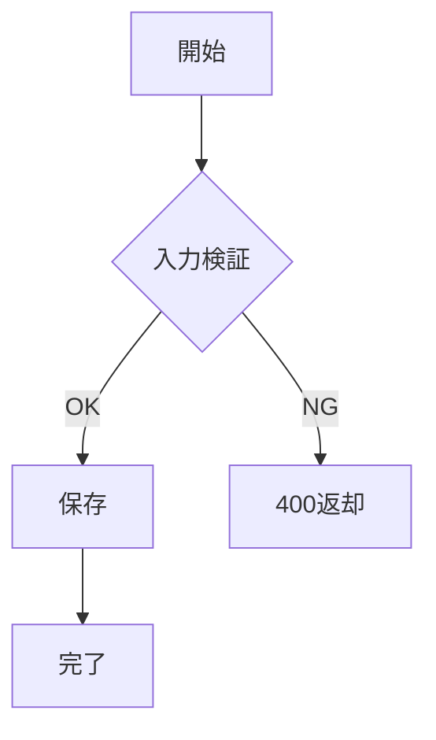
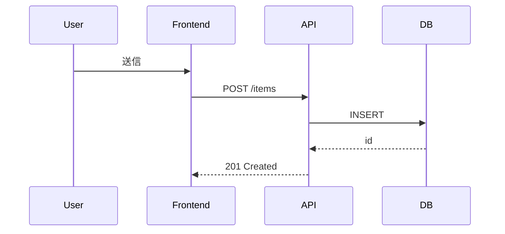
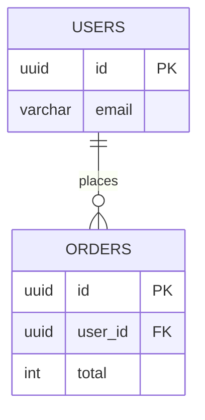
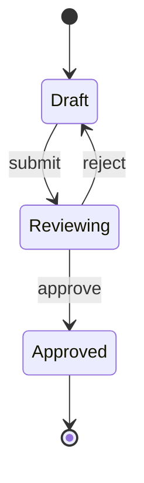
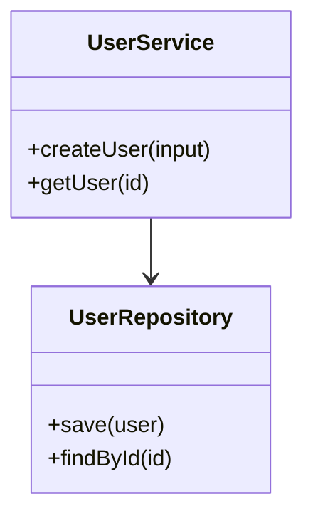

# 図表自動生成スキル（Mermaid + D2）

## 適用タイミング

このスキルは以下の場合に読み込む：
- 設計書（D-ARCH）作成時
- API設計（D-API）時のシーケンス図作成時
- DB設計（D-DB）時のER図作成時
- Reverse（R2）でアーキテクチャを復元する時

---

## 1. セットアップ

```bash
# Mermaid CLI
npm install -g @mermaid-js/mermaid-cli

# D2
brew install d2
```

動作確認：

```bash
mmdc --version
d2 --version
```

---

## 2. Mermaid と D2 の使い分け

| 観点 | Mermaid | D2 |
|------|---------|----|
| 使いどころ | Markdown内埋め込み、シーケンス、ER、状態遷移 | 全体構成図、ネットワーク、クラウド構成 |
| 強み | ドキュメント一体化が容易 | レイアウト制御と大規模構成表現が強い |
| 弱み | 大規模構成で読みにくくなりやすい | Markdown内プレビュー連携は一工夫必要 |
| 推奨 | 設計書本文の図 | アーキテクチャ正本図 |

運用ルール：

- 仕様説明の近接図は Mermaid。
- システム境界・ノード数が多い図は D2。

---

## 3. 図表テンプレート（タイプ別）

### 3.1 フローチャート（Mermaid）



### 3.2 シーケンス図（Mermaid）



### 3.3 ER図（Mermaid）



### 3.4 状態遷移図（Mermaid）



### 3.5 クラス図（Mermaid）



### 3.6 アーキテクチャ図（D2）

```d2
direction: right
client: Browser
cdn: CDN
web: WebApp
api: API
db: PostgreSQL
queue: Queue
worker: Worker

client -> cdn -> web
web -> api
api -> db
api -> queue
worker -> queue
worker -> db
```

---

## 4. CI 統合（Markdown mermaid -> SVG）

### 変換方針

- `docs/diagrams/src/*.mmd` と `docs/diagrams/src/*.d2` を正本にする
- CI で `docs/diagrams/dist/*.svg` を生成する
- 設計文書は `dist` の SVG を参照する

### 例: GitHub Actions

```yaml
name: diagrams
on: [pull_request]
jobs:
  build-diagrams:
    runs-on: ubuntu-latest
    steps:
      - uses: actions/checkout@v4
      - uses: actions/setup-node@v4
        with:
          node-version: 20
      - run: npm install -g @mermaid-js/mermaid-cli
      - run: sudo curl -fsSL https://d2lang.com/install.sh | sh -s --
      - run: mkdir -p docs/diagrams/dist
      - run: for f in docs/diagrams/src/*.mmd; do mmdc -i "$f" -o "docs/diagrams/dist/$(basename "${f%.mmd}").svg"; done
      - run: for f in docs/diagrams/src/*.d2; do d2 "$f" "docs/diagrams/dist/$(basename "${f%.d2}").svg"; done
```

---

## 5. HELIX L2/L3 統合

### L2（設計）

- D-ARCH テンプレートに「図表セクション」を標準搭載する
- 最低1枚の全体アーキテクチャ図（D2）を必須化する

### L3（詳細設計）

- D-API: 主要ユースケースごとにシーケンス図を必須化
- D-DB: ER図を必須化
- 状態を持つ機能は状態遷移図を必須化

### Reverse（R2）

- 既存構成復元時は「As-Isアーキテクチャ図（D2）」を先に固定し、差分を注記する

---

## 6. 完了判定

1. `mmdc` / `d2` が成功する
2. 生成SVGが設計書から参照される
3. 図と本文の用語が一致する
4. 変更時にCIで再生成される
