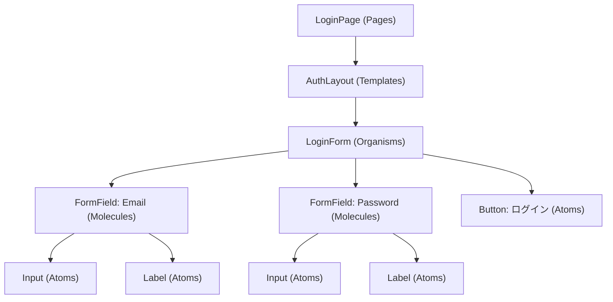

# FE コンポーネント実装スキル

## project/ui との関係

project/ui が「コンポーネント設計の原則・パターンカタログ」、このスキルが「実装時の具体的な型定義・ツリー構築手順」を担当する。

```
project/ui（設計原則・パターン）
  ↓
コンポーネント実装スキル（コンポーネントツリー + Props 型定義の具体化）
  ↓ 成果物: docs/fe/D-COMPONENT.md
  ↓
スタイル実装スキル
アクセシビリティ検証スキル
UI テストスキル
```

---

## Atomic Design 適用ガイド

| 層 | 定義 | 例 | 配置先 |
|---|------|----|-|
| Atoms | 最小単位。分割不可 | Button, Input, Icon, Badge, Label | `components/ui/` |
| Molecules | Atoms の組み合わせ | FormField, SearchBox, ListItem, Card | `components/ui/` |
| Organisms | 機能を持つ複合体 | Header, LoginForm, ProductCard, Modal | `components/features/` |
| Templates | ページレイアウト骨格 | MainLayout, AuthLayout, DashboardLayout | `components/layouts/` |
| Pages | 実際の画面インスタンス | LoginPage, DashboardPage | `app/` or `pages/` |

### 振り分け基準

- 「単体で意味をなすか」→ Atom
- 「Atom を 2 つ以上組み合わせているか」→ Molecule
- 「ドメインロジックや状態を持つか」→ Organism
- 「ページ全体の骨格か」→ Template

---

## コンポーネントツリー図テンプレート（mermaid）

`docs/fe/D-COMPONENT.md` に記載する。

````markdown
## コンポーネントツリー


````

---

## Props 型定義テンプレート（TypeScript）

### Atom の型定義

```typescript
// components/ui/button/Button.tsx
interface ButtonProps extends React.ComponentProps<'button'> {
  variant?: 'primary' | 'secondary' | 'outline' | 'ghost' | 'destructive'
  size?: 'sm' | 'md' | 'lg'
  isLoading?: boolean
}
```

### Molecule の型定義

```typescript
// components/ui/form-field/FormField.tsx
interface FormFieldProps {
  label: string
  htmlFor: string
  error?: string
  hint?: string
  required?: boolean
  children: React.ReactNode
}
```

### Organism の型定義

```typescript
// components/features/auth/LoginForm.tsx
interface LoginFormProps {
  onSuccess: (token: string) => void
  onError?: (error: Error) => void
  redirectPath?: string
}
```

---

## ディレクトリ構造

```
src/
  components/
    ui/                    # Atoms / Molecules
      button/
        Button.tsx
        Button.test.tsx
        index.ts
      input/
      form-field/
    features/              # Organisms
      auth/
        LoginForm.tsx
      dashboard/
    layouts/               # Templates
      MainLayout.tsx
      AuthLayout.tsx
  app/                     # Pages (Next.js App Router の場合)
    page.tsx
    dashboard/
      page.tsx
```

---

## 実装順序

L4 マイクロスプリントでの推奨順序:

1. Atoms（Button, Input, Icon 等）
2. Molecules（FormField, Card 等）
3. Organisms（各機能フォーム、ナビゲーション）
4. Templates（レイアウト）
5. Pages（ルーティング接続）

---

## チェックリスト

```
[ ] コンポーネントツリーが docs/fe/D-COMPONENT.md に存在するか
[ ] 各 Organism 以上の Props が TypeScript 型定義済みか
[ ] ディレクトリ構造が Atomic Design 層に準拠しているか
[ ] Props に optional/required が明示されているか
[ ] Organism は単体でレンダリング確認可能な構造か
[ ] index.ts で再エクスポートが整理されているか
```
