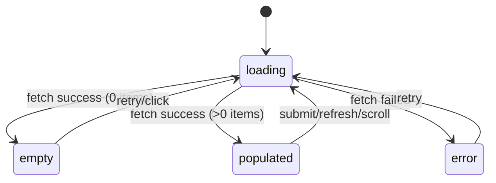

# Mock Template
> 目的: README・ADR・設計資料を作成する際に再利用できる文書テンプレート集として参照

TL が fe 駆動で使用する throw-away モック用テンプレート。
本テンプレートは `src/` など本実装コードへの import を行わないことを前提とする。

## mock.html ボイラープレート

```html
<!doctype html>
<html lang="ja">
  <head>
    <meta charset="UTF-8" />
    <meta name="viewport" content="width=device-width, initial-scale=1.0" />
    <title>Feature Mock</title>
    <script src="https://cdn.tailwindcss.com"></script>
    <!-- 必要時のみ有効化: <script defer src="https://unpkg.com/alpinejs@3.x.x/dist/cdn.min.js"></script> -->
  </head>
  <body class="min-h-screen bg-slate-50 text-slate-900">
    <main class="mx-auto max-w-4xl p-6">
      <header class="mb-6">
        <h1 class="text-2xl font-bold">Feature Mock</h1>
        <p class="text-sm text-slate-600">throw-away prototype in .helix/mock/</p>
      </header>

      <section class="rounded-lg border border-slate-200 bg-white p-4 shadow-sm">
        <h2 class="mb-4 text-lg font-semibold">Screen State: populated</h2>

        <form class="space-y-4">
          <label class="block">
            <span class="mb-1 block text-sm font-medium">Input</span>
            <input
              type="text"
              class="w-full rounded-md border border-slate-300 px-3 py-2"
              placeholder="Type here"
            />
          </label>
          <div class="flex gap-2">
            <button type="button" class="rounded-md bg-slate-900 px-4 py-2 text-white">Click Action</button>
            <button type="submit" class="rounded-md border border-slate-300 px-4 py-2">Submit</button>
            <a href="#next" class="rounded-md border border-slate-300 px-4 py-2">Go Next</a>
          </div>
        </form>
      </section>
    </main>
  </body>
</html>
```

## state-events.md テンプレート

```markdown
# 状態・イベント定義

## 画面状態
| 状態名 | 表示条件 | 主要UI要素 |
|---|---|---|
| loading | 初期ロード中 | スピナー、プレースホルダー |
| empty | データ0件 | 空状態メッセージ、CTA |
| error | API/検証エラー時 | エラーメッセージ、再試行ボタン |
| populated | データ表示可能 | 一覧、操作ボタン、フォーム |

## イベント
| イベント名 | トリガー | 副作用 | 遷移先状態 |
|---|---|---|---|
| click_primary | 主要ボタンクリック | モーダル表示/処理開始 | loading |
| submit_form | フォーム送信 | バリデーション/API呼び出し | loading / error / populated |
| hover_item | 項目ホバー | ツールチップ表示 | populated |
| scroll_list | リスト下端到達 | 追加読込要求 | loading / populated |

## 状態遷移図


## BE契約導出メモ
- このイベントで必要な API エンドポイント仮説: ...
- このイベントで永続化が必要なデータ: ...
```
