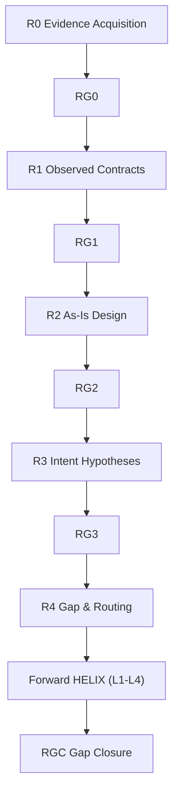

# Reverse Analysis Router

Reverse HELIX は「既存コードという観測事実」から設計と意図を逆方向に復元し、差分を Forward HELIX に安全に接続するための流れである。本スキルは全体像と入口を提供し、各フェーズの実行詳細は専用スキルへ委譲する。

## Reverse type matrix

| Type | 起点 | R0 | R1 | R2 | R3 | R4 | RGC |
|------|------|----|----|----|----|----|-----|
| code | レガシーコード | 証拠収集 | 契約抽出 | 設計復元 | 仮説検証 | Gap → Forward | 閉塞検証 |
| design | デザイン資産 | 資産収集 | skip | DAG/順序 | PO 検証 | Forward routing | 閉塞検証 |
| upgrade | 既存 system + 新版 | version diff | 影響分析 | 設計差分 | risk 評価 | Forward routing | upgrade RGC skip |
| normalization | 設計 drift | drift 検出 | skip | normalize 設計 | PO 確認 | Forward routing | 閉塞検証 |
| fullback | 実装完遂後 | 実装証拠 | 文書 gap 抽出 | alignment 設計 | 文書 PO 確認 | Forward routing | 閉塞検証 |

## Reverse フロー全体図

## フェーズ別ルーティング

| フェーズ | 担当スキル | パス |
|---|---|---|
| R0 Evidence Acquisition | reverse-r0 | [skills/workflow/reverse-r0/SKILL.md](skills/workflow/reverse-r0/SKILL.md) |
| R1 Observed Contracts | reverse-r1 | [skills/workflow/reverse-r1/SKILL.md](skills/workflow/reverse-r1/SKILL.md) |
| R2 As-Is Design | reverse-r2 | [skills/workflow/reverse-r2/SKILL.md](skills/workflow/reverse-r2/SKILL.md) |
| R3 Intent Hypotheses | reverse-r3 | [skills/workflow/reverse-r3/SKILL.md](skills/workflow/reverse-r3/SKILL.md) |
| R4 Gap & Routing | reverse-r4 | [skills/workflow/reverse-r4/SKILL.md](skills/workflow/reverse-r4/SKILL.md) |
| RGC Gap Closure | reverse-rgc | [skills/workflow/reverse-rgc/SKILL.md](skills/workflow/reverse-rgc/SKILL.md) |

## Type 別の使い分け

### code

既存の Reverse HELIX の標準経路。コード、DB、設定、運用実態から観測契約を抽出し、R1 で契約、R2 で As-Is 設計、R3 で意図仮説、R4 で Forward 接続を行う。

### design

デザイン資産起点の逆引き。既存コードの契約抽出は不要なため R1 を skip し、R2 で画面・コンポーネント・導線の DAG と実装順を復元する。R3 で PO 検証、R4 で Forward routing を決める。

### upgrade

既存 system と新版の差分を起点に、R0 で version diff、R1 で影響分析、R2 で設計差分を固める。R3 で risk 評価を行い、R4 で Forward の接続先を決める。gap closure は upgrade 完了として Forward 側で評価するため `upgrade RGC skip` とする。

### normalization

設計 drift の正規化を起点にする。R1 は skip し、R2 で drift を normalize した設計に戻し、R3 で PO 確認、R4 で Forward routing を行う。

### fullback

実装完遂後の文書整合を起点にする。R0 で実装証拠を集め、R1 で文書 gap を抽出し、R2 で alignment 設計、R3 で文書 PO 確認、R4 で closure routing を行う。

## Skip 条件

- design / normalization の R1 skip: 起点がデザイン資産または設計 drift であり、既存コードの contracts 抽出を追加で行う必要がないため。
- upgrade の RGC skip: gap closure は upgrade 単独では閉じず、Forward 側の完了として評価するため。`helix-test` では `upgrade RGC is skipped` の出力で確認できる。

## 使い分けガイド

全体の進め方・フェーズ間の接続・実行順を把握したい場合は本スキルを読む。個別フェーズに着手する場合は必ず対応する `reverse-r*` スキルを読み、そこで定義された入出力・検証・ゲート条件に従う。

後方互換: 旧 `reverse-analysis` に含まれていた Forward 詳細記述は、各 `reverse-r*` / `reverse-rgc` スキルへ移設済み。
